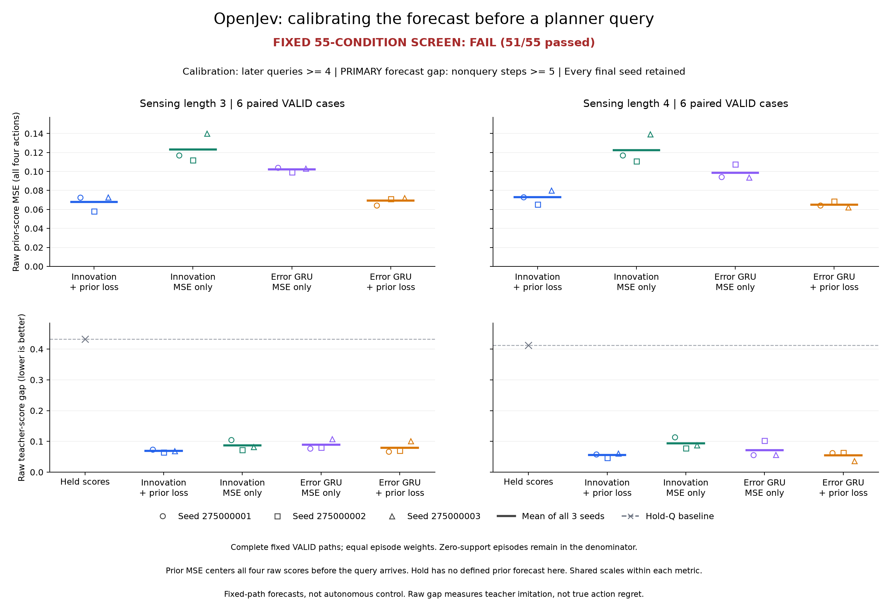

# OpenJev

**Context → questions and candidate answers → probabilities → your application's next step.**

OpenJev is a local decision interface and a collection of controlled learning experiments. Score choices with stable IDs, try text decisions in your browser, or explore recorded chess, Doom and robot policies.

[**Text demo**](https://kw2828.github.io/OpenJev/) · [**Chess replay**](https://kw2828.github.io/OpenJev/chess-candidate-replay.html) · [API](docs/decision-api.md) · [Setup](docs/project-reference.md) · [Experiment archive](research/experiment-index.md)

## Decision interface

Supply English context, your questions, and candidate IDs with descriptions. OpenJev returns each chosen ID and the relative probability of every supplied answer. Your application decides what to do next; the API itself executes no external action.

The local scorer uses a pinned Qwen model, maps candidates to single-token labels, and scores those labels without generating an explanation. Questions are independent. Stable IDs constrain the response format, not whether the choice is correct.

Use `POST /api/decide` with the `X-OpenJev: 1` header, or `openjev decide request.json`. The [complete example](examples/support.json) and [API reference](docs/decision-api.md) cover request limits, errors, model metadata and execution boundaries.

## Run locally

Apple Silicon macOS, Python 3.11-3.13:

```sh
git clone https://github.com/kw2828/OpenJev.git
cd OpenJev
uv sync --frozen --extra language
uv run --extra language openjev setup
uv run --extra language openjev serve
```

Open **http://127.0.0.1:8000**. Setup downloads the pinned Qwen3-4B weights; inference then uses the local cache. No paid API key is needed.

The free [browser demo](https://kw2828.github.io/OpenJev/) runs Qwen3-0.6B through WebGPU. Its scores are not interchangeable with the local 4B model. [Browser requirements](docs/browser-model.md) · [Linux, Docker and hosting](docs/hosting.md).

## Chess

[](https://kw2828.github.io/OpenJev/chess-candidate-replay.html)

Four small policies score legal moves across **twelve fits and 288 games**. Exact next-board differences raise ordinary move agreement from **31.75% to 33.15%**, but cost more computation and fail the engine-loss and game-score criteria. The GIF is the first scheduled game, not a selected win. No learned world model or Elo rating is established.

[Results, all checkpoints and controls](docs/chess-candidate.md) · [ChessBench transfer](docs/chessbench-transfer.md) · [Connectome comparison](docs/chess-connectome.md) · [Graph-quality comparison](docs/chess-pin-quality.md).

## Doom

[](docs/assets/jepa-policy-181000.gif)

**13 kills in 19.26 game seconds**, from the first fit and first evaluation seed. JEPA supplies training rewards; a small policy plays this recording. The full nine-method comparison did **not** establish a reliable JEPA advantage. This is one illustrative episode, not an inference-speed benchmark.

[Results and limits](docs/jepa-rl-study.md) · [Recording receipt](docs/assets/jepa-policy-181000.json) · [Other Doom controllers](docs/project-reference.md).

## Robot reaching

[](research/reacher-geometry-memory.md)

The stronger memory comparison **failed its rule: 24/25 checks passed**. Persistent GRU lowers control cost by **4.44% / 2.94%** versus a separately trained two-observation controller; the rule requires at least 3% on both sensing-gap panels. Supplied-physics controllers still perform better.

The GIF is from the earlier, weaker-control study. The [stronger comparison](research/reacher-two-observation-control.md) retains all nine models, five references and complete costs. Neither establishes a new architecture or biological-wiring advantage.

## Research status

The [latest recurrent comparison](research/otto-prequery-calibration-results.md)
collected **90 complete trajectories** and trained **12 small models**. Directly
training the forecast made before each planner query lowers the proposed model's
teacher-score gap by **20.32% / 40.62%** across two settings. The same loss also
helps an ordinary GRU, and training costs roughly **1.9x** as much.

[](research/otto-prequery-calibration-results.md)

The continuation rule still **fails: 51/55 conditions passed**. The proposed
model loses full-path agreement and does not consistently beat the ordinary GRU.
These recorded-path forecasts establish no autonomous control, deployment saving
or architecture advantage.
[Full results and costs](research/otto-prequery-calibration-results.md) ·
[All checkpoints and evidence](https://github.com/kw2828/OpenJev/releases/tag/otto-prequery-calibration-v1) ·
[Previous comparison](research/otto-cross-query-forecast-results.md).

A [follow-up diagnosis](research/otto-prequery-decision-diagnosis-results.md)
locates the mean agreement loss in the first three steps, before any correction.
A separate forecast readout is implemented for the next comparison; its effect
on trained performance is still untested.

Earlier [sparse querying](research/otto-sparse-query-results.md) reduced controller
cost but missed move-quality requirements. The [first forecast collection](research/otto-score-forecast-results.md)
stopped incomplete, and [exact caching](research/otto-exact-cache-results.md) failed
its opportunity screen. Their original results remain preserved.

The separate [shared-prefix scoring experiment](research/shared-prefix-results.md)
measured **2.08x** speedup on four-question synthetic workloads; single-question
caching was slower. This does not reproduce a proprietary RLCD system.

## Limits and provenance

Candidate probabilities are **uncalibrated and relative to the supplied choices**. Rewording or changing the choices can change the scores.

These demos use different models and protocols. Replays illustrate preserved episodes; they do not replace complete comparisons. The research has not established a novel architecture, a biological-wiring advantage or a new RL algorithm.

OpenJev is independent of [TypeSafe Jev](https://typesafe.ai/blog/introducing-system-one-models-and-jev), [zhihz/openjev](https://github.com/zhihz/openjev) and [openjev.com](https://openjev.com/). It does not reproduce proprietary Jev architecture or weights.

The root MIT license applies except where component notices specify other terms, including GPL-3.0-only chess research files. Third-party data and model licenses apply separately.
