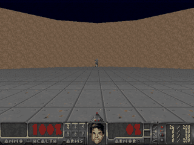

# OpenJev

**A small, open model that plays real Doom by emitting controls instead of text.**

Inspired by [TypeSafe's Jev](https://typesafe.ai/blog/introducing-system-one-models-and-jev).
Independent implementation, not Jev's architecture, weights, or RLCD training method.



*Local neural policy, Defend the Center, seed 42: 16 kills, then death after 23.1 game seconds. This is a complete episode sampled every four game tics, not a highlights reel. [Episode metrics](evidence/episode-42.json) · [Decision trace](evidence/episode-42.jsonl)*

## Run it

Requires Python 3.11-3.13. Tested on macOS Apple Silicon with Python 3.12; Linux CI has not been run; a workflow template is included. ViZDoom installs the engine and Freedoom assets. No commercial game files or API key needed.

```sh
git clone https://github.com/kw2828/OpenJev.git
cd OpenJev
uv sync --frozen
uv run openjev serve
```

Open **http://127.0.0.1:8000** and click **Run agent**. The server starts paused. An episode stops at death or timeout; restart explicitly. Stop the server with Ctrl-C.

Without uv:

```sh
python3.12 -m venv .venv
source .venv/bin/activate
python -m pip install -e .
openjev serve
```

The cockpit has live gameplay, action probabilities, policy-call latency, health, ammo, kills, and episode controls. Switch between the neural policy, its rule-based teacher, random controls, and your keyboard. Three objective presets: **hunt**, **conserve**, and **pacifist**. They are fixed modes, not natural-language understanding. Pacifist is also enforced in code.

## What is actually running?

```text
ViZDoom visible actor labels + game variables
                     |
              11 numeric features
                     |
              shared MLP: 64 → 64
                     |
         +-----------+-----------+
         |                       |
   steer: 3 logits          fire: 2 logits
   left / hold / right      no / yes
         |                       |
         +------ typed action ---+
                     |
            Doom buttons, 2 tics
```

The **5,253-parameter model** is trained from scratch on 60,000 synthetic structured states labeled by an explicit controller. Both output heads are computed together. Runtime inference uses NumPy; PyTorch is only needed to retrain. The model never calls the teacher at inference time.

This is **behavioral cloning for a narrow game task**, not a foundation model. It uses privileged engine labels for visible enemies, including bounding boxes and distance. It does not learn vision from screenshots, inspect hidden actors, understand arbitrary text, navigate full campaigns, or reproduce Jev's claimed general capability. Displayed local probabilities are not calibrated confidence.

## Measured gameplay

20 complete episodes per policy, same seeds **1000-1019**, default Defend the Center rules, two game tics per decision. The shipped checkpoint was fixed before these gameplay runs. Training seed 7; synthetic evaluation seed 8. Development gameplay used seeds 42-44.

| Controller | Mean kills | Mean reward | Mean survival, game seconds |
|---|---:|---:|---:|
| OpenJev local model | 17.55 | 16.55 | 25.32 |
| Rule-based teacher | 17.60 | 16.60 | 25.77 |
| Random controls | 0.95 | -0.05 | 8.65 |

[Every episode and timing measurement](evidence/defend-center.json). This small comparison shows the student largely reproducing its teacher in this scenario. It does not show an improvement over rules or a speedup over Jev/LLMs. Policy timing excludes the engine, rendering, network, and browser. The UI paces local play toward the engine's 35 game tics per wall second; slower remote decisions slow the simulation instead of running asynchronously.

Defend the Line and Basic are also selectable. The above performance numbers apply **only to Defend the Center**. Scenarios keep their original controls and reward definitions. Basic uses left/right strafing; the defense scenarios use left/right turning.

```sh
# Headless gameplay
uv run openjev play --policy local --seed 42

# A full recording, raw decisions, and episode metrics
uv run openjev play --seed 42 --record runs/my-episode

# Repeat the matched-seed comparison
uv run openjev evaluate --episodes 20 --seed 1000 --output runs/evaluation.json

# Reproduce training; overwrites the local checkpoint
uv sync --frozen --extra train --extra dev
uv run openjev train
uv run pytest -q
uv run ruff check src tests
```

Training metadata, feature order, synthetic agreement scores, and the checkpoint SHA-256 live in [doom.json](src/openjev/weights/doom.json). Synthetic teacher agreement is a different measurement from gameplay ability.

## Optional: use the real Jev

With an early-access TypeSafe key, export `TYPESAFE_API_KEY` in the server's environment before starting it. Select **Jev API** in the cockpit, or run:

```sh
uv run openjev play --policy jev --seed 42
```

The adapter uses the [documented TypeSafe endpoint](https://docs.typesafe.ai/api): one `Choice` for steering and one `Noul` for firing in a single request to `jev-latest`. It sends only the structured game observation. The key remains on the server.

**Live Jev status: not verified.** Request/response handling is covered by mocked contract tests, not a real API run. There is no silent fallback to the local model. Each policy instance reserves at most 300 calls, including failures; in the cockpit that budget persists across episode restarts and controller switches until the server is restarted. Timeout, invalid response, or exhausted budget pauses play. Requests are not retried. API usage may incur TypeSafe charges.

## Research and scope

See [the research notes](docs/research.md) for primary sources, the distinction between type safety and correctness, and what was publicly reproducible on September 16, 2026. See [the model card](docs/model-card.md) for training and evaluation limits.

## CI setup

All 27 tests pass locally on macOS. The publishing credential lacks GitHub workflow permission, so CI is not active. To enable it using a credential with that permission, copy [the workflow template](docs/ci-workflow.yml) to `.github/workflows/ci.yml` and commit it. It installs locked dependencies and runs lint plus the real-engine tests on Ubuntu. Linux execution remains unverified until that run passes.

## Project map

| File | Purpose |
|---|---|
| `src/openjev/domain.py` | Observation features, typed actions, teacher, hard control limits |
| `src/openjev/game.py` | Real ViZDoom engine and visible-actor extraction |
| `src/openjev/policies.py` | NumPy model, baselines, optional Jev HTTP adapter |
| `src/openjev/train.py` | Synthetic data and reproducible supervised training |
| `src/openjev/evaluate.py` | Full episodes, recordings, matched-seed comparisons |
| `src/openjev/server.py` | Local-only cockpit service and bounded game loop |
| `tests/` | Action constraints, API contract, real gameplay, browser-server controls |

The server binds to loopback, validates controls and Host/Origin, and does not allow arbitrary game commands or external endpoints. It is a single-user prototype, not an internet-facing service.

MIT license for this project's code and trained weights. ViZDoom and Freedoom retain their own licenses; their binaries/assets are installed as dependencies, not included in this repository. Doom is a trademark of id Software. No affiliation with TypeSafe AI or id Software.
