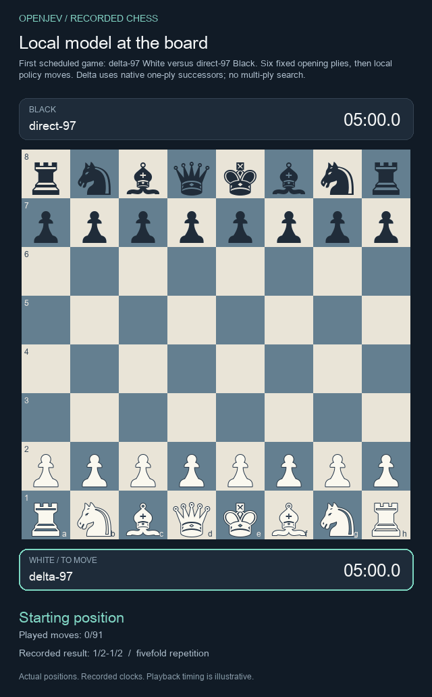
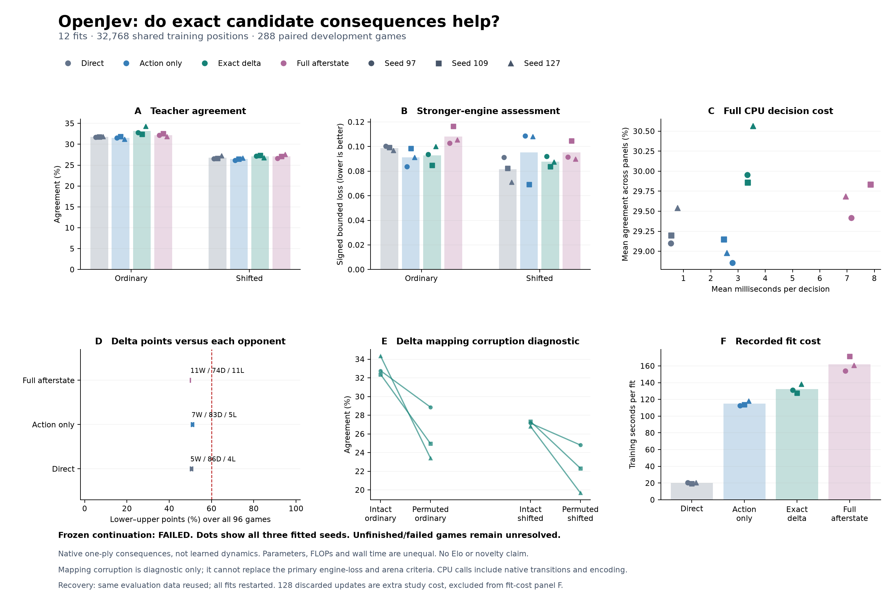
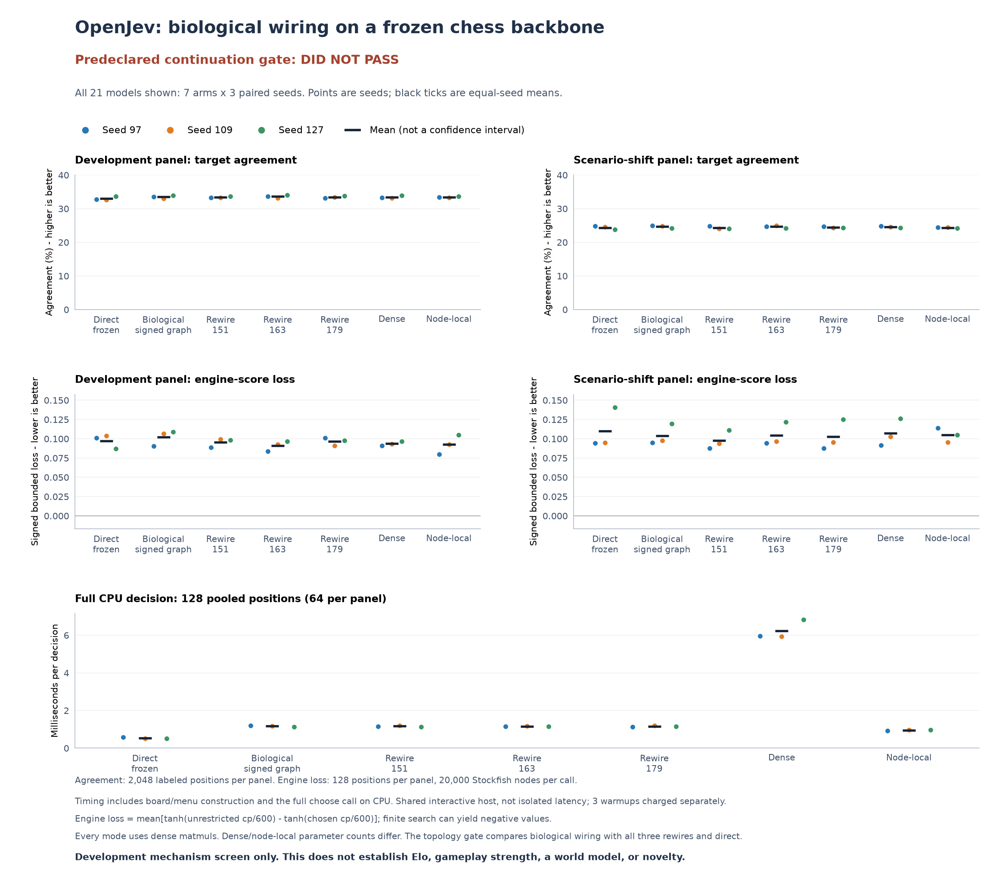
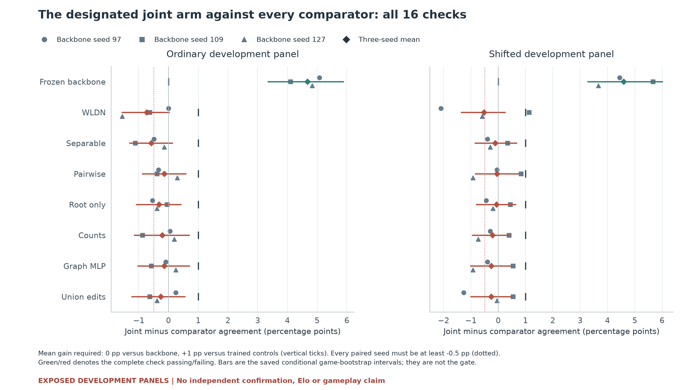
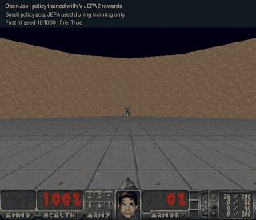
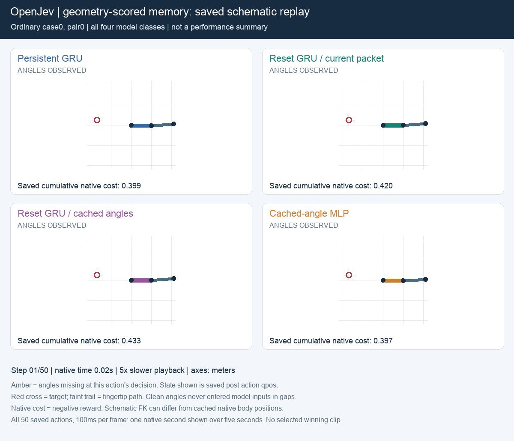
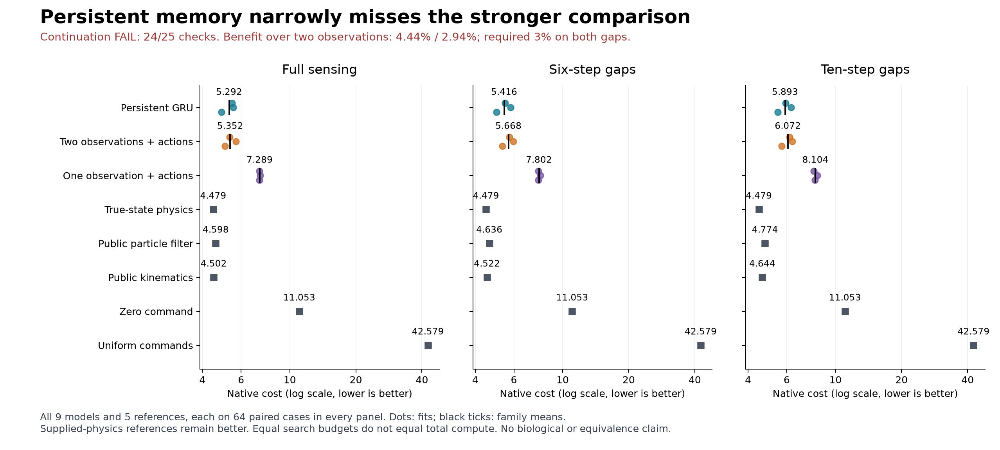
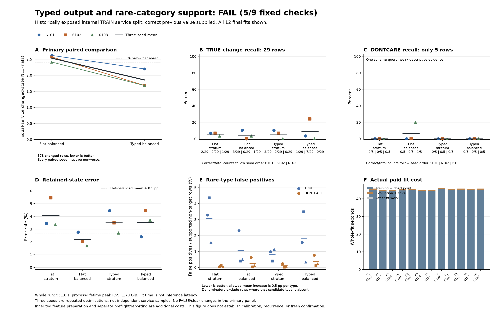

# OpenJev

**Context → questions and candidate answers → probabilities → your application's next step.**

Score choices with stable IDs. Try text decisions in your browser, run local Doom policies, or train a small chess model.

[**Text demo**](https://kw2828.github.io/OpenJev/) · [**Chess replay**](https://kw2828.github.io/OpenJev/chess-candidate-replay.html) · [API](docs/decision-api.md) · [Benchmarks](docs/benchmarks.md) · [Setup](docs/project-reference.md)

## Chess

[](https://kw2828.github.io/OpenJev/chess-candidate-replay.html)

Our candidate experiment compares **four small chess policies across twelve fits and 288 games**. Each scores every legal move. Two variants use exact next-board states from native chess rules. The GIF shows the first scheduled game, drawn by repetition.



Exact-delta matched Stockfish on **33.15%** of ordinary positions versus **31.75%** for direct scoring, and **27.10% versus 26.81%** on shifted positions. It costs more compute and **fails the engine-loss and game-score continuation criteria**. These development results establish neither a learned world model nor an Elo rating.

On a separate **4,096-position ChessBench transfer panel**, the four model families average **26.03-26.79%** move agreement. The gains remain small. [Transfer results](docs/chessbench-transfer.md).

The completed [connectome study](docs/chess-connectome.md) compared biological wiring with three rewired controls, dense recurrence and node-local recurrence across three seeds. It **did not establish a biological-wiring advantage**: only **5 of 30** required checks passed. All 21 models are shown below; there is no gameplay or Elo result for this study.

<a href="docs/chess-connectome.md"></a>

The [30-fit mapping follow-up](research/chess-connectome-mapping-study.md) reduced biological-model loss by 8.6% on ordinary positions, with no improvement under shift. It also failed its continuation rule.

[Results and all twelve weights](docs/chess-candidate.md) · [Connectome controls](research/chess-connectome-followup.md) · [Earlier capacity study](docs/chess-capacity.md)

[Earlier predictive models and paper](docs/chess-spatial.md) · [Astra, ChessFly and ChessLFM comparison](docs/chess.md)

The latest [24-fit graph comparison](docs/chess-pin-quality.md) found **36.43% / 31.40%** ordinary/shifted move agreement for joint pin factors, below the WLDN baseline's **37.16% / 31.92%**, while taking **13.1% more decision time**. Only 2/16 quality checks passed. The proposed mechanism did not earn continuation.

<a href="docs/chess-pin-quality.md"></a>

## Doom

[](docs/assets/jepa-policy-181000.gif)

**13 kills in 19.26 game seconds**, first fit and first evaluation seed. JEPA scored training clips; a small policy plays the recording. [Results and limits](docs/jepa-rl-study.md) · [Recording receipt](docs/assets/jepa-policy-181000.json).

## Robot reaching

[](research/reacher-geometry-memory.md)

**The stronger memory comparison failed its continuation rule: 24/25 checks.** Persistent GRU lowered control cost by **4.44%/2.94%** versus a separately trained model using two observations and intervening actions. The rule required at least 3% on both sensing-gap panels. All three paired fits improved, but the ten-step mean missed the required margin.



Supplied-physics controllers still perform better. Equal search budgets do not match total compute. The GIF replays the preselected first case from the earlier study; the chart shows all 42 rows of the new comparison. [New results and audit](research/reacher-two-observation-control.md).

The [earlier comparison](research/reacher-geometry-memory.md) passed all 25 checks against the weaker one-observation control, with 31.9%/26.0% lower cost. Neither study establishes a new architecture or biological-wiring advantage. [Earlier paper](output/pdf/openjev-reacher-geometry-memory-study.pdf) · [LaTeX](paper/reacher-geometry-memory-study.tex).

## Run locally

Apple Silicon macOS, Python 3.11-3.13:

```sh
git clone https://github.com/kw2828/OpenJev.git
cd OpenJev
uv sync --frozen --extra language
uv run --extra language openjev setup
uv run --extra language openjev serve
```

Open **http://127.0.0.1:8000**. Local text scoring uses Qwen3-4B; the free browser demo uses Qwen3-0.6B through WebGPU. [Linux, Docker and hosting](docs/hosting.md).

## Research results

- [Typed decisions and rare-category weighting](research/dialogue-typed-results.md): **12 fits completed in 9.2 minutes**. Typed normalization lowers changed-state loss **26.92%**, but accuracy falls **50.52% to 47.40%** and retained-value errors increase. The original flat/stratum control reaches **70.88%** changed accuracy. Only **5/9 checks pass**, so the rule fails. No architecture advantage established.
- [Conditional observation](research/dialogue-conditional-results.md): **9/9 fits completed in 8.2 minutes**, but candidate attention fails the consistency rule. Unseen-change NLL improves in two seeds and worsens in one; accuracy falls from **69.74% to 68.64%** versus slot attention. Every model receives the correct previous value, so this is a diagnostic, not autonomous memory. [Error diagnosis](research/dialogue-conditional-error-results.md): all nine models miss every unseen TRUE update by choosing the previous NOT_MENTIONED value.
- [Shared-token dialogue experiment](research/dialogue-token-results.md): training stopped at **7/12 fits**. The [shared-columns cost check](research/dialogue-token-shared-columns-results.md) passes all 16 numerical checks and **15/16 timing requirements**. One case reaches **1.088x**, below the fixed 1.10x requirement, so training remains closed. No new accuracy result.
- [Candidate-conditioned encoding cost screen](research/dialogue-joint-capacity-results.md): the 512-text probe completed, but **20.91 minutes projected** exceeded the fixed 12-minute threshold. Full encoding and training did not run. The next proposal reuses dialogue token features across candidates.
- [Corrected candidate text memory](research/dialogue-copy-v2-results.md): **15 fresh fits** pass internal probability checks, but selective memory still fails its rule (**7/13**). Unseen-service macro accuracy is **72.89%**, versus **72.58%** for simpler scalar memory and **65.76%** for literal copying. The correction establishes numerical validity, not an architecture advantage. [What selective retention changes](research/dialogue-selective-one-step-analysis.md).
- [Earlier recurrent text memory](research/dialogue-memory-results.md): 21 fits; the proposed memory lost to literal copying on unseen services.
- [Text inference](research/shared-prefix-results.md): shared-context prototype, **2.08x faster** for four-question workloads. Synthetic speed benchmark; single-question caching is slower.
- [Biological wiring](docs/chess-connectome.md): the controlled chess study **did not establish a connectome advantage**.
- [Recurrent robot memory](research/reacher-two-observation-control.md): small improvements over two-observation history, but the stronger continuation rule failed.
- [Robot dynamics screen](research/drive-qualification-results.md): 252 episodes; classical calibration leaves too little benefit from exact parameters to justify neural training here.
- [All experiments and visualizations](research/experiment-index.md): complete results, including negative findings, training receipts and paper sources.

[](research/dialogue-typed-results.md)

Candidate scores are uncalibrated and relative to the supplied choices. These experiments use different models and protocols. The root MIT license applies except where component notices specify other terms, including GPL-3.0-only chess research files. Third-party data and model licenses apply separately.

Independent of [TypeSafe Jev](https://typesafe.ai/blog/introducing-system-one-models-and-jev), [zhihz/openjev](https://github.com/zhihz/openjev) and [openjev.com](https://openjev.com/). No proprietary RLCD reproduction or established new RL algorithm is claimed.
