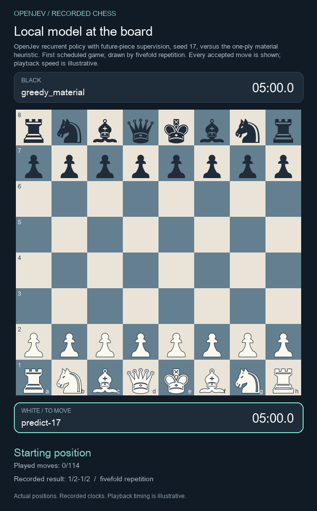
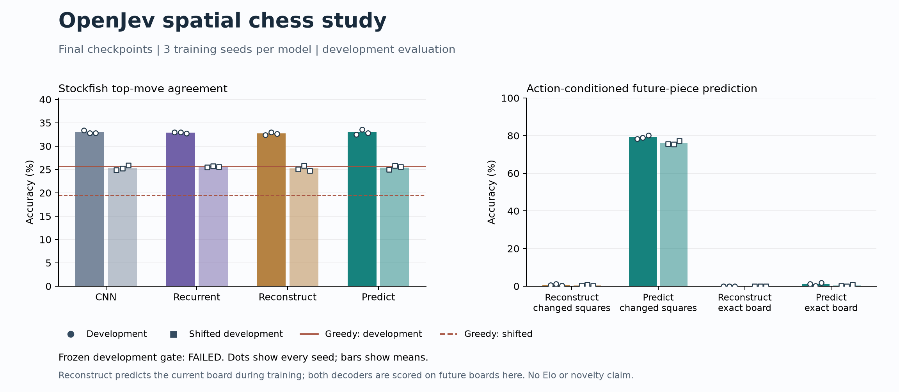

# OpenJev

**Context → questions and candidate answers → probabilities → your application's next step.**

Score choices with stable IDs. Try text decisions in your browser, run local Doom policies, or train a small chess model.

[**Text demo**](https://kw2828.github.io/OpenJev/) · [**Chess replay**](https://kw2828.github.io/OpenJev/chess-spatial-replay.html) · [API](docs/decision-api.md) · [Benchmarks](docs/benchmarks.md) · [Setup](docs/project-reference.md)

## Chess

[](https://kw2828.github.io/OpenJev/chess-spatial-replay.html)

Our **43,726-parameter recurrent reference model** scores every legal move without search. It learns from Stockfish, with an optional future-board prediction objective. The GIF shows the first scheduled game, a draw.



The prediction model matched Stockfish on **32.97%** of ordinary development positions versus **25.61%** for a material heuristic, and **25.43% versus 19.51%** on shifted development games. Future prediction did not beat the matched spatial controls. These are development results, not Elo or an established novel architecture.

**Latest follow-up:** twelve new fits separate input anchoring from varied-depth training. Their combination preserves decisions at sixteen steps, but does not pass the chess-quality test. [Charts and checkpoints](docs/chess-anchor.md) · [Earlier mate-training results and replay](docs/chess-refinement.md).

[Load the models](docs/chess-spatial.md) · [Results and protocol](research/chess-spatial-study.md) · [Paper](output/pdf/openjev-chess-spatial-study.pdf) · [Earlier Astra, ChessFly and ChessLFM comparison](docs/chess.md)

## Doom

[](docs/assets/jepa-policy-181000.gif)

**13 kills in 19.26 game seconds**, first fit and first evaluation seed. JEPA scored training clips; a small policy plays the recording. [Results and limits](docs/jepa-rl-study.md) · [Recording receipt](docs/assets/jepa-policy-181000.json).

## Run locally

Apple Silicon macOS, Python 3.11-3.13:

```sh
git clone https://github.com/kw2828/OpenJev.git
cd OpenJev
uv sync --frozen --extra language
uv run --extra language openjev setup
uv run --extra language openjev serve
```

Open **http://127.0.0.1:8000**. Local text scoring uses Qwen3-4B; the free browser demo uses Qwen3-0.6B through WebGPU. [Linux, Docker and hosting](docs/hosting.md).

## More experiments

- [Astra-trained text students](docs/codex-astra-distillation.md): routing improved; BoolQ remained near chance.
- [Recurrent world models](docs/recurrent-world-model-study.md) and [associative-memory PPO](docs/associative-ppo-study.md): no established memory advantage. [Initialization follow-up](docs/zero-critic-ppo-study.md).
- [Doom PPO/DQN](docs/rl-study.md), [JEPA + RL](docs/jepa-rl-study.md), [all figures](docs/benchmarks.md) and [paper sources](paper/README.md).

Candidate scores are uncalibrated and relative to the supplied choices. These experiments use different models and protocols. MIT for project code and original weights; third-party licenses apply separately.

Independent of [TypeSafe Jev](https://typesafe.ai/blog/introducing-system-one-models-and-jev), [zhihz/openjev](https://github.com/zhihz/openjev) and [openjev.com](https://openjev.com/). No proprietary RLCD reproduction or established new RL algorithm is claimed.
