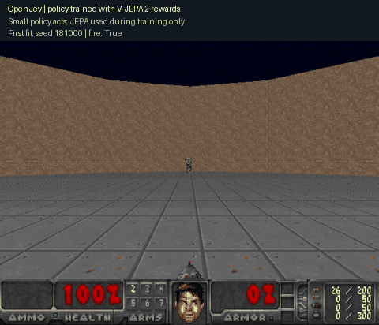
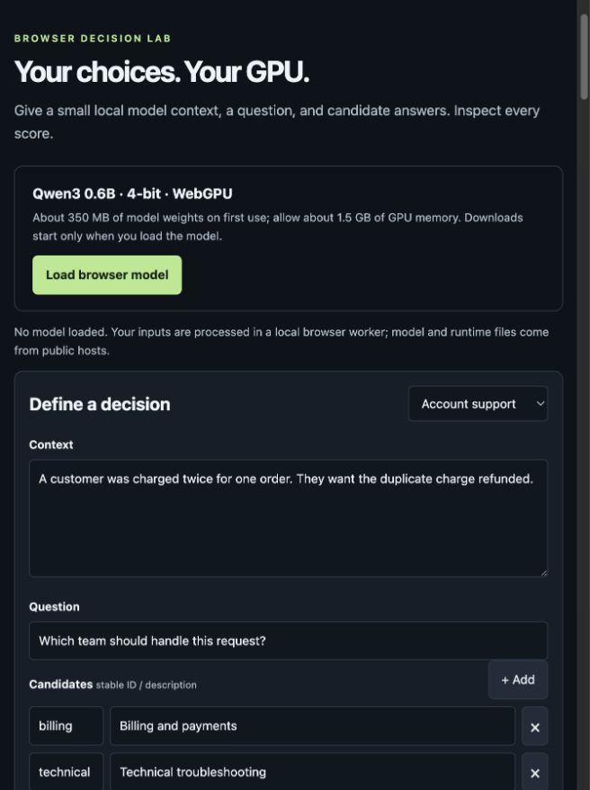
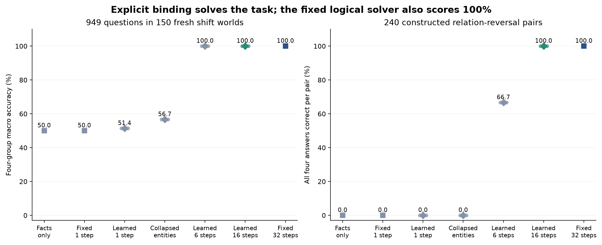

# OpenJev

**Context → questions and candidate answers → probabilities → your application's next step.**

Score choices you define at request time, with stable candidate IDs. Explore text decisions in your browser and locally trained policies playing Doom.

[**Try the demo**](https://kw2828.github.io/OpenJev/) · [API examples](docs/decision-api.md) · [Benchmarks](docs/benchmarks.md) · [Setup and project reference](docs/project-reference.md)

## See it work



**13 kills in 19.26 game seconds**, first fit and first evaluation seed. JEPA scored training clips; a small policy plays this recorded game. [Recording receipt](docs/assets/jepa-policy-181000.json).

[](https://kw2828.github.io/OpenJev/)

The free browser demo runs Qwen3-0.6B through WebGPU. It is separate from the Doom policy and the research students below.

## Run locally

Apple Silicon macOS, Python 3.11-3.13:

```sh
git clone https://github.com/kw2828/OpenJev.git
cd OpenJev
uv sync --frozen --extra language
uv run --extra language openjev setup
uv run --extra language openjev serve
```

Open **http://127.0.0.1:8000**. Local text scoring uses Qwen3-4B. [Linux, Docker and hosting](docs/hosting.md).

## Train a text model with Astra

Astra selects answers for training examples; a small MiniLM student learns to score candidate answers. The frozen pilot uses **BoolQ yes/no questions and CLINC domain routing**, with 128 teacher requests and a $20 ceiling. Evaluation labels stay out of teacher requests.

**Awaiting API credentials.** Gold-label controls are complete; no Astra-trained result exists yet. [Training commands, controls and evaluation plan](docs/text-distillation.md).

## Research results



- **Text routing:** 95.35% development accuracy on 150 intents. The recurrent gain fell below our continuation threshold. [Study](docs/corrective-associative-study.md).
- **Rule reasoning:** a 225-parameter operator scores 100% on 949 new development questions using a restricted English parser. A fixed logical solver matches it; novelty is unproven. [Study and runnable model](docs/bound-rule-study.md).
- **Doom:** history-PPO improved Center combat. JEPA + RL reached 12.40 mean Center kills without establishing an advantage over GRPO or pixel similarity; Line policies matched always-fire. [PPO/DQN](docs/rl-study.md) · [JEPA + RL](docs/jepa-rl-study.md).

[All charts and limitations](docs/benchmarks.md) · [Paper draft](output/pdf/openjev-rl-paper.pdf) · [LaTeX](paper/README.md)

Scores are uncalibrated and relative to the supplied choices. Doom uses structured observations and restricted controls. [Model card](docs/language-model-card.md) · [Research notes](docs/research.md).

Independent of [TypeSafe Jev](https://typesafe.ai/blog/introducing-system-one-models-and-jev), [zhihz/openjev](https://github.com/zhihz/openjev) and [openjev.com](https://openjev.com/). No proprietary RLCD reproduction or new RL algorithm is claimed. MIT for project code and original weights; third-party licenses still apply.
