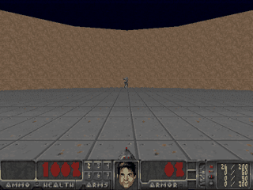
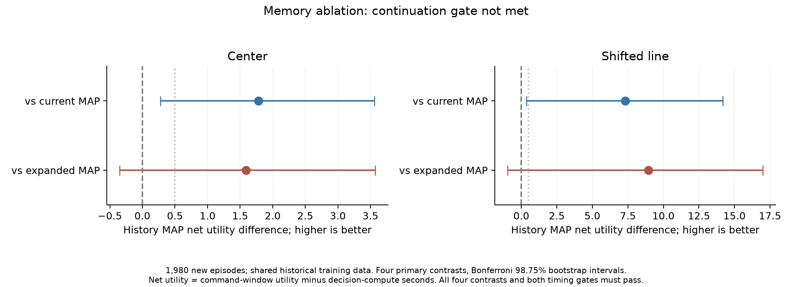

# DecisionTics

Previously `kw2828/OpenJev`. The project is now named DecisionTics to distinguish it from existing OpenJev projects. The `openjev` Python package, CLI, environment variables, and API header remain compatible with earlier experiments.

**English context → your questions and candidate answers → candidate probabilities → your application's next step.**

A local decision interface with an editable playground and a real Doom application. Define questions and candidate descriptions at request time. Responses preserve your candidate IDs and return relative probabilities without generating an explanation.

Independently implemented, with interface inspiration from [TypeSafe Jev](https://typesafe.ai/blog/introducing-system-one-models-and-jev) and the interface direction of [zhihz/openjev](https://github.com/zhihz/openjev). The [openjev.com browser lab](https://openjev.com/) also demonstrates browser-local candidate scoring. DecisionTics is independent of these projects and does not reproduce Jev's architecture, weights, or proprietary RLCD method.

## Watch the local model play Doom



*Recorded on Apple Silicon with the local Qwen3-4B language controller: **2 kills in 8.17 game seconds**, then death. Playback is at game speed; inference took **20.61 wall seconds**. This is a gameplay demonstration, separate from the Bayesian experiment below. [Recording details and trace](#language-model-gameplay) · [Tiny imitation model gameplay](#tiny-model-gameplay).*

## Hosted demo and deployment

[**Try the free browser playground**](https://kw2828.github.io/DecisionTics/) · [**Run the full app**](docs/hosting.md) · [Open in Codespaces](https://codespaces.new/kw2828/DecisionTics)

The Pages site runs a pinned Qwen3-0.6B model in your browser through WebLLM and displays recorded Doom gameplay. Load the model to score your own candidates without an inference server. See [browser requirements and scoring limits](docs/browser-model.md). The interactive app has a Linux Docker deployment for Hugging Face Spaces or another container host. It runs the API, **Qwen3-0.6B on CPU**, and real ViZDoom together. This smaller hosted checkpoint is distinct from the Mac 4B model below; responses identify which model produced the scores. The Pages playground needs no backend; the full live Doom app still runs separately. See [hosting instructions and shared-arena limits](docs/hosting.md).

```sh
docker build -t openjev .
docker run --rm -p 127.0.0.1:7860:7860 --memory=6g --cpus=2 openjev
```

Open http://localhost:7860. Public mode disables the paid Jev API. Model weights are downloaded during the image build, then inference runs offline.

## Run the English decision model on a Mac

The MLX language backend requires **Apple Silicon macOS** and Python 3.11-3.13. It uses a pinned [Qwen3-4B-Instruct-2507 MLX 4-bit checkpoint](https://huggingface.co/mlx-community/Qwen3-4B-Instruct-2507-4bit), about 2.3 GB of downloaded weights. The pretrained model is multilingual; this interface and its development checks focus on English. No paid API key is required.

```sh
git clone https://github.com/kw2828/DecisionTics.git
cd DecisionTics
uv sync --frozen --extra language
uv run --extra language openjev setup
uv run --extra language openjev serve
```

Open **http://127.0.0.1:8000**. The **Decision playground** lets you edit context, add questions, supply candidate IDs and descriptions, inspect all scores, and export JSON. Model loading is lazy. Setup downloads the pinned artifact; inference uses the local cache and makes no hosted inference calls.

For the existing tiny Doom baseline only, use `uv sync --frozen` and `uv run openjev serve`. It does not need language weights. For Linux language inference, use the CPU container above. GitHub CI remains unconfigured.

## Research extensions

**New: [frozen memory ablation](docs/memory-ablation.md), 1,980 fresh episodes.** Causal history improved utility over the original model on both scenarios, but did not clear the predeclared comparisons against the equally sized current-only control. The continuation gate failed; adaptive-compute and second-environment efficacy experiments stopped.



[**Benchmark figures and evidence**](docs/benchmarks.md) · [**Paper draft (PDF)**](output/pdf/decisiontics-paper.pdf) · [**LaTeX source and build instructions**](paper/README.md)

The [research plan](docs/research.md) covers conformal prediction sets, connectome-inspired sparse recurrence, shared-depth latent transformers, recurrent world models, and a Rust/Python score-kernel benchmark. Working modules live under `openjev.research`; they are opt-in and do not change the deployed policy. The architecture modules are untrained, and synthetic checks are not model-quality results. The proposed ICLR direction is uncertainty-guided compute under a fixed budget, with explicit prior-work comparisons and stop rules.

The [Bayesian calibrated-decision pilot](docs/bayesian-rlcd.md) now includes a **440-episode valid development run**: posterior averaging did not establish a control gain, and conservative Bayesian gating reduced utility under scenario shift. It includes fitted outcome models, paired comparisons, public RLCR references, and the preserved earlier measurement failure. These are development results, not an ICLR novelty claim.


*Higher is better; zero is the learned point estimate (MAP). Bars show exploratory 95% paired crossed-bootstrap intervals. Utility counts successful firing windows minus 0.25 per fire-command window. [Protocol, results, and limitations](docs/bayesian-rlcd.md).*

### Benchmark visualizations


*20 matched seeds per policy; dots are episodes and red marks are means. This original two-tic gameplay benchmark uses a different protocol from the Bayesian study above.*


*One local score-kernel benchmark: **0.204 ms Rust vs 0.550 ms NumPy** per row at the median, a **2.70x ratio**. Red marks show median and IQR, not confidence intervals. This excludes model inference and Doom, so it is not an end-to-end speedup. [All benchmark scopes, audit plot, and source data](docs/benchmarks.md).*

## Reusable API

```json
{
  "context": "A customer was charged twice and requests the duplicate payment back.",
  "questions": [{
    "id": "queue",
    "question": "Which team should handle this request?",
    "candidates": [
      {"id": "billing", "description": "Billing and payments"},
      {"id": "technical", "description": "Technical troubleshooting"}
    ]
  }]
}
```

```sh
curl http://127.0.0.1:8000/api/decide \
  -H 'Content-Type: application/json' -H 'X-OpenJev: 1' \
  --data-binary @examples/support.json

# Or score a file without starting the web server:
uv run --extra language openjev decide examples/support.json
```

Each answer contains `id`, `choice`, `probabilities`, input token count, latency, action-label entropy, and the full-vocabulary probability mass assigned to candidate letters. The response also identifies the model revision and scoring protocol. The runtime constructs JSON; no explanation or probability numbers are generated as text. See [the API contract](docs/decision-api.md).

**Scores are uncalibrated and conditional on the supplied candidates.** A high score does not establish correctness or predict success. Include an explicit "not enough information" candidate if your application needs it. The API does not silently add answers, execute tools, or guarantee understanding of arbitrary new tasks.

The backend reads one next-token label distribution per question. Multiple questions are currently evaluated sequentially and re-encode the context. It still runs a pretrained autoregressive transformer. No shared-prefix optimization, GLiClass backend, conformal guarantee, semantic entropy, new RL training, or latent-recurrence extension is claimed.

## Doom consumes the same contract

Choose **Doom application**, select **Qwen / English decision model**, enter an instruction, click **Apply instruction**, then **Run agent**. Try "Do not fire your weapon, even when an enemy is visible" or "Aim at enemies and fire when aligned."

The adapter supplies the current structured observation and four recent steps as context. It asks one question over six combinations of left/hold/right and fire/no-fire, then maps the selected candidate ID to game buttons. This uses the same `DecisionService` and schema as `/api/decide`. Scores shown for steering and firing are marginals of the six-action distribution; the executed action is the winning joint candidate.

These scenarios only support turning or strafing and firing. Requests to navigate a full level, find cover, or perform unavailable actions cannot be fulfilled by this action space. Observations come from privileged engine labels, not screenshots. Recent history is explicitly serialized, not a learned recurrent memory. Pacifist and empty-ammo firing limits remain enforced in code for every controller.

**The simulation waits while the language model scores each action.** Two game tics advance per decision; wall-clock playback is slower than the tiny baseline. No real-time language-control or speedup claim is made.

```sh
uv run --extra language openjev play --policy language --seed 42 \
  --instruction "Aim at visible enemies and fire when aligned. Keep scanning when no enemy is visible." \
  --record runs/language-episode
```

### Language model gameplay

[Watch the recording at the top of this README](#watch-the-local-model-play-doom).

*Complete Defend the Center episode, seed 42: **2 kills, then death after 8.17 game seconds**. The language controller made 138 decisions; this run took 20.61 wall seconds. The GIF plays at game speed, not inference speed. Median policy-call latency was 120 ms on this machine. This is a development demonstration, not an optimized speed benchmark or an improvement over the specialized baseline. [Metrics](evidence/language-doom-42.json) · [Full decision trace](evidence/language-doom-42.jsonl).*

### Tiny model gameplay


*This earlier GIF shows the 5,253-parameter imitation baseline, not Qwen: 16 kills, then death after 23.1 game seconds. Complete seed-42 episode sampled every four tics. [Metrics](evidence/episode-42.json) · [Trace](evidence/episode-42.jsonl).*

## Verification and limits

- [Language development checks](evidence/language-development.json): **8/8** disclosed text questions, an unchanged distribution under exact candidate reordering, and a paired English Doom instruction check that changed firing to no-firing. These are implementation smoke checks, not an independent benchmark or evidence of calibration.
- Tests cover invalid requests, duplicate IDs, candidate mapping, excluded probability mass, bounded inference concurrency, no fallback on missing weights, origin protection, and real-engine baseline behavior.
- The local server binds to loopback. API mutations require `X-OpenJev: 1`; cross-origin requests are rejected. Do not expose this single-user prototype to the internet.
- [Language model card](docs/language-model-card.md) and [implementation plan](docs/update-plan.md).

```sh
uv run --extra language python scripts/check_language.py --output runs/my-language-check.json
uv run --extra dev pytest -q
uv run --extra dev ruff check src tests scripts
```

## Tiny imitation baseline

```text
ViZDoom visible actor labels + game variables
                     |
              11 numeric features
                     |
              shared MLP: 64 → 64
                     |
         +-----------+-----------+
         |                       |
   steer: 3 logits          fire: 2 logits
   left / hold / right      no / yes
         |                       |
         +------ typed action ---+
                     |
            Doom buttons, 2 tics
```

The **5,253-parameter model** is trained from scratch on 60,000 synthetic structured states labeled by an explicit controller. Both output heads are computed together. Runtime inference uses NumPy; PyTorch is only needed to retrain. The model never calls the teacher at inference time.

This is **behavioral cloning for a narrow game task**, not a foundation model. It uses privileged engine labels for visible enemies, including bounding boxes and distance. It does not learn vision from screenshots, inspect hidden actors, understand arbitrary text, navigate full campaigns, or reproduce Jev's claimed general capability. Displayed local probabilities are not calibrated confidence.

## Measured tiny-baseline gameplay

20 complete episodes per policy, same seeds **1000-1019**, default Defend the Center rules, two game tics per decision. The shipped checkpoint was fixed before these gameplay runs. Training seed 7; synthetic evaluation seed 8. Development gameplay used seeds 42-44.

| Controller | Mean kills | Mean reward | Mean survival, game seconds |
|---|---:|---:|---:|
| DecisionTics local model | 17.55 | 16.55 | 25.32 |
| Rule-based teacher | 17.60 | 16.60 | 25.77 |
| Random controls | 0.95 | -0.05 | 8.65 |

[Every episode and timing measurement](evidence/defend-center.json). This small comparison shows the student largely reproducing its teacher in this scenario. It does not show an improvement over rules or a speedup over Jev/LLMs. Policy timing excludes the engine, rendering, network, and browser. The UI paces local play toward the engine's 35 game tics per wall second; slower remote decisions slow the simulation instead of running asynchronously.

Defend the Line and Basic are also selectable. The above performance numbers apply **only to Defend the Center**. Scenarios keep their original controls and reward definitions. Basic uses left/right strafing; the defense scenarios use left/right turning.

```sh
# Headless gameplay
uv run openjev play --policy local --seed 42

# A full recording, raw decisions, and episode metrics
uv run openjev play --seed 42 --record runs/my-episode

# Repeat the matched-seed comparison
uv run openjev evaluate --episodes 20 --seed 1000 --output runs/evaluation.json

# Reproduce training; overwrites the local checkpoint
uv sync --frozen --extra train --extra dev
uv run openjev train
uv run pytest -q
uv run ruff check src tests
```

Training metadata, feature order, synthetic agreement scores, and the checkpoint SHA-256 live in [doom.json](src/openjev/weights/doom.json). Synthetic teacher agreement is a different measurement from gameplay ability.

## Optional: use the real Jev

With an early-access TypeSafe key, export `TYPESAFE_API_KEY` in the server's environment before starting it. Select **Jev API** in the cockpit, or run:

```sh
uv run openjev play --policy jev --seed 42
```

The adapter uses the [documented TypeSafe endpoint](https://docs.typesafe.ai/api): one `Choice` for steering and one `Noul` for firing in a single request to `jev-latest`. It sends only the structured game observation. The key remains on the server.

**Live Jev status: not verified.** Request/response handling is covered by mocked contract tests, not a real API run. There is no silent fallback to the local model. Each policy instance reserves at most 300 calls, including failures; in the cockpit that budget persists across episode restarts and controller switches until the server is restarted. Timeout, invalid response, or exhausted budget pauses play. Requests are not retried. API usage may incur TypeSafe charges.

## Research and scope

See [the research notes](docs/research.md) for primary sources, the distinction between type safety and correctness, and what was publicly reproducible on September 16, 2026. See [the model card](docs/model-card.md) for training and evaluation limits.

## CI setup

Automated tests pass locally on macOS. The publishing credential lacks GitHub workflow permission, so CI is not active. To enable it using a credential with that permission, copy [the workflow template](docs/ci-workflow.yml) to `.github/workflows/ci.yml` and commit it. It installs locked dependencies and runs lint plus the real-engine tests on Ubuntu. Language contract tests use explicit test doubles; real MLX inference checks run separately on Apple Silicon. Linux execution remains unverified until that run passes.

## Project map

| File | Purpose |
|---|---|
| `src/openjev/decisions.py` | Game-independent request schema, pinned local language scoring and bounded worker |
| `src/openjev/doom_adapter.py` | English objective + observed game state to the general decision contract |
| `src/openjev/domain.py` | Observation features, typed actions, teacher, hard control limits |
| `src/openjev/game.py` | Real ViZDoom engine and visible-actor extraction |
| `src/openjev/policies.py` | NumPy model, baselines, optional Jev HTTP adapter |
| `src/openjev/train.py` | Synthetic data and reproducible supervised training |
| `src/openjev/evaluate.py` | Full episodes, recordings, matched-seed comparisons |
| `src/openjev/server.py` | Local-only cockpit service and bounded game loop |
| `tests/` | Action constraints, API contract, real gameplay, browser-server controls |

The server binds to loopback, validates controls and Host/Origin, and does not allow arbitrary game commands or external endpoints. It is a single-user prototype, not an internet-facing service.

MIT license for this project's code and trained weights. ViZDoom and Freedoom retain their own licenses; their binaries/assets are installed as dependencies, not included in this repository. Doom is a trademark of id Software. No affiliation with TypeSafe AI or id Software.
