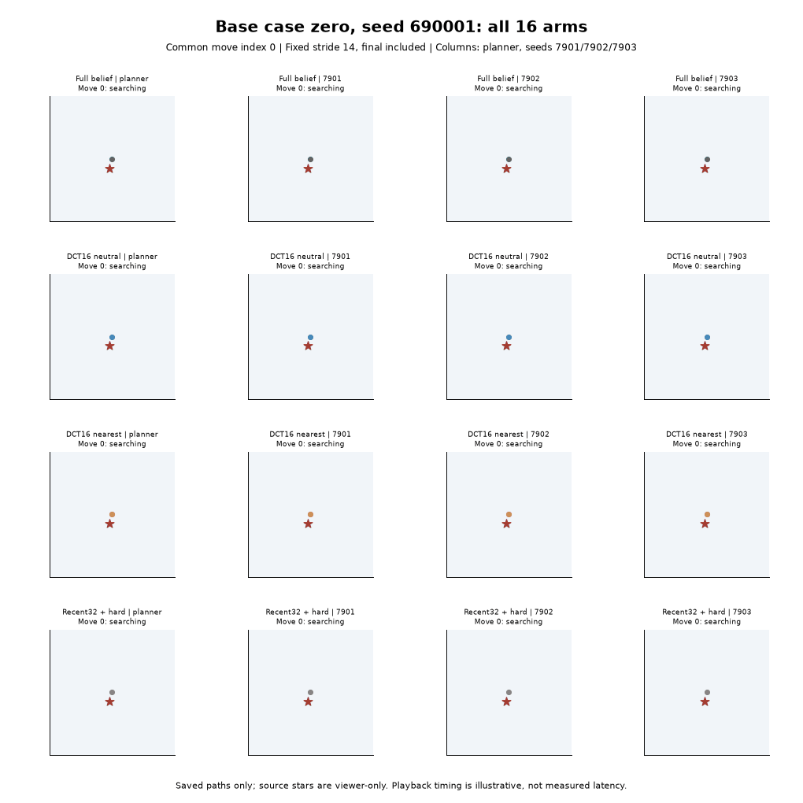
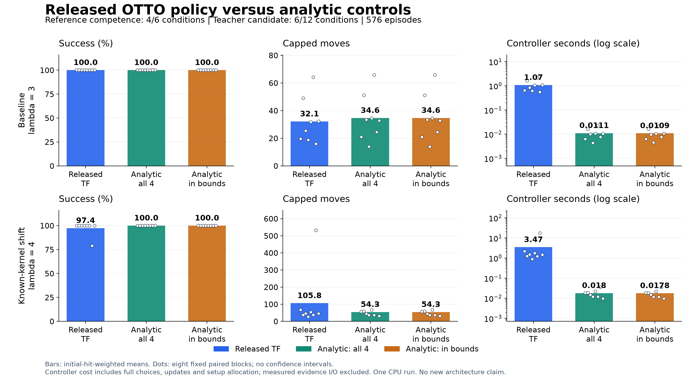
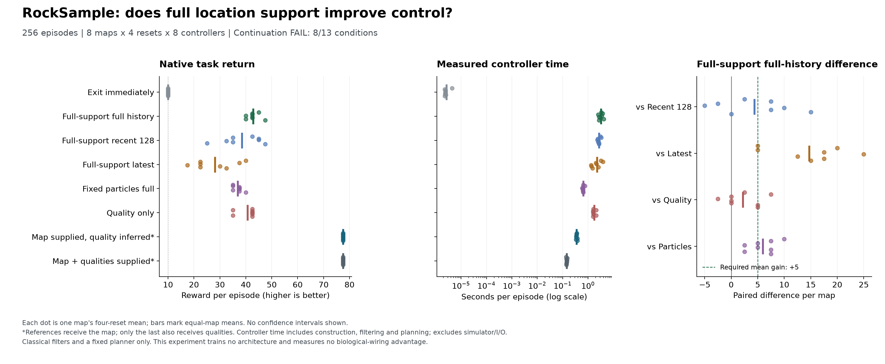
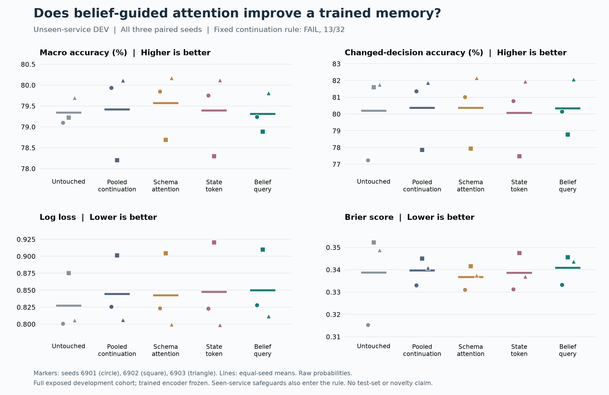

# OpenJev

**Context → questions and candidate answers → probabilities → your application's next step.**

Score choices with stable IDs. Try text decisions in your browser, run local Doom policies, or train a small chess model.

[**Text demo**](https://kw2828.github.io/OpenJev/) · [**Chess replay**](https://kw2828.github.io/OpenJev/chess-candidate-replay.html) · [API](docs/decision-api.md) · [Benchmarks](docs/benchmarks.md) · [Setup](docs/project-reference.md)

## Chess

[](https://kw2828.github.io/OpenJev/chess-candidate-replay.html)

Our candidate experiment compares **four small chess policies across twelve fits and 288 games**. Each scores every legal move. Two variants use exact next-board states from native chess rules. The GIF shows the first scheduled game, drawn by repetition.


Exact-delta matched Stockfish on **33.15%** of ordinary positions versus **31.75%** for direct scoring, and **27.10% versus 26.81%** on shifted positions. It costs more compute and **fails the engine-loss and game-score continuation criteria**. These development results establish neither a learned world model nor an Elo rating.

On a separate **4,096-position ChessBench transfer panel**, the four model families average **26.03-26.79%** move agreement. The gains remain small. [Transfer results](docs/chessbench-transfer.md).

The completed [connectome study](docs/chess-connectome.md) compared biological wiring with three rewired controls, dense recurrence and node-local recurrence across three seeds. It **did not establish a biological-wiring advantage**: only **5 of 30** required checks passed. All 21 models are shown below; there is no gameplay or Elo result for this study.

<a href="docs/chess-connectome.md"></a>

The [30-fit mapping follow-up](research/chess-connectome-mapping-study.md) reduced biological-model loss by 8.6% on ordinary positions, with no improvement under shift. It also failed its continuation rule.

[Results and all twelve weights](docs/chess-candidate.md) · [Connectome controls](research/chess-connectome-followup.md) · [Earlier capacity study](docs/chess-capacity.md)

[Earlier predictive models and paper](docs/chess-spatial.md) · [Astra, ChessFly and ChessLFM comparison](docs/chess.md)

The latest [24-fit graph comparison](docs/chess-pin-quality.md) found **36.43% / 31.40%** ordinary/shifted move agreement for joint pin factors, below the WLDN baseline's **37.16% / 31.92%**, while taking **13.1% more decision time**. Only 2/16 quality checks passed. The proposed mechanism did not earn continuation.

<a href="docs/chess-pin-quality.md"></a>

## Doom

[](docs/assets/jepa-policy-181000.gif)

**13 kills in 19.26 game seconds**, first fit and first evaluation seed. JEPA scored training clips; a small policy plays the recording. [Results and limits](docs/jepa-rl-study.md) · [Recording receipt](docs/assets/jepa-policy-181000.json).

## Robot reaching

[](research/reacher-geometry-memory.md)

**The stronger memory comparison failed its continuation rule: 24/25 checks.** Persistent GRU lowered control cost by **4.44%/2.94%** versus a separately trained model using two observations and intervening actions. The rule required at least 3% on both sensing-gap panels. All three paired fits improved, but the ten-step mean missed the required margin.


Supplied-physics controllers still perform better. Equal search budgets do not match total compute. The GIF replays the preselected first case from the earlier study; the chart shows all 42 rows of the new comparison. [New results and audit](research/reacher-two-observation-control.md).

The [earlier comparison](research/reacher-geometry-memory.md) passed all 25 checks against the weaker one-observation control, with 31.9%/26.0% lower cost. Neither study establishes a new architecture or biological-wiring advantage. [Earlier paper](output/pdf/openjev-reacher-geometry-memory-study.pdf) · [LaTeX](paper/reacher-geometry-memory-study.tex).

## Run locally

Apple Silicon macOS, Python 3.11-3.13:

```sh
git clone https://github.com/kw2828/OpenJev.git
cd OpenJev
uv sync --frozen --extra language
uv run --extra language openjev setup
uv run --extra language openjev serve
```

Open **http://127.0.0.1:8000**. Local text scoring uses Qwen3-4B; the free browser demo uses Qwen3-0.6B through WebGPU. [Linux, Docker and hosting](docs/hosting.md).

## Research results

[Learned odor-search pilot](research/otto-action-head-results.md): **1,536 autonomous searches, twelve trained policies and four analytic planners**. The full-belief learned head achieved **24.59% / 23.08%** mixture-weighted success across the two regimes, versus **100% / 100%** for the full-belief planner. Only **6/40** candidate checks passed, and the full-head competence requirement failed. This training recipe does not establish a compact-memory or learned-architecture advantage.

[](research/otto-action-head-results.md)

The GIF shows the preselected first baseline case, with illustrative timing. [All-controller chart](output/otto-action-head-v1/figure-01/action-head.png) · [Shifted replay](output/otto-action-head-v1/figure-01/first-case-shift.gif) · [Results, weights and audit](research/otto-action-head-results.md).

The [original pretrained policy comparison](research/otto-released-reference-results.md) now completes **576 fresh searches**. It uses **7.29% fewer moves** in the baseline, but **94.88% more under a sensing shift**, with one failed search and much greater CPU cost. Competence **4/6**, teacher **6/12** and utility-compute **6/16** checks pass; all overall rules fail. [Baseline GIF](output/otto-released-reference-v1/figure-01/replay-base-case0.gif) · [Shifted GIF](output/otto-released-reference-v1/figure-01/replay-shift-case0.gif).

[](research/otto-released-reference-results.md)

The earlier [fixed-memory comparison](research/otto-spectral-control-results.md) completed **1,152 searches**: both compact memories found every source with **80.79% less evolving array state**, but used **31-39% more controller computation**. Its compact and utility-compute rules also failed.

The [original 768-search comparison](research/otto-large-memory-results.md) still fails its continuation rule: full history improves mean search time **41.13%**, but only **5/8 blocks** improve. A [saved-history diagnostic](research/otto-memory-evidence-results.md) traces 98% of the net gain to three cases. [Earlier 19x19 pilot](research/otto-memory-results.md).

[RockSample state representation comparison](research/rocksample-representation-results.md): **256 episodes**, with **42.81 reward** for full history versus **38.44** for recent history and **40.63** for quality-only. The broader representation beats fixed particles on every map, but misses the stronger controls' required margins and sometimes violates occupancy bounds. **8/13 conditions pass; no learned memory pilot is admitted.**

[](research/rocksample-representation-results.md)

[Earlier control screen](research/rocksample-policy-value-results.md) · [Prediction diagnostic](research/rocksample-public-memory-results.md) · [Olfactory search source review](research/olfactory-search-opportunity.md).

**Belief-guided attention did not improve the trained memory.** All twelve adapted fits completed. Unseen macro accuracy is **79.31%**, versus **79.42%** for ordinary continued training and **79.57%** for schema attention. Probability scores also worsen; the fixed rule fails **13/32**, with independent agreement.

[](research/dialogue-warm-pooling-results.md)

All fifteen initial replays reproduced the original probabilities exactly, so this tests the new attention mechanism from a competent starting point. [Complete results](research/dialogue-warm-pooling-results.md). No new architecture advantage is established.

- [Calibration control](research/dialogue-calibration-runtime-v2-results.md): trained-model log loss improves 26.4% with every answer unchanged, but the frozen reference worsens; the full rule fails 9/11.
- [Earlier attention pilot](research/dialogue-belief-pooling-pilot-results.md): all eight small fresh-training fits scored 0% on changed decisions.
- [Earlier text learning experiments](research/dialogue-objective-results.md): matched training objectives and recurrent variants have not established an architecture advantage.
- [Qwen lexical ablation](research/dialogue-qwen-lexical-ablation-results.md): better changed-value accuracy, worse retention; 5/16 conditions passed.
- [Text inference speed](research/shared-prefix-results.md): shared-context scoring is **2.08x faster** for four-question synthetic workloads; single-question caching is slower.
- [All experiments, failures and visualizations](research/experiment-index.md): complete results, protocols, receipts and paper sources.

Demo candidate scores are uncalibrated and relative to the supplied choices. These experiments use different models and protocols. The root MIT license applies except where component notices specify other terms, including GPL-3.0-only chess research files. Third-party data and model licenses apply separately.

Independent of [TypeSafe Jev](https://typesafe.ai/blog/introducing-system-one-models-and-jev), [zhihz/openjev](https://github.com/zhihz/openjev) and [openjev.com](https://openjev.com/). No proprietary RLCD reproduction or established new RL algorithm is claimed.
