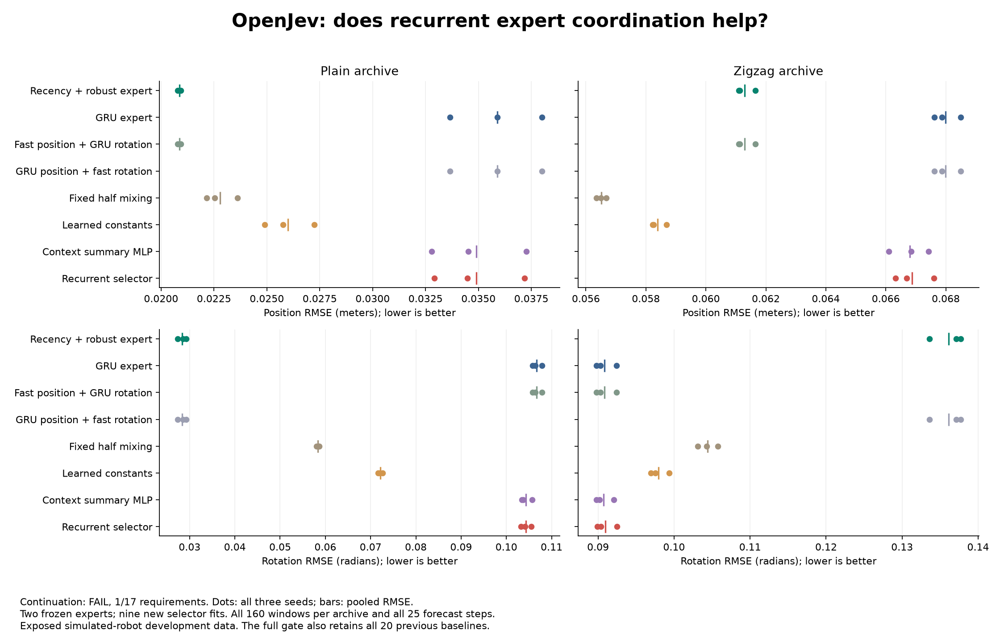

# OpenJev

**Context → questions and candidate answers → probabilities → your application's next step.**

Score choices with stable IDs. Try text decisions in your browser, run local Doom policies, or train a small chess model.

[**Text demo**](https://kw2828.github.io/OpenJev/) · [**Chess replay**](https://kw2828.github.io/OpenJev/chess-candidate-replay.html) · [API](docs/decision-api.md) · [Benchmarks](docs/benchmarks.md) · [Setup](docs/project-reference.md)

## Chess

[](https://kw2828.github.io/OpenJev/chess-candidate-replay.html)

Our candidate experiment compares **four small chess policies across twelve fits and 288 games**. Each scores every legal move. Two variants use exact next-board states from native chess rules. The GIF shows the first scheduled game, drawn by repetition.


Exact-delta matched Stockfish on **33.15%** of ordinary positions versus **31.75%** for direct scoring, and **27.10% versus 26.81%** on shifted positions. It costs more compute and **fails the engine-loss and game-score continuation criteria**. These development results establish neither a learned world model nor an Elo rating.

On a separate **4,096-position ChessBench transfer panel**, the four model families average **26.03-26.79%** move agreement. The gains remain small. [Transfer results](docs/chessbench-transfer.md).

The completed [connectome study](docs/chess-connectome.md) compared biological wiring with three rewired controls, dense recurrence and node-local recurrence across three seeds. It **did not establish a biological-wiring advantage**: only **5 of 30** required checks passed. All 21 models are shown below; there is no gameplay or Elo result for this study.

<a href="docs/chess-connectome.md"></a>

The [30-fit mapping follow-up](research/chess-connectome-mapping-study.md) reduced biological-model loss by 8.6% on ordinary positions, with no improvement under shift. It also failed its continuation rule.

[Results and all twelve weights](docs/chess-candidate.md) · [Connectome controls](research/chess-connectome-followup.md) · [Earlier capacity study](docs/chess-capacity.md)

[Earlier predictive models and paper](docs/chess-spatial.md) · [Astra, ChessFly and ChessLFM comparison](docs/chess.md)

The latest [24-fit graph comparison](docs/chess-pin-quality.md) found **36.43% / 31.40%** ordinary/shifted move agreement for joint pin factors, below the WLDN baseline's **37.16% / 31.92%**, while taking **13.1% more decision time**. Only 2/16 quality checks passed. The proposed mechanism did not earn continuation.

<a href="docs/chess-pin-quality.md"></a>

## Doom

[](docs/assets/jepa-policy-181000.gif)

**13 kills in 19.26 game seconds**, first fit and first evaluation seed. JEPA scored training clips; a small policy plays the recording. [Results and limits](docs/jepa-rl-study.md) · [Recording receipt](docs/assets/jepa-policy-181000.json).

## Robot reaching

[](research/reacher-geometry-memory.md)

**The stronger memory comparison failed its continuation rule: 24/25 checks.** Persistent GRU lowered control cost by **4.44%/2.94%** versus a separately trained model using two observations and intervening actions. The rule required at least 3% on both sensing-gap panels. All three paired fits improved, but the ten-step mean missed the required margin.


Supplied-physics controllers still perform better. Equal search budgets do not match total compute. The GIF replays the preselected first case from the earlier study; the chart shows all 42 rows of the new comparison. [New results and audit](research/reacher-two-observation-control.md).

The [earlier comparison](research/reacher-geometry-memory.md) passed all 25 checks against the weaker one-observation control, with 31.9%/26.0% lower cost. Neither study establishes a new architecture or biological-wiring advantage. [Earlier paper](output/pdf/openjev-reacher-geometry-memory-study.pdf) · [LaTeX](paper/reacher-geometry-memory-study.tex).

## Run locally

Apple Silicon macOS, Python 3.11-3.13:

```sh
git clone https://github.com/kw2828/OpenJev.git
cd OpenJev
uv sync --frozen --extra language
uv run --extra language openjev setup
uv run --extra language openjev serve
```

Open **http://127.0.0.1:8000**. Local text scoring uses Qwen3-4B; the free browser demo uses Qwen3-0.6B through WebGPU. [Linux, Docker and hosting](docs/hosting.md).

## More experiments

- [Recurrent expert coordination](research/pose-coordination-results.md): nine new selector fits completed. The recurrent and summary selectors put about **97% weight on the GRU** in both robot archives. Recurrence shows no advantage and costs more. **1/17 requirements pass**. Saved training forecasts reveal that expert rankings change outside their training examples.

[](research/pose-coordination-results.md)

- [Recency and robust adaptation](research/pose-support-results.md): with the same trained weights, position error falls **36.6% / 15.4%** versus no adaptation. Plain rotation improves; zigzag rotation regresses **7.6%**. Recent-five explains most of the position gain. **5/17 requirements pass**, so no new architecture advantage is established.

[](research/pose-support-results.md)

- [Learning through context adaptation](research/pose-adaptation-results.md): twelve new fits. Disabling adaptation in the **same trained model** lowers both physical errors on both robot archives for every seed. Only **1/17 requirements** passed; the adaptation recipe failed.

- [Geometry and recurrent memory](research/pose-transport-results.md): 12 new fits with physical position/rotation errors and stronger motion baselines. Rotating memory improved the matched model by only 0.1% to 1.4%; **345/541 checks passed**, so the continuation rule failed.

- [Residual dynamics and online correction](research/residual-dynamics-results.md): six new fits and 500 ms forecasts. Error fell 52% on one archive and rose 27% on another; **36/49 checks passed**, so the continuation rule failed. The gain is concentrated in one trajectory, and simple motion prediction explains much of the position improvement. [Figure](output/residual-dynamics-v1/visualization-03/forecast-results.png).

- [Action-conditioned robot memory](research/action-filter-results.md): 15 new fits on published simulated-robot data. A linear predictor beat every neural model; the proposed memory had 18.3 times the GRU's forecast error. [Comparison figure](output/action-filter-v1/visualization-01/forecast-results.png). No architecture advantage established.

[](research/card-calibration-results.md)

[](research/card-calibration-results.md)

- [Calibrated card memory](research/card-calibration-results.md): with the same weights, all five associative-memory families improve from **35-46% to 100% completion**, and aggregate prediction loss falls **36.3%**. The overall rule still fails **11/12** because the GRU regresses. Simple memory references remain more efficient; no new architecture advantage is established. [Earlier controller comparison](research/card-controller-comparison.md) · [Original training](research/card-memory-pilot.md).
- [Route memory](research/mystery-path-memory-qualification.md): full memory reached 76.2% success versus 29.7% with the last 32 transitions, but missed the fixed 80% requirement. These are rule-based controls; no neural-model result is claimed. [Recorded GIF](output/mystery-path-qualification-v1/visualization-01/episode.gif).
- [Planning diagnostic](research/reacher-common-root-diagnostic.md): a longer horizon lowered mean branch cost by 7.33%, but missed the consistency rule; accurate dynamics lowered selected branch cost by 2.51%. All three comparisons failed, so this tracking setup is closed. [Earlier plan-memory test](research/reacher-proposal-memory.md).
- [Error-gated memory pilot](research/reacher-innovation-pilot.md): twelve fits learned, but normalized-error gating failed its continuation rule (21/29 checks). Its gain over age-only gating was below 0.13%.
- [Earlier robot reward-prediction study](research/reacher-reward-residual-control.md): 9/17 continuation checks passed. [Biological learning and JEPA follow-up](research/connectome-learning-program.md).
- [Chess action-outcome supervision](docs/chess-continuation.md): nine fits and 192 games; no established gameplay improvement.
- [Astra-trained text students](docs/codex-astra-distillation.md): routing improved; BoolQ remained near chance.
- [Recurrent world models](docs/recurrent-world-model-study.md) and [associative-memory PPO](docs/associative-ppo-study.md): no established memory advantage. [Initialization follow-up](docs/zero-critic-ppo-study.md).
- [Doom PPO/DQN](docs/rl-study.md), [JEPA + RL](docs/jepa-rl-study.md), [all figures](docs/benchmarks.md) and [paper sources](paper/README.md).

Candidate scores are uncalibrated and relative to the supplied choices. These experiments use different models and protocols. The root MIT license applies except where component notices specify other terms, including GPL-3.0-only chess research files. Third-party data and model licenses apply separately.

Independent of [TypeSafe Jev](https://typesafe.ai/blog/introducing-system-one-models-and-jev), [zhihz/openjev](https://github.com/zhihz/openjev) and [openjev.com](https://openjev.com/). No proprietary RLCD reproduction or established new RL algorithm is claimed.
