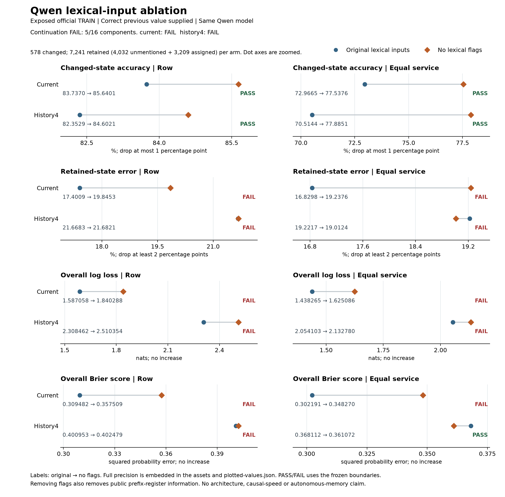

# OpenJev

**Context → questions and candidate answers → probabilities → your application's next step.**

Score choices with stable IDs. Try text decisions in your browser, run local Doom policies, or train a small chess model.

[**Text demo**](https://kw2828.github.io/OpenJev/) · [**Chess replay**](https://kw2828.github.io/OpenJev/chess-candidate-replay.html) · [API](docs/decision-api.md) · [Benchmarks](docs/benchmarks.md) · [Setup](docs/project-reference.md)

## Chess

[](https://kw2828.github.io/OpenJev/chess-candidate-replay.html)

Our candidate experiment compares **four small chess policies across twelve fits and 288 games**. Each scores every legal move. Two variants use exact next-board states from native chess rules. The GIF shows the first scheduled game, drawn by repetition.


Exact-delta matched Stockfish on **33.15%** of ordinary positions versus **31.75%** for direct scoring, and **27.10% versus 26.81%** on shifted positions. It costs more compute and **fails the engine-loss and game-score continuation criteria**. These development results establish neither a learned world model nor an Elo rating.

On a separate **4,096-position ChessBench transfer panel**, the four model families average **26.03-26.79%** move agreement. The gains remain small. [Transfer results](docs/chessbench-transfer.md).

The completed [connectome study](docs/chess-connectome.md) compared biological wiring with three rewired controls, dense recurrence and node-local recurrence across three seeds. It **did not establish a biological-wiring advantage**: only **5 of 30** required checks passed. All 21 models are shown below; there is no gameplay or Elo result for this study.

<a href="docs/chess-connectome.md"></a>

The [30-fit mapping follow-up](research/chess-connectome-mapping-study.md) reduced biological-model loss by 8.6% on ordinary positions, with no improvement under shift. It also failed its continuation rule.

[Results and all twelve weights](docs/chess-candidate.md) · [Connectome controls](research/chess-connectome-followup.md) · [Earlier capacity study](docs/chess-capacity.md)

[Earlier predictive models and paper](docs/chess-spatial.md) · [Astra, ChessFly and ChessLFM comparison](docs/chess.md)

The latest [24-fit graph comparison](docs/chess-pin-quality.md) found **36.43% / 31.40%** ordinary/shifted move agreement for joint pin factors, below the WLDN baseline's **37.16% / 31.92%**, while taking **13.1% more decision time**. Only 2/16 quality checks passed. The proposed mechanism did not earn continuation.

<a href="docs/chess-pin-quality.md"></a>

## Doom

[](docs/assets/jepa-policy-181000.gif)

**13 kills in 19.26 game seconds**, first fit and first evaluation seed. JEPA scored training clips; a small policy plays the recording. [Results and limits](docs/jepa-rl-study.md) · [Recording receipt](docs/assets/jepa-policy-181000.json).

## Robot reaching

[](research/reacher-geometry-memory.md)

**The stronger memory comparison failed its continuation rule: 24/25 checks.** Persistent GRU lowered control cost by **4.44%/2.94%** versus a separately trained model using two observations and intervening actions. The rule required at least 3% on both sensing-gap panels. All three paired fits improved, but the ten-step mean missed the required margin.


Supplied-physics controllers still perform better. Equal search budgets do not match total compute. The GIF replays the preselected first case from the earlier study; the chart shows all 42 rows of the new comparison. [New results and audit](research/reacher-two-observation-control.md).

The [earlier comparison](research/reacher-geometry-memory.md) passed all 25 checks against the weaker one-observation control, with 31.9%/26.0% lower cost. Neither study establishes a new architecture or biological-wiring advantage. [Earlier paper](output/pdf/openjev-reacher-geometry-memory-study.pdf) · [LaTeX](paper/reacher-geometry-memory-study.tex).

## Run locally

Apple Silicon macOS, Python 3.11-3.13:

```sh
git clone https://github.com/kw2828/OpenJev.git
cd OpenJev
uv sync --frozen --extra language
uv run --extra language openjev setup
uv run --extra language openjev serve
```

Open **http://127.0.0.1:8000**. Local text scoring uses Qwen3-4B; the free browser demo uses Qwen3-0.6B through WebGPU. [Linux, Docker and hosting](docs/hosting.md).

## Research results

**Latest: removing lexical flags did not fix retention.** The complete 15,638-decision comparison finished in 41.3 minutes. Changed-value accuracy improved, but only **5/16** continuation checks passed. Both context settings failed, with independent arithmetic agreement.

| Model | Changed-value accuracy ↑ | Retained-value error ↓ | Overall accuracy ↑ |
| --- | ---: | ---: | ---: |
| Earlier small model, three-seed mean | 58.59% | 2.46% | 94.66% |
| Qwen, current exchange, original inputs | 83.74% | 17.40% | 82.68% |
| Qwen, current exchange, no lexical flags | 85.64% | 19.85% | 80.56% |
| Qwen, four exchanges, original inputs | 82.35% | 21.67% | 78.63% |
| Qwen, four exchanges, no lexical flags | 84.60% | 21.68% | 78.78% |

Removing flags also removes some full-history information and shortens prompts. Overall log loss worsened in both context settings. Every model receives the correct previous value on exposed development data; this is not an autonomous-memory or new-architecture result. [Complete paired results](research/dialogue-qwen-lexical-ablation-results.md) · [Earlier baseline and every training seed](research/dialogue-qwen-observation-results.md).

[](research/dialogue-qwen-lexical-ablation-results.md)

The [complete history audit](research/dialogue-history-support-results.md) found that apparent delayed references mostly came from matching digits while missing number words. We are prioritizing better text interpretation with autonomous scalar state before another recurrent architecture comparison. The earlier [retention diagnosis and blinded Astra6 review](research/dialogue-qwen-retention-results.md) remain diagnostic.

The [full-batch training pilot](research/dialogue-observation-learning-cost-results.md) passed **40 cases and 52 updates in 75.3 seconds**, including real encoder gradients and checkpoint writing. It uses synthetic targets. The [twelve-fit accuracy comparison](research/dialogue-observation-learning-status.md) is now running under a frozen eight-hour limit; there is no accuracy result yet.

- [Earlier text learning experiments](research/dialogue-objective-results.md): matched training objectives and recurrent variants have not established an architecture advantage.
- [Text inference speed](research/shared-prefix-results.md): shared-context scoring is **2.08x faster** for four-question synthetic workloads; single-question caching is slower.
- [All experiments, failures and visualizations](research/experiment-index.md): complete results, protocols, receipts and paper sources.

Candidate scores are uncalibrated and relative to the supplied choices. These experiments use different models and protocols. The root MIT license applies except where component notices specify other terms, including GPL-3.0-only chess research files. Third-party data and model licenses apply separately.

Independent of [TypeSafe Jev](https://typesafe.ai/blog/introducing-system-one-models-and-jev), [zhihz/openjev](https://github.com/zhihz/openjev) and [openjev.com](https://openjev.com/). No proprietary RLCD reproduction or established new RL algorithm is claimed.
