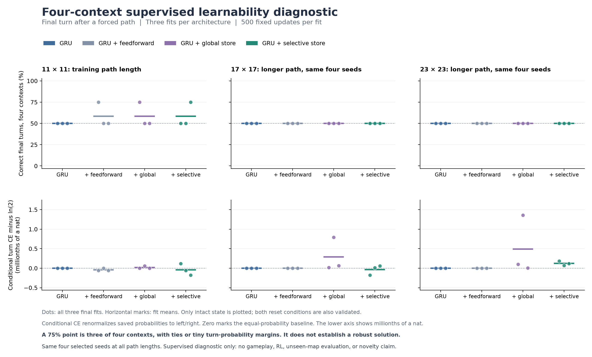

# Can the memory models learn the decision at all?

**The initial supervised check failed. Changing the supervised objective enabled the GRU to learn all four training contexts.** Training over the two relevant turn candidates solved those contexts in every GRU fit. Training over all seven native actions remained at chance, even with an explicit cache of the first observation.

These are small development diagnostics, not RL results. Navigation is forced, there are only four unique examples, and longer routes reuse the same cue/branch combinations. None establishes a new architecture or independent generalization.

## First check: four architectures, seven-action loss

After the [cue-visible PPO failure](cue-memory-study.md), compare the [GRU, feedforward adapter, global associative store and selective store](associative-memory.md). Each model receives the real partial observations and previous forced actions along a route from the visible cue to the fork. Only the final turn receives a supervised loss. The teacher reads the visible initial cue and final branch objects; hidden goal state is not a model input or teacher input.

The dataset exhausts the four cue/upper-branch combinations. Targets are balanced between left and right. Each architecture uses seeds 101, 113 and 127, 500 Adam updates at learning rate 0.001, and a batch of all four contexts. Train on size 11 and evaluate final checkpoints on sizes 11, 17 and 23. The same four seed IDs are reused across lengths. Sources, dependencies, data hashes and settings were frozen in commit `d56b52c` before training.



| Model | Size 11 mean | Size 17 mean | Size 23 mean |
| --- | ---: | ---: | ---: |
| GRU | 50.00% | 50.00% | 50.00% |
| + feedforward adapter | 58.33% | 50.00% | 50.00% |
| + global store | 58.33% | 50.00% | 50.00% |
| + selective store | 58.33% | 50.00% | 50.00% |

**The apparent training-size gains are numerical near ties.** One fit in each added-capacity arm reaches 75%, but each includes an exact left/right probability tie. Their maximum turn-probability margins are below one millionth. All intact conditional turn losses remain within 0.0000014 nats of the equal-probability baseline, `ln(2)`. These fits do not demonstrate a robust solution. Twelve fits completed 6,000 optimizer updates in 11.75 measured local CPU seconds.

[Frozen plan](../evidence/associative-learnability-v1/plan.json) · [All results](../evidence/associative-learnability-v1/summary.json) · [Validation and figure receipt](../evidence/associative-learnability-v1/associative-learnability-figures.json)

## Separate memory credit from action suppression

A second frozen 2 by 2 experiment changes two factors independently, keeping the GRU parameters, initialization, examples, seeds, optimizer and budget identical:

1. **State path:** ordinary recursive updates, or cache the first GRU state and pass that unchanged, differentiable state into each later GRU computation.
2. **Loss:** cross-entropy over all seven output logits, or only the two turn logits. Both conditions retain the identical seven-output model.

The cache is an explicit first-observation shortcut. It does not learn what to retain. At the fork, its computation uses the same first and final observations at every route length, so longer-path success is structurally expected once the endpoint decision is learned.


| State path and loss | Size 11 | Size 17 | Size 23 | Size 11, fork memory erased |
| --- | ---: | ---: | ---: | ---: |
| Recursive, seven actions | 50% | 50% | 50% | 50% |
| Cached first state, seven actions | 50% | 50% | 50% | 50% |
| Recursive, two candidates | 100% | 75% | 50% | 50% |
| Cached first state, two candidates | 100% | 100% | 100% | 50% |

These are means over all three fits. Seven-way and two-candidate argmax accuracies happen to agree in the measured results; both are retained separately in the evidence. Recursive two-candidate accuracy by seed is **100/100/100**, **100/75/25**, and **100/50/25** across the three sizes. The mean therefore hides substantial fit-to-fit variation. The cached model succeeds for every fit and length.

The seven-action objective has two terms: the loss for choosing the correct turn conditional on left/right, plus a penalty for assigning probability outside those two actions. Under this recipe, all seven-action fits end with every fork-state component above 0.95 in absolute value and conditional turn loss near `ln(2)`. Changing only the candidate set used by the loss resolves GRU training-context learning. The experiment supports an objective-dependent optimization failure here; it does not prove the seven-action objective generally fails, identify saturation as the sole cause, or explain the earlier PPO failure.

Erasing memory only at the fork returns every condition to 50%. The successful two-candidate fits use information beyond the current fork observation. Ordinary recurrence remains unreliable on longer paths. Caching the first state isolates a working endpoint-memory control, not a learned retention mechanism.

This protocol was frozen in `9602885`. Twelve fits completed 6,000 optimizer updates in **7.87 measured local CPU seconds**. The three recursive seven-action checkpoints reproduce the earlier GRU checkpoint tensors exactly. No old study was edited or relabeled, and no checkpoint is used as an RL warm start.

[Frozen factorial plan](../evidence/memory-optimization-v1/plan.json) · [All factorial results](../evidence/memory-optimization-v1/summary.json) · [Replay and reproduction receipt](../evidence/memory-optimization-v1/memory-optimization-figures.json)

### Confidence does not identify these errors

A post-hoc audit of the recursive two-candidate fits found **nine errors among 24 longer-route decisions**. Every error assigned its chosen turn **99.86% to 99.99% conditional confidence**. Flagging decisions below 99% confidence catches no errors and flags one correct decision. An entropy threshold fitted to catch every observed error would flag 20 of the 24 decisions, including 11 correct ones.

This is a descriptive audit of these reused contexts, not a calibrated gate evaluation. It motivates testing memory-sensitive signals alongside entropy when investigating adaptive computation. [Saved-probability audit](../evidence/memory-optimization-v1/confidence-audit.json).

## Learned associative memory with the corrected objective

The next comparison changes only the supervised loss from seven-action normalization to the two turn candidates for all four architectures. It keeps the original data, initialization, seeds, 500-update budget and optimizer, trains all 12 fits afresh, and evaluates every final checkpoint. The protocol and continuation rule were frozen in `656b645` before training.


| Architecture | Size 11 | Size 17 | Size 23 | Size 23, store reset |
| --- | ---: | ---: | ---: | ---: |
| GRU | 100% | 75.00% | 50% | 50% |
| + feedforward adapter | 100% | 83.33% | 50% | 50% |
| + global associative writes | 100% | 100% | 100% | 50% |
| + selective associative writes | 100% | 100% | 100% | 50% |

Both associative stores succeed on every fit and length. Clearing the matrix before each observation, while preserving the GRU, reduces their accuracy to 50%. The global store's mean conditional loss at size 23 is **0.000926 nats**; the selective store's is **0.0000203 nats**. Seven-action and two-candidate argmax accuracies agree in these recorded results, but the models have only been trained to choose a final turn after forced navigation.

The GRU controls reproduce the factorial's recursive two-candidate checkpoints exactly. The feedforward control's three fits score **100/75/50**, **100/100/50**, and **100/75/50** across the sizes, giving the means above. Twelve new fits completed 6,000 optimizer updates in **12.46 measured local CPU seconds**.

**The selective-writing continuation rule failed.** Every other criterion passed, but selective writes did not beat global writes by the required 25 percentage points on the longest route. Their lower conditional loss is a descriptive difference, not a replacement success criterion. These results support usable associative storage in this small task; they do not establish a need for input-dependent write strength or novel architecture.

[Frozen candidate plan](../evidence/associative-candidate-v1/plan.json) · [All candidate results and gates](../evidence/associative-candidate-v1/summary.json) · [GRU reproduction receipt](../evidence/associative-candidate-v1/gru-reproduction.json) · [Prediction replay and figure receipt](../evidence/associative-candidate-v1/associative-candidate-figures.json)

## What this changes next

The simple global-write store is now a working retention baseline. A separately frozen [autonomous PPO comparison](associative-ppo-study.md) is running from fresh initialization with all seven native actions. It has no scored results yet. Any later selective-writing claim must still beat global writes and extra capacity under matched training and evaluation.

Solving these four contexts is a prerequisite, not the project goal. A useful policy still needs autonomous navigation, matched gameplay controls, new scenarios and a second environment. A loss change or a fixed first-frame cache alone is not an ICLR novelty claim.

## Reproduce

Use the environment and pinned dependencies recorded in each plan. The research environment includes MiniGrid 3.0.0, PyTorch and NumPy. Runs refuse changed source hashes and existing output directories.

```sh
.venv/bin/python scripts/associative_learnability.py run \
  --plan evidence/associative-learnability-v1/plan.json \
  --out runs/associative-learnability-reproduction
.venv/bin/python scripts/memory_optimization_diagnostic.py run \
  --plan evidence/memory-optimization-v1/plan.json \
  --out runs/memory-optimization-reproduction
.venv/bin/python scripts/associative_candidate_diagnostic.py run \
  --plan evidence/associative-candidate-v1/plan.json \
  --out runs/associative-candidate-reproduction
```

Local timing includes concurrent development work and is not an isolated systems benchmark. Repeated optimizer exposure to four examples does not increase the number of unique training contexts.
