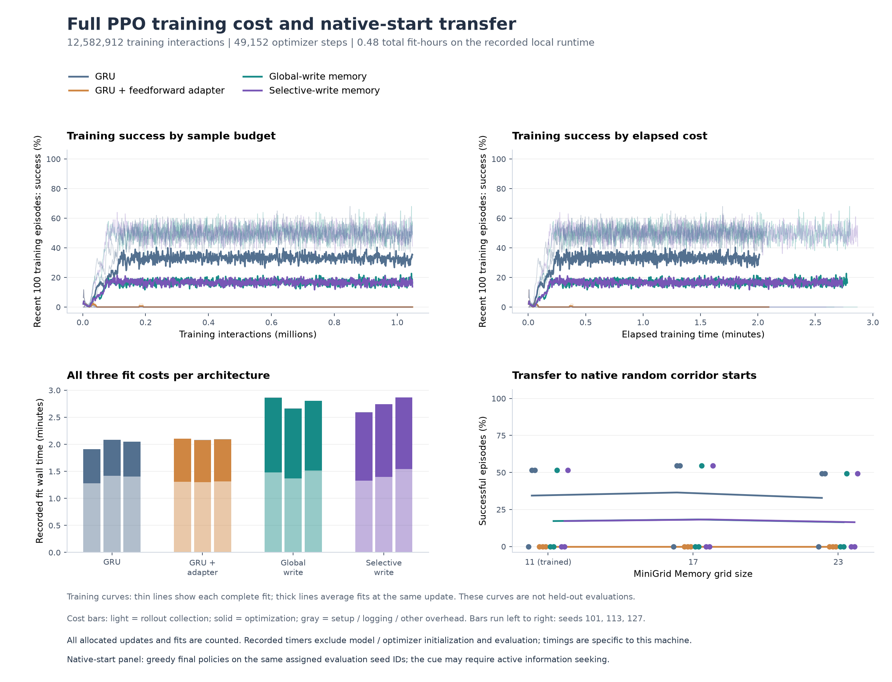

# Do associative stores help autonomous reward learning?

**Completed: the selective-memory continuation rule failed.** Across three fits, both stores reached 17.19% same-size success versus 34.38% for GRU. No cue swap changed a scored branch choice. The protocol and sources were frozen in `34970a9` before execution. This study tests autonomous PPO from fresh initialization, following the [supervised four-context diagnostic](associative-learnability.md).


## Results

All twelve final fits completed 12,582,912 training interactions and 49,152 optimizer steps. Evaluation covered 21,120 assigned episodes across 55 fit/condition records and three map sizes. There was no checkpoint or seed selection.

| Architecture | Size 11 | Size 17 | Size 23 | Size 11 by seed 101 / 113 / 127 |
| --- | ---: | ---: | ---: | --- |
| GRU | 34.38% | 36.46% | 32.81% | 0% / 51.56% / 51.56% |
| Feedforward adapter | 0% | 0% | 0% | 0% / 0% / 0% |
| Global writes | 17.19% | 18.23% | 16.41% | 0% / 0% / 51.56% |
| Selective writes | 17.19% | 18.23% | 16.41% | 0% / 0% / 51.56% |
| Uniform random reference | 0.78% | 0% | 0% | One seeded reference |

Eight of twelve trained fits timed out on every intact evaluation episode. The four surviving fits reached a branch on every episode but succeeded only about half the time. These descriptive means do not establish a statistical architecture advantage.

Swapping the visible cue, while preserving the original reward targets, changed no scored branch choices for any fit at any size. Clearing state left outcomes unchanged for GRU, the adapter and selective writes. The global-write fit with seed 127 became entirely timeout-prone when its store was cleared. That ablation establishes sensitivity to the store, but the unchanged cue-swap choices do not demonstrate use of the remembered cue. Native-start outcomes matched the intact outcomes in this panel.

Nine of the twelve selective-writing checks failed, including same-size utility, every-fit utility, the store-reset effect, and superiority to GRU and global writes at all three sizes. Only comparisons against the failed feedforward adapter passed. The selective-writing continuation rule remains failed.



Recorded fit timers total **1,731.49 seconds**, covering environment setup, rollouts, optimization, logging and checkpoint saves. They exclude model/optimizer initialization and evaluation. Other local work ran concurrently, so these timings are descriptive rather than an isolated speed comparison.

The [training-log audit](../evidence/associative-ppo-v1/training-discovery-audit.json) found some rewarded training episodes in every current fit, including policies that later stopped succeeding. Windows overlap and sometimes omit episodes, so their counts are not exact reward-event totals. The separate [initialization probe](ppo-initialization-probe.md) motivates a [single-factor value-head follow-up](zero-critic-ppo-study.md), now running; its gradients alone do not explain the scored failure.

[Full episode results](../evidence/associative-ppo-v1/summary.json) · [Completed report](../evidence/associative-ppo-v1/completed.json) · [Figure and accounting audit](../evidence/associative-ppo-v1/associative-ppo-figures.json)

## Matched comparison

Use the same four architectures: plain GRU, a feedforward adapter with a similar added parameter count, global associative writes, and input-dependent selective writes. Every arm receives the same cue-visible MiniGrid reset, native seven actions, native sparse rewards, 128-step episode cap, optimizer and interaction budget. No model inherits a supervised checkpoint. There are no auxiliary prediction losses or privileged visibility inputs.

| Setting | Frozen value |
| --- | --- |
| Training seeds | 101, 113, 127 |
| Training / evaluation sizes | Train 11; evaluate 11, 17, 23 |
| Environments / rollout | 16 / 64 steps |
| Updates per fit | 1,024 |
| Interactions per fit / total | 1,048,576 / 12,582,912 |
| PPO epochs / environment minibatch | 2 / 8 |
| Learning rate / entropy coefficient | 0.0003 / 0.01 |
| Discount / GAE lambda | 0.99 / 0.95 |
| Clip / value coefficient / gradient cap | 0.2 / 0.5 / 0.5 |
| Evaluation | Final checkpoint, greedy actions, 128 assigned episodes per size |

The action-sampling RNG is reset after architecture-specific parameter initialization. A fixed randomized order runs all 12 fits. Source and dependency hashes must match the frozen plan. Evaluation seeds are separated from training seed streams, but this finite environment can reuse layouts across seeds. The budget matches interactions, not total computation.

## Interventions and reporting

Every learned fit is evaluated intact, with all state cleared before each action, with the visible cue swapped while preserving the reward target, and under the original random-start rule. Both store architectures also receive store-only resets, preserving the GRU. One uniform-random reference is included. This yields 55 evaluation records and 21,120 assigned episodes across the three sizes.

Report every fit, success, wrong-goal and timeout rates, returns, lengths, action counts and measured training cost. Paired cue swaps retain timeout pairs in the denominator. Count branch reversals only when both paired episodes reach a branch. Write-strength telemetry is descriptive and uses cue-visibility metadata only after the model acts.

The predeclared selective-writing continuation rule requires all of:

- At least 80% mean same-size success and at least 70% for every fit.
- At least a five-percentage-point mean advantage over each of GRU, feedforward adapter and global writes at every size.
- At least a 20-percentage-point same-size success drop with store-only resets.

If both stores improve equally, report the simpler global store's observed comparison with the controls while retaining a failed selective-writing gate. Do not replace the gate with another metric after seeing results. Stronger initial writes, lower losses or isolated successful episodes do not establish a selective-writing advantage.

These are development comparisons of established fast-weight mechanisms. They do not establish architectural novelty or independent confirmation. The earlier supervised seven-action loss failure does not prove that PPO will fail: it is a different learning objective.

## Comparison with established implementations

Conclusions apply to this compact training recipe. [Farama recommends rl-starter-files](https://github.com/Farama-Foundation/Minigrid#training-an-agent), whose [model](https://github.com/lcswillems/rl-starter-files/blob/master/model.py) uses a convolutional encoder and optional LSTM64. Its [training CLI](https://github.com/lcswillems/rl-starter-files/blob/master/scripts/train.py) defaults to ten million interactions and requires recurrence greater than one to enable memory. OpenJev uses a flattened symbolic encoder, GRU64 and about one million interactions per fit.

The Memory Gym authors' [recurrent PPO configuration](https://github.com/MarcoMeter/recurrent-ppo-truncated-bptt/blob/main/configs/minigrid.yaml) sets 500 updates, 16 workers and 256 rollout steps, or 2,048,000 interactions, with eight-step sequences and LSTM256. Its [Memory wrapper](https://github.com/MarcoMeter/recurrent-ppo-truncated-bptt/blob/main/environments/minigrid_env.py) restricts actions to left/right/forward and renders a 3x3 view as 84x84 RGB. The configuration also retains hidden state between episodes. These are configuration comparisons, not reproduced performance results.

[Native Memory](https://github.com/Farama-Foundation/Minigrid/blob/v3.0.0/minigrid/envs/memory.py) defaults to `5 * size ** 2` steps, or 605 at size 11. This study's 128-step cap and seven actions change exploration difficulty; the cap also changes the denominator of the time-sensitive native reward. A separately frozen starter CNN+LSTM control on OpenJev's exact task would help test whether the custom recipe explains its learning difficulty. No such baseline has been run here.

## Run

```sh
.venv/bin/python scripts/associative_ppo_study.py run \
  --plan evidence/associative-ppo-v1/plan.json \
  --out runs/associative-ppo-v1/execution
.venv/bin/python scripts/associative_ppo_study.py report \
  --plan evidence/associative-ppo-v1/plan.json \
  --run runs/associative-ppo-v1/execution \
  --out runs/associative-ppo-v1/report
```

[Frozen plan](../evidence/associative-ppo-v1/plan.json) · [Architecture and prior art](associative-memory.md)
