# OpenJev benchmark figures

[Paper draft (PDF)](../output/pdf/openjev-rl-paper.pdf) · [LaTeX source and build instructions](../paper/README.md)

These figures visualize existing development evidence. No new model training or gameplay runs were performed to produce them. Each experiment has a separate scope; they do not form a single leaderboard.

## Recurrent world models

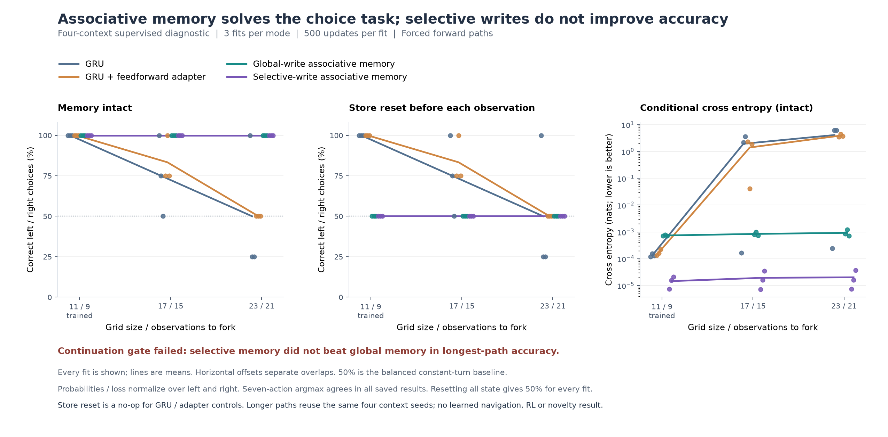

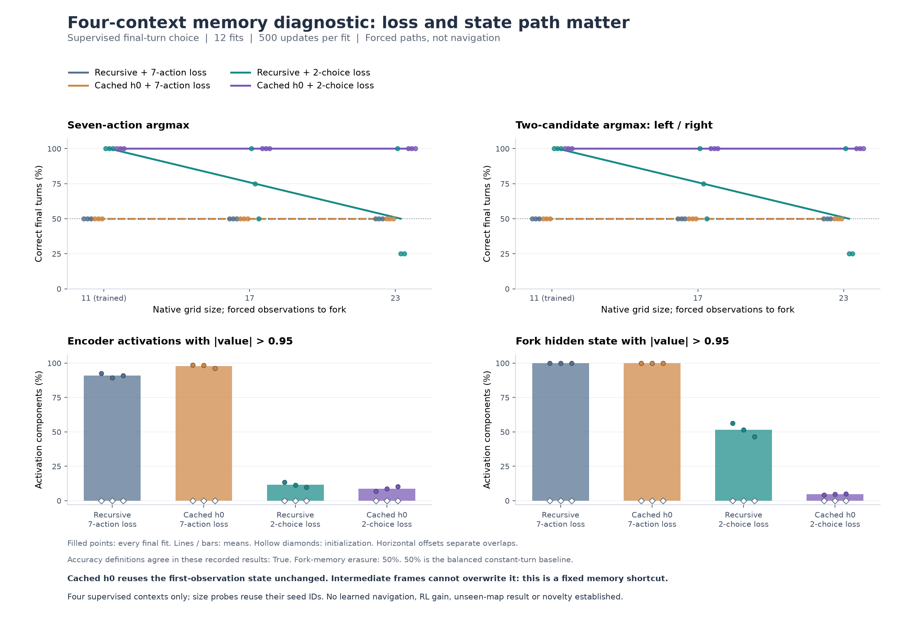

The initial seven-action supervised check failed across four memory architectures. A separate factorial diagnostic found that training over the two relevant candidates solves the four training examples, while ordinary recurrence remains unreliable on longer routes. With the corrected objective, both associative stores reach 100% at every length and fall to 50% under store-only resets. Selective writes tie global writes and fail the superiority gate. These are four-context supervised diagnostics, not gameplay or unseen-task scores. [Protocols, all fits and interpretation](associative-learnability.md).

An [initialization audit](ppo-initialization-probe.md) found nonzero actor and critic gradients before any reward in twelve initial PPO rollouts. Zeroing the value head removes those gradients on the same data. This is a measured initialization effect, not evidence that the change improves learning.

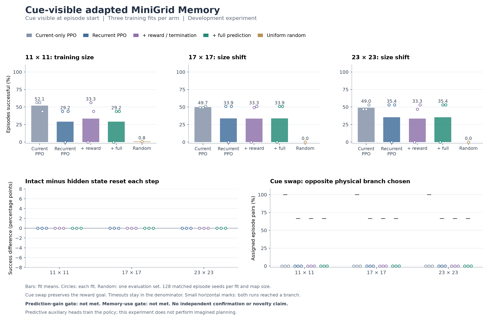

The follow-up made the cue visible at the start: 12 fits, 6,291,456 training interactions and 17,664 evaluation episodes. Recurrent and predictive PPO both reached 29.2% same-size success versus 52.1% for current-only PPO. No scored branch choice changed under a cue swap, and state clearing changed no outcomes. [Results, learning curves, transfer and retention probe](cue-memory-study.md).

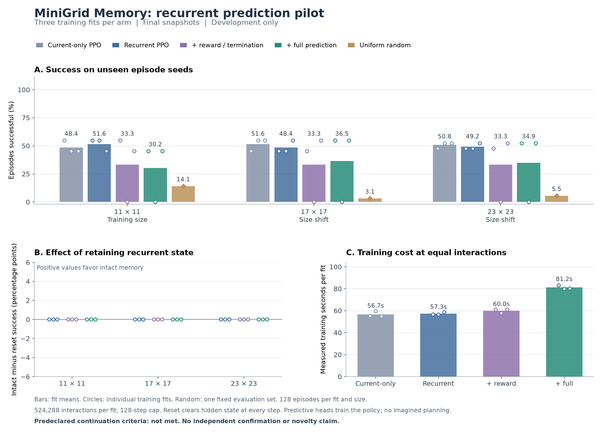

Twelve fits completed 6,291,456 training interactions and 8,448 evaluation episodes on an adapted MiniGrid Memory task. Full prediction reached 30.2% same-size success versus 51.6% for recurrent PPO and failed the predeclared continuation rule. Clearing recurrent state left all scored episode outcomes unchanged; a replay audit found that no policy acquired an initially unseen cue. [Protocol, all fits, learning curves and actual policy GIF](recurrent-world-model-study.md).

## Text student controls

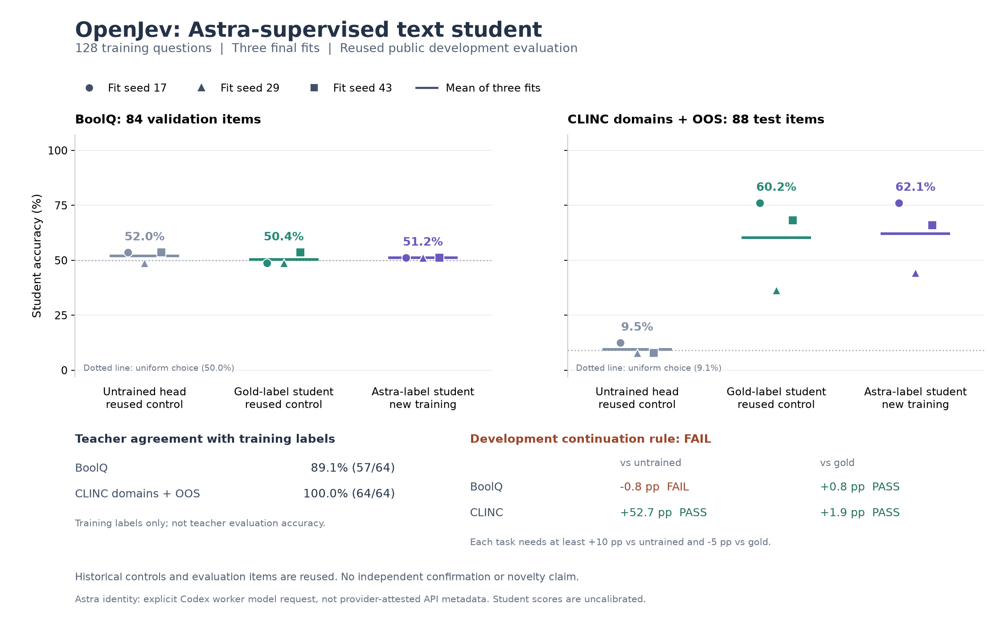

[Astra through Codex](codex-astra-distillation.md): four fresh teacher batches labeled 128 training examples, then three MiniLM students reached 62.12% domain-routing accuracy versus 9.47% untrained and 60.23% gold-supervised. BoolQ remained at 51.19% and failed the combined continuation rule. All three fits are shown on the same 172 previously scored development examples; this is hard-label distillation, not an independent confirmation or architecture result.


[Bound-rule follow-up](bound-rule-study.md): 12 learned fits and three fixed controls on previously unused development worlds. A 225-parameter operator with a handwritten parser and explicit logical operations reaches 100% shift macro accuracy. Sixteen recurrent steps also solve all 240 constructed counterfactual pairs. The fixed solver matches 100%; novelty and a runtime advantage remain unproven. The frozen selector chose six steps on a tie and failed its longer-chain challenge gate.

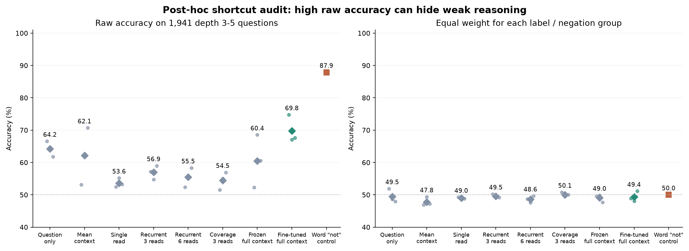

[Full-context follow-up](rule-crossencoder-study.md): three fine-tuned MiniLM fits reached 69.81% raw shift accuracy but only 49.36% after equal weighting of label/negation groups. A training-fitted word-only control scores 87.89% raw and 50% balanced. The shortcut audit is post-hoc; no reasoning or novelty gain is established.

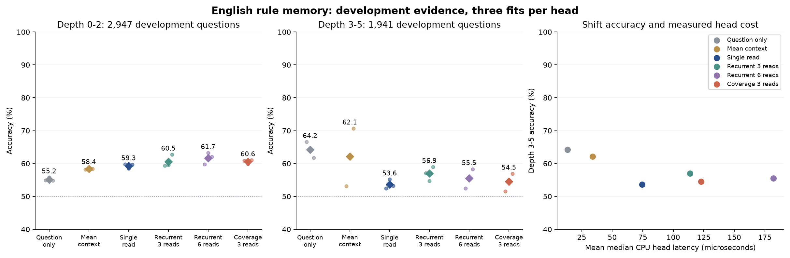

[RuleTaker memory study](rule-memory-study.md): 18 fits on 19,809 training questions. Three reads reached 56.95% on depth 3-5 development questions versus 64.21% for the question-only control. The continuation rule failed. These are selected, verified development subsets, not the full official benchmark.

[Corrective-recurrence follow-up](corrective-associative-study.md): 18 fits produced a small development gain, 95.35% versus 95.10%, below the predeclared improvement threshold. Confirmation stayed closed. This is not an established novel-method benefit.

[Learned-head follow-up](learned-associative-study.md): 12 matched-parameter fits raised development accuracy to 95.10% for the linear metric control. Dense and sparse recurrence did not improve it. The independent confirmation set remains unscored.

[Associative architecture follow-up](associative-text-study.md): a full-training-bank prototype reached 91.6% in-scope accuracy on development data and outperformed the tested recurrent retrieval. Confirmation was not opened. This is a different task and data budget from the small student pilot below.

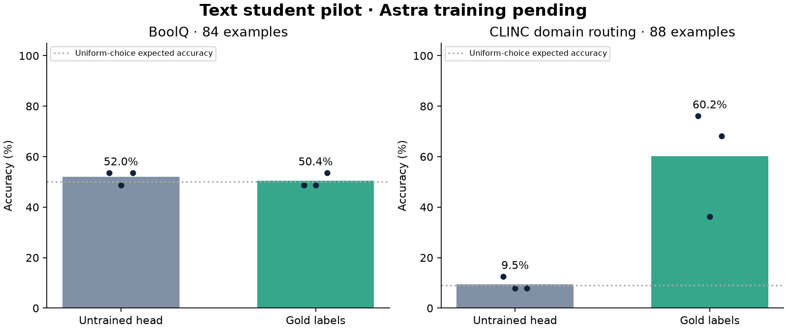

Gold-label training raised CLINC domain-routing accuracy from 9.5% to 60.2%, averaged across three fits, with substantial fit-to-fit variation. BoolQ remained near chance. These are balanced, filtered subsets, not full benchmark scores. This original Responses API teacher arm remains unrun; the separate Codex result appears above. [Protocol, all fits and limitations](text-distillation.md).

## JEPA rewards and RL variants

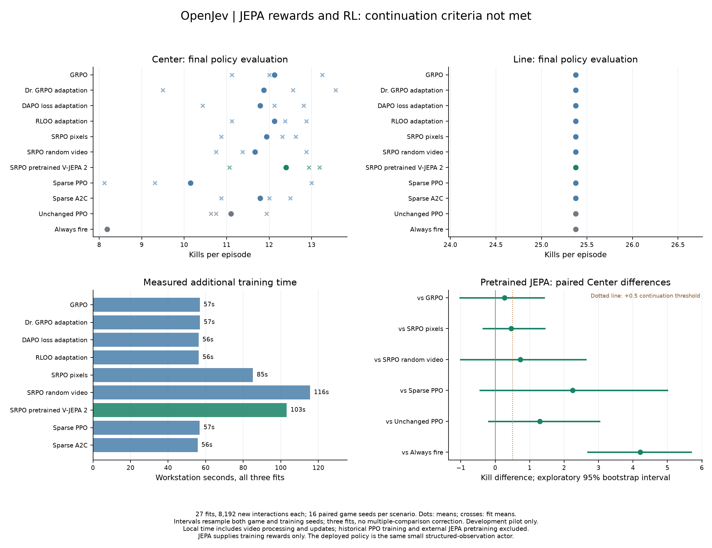

The actual pretrained V-JEPA 2 reward arm continuation criteria not met. All nine methods received 8,192 additional interactions per fit, across three corresponding warm-start policies. Dots show means; crosses show individual fits; paired intervals resample both training and evaluation seeds. Local training time includes video processing and updates but excludes shared historical PPO and external JEPA pretraining. [Full report and evidence](jepa-rl-study.md).

## SRPO adaptation pilot

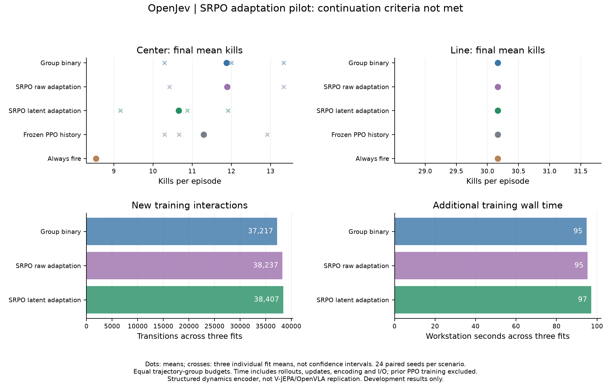

Latent self-reference failed its continuation criteria: lower mean Center kills than binary rewards, raw similarity and unchanged PPO, with wide exploratory intervals. Line outcomes matched across all methods. Costs include rollouts, updates, encoding and I/O, and exclude shared historical PPO training. Equal trajectory-group budgets do not imply equal interactions or compute. [Full SRPO report](srpo-study.md). The paper PDF above covers the preceding studies through PPO/DQN.

## Direct reinforcement learning

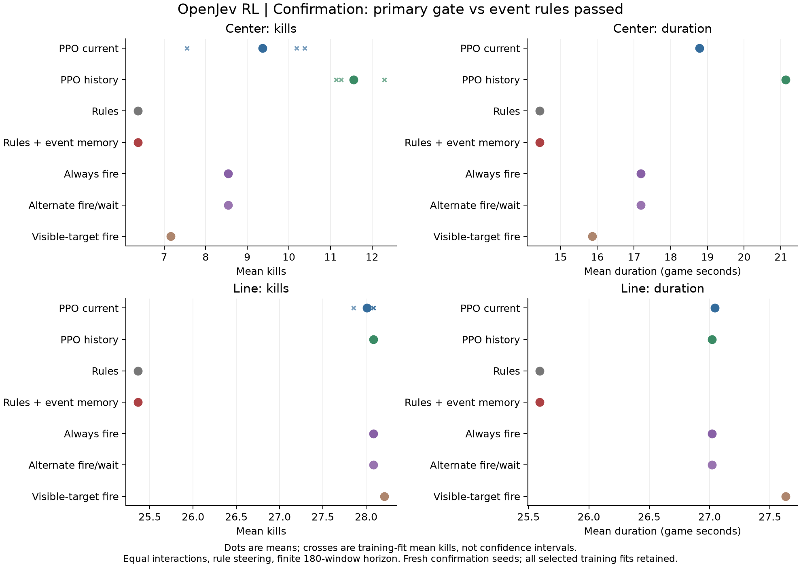

PPO with history passed the frozen combat gate against event-memory rules on 96 new seeds per scenario, retaining all three training fits. It also improved Center kills against current-only PPO and the simple controls in exploratory secondary comparisons. Line actions match always-fire. Dots are means; crosses show each training fit's mean kills, not confidence intervals. [Full report and intervals](rl-study.md).

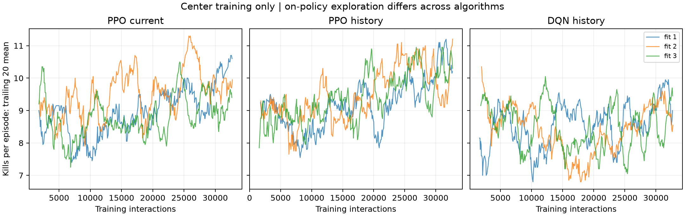

The training curves show trailing 20-episode means, including exploration, and do not substitute for held-out evaluation. The old command-window metric can miss delayed hits under alternate fire/wait schedules. The new study uses kills and duration as its primary outcomes.

## Prospective improvement studies

[All three studies and failed continuation gates](improvement-studies.md). These ran 6,408 new episodes; the figures below were generated from preserved results. Each confirmation uses 96 paired seeds in both scenarios. Bars are exploratory 99.375% bootstrap intervals, adjusted within the primary comparison family of each study.

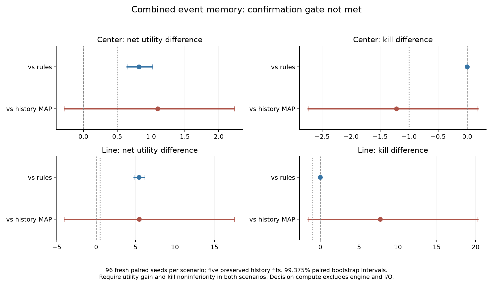

The combined event-memory rule reduces redundant commands with identical paired kills, but fails the broader comparisons against historical models.

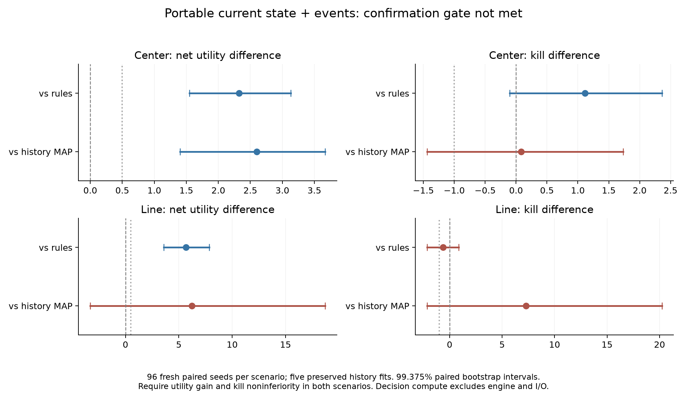

The selected fitted model improves utility over rules, but does not establish kill noninferiority in Line or clear the historical-bank comparisons. [All component comparisons](portable-head-study.md).

## Original gameplay

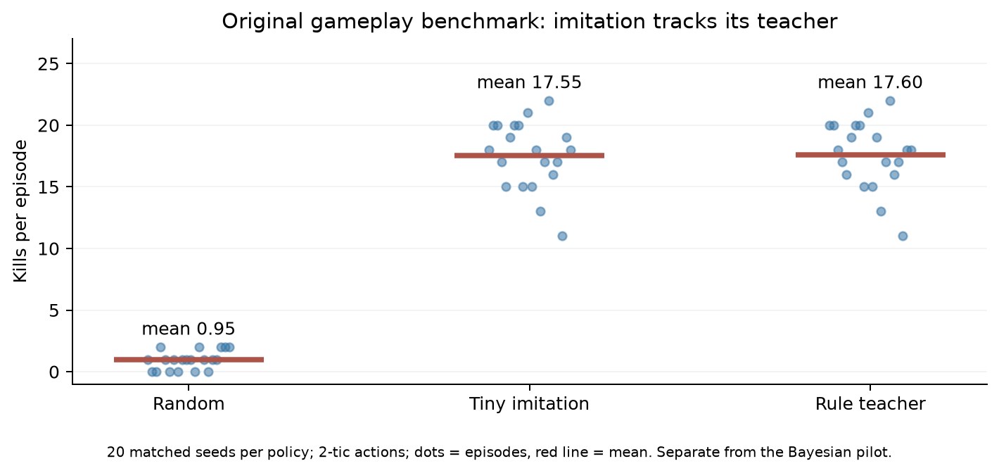

Twenty matched seeds per policy, two-tic actions, Defend the Center. Every dot is an episode; red marks are means. The 5,253-parameter imitation model approximately matches its rule teacher. This uses full steering policies, unlike the Bayesian firing-only comparison. [Episode data](../evidence/defend-center.json) · [Vector figure](../evidence/benchmarks/gameplay.svg).

## Bayesian decision utility

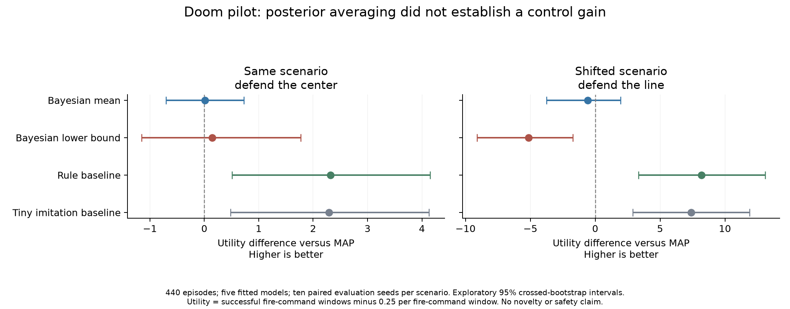

The 440-episode valid development study includes training, audit and evaluation episodes. Learned methods use five fits and ten paired evaluation seeds per scenario. Existing baseline episodes are reused across fits, not counted as independent copies. Seven-tic actions and rule steering are shared. Intervals are exploratory, unadjusted paired crossed-bootstrap intervals. [Protocol and limits](bayesian-rlcd.md) · [Analysis](../evidence/bayesian-doom-v2/analysis-001.json).

## Probability prediction on a common audit

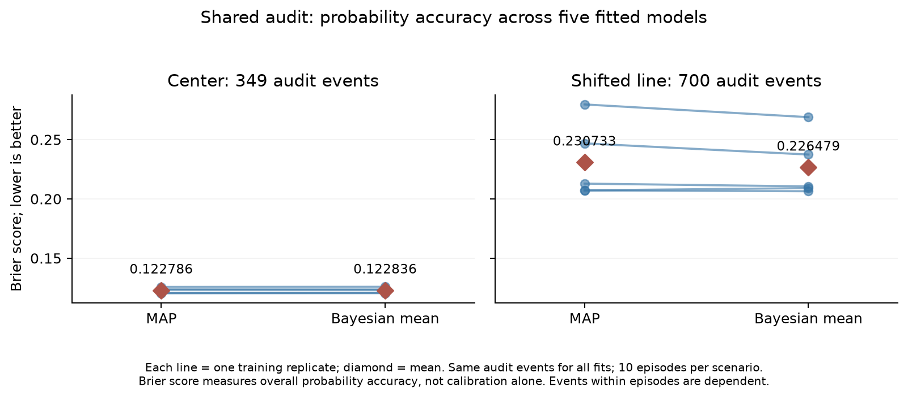

Lines pair MAP and Bayesian predictions from each of five fitted models. Diamonds are means, not confidence intervals. Each scenario uses the same ten audit episodes for all fits, with dependent events within each episode. A lower Brier score indicates better overall probability prediction, not calibration alone. The shifted audit's descriptive improvement did not establish better control utility. [Vector figure](../evidence/benchmarks/audit-brier.svg).

## Rust versus Python/NumPy scoring

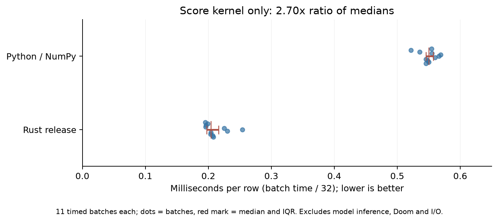

Eleven timed batches per implementation, after three warmups, on identical float64 inputs: 32 rows, 151,936 vocabulary entries and six candidates. Points are batch milliseconds divided by 32; red marks show the median and interquartile range. Rust ran first, other Docker services were active, and only one environment was measured. NumPy uses native numerical kernels. These are implementation-specific timings, not a general language comparison or model-inference speedup. [Raw timings and environment](../evidence/rust-python-score-kernel.json) · [Vector figure](../evidence/benchmarks/score-kernel.svg).

## Regenerate

From the repository root:

```sh
uv run --no-sync --with matplotlib==3.11.2 python research/plot_benchmarks.py
```

This creates PNG, SVG and PDF figures, a LaTeX results table, and a [source-hash manifest](../evidence/benchmarks/manifest.json). It does not rerun experiments or overwrite their measurements. The earlier utility comparison has its own `research/plot_bayesian_doom.py` renderer.
