# OpenJev benchmark figures

[Paper draft (PDF)](../output/pdf/openjev-rl-paper.pdf) · [LaTeX source and build instructions](../paper/README.md)

These figures visualize existing development evidence. No new model training or gameplay runs were performed to produce them. Each experiment has a separate scope; they do not form a single leaderboard.

## Chess

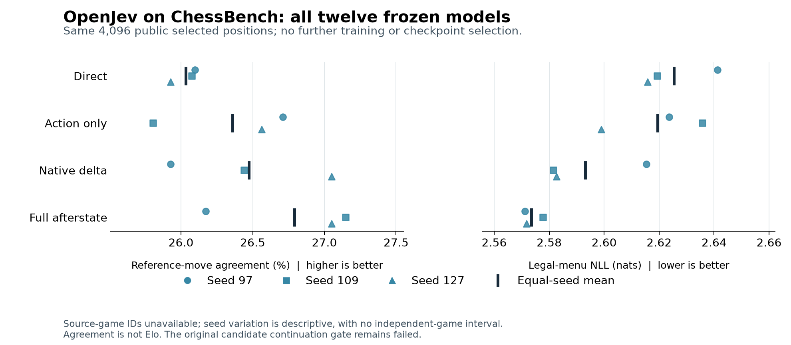

All twelve published candidate-policy fits were evaluated on the same 4,096 externally sourced positions after excluding previously encountered roots and legal successors, including mirrors. Mean move agreement is 26.03% for direct, 26.36% for action only, 26.47% for exact delta and 26.79% for full afterstate. These small descriptive differences do not change the earlier failed continuation criteria. [Transfer results and evidence](chessbench-transfer.md).


Exact native candidate consequences give a small agreement gain: 33.15% ordinary and 27.10% shifted for delta versus 31.75% and 26.81% for direct scoring. All four required bounded-loss comparisons and both required game-score thresholds fail. Delta's full CPU decision averages 3.415 ms versus 0.617 ms for direct. All twelve fits, 286 scored games and two unfinished games are retained. [Candidate results, weights and first scheduled replay](chess-candidate.md).

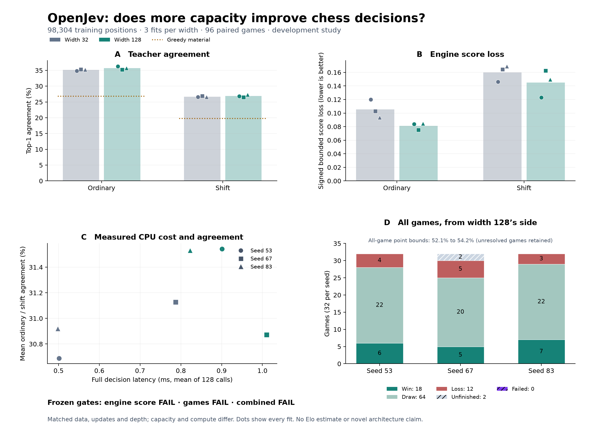

The larger policy reduces bounded engine-score loss by 22.99% on ordinary positions and 9.26% on shifted positions, below the required 20% on both. Raw shifted centipawn loss worsens. Its 18 wins, 64 draws, 12 losses and two unfinished games give a 52.08-54.17% point bound, below the 60% continuation threshold. Parameters and compute are unequal. [Capacity results, all six weights and replay](chess-capacity.md).

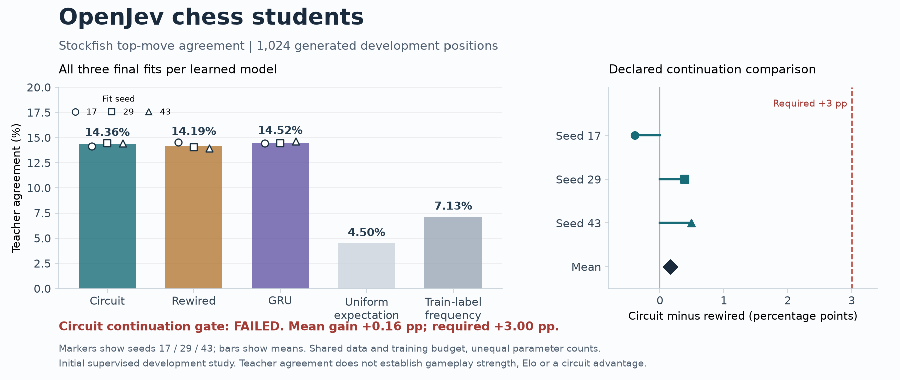

Nine original chess students trained on the same 4,096 Stockfish-labeled positions. Across three fits, teacher agreement on 1,024 development positions was 14.36% for the circuit, 14.19% for rewired and 14.52% for GRU. The circuit's 0.16-point gain missed the required 3-point improvement. [All fits, weights and protocol](chess-student.md).

[The separate arena](chess.md) compares the fixed seed-17 students with ChessFly, ChessLFM, Qwen and Astra through Codex. It reports 24 public first-move puzzles and an 18-game color-paired schedule. These models differ in training and compute; the panel is not an Elo estimate or a matched architecture comparison.

## Recurrent world models

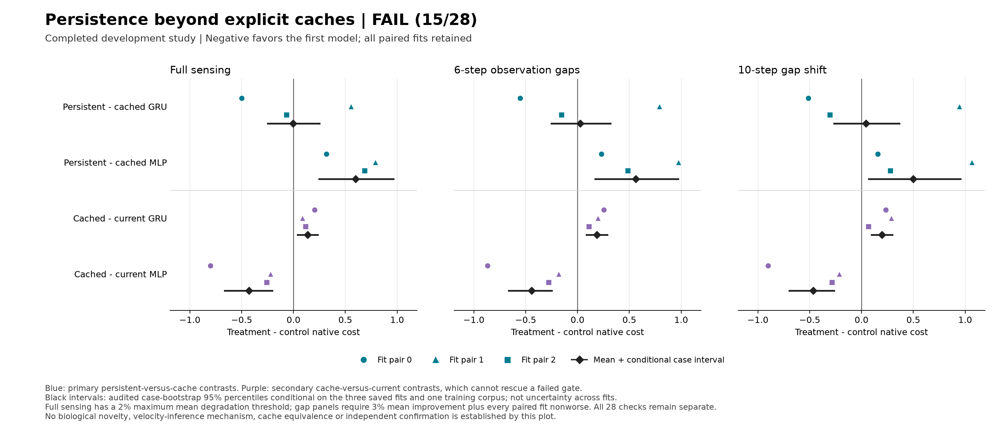

The latest **15-fit cache comparison failed its continuation rule, passing 15/28 checks**. Cached MLP lowered mean control cost by **6.32%/5.57%** versus persistent GRU on six-step/ten-step gaps and improved every paired fit. It also beat the packet MLP by **5.04%/5.22%**; cached GRU instead worsened relative to its current-only control. Persistent recurrence predicted angles and rewards better on the shared prediction cohort but controlled worse than cached MLP. These are development results in one environment, not cache equivalence or an architectural novelty claim. [All results, GIF and reproducible evidence](../research/reacher-cache-ablation.md).

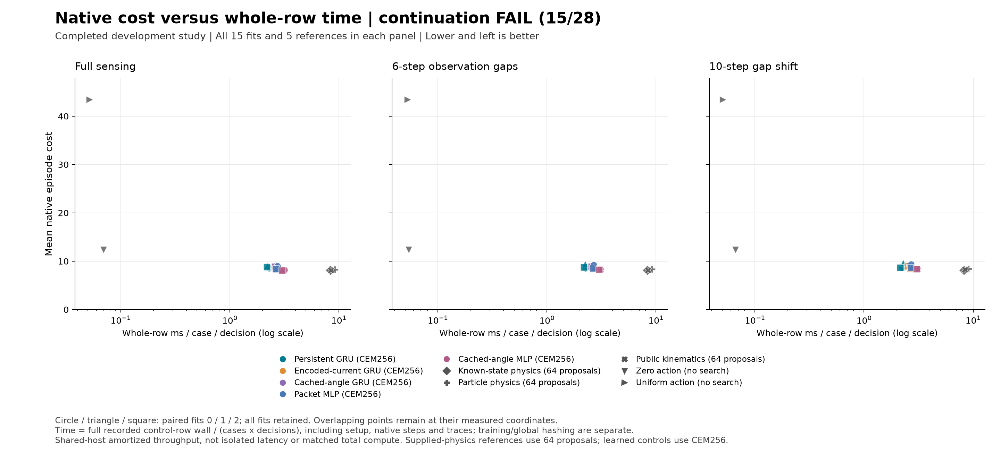

Cached MLP used about **38% more whole-row time** than persistent GRU on the gap panels. All 15 fits and 60 rows are retained. Total execution took **1,234.34 seconds**, followed by a **36.72-second audit** of 235,200 native transitions with zero discrepancy. Timings include validation, copies and traces where charged to controller rows; training and global hashing remain separate. Equal updates and near-equal parameters do not match compute.


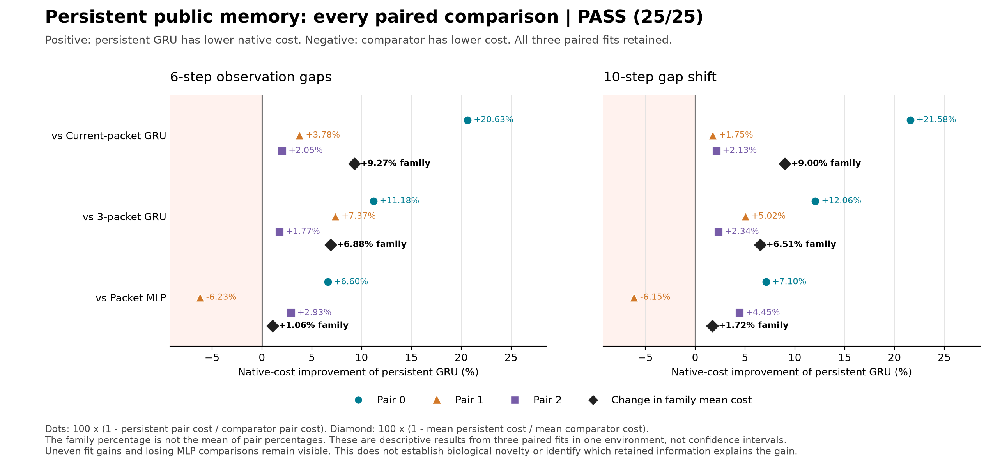

The completed **12-fit Reacher memory comparison passed 25/25 checks**. Persistent GRU recurrence lowered mean control cost by **9.27%/9.00%** versus a GRU trained without cross-decision history on six-step/ten-step gaps. Its longer-gap advantage over a three-packet GRU was **6.51%**. Every paired GRU comparison improved on both gap panels, although one fit contributes much of the current-only mean gain. The MLP was much closer, with only **1.06%/1.72%** lower cost for persistent recurrence in the family means and a paired fit that beats persistent recurrence. Supplied-physics references remain better. This qualifies useful public-history memory under the fixed recipe, not biological wiring, velocity inference or a new architecture. [All fits, criteria, prediction errors and replay](../research/reacher-memory-ablation.md).

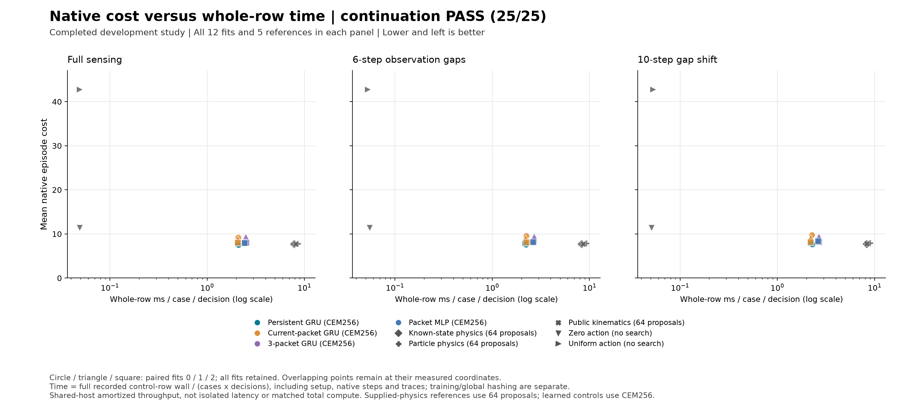

All four families share the training corpus and 1,152 updates per fit. They do not match compute. Three-packet training took **2.89 times** persistent-GRU fitting time. The complete execution took **1,083.97 seconds**, plus **30.97 seconds** for a saved-output audit that replayed **206,400 native transitions** with zero discrepancy. Plot timings amortize the whole controller row, including setup, native steps and traces; fitting and final global hashing are separate. Shared-host measurements do not establish isolated latency or Rust/Python speed differences.

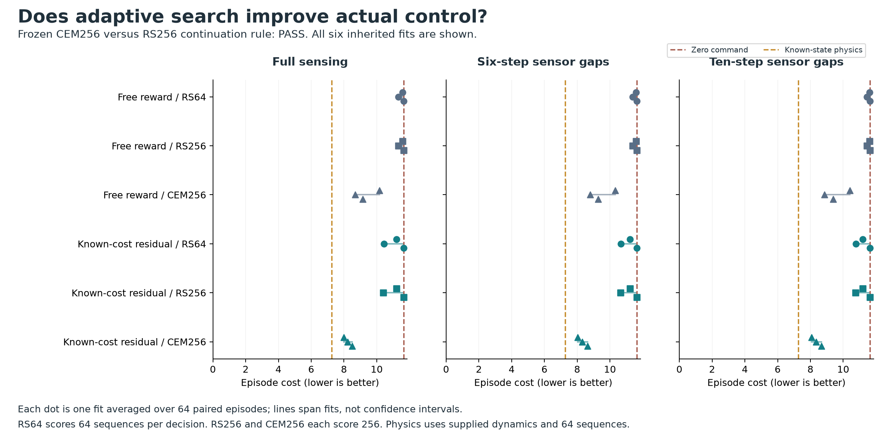

The completed Reacher search comparison reused all six saved recurrent models on fresh cases. For the residual family, adaptive cross-entropy search lowered native control cost by **25.48% ordinarily and 25.26% with longer sensor gaps**, compared with random search using the same 256 candidate evaluations per decision. Every paired residual fit improved; the primary 8/8 and adaptive-search competence 15/15 checks passed. Supplied-physics references remain better. This establishes a planning improvement, not a memory, connectome or JEPA advantage. The earlier reward-head study's failed continuation rule remains unchanged. [Full results, all fits, diagnostic exceptions and reproducible traces](../research/reacher-adaptive-search.md).

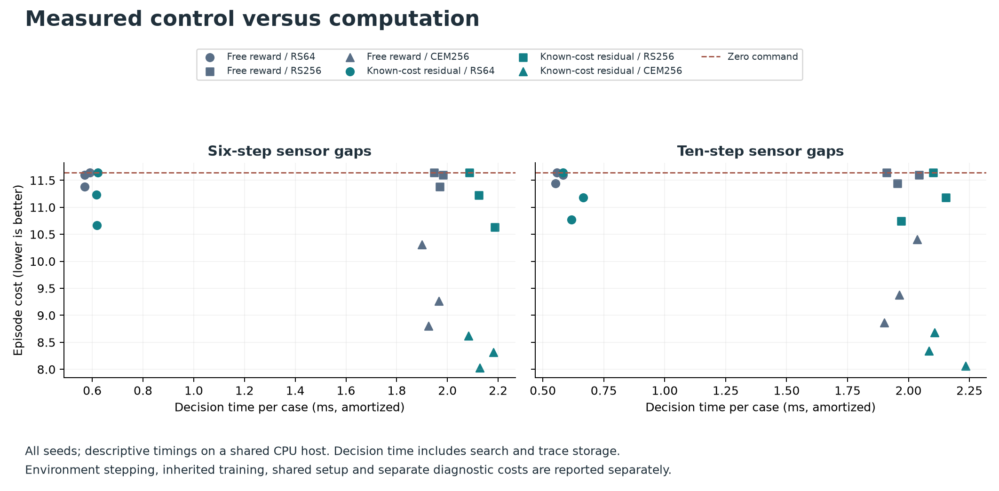

Candidate-scoring budgets match; FLOPs are not claimed equal. Decision times include loading saved proposals, scoring, recurrent updates and trace storage, amortized over batched cases, and exclude row setup and native stepping. These shared-host measurements are throughput figures, not isolated single-agent latency.

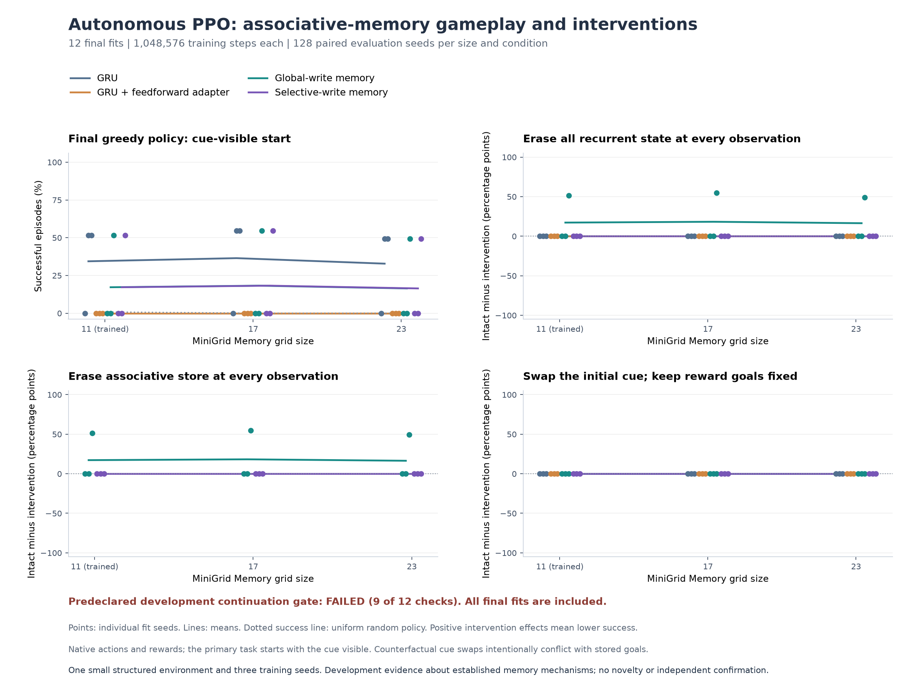

[Autonomous follow-up](associative-ppo-study.md): twelve fresh fits completed 12.58 million training interactions. Same-size success averaged 17.19% for either store versus 34.38% for GRU; eight fits timed out on every intact evaluation episode. No cue swap changed a scored branch choice. Selective writing failed its continuation rule, despite the supervised retention result below.


The initial seven-action supervised check failed across four memory architectures. A separate factorial diagnostic found that training over the two relevant candidates solves the four training examples, while ordinary recurrence remains unreliable on longer routes. With the corrected objective, both associative stores reach 100% at every length and fall to 50% under store-only resets. Selective writes tie global writes and fail the superiority gate. These are four-context supervised diagnostics, not gameplay or unseen-task scores. [Protocols, all fits and interpretation](associative-learnability.md).

An [initialization audit](ppo-initialization-probe.md) found nonzero actor and critic gradients before any reward in twelve initial PPO rollouts. Zeroing the value head removes those gradients on the same data. This is a measured initialization effect, not evidence that the change improves learning.


The completed [zero-critic follow-up](zero-critic-ppo-study.md) reused all original controls and trained twelve fresh fits. Same-size success rose to 50.52% for the adapter and both stores, but GRU fell from 34.38% to 17.19%. No cue swap changed the recorded behavior, and resetting the selective store changed no outcomes. Both continuation rules failed. This is an initialization effect on previously scored development seeds, not acquired memory or independent confirmation.


The follow-up made the cue visible at the start: 12 fits, 6,291,456 training interactions and 17,664 evaluation episodes. Recurrent and predictive PPO both reached 29.2% same-size success versus 52.1% for current-only PPO. No scored branch choice changed under a cue swap, and state clearing changed no outcomes. [Results, learning curves, transfer and retention probe](cue-memory-study.md).


Twelve fits completed 6,291,456 training interactions and 8,448 evaluation episodes on an adapted MiniGrid Memory task. Full prediction reached 30.2% same-size success versus 51.6% for recurrent PPO and failed the predeclared continuation rule. Clearing recurrent state left all scored episode outcomes unchanged; a replay audit found that no policy acquired an initially unseen cue. [Protocol, all fits, learning curves and actual policy GIF](recurrent-world-model-study.md).

## Text student controls


[Astra through Codex](codex-astra-distillation.md): four fresh teacher batches labeled 128 training examples, then three MiniLM students reached 62.12% domain-routing accuracy versus 9.47% untrained and 60.23% gold-supervised. BoolQ remained at 51.19% and failed the combined continuation rule. All three fits are shown on the same 172 previously scored development examples; this is hard-label distillation, not an independent confirmation or architecture result.


[Bound-rule follow-up](bound-rule-study.md): 12 learned fits and three fixed controls on previously unused development worlds. A 225-parameter operator with a handwritten parser and explicit logical operations reaches 100% shift macro accuracy. Sixteen recurrent steps also solve all 240 constructed counterfactual pairs. The fixed solver matches 100%; novelty and a runtime advantage remain unproven. The frozen selector chose six steps on a tie and failed its longer-chain challenge gate.


[Full-context follow-up](rule-crossencoder-study.md): three fine-tuned MiniLM fits reached 69.81% raw shift accuracy but only 49.36% after equal weighting of label/negation groups. A training-fitted word-only control scores 87.89% raw and 50% balanced. The shortcut audit is post-hoc; no reasoning or novelty gain is established.


[RuleTaker memory study](rule-memory-study.md): 18 fits on 19,809 training questions. Three reads reached 56.95% on depth 3-5 development questions versus 64.21% for the question-only control. The continuation rule failed. These are selected, verified development subsets, not the full official benchmark.

[Corrective-recurrence follow-up](corrective-associative-study.md): 18 fits produced a small development gain, 95.35% versus 95.10%, below the predeclared improvement threshold. Confirmation stayed closed. This is not an established novel-method benefit.

[Learned-head follow-up](learned-associative-study.md): 12 matched-parameter fits raised development accuracy to 95.10% for the linear metric control. Dense and sparse recurrence did not improve it. The independent confirmation set remains unscored.

[Associative architecture follow-up](associative-text-study.md): a full-training-bank prototype reached 91.6% in-scope accuracy on development data and outperformed the tested recurrent retrieval. Confirmation was not opened. This is a different task and data budget from the small student pilot below.


Gold-label training raised CLINC domain-routing accuracy from 9.5% to 60.2%, averaged across three fits, with substantial fit-to-fit variation. BoolQ remained near chance. These are balanced, filtered subsets, not full benchmark scores. This original Responses API teacher arm remains unrun; the separate Codex result appears above. [Protocol, all fits and limitations](text-distillation.md).

## JEPA rewards and RL variants


The actual pretrained V-JEPA 2 reward arm continuation criteria not met. All nine methods received 8,192 additional interactions per fit, across three corresponding warm-start policies. Dots show means; crosses show individual fits; paired intervals resample both training and evaluation seeds. Local training time includes video processing and updates but excludes shared historical PPO and external JEPA pretraining. [Full report and evidence](jepa-rl-study.md).

## SRPO adaptation pilot


Latent self-reference failed its continuation criteria: lower mean Center kills than binary rewards, raw similarity and unchanged PPO, with wide exploratory intervals. Line outcomes matched across all methods. Costs include rollouts, updates, encoding and I/O, and exclude shared historical PPO training. Equal trajectory-group budgets do not imply equal interactions or compute. [Full SRPO report](srpo-study.md). The paper PDF above covers the preceding studies through PPO/DQN.

## Direct reinforcement learning


PPO with history passed the frozen combat gate against event-memory rules on 96 new seeds per scenario, retaining all three training fits. It also improved Center kills against current-only PPO and the simple controls in exploratory secondary comparisons. Line actions match always-fire. Dots are means; crosses show each training fit's mean kills, not confidence intervals. [Full report and intervals](rl-study.md).


The training curves show trailing 20-episode means, including exploration, and do not substitute for held-out evaluation. The old command-window metric can miss delayed hits under alternate fire/wait schedules. The new study uses kills and duration as its primary outcomes.

## Prospective improvement studies

[All three studies and failed continuation gates](improvement-studies.md). These ran 6,408 new episodes; the figures below were generated from preserved results. Each confirmation uses 96 paired seeds in both scenarios. Bars are exploratory 99.375% bootstrap intervals, adjusted within the primary comparison family of each study.


The combined event-memory rule reduces redundant commands with identical paired kills, but fails the broader comparisons against historical models.


The selected fitted model improves utility over rules, but does not establish kill noninferiority in Line or clear the historical-bank comparisons. [All component comparisons](portable-head-study.md).

## Original gameplay


Twenty matched seeds per policy, two-tic actions, Defend the Center. Every dot is an episode; red marks are means. The 5,253-parameter imitation model approximately matches its rule teacher. This uses full steering policies, unlike the Bayesian firing-only comparison. [Episode data](../evidence/defend-center.json) · [Vector figure](../evidence/benchmarks/gameplay.svg).

## Bayesian decision utility


The 440-episode valid development study includes training, audit and evaluation episodes. Learned methods use five fits and ten paired evaluation seeds per scenario. Existing baseline episodes are reused across fits, not counted as independent copies. Seven-tic actions and rule steering are shared. Intervals are exploratory, unadjusted paired crossed-bootstrap intervals. [Protocol and limits](bayesian-rlcd.md) · [Analysis](../evidence/bayesian-doom-v2/analysis-001.json).

## Probability prediction on a common audit


Lines pair MAP and Bayesian predictions from each of five fitted models. Diamonds are means, not confidence intervals. Each scenario uses the same ten audit episodes for all fits, with dependent events within each episode. A lower Brier score indicates better overall probability prediction, not calibration alone. The shifted audit's descriptive improvement did not establish better control utility. [Vector figure](../evidence/benchmarks/audit-brier.svg).

## Rust versus Python/NumPy scoring


Eleven timed batches per implementation, after three warmups, on identical float64 inputs: 32 rows, 151,936 vocabulary entries and six candidates. Points are batch milliseconds divided by 32; red marks show the median and interquartile range. Rust ran first, other Docker services were active, and only one environment was measured. NumPy uses native numerical kernels. These are implementation-specific timings, not a general language comparison or model-inference speedup. [Raw timings and environment](../evidence/rust-python-score-kernel.json) · [Vector figure](../evidence/benchmarks/score-kernel.svg).

## Regenerate

From the repository root:

```sh
uv run --no-sync --with matplotlib==3.11.2 python research/plot_benchmarks.py
```

This creates PNG, SVG and PDF figures, a LaTeX results table, and a [source-hash manifest](../evidence/benchmarks/manifest.json). It does not rerun experiments or overwrite their measurements. The earlier utility comparison has its own `research/plot_bayesian_doom.py` renderer.

## Board-aware chess follow-up


Twelve final fits improve on the material heuristic, but future prediction does not beat the matched spatial controls. [Full results and models](chess-spatial.md) · [Frozen protocol](../research/chess-spatial-study.md).

## Chess refinement

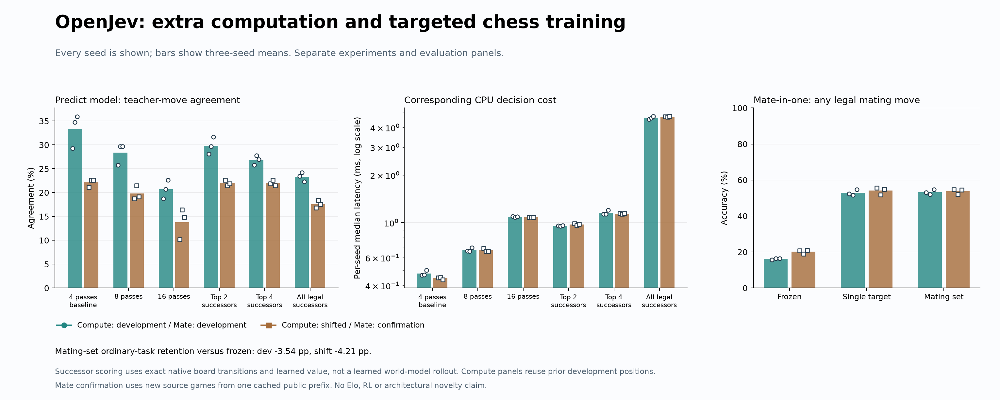

Targeted mating accuracy improved, while ordinary decisions regressed. More untrained recurrent steps also hurt. [All results and scope](chess-refinement.md).

## Input-anchored chess recurrence

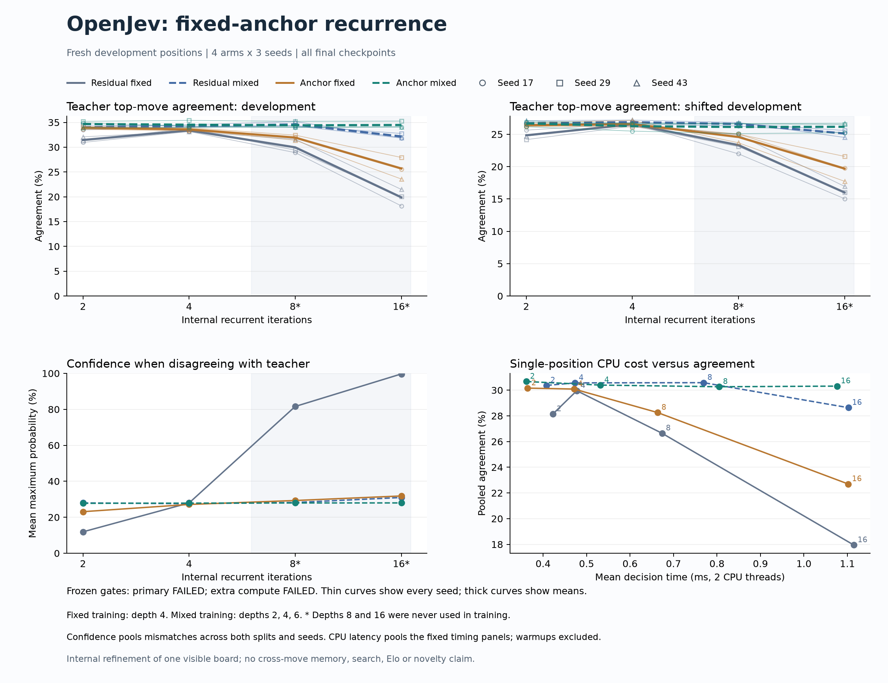

Input anchoring with varied-depth training preserves agreement at sixteen steps, but neither move-quality nor extra-computation continuation criteria pass. [All results, checkpoints and scope](chess-anchor.md).
