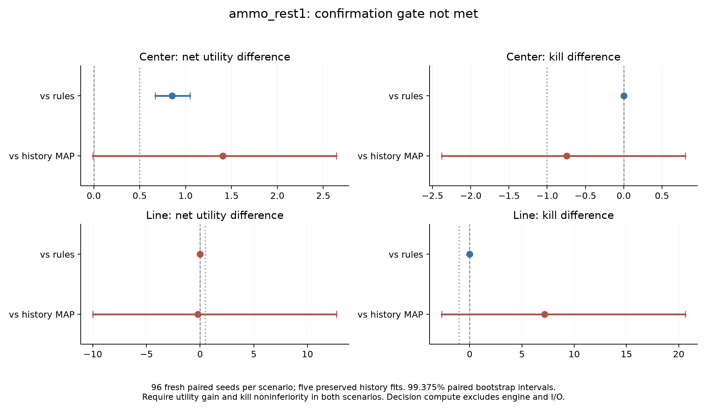

# Firing-cadence follow-up

This is a separate OpenJev improvement study, authorized after the original memory gate failed. It does not revise that gate or turn its confirmation seeds back into development data. The protocol and execution sources were committed at `5bd0a64` before the new development run.

## Why this experiment

Exploratory inspection of the historical traces found that Center fire commands immediately after an observed ammo decrease could produce no hit. The original model also clipped ammo above 60, hiding expenditure at high ammo counts. A small controller can use the current, un-clipped ammo observation and the previous one to decide whether to pause firing. It does not read hidden weapon state or future observations.

This is deliberately a simple control baseline. Action timing and repetition are established research topics, including [Dynamic Action Repetition](https://ojs.aaai.org/index.php/AAAI/article/view/10918) and [FiGAR](https://arxiv.org/abs/1702.06054). This experiment retains fixed seven-tic decision windows and tests a handwritten firing schedule. It is not a new RL algorithm, a recurrent world model, or evidence of ICLR novelty.

## Prospective protocol

- Development: nine fixed cadence/aiming candidates, 24 new Center seeds, 216 episodes. No Line evaluation in this selection round.
- Selection: highest mean net utility among candidates gaining at least 0.5 over rules while losing no more than 0.5 mean kills. Select once.
- Confirmation: the selected policy, original rules, a matched controller with the rest disabled, a rest-after-command control, and all five preserved history-MAP fits. Each uses the same 96 fresh seeds in each of Center and Line, for 1,728 episodes.
- Keep steering, seven-tic decision windows, the 180-window horizon, and cost of 0.25 per issued fire command matched. Net utility subtracts measured decision compute at one utility unit per second. Engine observation, advancement and trace I/O are excluded from this compute measure.
- Require at least 0.5 mean net-utility gain, a positive lower utility interval endpoint, and a kill-difference lower endpoint above -1, against both rules and history in both scenarios. The eight primary contrasts use 99.375% paired percentile bootstrap intervals, with seed and history-fit resampling. These are finite-sample exploratory intervals, not guaranteed coverage. Candidate episode p95 decision time must remain below 1 ms.
- Line is a previously studied scenario excluded from this round's selection, not an unseen task. No second-environment generality is implied.

The kill requirement helps prevent a candidate from qualifying merely by suppressing costly commands while playing worse. Command-window utility still does not equal per-shot accuracy; kills, engine reward, ammo use and truncation are reported separately.

## Development result

Only `ammo_rest1`, a one-window rest following an observed ammo decrease, qualified. It improved mean utility from 2.646 to 3.396, preserved mean kills at 6.5, and reduced issued fire commands from 15.417 to 12.417 per episode. Some tighter-aim policies had higher utility but lost too many kills. This is selection evidence, not confirmation.

The preserved [development selection](../evidence/cadence-doom-v1/development-001/selection.json) includes every candidate. The confirmation result follows.

## Reproduce

Use new output directories; the runner refuses to overwrite an existing run.

```sh
uv run python research/cadence_doom.py --stage development --output evidence/cadence-doom-v1/development-new
uv run python research/cadence_doom.py --stage confirmation --development evidence/cadence-doom-v1/development-new --output evidence/cadence-doom-v1/confirmation-new
uv run python research/analyze_cadence_doom.py evidence/cadence-doom-v1/confirmation-new --output evidence/cadence-doom-v1/analysis-new.json
```

Confirmation checks development artifact hashes, the frozen source/protocol hashes, and the hashes of all five historical model files. No paid API is used.

## Confirmation result

The full gate failed. The selected ammo-only policy improved net utility over rules in Center by +0.854 (99.375% interval [0.672, 1.050]), with identical kills. It had identical gameplay outcomes to rules in Line; the tiny net-utility difference there is timing noise. Line replenishes ammunition, so this trigger cannot detect its shots.

Against the five history-MAP fits, Center net utility improved by +1.404 but its interval included zero [-0.008, 2.644], and kill noninferiority was not established. The Line history comparison also remained inconclusive. This is a confirmed improvement over rules in one scenario, not a passing cross-scenario result.



[Full analysis](../evidence/cadence-doom-v1/analysis-001.json) · [Confirmation manifest](../evidence/cadence-doom-v1/confirmation-001/manifest.json) · [Combined-event follow-up](event-cadence-study.md)

The next fixed candidate was derived from historical hit-feedback traces and frozen before this confirmation analysis. It uses separate development and confirmation seeds. Lightweight coding, tests and document preparation ran concurrently with this single-worker study, so timing is a workstation screening measurement.
