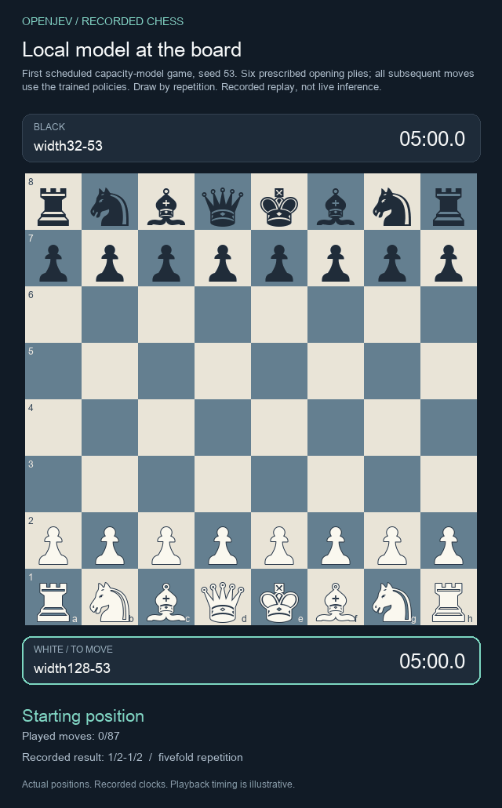

# Larger chess policy: modest gains, continuation gate failed

Six new fits compare a width-32 recurrent policy with width 128 on identical data and training updates. The larger policy improves bounded engine-score loss, but misses the required improvement on shifted positions and the arena point threshold. It is not promoted as a stronger reference model.

[Watch the first scheduled game](chess-capacity-replay.html) · [Full evidence](../evidence/chess-capacity-v1/results/) · [All six checkpoints](../models/chess-capacity-v1/) · [Frozen protocol](../research/chess-capacity-study.md)

## What changed

Both widths use four residual recurrent steps, score all legal moves, and predict a bounded engine value. There is no search, mate guard or memory carried between moves. Each trains from scratch on the same 98,304 positions for eight epochs, with matched minibatch order within seeds 53, 67 and 83. The loss is legal-move cross entropy plus 0.5 value MSE.

Width 32 has **33,185 active parameters**; width 128 has **439,073**, a 13.23-fold increase. Their checkpoints retain unused auxiliary decoders, for 43,726 and 591,790 stored parameters. Data and optimizer updates are matched; parameters, FLOPs and wall time are not.

Every final fit is evaluated on 4,096 fresh ordinary and 4,096 fresh shifted positions. These exclude previously seen states and their mirrored equivalents. The rollout generators have been studied before, so this remains development evidence.

## Move quality

Teacher agreement measures matching the 2,000-node Stockfish label, not winning percentage. Score loss uses separate 20,000-node assessments on 128 fixed positions per panel. Entries average all three seeds.

| Metric | Width 32 | Width 128 |
|---|---:|---:|
| Ordinary teacher agreement | 35.13% | 35.75% |
| Shifted teacher agreement | 26.69% | 26.88% |
| Ordinary bounded score loss | 0.10547 | 0.08122 |
| Shifted bounded score loss | 0.15987 | 0.14507 |
| Ordinary raw centipawn loss | 302.47 | 299.72 |
| Shifted raw centipawn loss | 177.01 | 231.08 |

The frozen continuation rule required at least **20% lower bounded score loss on both panels**. Ordinary loss improves by 22.99%, but shifted loss improves by only 9.26%. This criterion fails. Agreement gains are only 0.62 and 0.19 percentage points; both conditional game-cluster intervals include zero.

**Shifted raw centipawn loss worsens despite the bounded improvement.** The bounded metric applies `tanh(cp / 600)`, which compresses large score differences. Neither measure is exact game-theoretic regret or a calibrated winning probability. Signed finite-search differences are retained, including negative values.

## Paired games

The larger policy scores **18 wins, 64 draws, 12 losses and 2 unfinished games** against the smaller policy. All 96 scheduled games count: sixteen fixed opening prefixes, three paired seeds and both colors. Each side has five minutes without increment; a nonterminal 240-ply cap is unfinished.

The larger policy earns **52.08% to 54.17% of available points**, depending on unresolved outcomes. The required lower bound was 60%, so the arena criterion also fails. There were no failed games. Of the 64 draws, 58 were fivefold repetition and six insufficient material.

The replay shows the first scheduled game, width128-53 as White against width32-53, drawn by repetition. It was selected before outcomes. These paired development games do not establish an Elo rating or broad chess strength.

## Cost and artifacts

Mean full CPU decision time was **0.595 ms versus 0.911 ms**, measured on the same 128 positions with two PyTorch threads. Three warmups per model are recorded separately. This is one machine and one timing pass, not a general speed benchmark.

The six fits used **36,864 updates and 362.53 seconds of MPS training**: 126.28 seconds for width 32 and 236.25 for width 128. Fresh data generation used 80,229 engine calls and 160.458 million requested nodes, including discarded positions. Stronger grading used 828 calls and 16.56 million requested nodes. These are incremental study costs; the reused 32,768 training labels were generated earlier. Full execution took 814.20 seconds.

Every fit is released without seed selection:

| Seed | Width-32 weights | Width-128 weights |
|---|---|---|
| 53 | [width32-53](../models/chess-capacity-v1/width32-53/weights.pt) | [width128-53](../models/chess-capacity-v1/width128-53/weights.pt) |
| 67 | [width32-67](../models/chess-capacity-v1/width32-67/weights.pt) | [width128-67](../models/chess-capacity-v1/width128-67/weights.pt) |
| 83 | [width32-83](../models/chess-capacity-v1/width32-83/weights.pt) | [width128-83](../models/chess-capacity-v1/width128-83/weights.pt) |

The [evidence package](../evidence/chess-capacity-v1/results/) retains the frozen plan, predictions, training logs, engine calls, all game records and receipt hashes. The [model card](../models/chess-capacity-v1/README.md) records identities and loading requirements.

## Exploratory failure analysis

A [separate posthoc replay audit](../evidence/chess-capacity-v1/finishing-diagnostic/summary.json) finds 104 recorded turns with an available immediate mate: 30 were taken and 74 missed. These are dependent turns in the existing games, not 104 independent test positions. No selected move caused stalemate. The audit uses native chess rules, with no new model calls, engine calls or training; it does not change any result or continuation criterion.

The [candidate-refinement proposal](../research/chess-candidate-refinement.md) is a separate, unrun hypothesis. This capacity comparison establishes neither a novel architecture nor useful recurrent world-model computation.
