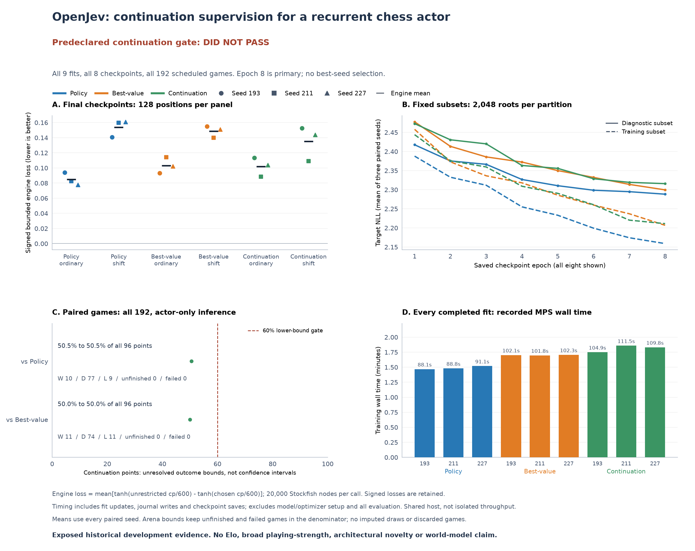

# Action-outcome supervision did not establish a stronger chess policy

All nine fits and 192 scheduled games completed. The original saved-output
audit passed; **all four engine-loss thresholds and both game-score thresholds
failed**. The result does not justify promoting the continuation model.



The same small recurrent actor learns under three objectives: the original
policy/root-value loss, an additional value target for the teacher's move,
or additional value targets for the teacher's move and a distinct recorded
behavior move. The extra critic is used only during training. Move selection,
initial actor weights, minibatch order and update counts are matched within
each of three seeds. This isolates an auxiliary supervision change, not a new
architecture or a learned world model.

| Objective | Ordinary engine loss | Shifted engine loss | Ordinary move agreement | Shifted move agreement | Mean training seconds |
|---|---:|---:|---:|---:|---:|
| Policy | 0.08472 | 0.15389 | 35.06% | 26.33% | 89.35 |
| Teacher-action value | 0.10321 | 0.14866 | 34.49% | 25.81% | 102.07 |
| Continuation-action value | 0.10190 | 0.13522 | 34.55% | 26.19% | 108.75 |

All values include seeds 193, 211 and 227. Lower engine loss is better. Each
panel uses 4,096 positions for move agreement and a fixed 128-position subset
for 20,000-node Stockfish grading. Bounded engine loss is a signed finite-search
score difference, not an exact game-theoretic regret or win probability.

Continuation supervision reduces shifted loss by 12.13% against policy and
9.04% against teacher-action value, below the required 20% against each. On
ordinary positions it worsens loss by 20.28% against policy and improves it
by only 1.27% against teacher-action value. This tradeoff fails the prespecified
requirement to improve both panels against both controls.

The shifted improvement also depends on the bounded score scale: mean raw
centipawn loss is 351.32 for continuation versus 315.11 for policy. The full
summary retains every seed's centipawn mean, 95th percentile and maximum.

## Actual games

Each opponent comparison uses 16 fixed openings, both colors and all three
paired training seeds. Every game completed, with no failed or capped games.

| Continuation versus | Wins | Draws | Losses | Points scored | Required |
|---|---:|---:|---:|---:|---:|
| Policy | 10 | 77 | 9 | 50.52% | 60% |
| Teacher-action value | 11 | 74 | 11 | 50.00% | 60% |

Opening-cluster bootstrap intervals are 44.27-56.25% and 45.83-54.17%,
respectively, conditional on these fitted models. Across all 192 games,
142 end by fivefold repetition. The continuation actors miss 34 of 55 recorded
immediate-mate opportunities. These are observed weaknesses, not evidence that
missing memory or any particular architectural feature caused them.

## What was measured

The frozen study uses 88,408 training roots from 1,577 historical games and
9,896 diagnostic roots from 177 different source games. Each fit trains for
eight epochs and 5,528 updates. All nine fits finish before any evaluation;
epoch eight is primary and every epoch appears in the diagnostic curves.
All actors use the same 33,185 inference parameters at depth four.

Primary execution took 1,036.68 seconds, including training and evaluation.
Engine grading used 848 calls, 16,960,000 requested nodes and 16,896,950 reported
nodes. Recorded training time averages 89.35, 102.07 and 108.75 seconds per fit.
These are shared-desktop measurements, not a claim of matched total compute.

The original audit completed in 47.71 seconds without new model or engine
calls. It checked source/input hashes, every recorded update and checkpoint,
scalar prediction arithmetic, engine coverage and full native game replay.
It does not independently prove complete prediction vectors or exact gradient
execution. The primary panels were already exposed during development, so
these are not fresh confirmation results. There is no Elo estimate, Astra
comparison, biological-wiring advantage or architectural novelty claim.

## Evidence and reproduction scope

- [Frozen plan](../evidence/chess-continuation-v1/protocol/plan.json)
- [Complete audited summary](../evidence/chess-continuation-v1/audit/summary.json)
- [Original audit receipt](../evidence/chess-continuation-v1/audit/receipt.json)
- [Implementation checks](../evidence/chess-continuation-v1/tests.json)
- [Publication check: 342 synthetic tests from exported source](../evidence/chess-continuation-v1/publication-check.json)
- [Study runner](../scripts/chess_continuation_study.py)

Raw execution records and checkpoints remain local at
`runs/chess-continuation-v1/execution`. The protocol binds historical local
spatial/capacity training inputs, the inventory's `records.jsonl`, the original
evaluation panels and the Stockfish executable. Inventory metadata is published;
the 135 MB continuation record file remains local. This repository publishes the
implementation, protocol and audited report, not a portable execution archive
or a one-command reproduction of those exact inputs.

The frozen run used Python 3.12. The existing project lock does not include
`chess`; synthetic checks need that supplemental package. In a separate
environment, install the project training/development dependencies and the
recorded chess version:

```sh
uv sync --frozen --extra train --extra dev
uv pip install --python .venv/bin/python chess==1.11.2
.venv/bin/python -m pytest -q tests/test_chess_continuation_study.py tests/test_chess_continuation_model.py tests/test_chess_continuation_data.py tests/test_chess_continuation_arena.py
```

The saved-summary figure can be regenerated without those local training
inputs or model weights. Install `matplotlib==3.11.2` in that environment and
use a new output directory:

```sh
.venv/bin/python scripts/plot_chess_continuation.py --audit evidence/chess-continuation-v1/audit --plan evidence/chess-continuation-v1/protocol/plan.json --out /tmp/openjev-continuation-figure
```

The separate [connectome study](chess-connectome.md) remains negative. This
supervision result supplies no stronger replacement baseline and does not
explain its failure. The [hard spatial-interface prototype](../research/chess-connectome-interface.md)
remains an untrained hypothesis with matched rewired controls still required.
