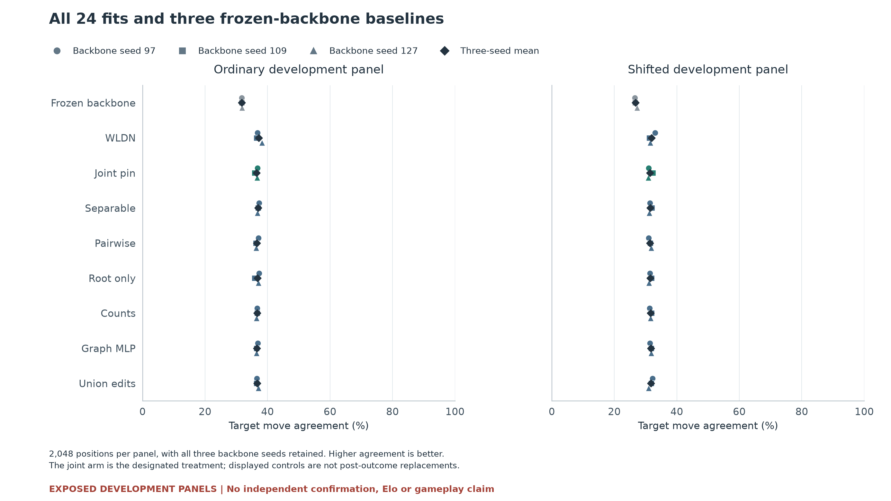

# Joint pin factors did not improve the chess policy

**Completed and audited September 18, 2026. The continuation criterion failed.**
The designated joint-factor model passed only **2 of 16** quality checks. It
improved on the frozen backbone but trailed every trained comparator in mean
move agreement on both development panels. This result does not support
advancing the joint-pin mechanism or claiming a biological architecture benefit.

The experiment trained eight heads on each of three frozen backbones: **24 fresh
fits and 36,864 updates**. All fits finished before evaluation. Every model
scored the same 2,048 ordinary and 2,048 shifted positions, with all legal-move
score vectors retained. The panels were already exposed during development;
they are not an untouched confirmation set.

## All families

Mean move agreement with the existing engine labels, across three fits.
Higher is better. The frozen backbone was evaluated again without training.

| Method | Ordinary | Shifted |
| --- | ---: | ---: |
| Frozen backbone | 31.75% | 26.81% |
| WLDN graph difference | 37.16% | 31.92% |
| **Joint pin factors, designated treatment** | **36.43%** | **31.40%** |
| Separable role terms | 37.01% | 31.51% |
| Pairwise role terms | 36.57% | 31.45% |
| Root-only pin context | 36.75% | 31.46% |
| Pin counts | 36.64% | 31.61% |
| Graph MLP capacity control | 36.57% | 31.66% |
| Union edits | 36.69% | 31.66% |

Joint improved over the backbone by 4.67 and 4.59 percentage points, but fell
behind WLDN by 0.73 and 0.52 points. Its prespecified criterion required at
least one mean agreement point over **every trained comparator on each panel**,
with no paired-seed deficit worse than half a point. None of those fourteen
trained-comparator checks passed. The two backbone comparisons passed.

WLDN's highest observed mean does not turn it into a new confirmatory treatment.
NLL and source-game bootstrap intervals are descriptive. The intervals condition
on these exposed panels and three fixed backbones; they do not correct the
adaptive research sequence or establish uncertainty over new training seeds.

## What was checked

The [completed audit](../evidence/chess-pin-quality-v3/audit/receipt.json)
checked all 24 initial and final checkpoint identities, 36,864 training-index
receipts, 110,592 prediction records and 3,226,149 candidate scores. It rebuilt
12,288 native root/backbone inputs, recomputed every criterion and replayed all
cached scores/NLL and native vectors exactly with the production neural kernels.
This is not independent neural code or full retraining.

Native versus cached arithmetic passed its separate numerical criterion:
maximum score difference was **3.815e-6**, below the fixed 1e-5 tolerance, with
**zero changed moves**. Numerical agreement does not rescue the failed quality
criterion. No new engine labels or external model calls were made.

The full execution took **17,849.14 seconds (4.96 hours)**; its audit took
**674.46 seconds (11.24 minutes)**. These are whole-run times on a shared CPU
host, not isolated decision latency. The separately frozen
[full-decision timing study](../evidence/chess-pin-trained-cost-v2/README.md)
also completed: Joint took **6.95 ms** versus WLDN's **6.11 ms** median complete
decision time. The median paired ratio was **1.131**, or about 13.1% slower.
It retained 31,104 timings, 54 warmups and 3,456 audited decisions with zero
changed moves. These measurements cover 128 fixed ordinary roots, three seeds
and nine rotating repeats on the shared host. This lower-quality candidate did
not obtain a compensating speed advantage.

[Timing table and scope](../evidence/chess-pin-trained-cost-v2/figures/report.md) ·
[Verified cost archive](https://github.com/kw2828/OpenJev/releases/download/research-chess-pin-quality-v3/cost-v2-verification.tar.gz).

Two previous attempts remain separate: v1 stopped after 770 updates because of
a source-game identifier schema problem; v2 disappeared after five fits and
8,239 updates, with unknown cause. V3 started fresh and reused no partial
weights. Neither interrupted attempt supplied evaluation evidence.

[All figures, NLL, numerical checks and per-fit costs](../evidence/chess-pin-quality-v3/figures/README.md)
are generated from authenticated saved artifacts. The renderer makes no model
or engine calls; its 15 synthetic checks verify coverage, source binding and
retention of failed criteria.

The [339-file verification archive](https://github.com/kw2828/OpenJev/releases/tag/research-chess-pin-quality-v3)
includes the complete primary outputs, native replay, closed process logs,
frozen sources and lineage metadata. Its 103 MB download and sidecars have
[verified sizes and SHA-256 hashes](../evidence/chess-pin-quality-v3/publication/release-verification.json).
It is not a complete runnable reproduction: inherited training data, caches,
backbones and historical artifacts remain separate dependencies. Timing-v2
outputs are excluded from this quality archive.

## Decision

Stop this joint-pin candidate under its frozen rule. The results are consistent
with useful extra supervised graph capacity, but do not isolate the benefit of
candidate-dependent three-role pin interactions. Do not add more pin variants
to the same exposed panels and describe the best one as confirmed.

The next architecture question belongs in the partially observed control task:
first distinguish trained recurrent memory from current observations and a
strictly bounded history, then test a specific learning mechanism. The
[architecture note](../research/reacher-architecture-mechanism-options.md)
describes those controls. None has a new scored result here.

[Frozen question and controls](../research/chess-pin-quality-study.md) ·
[V3 protocol and preserved lineage](../evidence/chess-pin-quality-v3/README.md) ·
[Updated development paper](../output/pdf/openjev-chess-pin-quality-v3-development.pdf)

Audit receipt SHA-256:
`c86562f02e450ad67ed6af6225cf3ba0b13a958c2ae63a8746441dcbf9e9c52e`.
This is a development result, not an Elo, gameplay or ICLR contribution claim.
