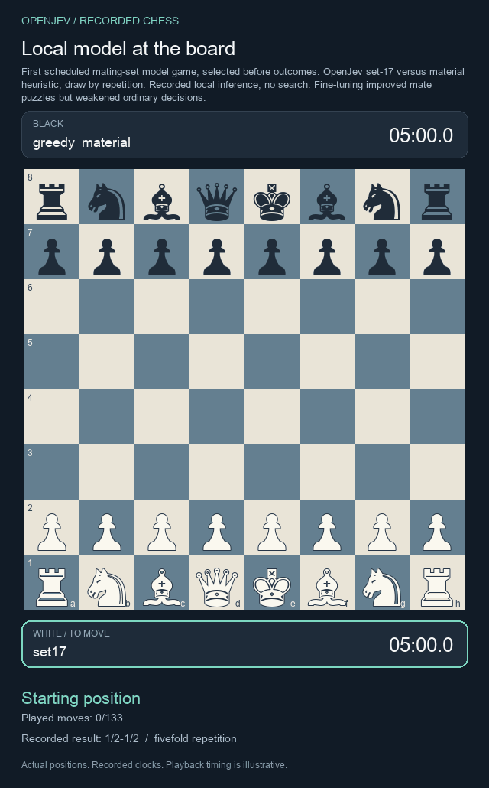

# Chess refinement: better mating, weaker general decisions

We trained six additional OpenJev checkpoints and tested 90 inference configurations. Targeted training improved mate-in-one accuracy, but ordinary move quality regressed. More recurrent computation also hurt the existing models. Neither experiment passes the full continuation criteria.


## Targeted training

We fine-tuned the same 43,726-parameter network, with three seeds per objective. Single-answer training uses the recorded mating move. Set training accepts every legal move that immediately mates. The network uses four internal updates and receives only board features and legal UCI candidates when choosing a move.

| Model | Mate development, 256 positions | Mate confirmation, 512 positions | Ordinary development, 4,096 positions | Shifted development, 4,096 positions |
|---|---:|---:|---:|---:|
| Frozen original | 16.15% | 20.18% | 32.97% | 25.43% |
| Single answer | 52.86% | 54.10% | 29.51% | 21.32% |
| All mating answers | 53.26% | 53.71% | 29.43% | 21.22% |

Entries are means across the same three initialization seeds. Mate accuracy accepts any checkmate. Ordinary accuracy measures agreement with the existing 2,000-node Stockfish teacher, not winning percentage.

**The targeted skill improved; retention failed.** The set model gained 33.53 percentage points on mate confirmation, but lost 3.54 points on ordinary positions and 4.21 on shifted positions. It did not beat the single-answer control. Only 19 confirmation positions have multiple mating moves; both objectives reached the same 52.63% mean accuracy on that small subset.

Training used 1,024 mating positions and 12,288 distinct ordinary replay positions per seed, 192 updates per fit. Six fits required 1,152 updates and 8.66 seconds of recorded training time on local MPS, excluding data preparation and evaluation. No new engine labels or Astra calls were needed for this training. Existing initial weights were already distilled from Stockfish.

The confirmation games and board states were unused by the earlier evaluations and these fine-tuning batches. All puzzles still come from one cached public Lichess prefix. These results do not estimate general chess strength, Elo or independence from external models' pretraining. The ordinary regression panels were evaluated previously.

## More computation on the original models

This separate diagnostic uses the same 256 previously scored positions per split for every configuration. It covers all twelve spatial checkpoints; the table shows the prediction model averaged over its three seeds.

| Decision method | Ordinary agreement | Shifted agreement | Mean decision time, ordinary |
|---|---:|---:|---:|
| Four recurrent steps | 33.33% | 22.14% | 0.48 ms |
| Eight steps | 28.39% | 19.79% | 0.68 ms |
| Sixteen steps | 20.70% | 13.80% | 1.10 ms |
| Native immediate-mate guard, otherwise four steps | 34.51% | 22.14% | 0.62 ms |
| Rank every exact successor by learned value | 23.31% | 17.58% | 4.38 ms |

Timings include preparation and decision logic on the same CPU with two PyTorch threads. Model loading is excluded and three warmups per configuration are recorded separately. The inference panel is smaller than the training-retention panel, so their percentages should not be compared across tables.

Eight and sixteen steps were never trained. Their degradation is evidence against this particular untrained depth extension, not against recurrence in general. Exact-successor ranking uses native chess transitions and terminal outcomes plus the learned value head; it is explicit one-ply lookahead, not learned world-model planning.

On a fixed 64-position subset per split, stronger 20,000-node Stockfish assessment also worsened for eight-step and all-successor methods versus four steps. Mean bounded score loss was 0.0704/0.1410 for four steps, 0.1024/0.1433 for eight, and 0.1317/0.1941 for all successors (ordinary/shifted). This finite-search difference can be negative and is not exact game-theoretic regret.

The full run contains 46,080 decisions and 1,355 stronger-engine calls: 27.1 million requested nodes, 26,968,142 reported nodes and 18.61 seconds of recorded engine-call time. Every method, seed, choice and cost is retained.

A [post-hoc audit of saved probabilities](../evidence/chess-compute-v1/confidence-diagnostic/) found that confidence saturates while agreement falls. At sixteen steps, 606 of 609 ordinary teacher mismatches and 654 of 662 shifted mismatches have a maximum softmax probability of at least 90%. This is not calibrated certainty, and a teacher mismatch does not by itself prove that a move loses.

## Fixed game comparison

All sixteen games completed. Each policy played the material heuristic and the existing CNN once with each color, starting from the standard board. Seed 17 and the schedule were chosen before game outcomes.

| Policy | Wins | Draws | Losses |
|---|---:|---:|---:|
| Frozen original | 1 | 3 | 0 |
| Single-answer fine-tuning | 0 | 3 | 1 |
| Set fine-tuning | 0 | 3 | 1 |
| Frozen original with native mate guard | 2 | 2 | 0 |

The rule-based guard explicitly checks immediate checkmates. Its extra win belongs to that rule, not to a learned architectural improvement. The tiny deterministic schedule does not establish an Elo ranking.

[](chess-mate-replay.html)

This is the first scheduled set-model game, selected before outcomes, drawn by repetition. [Interactive recorded replay](chess-mate-replay.html) · [All sixteen JSON traces and PGNs](../evidence/chess-mate-arena-v1/results/).

## Reproduce and load

- [Inference protocol and complete evidence](../evidence/chess-compute-v1/results/)
- [Mate protocol, fixed split and complete evidence](../evidence/chess-mate-v1/results/)
- [All six original fine-tuned checkpoints](../models/chess-mate-v1/)
- [Study design and continuation rules](../research/chess-refinement-study.md)

```python
from pathlib import Path
import hashlib
import chess
from openjev.research.chess_spatial import SpatialChess

plan = Path("evidence/chess-mate-v1/plan.json")
model = SpatialChess.load(
    "models/chess-mate-v1/set-17/weights.pt",
    expected_plan_sha256=hashlib.sha256(plan.read_bytes()).hexdigest(),
)
result = model.choose(chess.Board())
print(result["choice"], result["probabilities"])
```

Probabilities are an uncalibrated softmax over legal moves. The mate checkpoints are experimental and are not promoted as stronger general players. The architecture is unchanged; this is supervised fine-tuning, not a new RL algorithm. The next architecture experiment should address unstable recurrence while preserving the original decision task.
