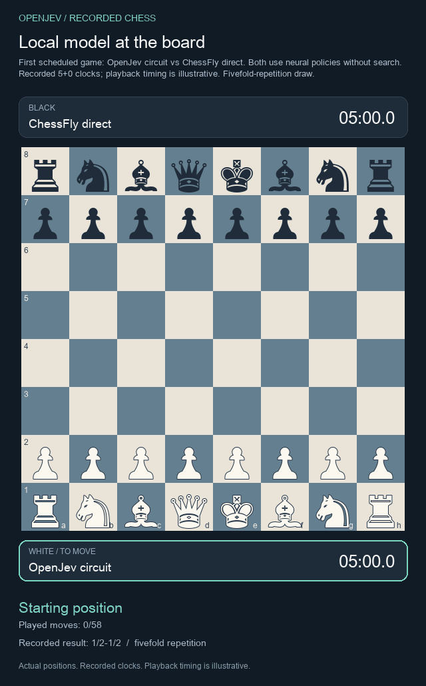
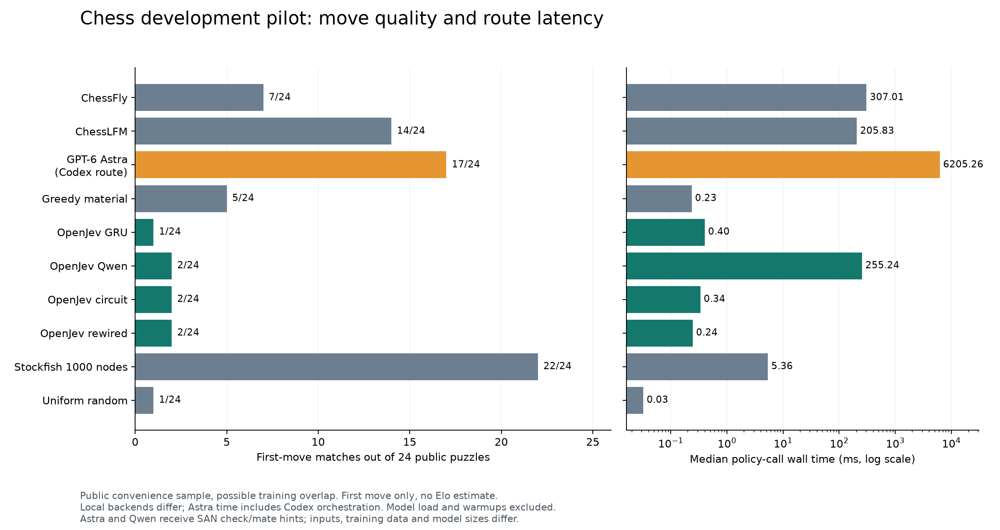

# Chess pilot

OpenJev now includes a trained 182,289-parameter recurrent circuit, a legal-move arena, and recorded games against ChessFly, ChessLFM, Qwen and GPT-6 Astra through Codex. This is a development experiment, not an Elo rating or a demonstrated architecture advantage.

[Play the first scheduled game](https://kw2828.github.io/OpenJev/chess-replay.html) · [Our trained models](chess-student.md) · [Research plan](../research/chess-research-plan.md) · [Paper draft](../paper/chess-study.tex)

[](https://kw2828.github.io/OpenJev/chess-replay.html)

The replay is game-01, selected before gameplay. It includes every accepted move; playback timing is illustrative. No engine chooses either player's game moves.

## Public puzzle panel

We fixed the first eight valid Lichess puzzles in each of three rating bands: at most 1200, 1201-1800 and above 1800. The opponent setup move is applied before the solver chooses. The reported score is the first solver move matching the published solution, not a full puzzle solve. This 24-position convenience sample may overlap published models' training data.



| Policy | First-move matches | Immediate-mate alternative included | Failed calls | Median wall ms |
| --- | ---: | ---: | ---: | ---: |
| ChessFly direct | 7/24 | 8/24 | 0 | 307.01 |
| ChessLFM direct | 14/24 | 15/24 | 0 | 205.83 |
| GPT-6 Astra via Codex | 17/24 | 18/24 | 0 | 6205.26 |
| Greedy material | 5/24 | 5/24 | 0 | 0.23 |
| OpenJev GRU | 1/24 | 1/24 | 0 | 0.40 |
| OpenJev Qwen direct | 2/24 | 2/24 | 0 | 255.24 |
| OpenJev circuit | 2/24 | 2/24 | 0 | 0.34 |
| OpenJev rewired | 2/24 | 2/24 | 0 | 0.24 |
| Stockfish 1000 nodes | 22/24 | 23/24 | 0 | 5.36 |
| Uniform random | 1/24 | 1/24 | 0 | 0.03 |

## Recorded games

Both colors are played from the standard starting position. Each side has 300 seconds with no increment. A game reaching 120 plies remains unfinished; it is not scored as a draw. Timeouts and model errors remain visible. These are individual exhibitions, not independent repeated samples.

| Game | White | Black | Result | Termination | Plies |
| --- | --- | --- | --- | --- | ---: |
| [game-01](../evidence/chess-v1/results/game-game-01.pgn) | OpenJev circuit | ChessFly direct | 1/2-1/2 | fivefold_repetition | 58 |
| [game-02](../evidence/chess-v1/results/game-game-02.pgn) | ChessFly direct | OpenJev circuit | 1-0 | checkmate | 35 |
| [game-03](../evidence/chess-v1/results/game-game-03.pgn) | OpenJev circuit | ChessLFM direct | 0-1 | checkmate | 38 |
| [game-04](../evidence/chess-v1/results/game-game-04.pgn) | ChessLFM direct | OpenJev circuit | 1-0 | checkmate | 31 |
| [game-05](../evidence/chess-v1/results/game-game-05.pgn) | OpenJev circuit | GPT-6 Astra via Codex | 0-1 | checkmate | 48 |
| [game-06](../evidence/chess-v1/results/game-game-06.pgn) | GPT-6 Astra via Codex | OpenJev circuit | 1-0 | checkmate | 45 |
| [game-07](../evidence/chess-v1/results/game-game-07.pgn) | ChessFly direct | ChessLFM direct | 0-1 | checkmate | 58 |
| [game-08](../evidence/chess-v1/results/game-game-08.pgn) | ChessLFM direct | ChessFly direct | 1/2-1/2 | stalemate | 101 |
| [game-09](../evidence/chess-v1/results/game-game-09.pgn) | ChessFly direct | GPT-6 Astra via Codex | 1-0 | timeout | 103 |
| [game-10](../evidence/chess-v1/results/game-game-10.pgn) | GPT-6 Astra via Codex | ChessFly direct | 1-0 | checkmate | 33 |
| [game-11](../evidence/chess-v1/results/game-game-11.pgn) | ChessLFM direct | GPT-6 Astra via Codex | 0-1 | checkmate | 82 |
| [game-12](../evidence/chess-v1/results/game-game-12.pgn) | GPT-6 Astra via Codex | ChessLFM direct | 0-1 | checkmate | 64 |
| [game-13](../evidence/chess-v1/results/game-game-13.pgn) | OpenJev circuit | OpenJev Qwen direct | 1/2-1/2 | fivefold_repetition | 94 |
| [game-14](../evidence/chess-v1/results/game-game-14.pgn) | OpenJev Qwen direct | OpenJev circuit | 1/2-1/2 | fivefold_repetition | 103 |
| [game-15](../evidence/chess-v1/results/game-game-15.pgn) | OpenJev circuit | OpenJev GRU | 1/2-1/2 | fivefold_repetition | 79 |
| [game-16](../evidence/chess-v1/results/game-game-16.pgn) | OpenJev GRU | OpenJev circuit | 1/2-1/2 | fivefold_repetition | 92 |
| [game-17](../evidence/chess-v1/results/game-game-17.pgn) | OpenJev circuit | OpenJev rewired | 1/2-1/2 | fivefold_repetition | 43 |
| [game-18](../evidence/chess-v1/results/game-game-18.pgn) | OpenJev rewired | OpenJev circuit | 1/2-1/2 | fivefold_repetition | 97 |

18 games reached a scored outcome; 0 were unfinished and 0 failed.

## What each policy uses

- **Our circuit, rewired control and GRU:** exactly the first predeclared fit, seed 17. All use the same 4,096 engine-labeled training positions and three epochs. Hidden state resets at every board; four recurrent updates refine the current board. This is not cross-move memory or a world model.
- **ChessFly:** independently implemented CPU adapter for the pinned public weights and FlyWire graph. Five recurrent updates from zero per board. The browser demo's depth-three search is excluded.
- **ChessLFM:** pinned public hybrid convolution/attention model, two forward passes, all legal moves scored. Its demo search is excluded. This does not reproduce the author's search-assisted rating.
- **OpenJev Qwen:** one forward pass scores single-token candidate labels for every legal move; no text generation or search.
- **Astra:** an explicitly dispatched `gpt-6-astra` Codex agent receives FEN, board, recent moves and legal candidates. It is instructed to use no engine, browsing or workspace data beyond the board helper. One persistent agent serves the panel, so its conversation also contains earlier packets; this is not an independently reset API call per move. The packets do not supply remaining game clocks. This is instruction-limited isolation, not a technical sandbox or provider-attested Responses API benchmark. No probabilities are invented for Astra.
- **Stockfish:** puzzle reference with 1,000 nodes per position, one thread and cleared hash. It is not consulted by any game player. Greedy material and seeded uniform random are additional puzzle controls.

## Timing and claim limits

Timing is the complete policy-call wall time. Initial loading and two declared local warmups are excluded and recorded separately. Astra includes Codex reasoning, scheduling and helper calls. Qwen runs on MLX; ChessFly, ChessLFM and students use CPU PyTorch with two threads. The LFM convolution uses the reference implementation. The timings are route measurements, not equal-hardware model speed or equal-compute architecture comparisons. Background local work can affect timing. A policy call is adjudicated after return; the Astra transport has a separate 120-second per-request timeout.

Astra and Qwen receive SAN check/checkmate markers in their legal candidate descriptions. Three of the 24 puzzle positions contain an immediate mate revealed by this notation; numerical policies receive legal masks without SAN. This is another representation confound, so the panel does not measure unaided chess reasoning. Move probabilities are conditional on the legal candidates and are uncalibrated. Neither confidence nor checkmate strength follows from a large candidate probability. External models have different pretraining data and scale. The controlled architectural comparison is [our nine-fit student study](chess-student.md), whose circuit continuation gate failed.

## Reproduction and evidence

[Frozen plan](../evidence/chess-v1/plan.json) · [Pre-results schedule](../evidence/chess-v1/design.json) · [Raw attempts and game traces](../evidence/chess-v1/results/) · [Summary](../evidence/chess-v1/results/summary.json) · [Publication receipt](../evidence/chess-v1/publication.json)

Install the project's language/research dependencies and `research/requirements-chess.txt`. Download the pinned external assets according to their model cards. For a new run, copy the config, set local artifact paths and a fresh Astra bridge directory, then prepare a new plan. Do not overwrite this frozen run or substitute checkpoints under its identity.

```sh
python scripts/chess_study.py prepare --config YOUR_CONFIG.json --puzzles YOUR_LICHESS.csv --out NEW_PLAN.json
python scripts/chess_study.py run --plan NEW_PLAN.json --out NEW_EXECUTION
```

The Astra policy requires a separately dispatched Codex worker. Without one, remove it from the new schedule before preparation; the runner will never substitute a different model.

## Sources and licenses

[Lichess puzzles](https://database.lichess.org/) are CC0. [Stockfish](https://stockfishchess.org/) is the local GPL engine teacher/reference; its binary is not redistributed. [ChessFly](https://huggingface.co/mlabonne/chessfly) uses externally licensed FlyWire assets with noncommercial terms. [ChessLFM](https://huggingface.co/mlabonne/LFM2.5-230M-Chess) has its own model license. External model weights, graph assets and Space code are not redistributed here. Our independently written adapters and original student weights use the project MIT license.
