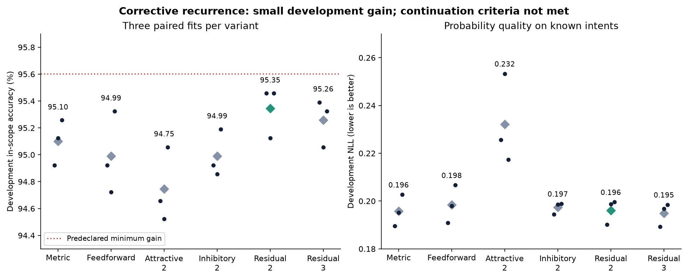

# Corrective recurrence

The [learned-head comparison](learned-associative-study.md) reached 95.10% development accuracy with a linear metric head. Dense attractive recurrence worsened accuracy, NLL and cost. This screen tests whether subtractive or residual updates help instead, while keeping the learned parameter count and optimization recipe fixed.

## Results



All 18 fits completed. Diamonds show means and dots show the three fits. Accuracy is plotted on a restricted axis to make these small differences visible.

| Head | Mean accuracy | Balanced utility | In-scope NLL |
| --- | ---: | ---: | ---: |
| Metric | 95.101% | 92.957% | 0.19584 |
| Feedforward | 94.990% | 92.890% | 0.19848 |
| Attractive, 2 steps | 94.745% | 92.701% | 0.23208 |
| Inhibitory, 2 steps | 94.990% | 92.923% | 0.19733 |
| Residual, 2 steps | **95.346%** | **93.079%** | 0.19614 |
| Residual, 3 steps | 95.257% | **93.079%** | **0.19485** |

The predeclared selector chose two-step residual correction. It improved accuracy by **0.245 percentage points**, won two paired seeds and tied one, but did not reach the required 0.5-point improvement. Its NLL was slightly worse than the metric control and its estimated head matrix cost was 2.12 times higher. The criterion therefore failed. We did not switch selection to the three-step head after inspecting its better NLL.

The 5,410-example confirmation and 1,550-example calibration sets remain unscored. These reused development data do not establish generalization, novelty or a significant improvement. The small positive signal warrants a hypothesis about correction, not another round of tuning this same routing score indefinitely. The next task should test multi-step reasoning explicitly.

[All fits, frozen settings and selection decision](../evidence/corrective-associative-v1/summary.json) · [Execution receipt](../evidence/corrective-associative-v1/receipt.json) · [Exact replay of all nine control checkpoints](../evidence/corrective-associative-v1/control-replay.json)

The [RuleTaker follow-up](rule-memory-study.md) now has 18 completed fits. Recurrence improved over single-read attention but lost to the question-only control on the depth-and-context shift.

Six heads run across three paired seeds, all with 68,481 parameters:

| Head | Update before normalization | Steps |
| --- | --- | ---: |
| Metric | Linear projected query | 0 |
| Feedforward | GELU projected query | 0 |
| Attractive | `0.5*q0 + 0.5*recall` | 2 |
| Inhibitory | `q0 - 0.25*recall` | 2 |
| Residual | `state + 0.25*(q0 - recall)` | 2 |
| Residual | `state + 0.25*(q0 - recall)` | 3 |

`recall` is the softmax-weighted mean of the learned class vectors given the current state, using beta 10. The original projected query `q0` is held fixed within each forward pass. All heads use the same original-embedding rejection gate. This is a finite differentiable architecture ablation trained by backpropagation. It is not local predictive-coding learning, an implicit equilibrium solver, or a claim of biological fidelity.

The unchanged optimizer and data-access functions from the frozen learned-head study are reused through an explicit adapter. The adapter hashes itself, the original trainer, and both architecture modules. It supplies the new model factory/protocol and verifies the actual 18 output files before writing the completion count. Prior sources, results and checkpoints remain unchanged.

The training recipe is identical to the previous screen: 30 epochs, 15,000 known-intent training examples, three paired seeds, same minibatch order, final-step cross entropy, same optimizer and learning rate. Selection reads only the same development set. It does not load the 5,410-example confirmation or 1,550-example calibration arrays.

Select the corrective variant with the best mean in-scope accuracy. It must beat the best control by at least 0.5 percentage points, improve or match balanced utility and NLL, win at least two paired seeds, and stay within three times the head matrix-operation count. Passing only permits a separately frozen confirmation. Repeated development selection across these screens increases optimism; no development improvement is an independent benchmark claim.

```sh
.venv/bin/python scripts/corrective_associative_study.py freeze \
  --packet runs/associative-text-v1/packet --out runs/corrective-associative-v1/plan.json
.venv/bin/python scripts/corrective_associative_study.py train \
  --packet runs/associative-text-v1/packet --plan runs/corrective-associative-v1/plan.json \
  --out runs/corrective-associative-v1/fits --device cpu
.venv/bin/python scripts/corrective_associative_study.py report \
  --packet runs/associative-text-v1/packet --plan runs/corrective-associative-v1/plan.json \
  --runs runs/corrective-associative-v1/fits --out runs/corrective-associative-v1/summary.json
```

Related work motivates the question, not a novelty claim: [predictive coding with local recurrent processing](https://arxiv.org/abs/1805.07526), [deep equilibrium models](https://arxiv.org/abs/1909.01377), and the [associative retrieval sources](associative-text-study.md#sources).
