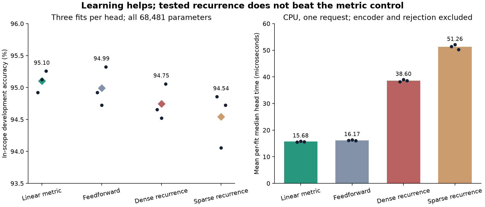

# Learned associative heads

The [untrained associative retrieval screen](associative-text-study.md) favored simple centroids. This follow-up tests whether learning the projection and class memory makes recurrence useful. This is a development experiment, not an established novel architecture or confirmed benchmark improvement.

## Development results



All 12 fits completed. Diamonds show mean accuracy, bars show mean timing, and dots show individual fits; the accuracy axis starts at 93.5%. These are repeated fits on the same development examples, not independent confirmation samples.

| Head | Mean in-scope accuracy | Balanced utility | In-scope NLL | Head time, microseconds |
| --- | ---: | ---: | ---: | ---: |
| Linear metric | **95.10%** | **92.96%** | **0.196** | **15.68** |
| Feedforward | 94.99% | 92.89% | 0.198 | 16.17 |
| Dense recurrence | 94.75% | 92.70% | 0.232 | 38.60 |
| Sparse recurrence | 94.54% | 92.71% | 0.256 | 51.26 |

Times are means of each fit's warmed batch-one median on an Apple M5 Max, with four CPU threads. They exclude the encoder and common rejection gate. All heads use the same gate, giving the same 96% recall on the 50 OOS development examples. That gate was tuned on these data in the previous screen, so this is not an independently validated OOS result.

Learning raised the best control from the prior fixed prototype's 91.65% accuracy to 95.10%. Dense recurrence, selected over sparse recurrence by the frozen rule, lost to the learned metric head in **all three paired seeds**. Its mean accuracy was 0.36 percentage points lower and its estimated matrix cost was 2.12 times higher. Probability scores also worsened. Sparse recurrence had fewer estimated matrix operations than dense recurrence but higher measured time, illustrating the cost of top-k selection and gathering.

The continuation rule failed. **Confirmation and calibration remain unscored.** This study establishes a stronger development baseline, not a benefit from recurrence. The 12 fits used 21,240 training updates and 28.74 seconds of CPU training in total, excluding shared encoder precomputation. [All fits and frozen plan](../evidence/learned-associative-v1/summary.json) · [Execution receipt](../evidence/learned-associative-v1/receipt.json).

Next work should test corrective or inhibitory updates against attractive recurrence, and include a task requiring multiple reasoning steps. Simply increasing attractive recurrence on this single-utterance task is not supported by the results. Any change needs a new frozen development experiment; the existing controls and negative results stay visible.

## Matched controls

All four heads have **68,481 trainable parameters**: a 384-to-128 projection with bias, 150 learned class vectors, and one logit scale. MiniLM embeddings are fixed. Class vectors are initialized from projected training-class means; all parameters then learn from the same labels.

| Head | Initial projection | Refinement |
| --- | --- | --- |
| Metric | Linear, normalized | None |
| Feedforward | Linear + GELU, normalized | None |
| Recurrent | Same as feedforward | Two dense associative updates |
| Sparse recurrent | Same as feedforward | Two top-8 associative updates |

The recurrent heads reuse the same class vectors for retrieval and classification. Each update mixes the original projected query with retrieved class vectors at a fixed 0.5 anchor, then normalizes. Retrieval softmax uses beta 10. There are no extra recurrent parameters. Zero-step recurrence is the feedforward head, with the same initial tensors; the sparse variant changes which class vectors participate in the update. These are adaptations of existing [prototype methods](https://arxiv.org/abs/1703.05175) and [modern Hopfield retrieval](https://arxiv.org/abs/2008.02217), not independent novelty claims.

Each head trains for 30 epochs on the same 15,000 known-intent CLINC examples, with AdamW at 0.001, weight decay 0.0001, minibatches of 256, final-step cross entropy and gradient clipping at 1. Three paired seeds use the same minibatch order. No early stopping, best-epoch selection, best-seed reporting or encoder fine-tuning is allowed.

All heads use the same rejection rule: original-embedding centroid support at the prior development-selected threshold of 0.48. This prevents changes to rejection settings from being credited as architecture improvements. In-scope accuracy before rejection, correct-and-accepted accuracy, balanced utility, NLL and Brier score are reported separately. These heads recognize the learned 150-intent inventory; they are not yet a general request-time candidate API.

## Selection and confirmation

Training reads only the frozen `train` and `tune` parts of the associative-text-v1 packet. The 5,410-example confirmation and 1,550-example calibration parts are excluded by the loader. Development has 1,497 known-intent and 50 OOS examples. This development set has already informed prior architecture choices, so its improvements are selection evidence, not independent efficacy.

The best recurrent variant by mean in-scope accuracy must beat the strongest nonrecurrent control by at least 0.5 percentage points, match or improve its mean balanced utility, win in at least two of three paired seeds, and use at most three times its head matrix multiply-accumulate count. Only then does it become eligible for an independently frozen confirmation procedure. All three fits must be retained for that comparison.

Parameter matching does not equal compute matching. Report training time, matrix operation estimates, and batch-one CPU head timing. The operation estimate excludes normalization, activation, softmax, top-k, rejection scoring, data movement and the shared encoder. Head timing also excludes the encoder and common rejection gate. Neither is an end-to-end application speed claim.

## Run

Use the existing pinned input packet from [the associative study](associative-text-study.md).

```sh
.venv/bin/python scripts/learned_associative_study.py freeze \
  --packet runs/associative-text-v1/packet --out runs/learned-associative-v1/plan.json
.venv/bin/python scripts/learned_associative_study.py train \
  --packet runs/associative-text-v1/packet --plan runs/learned-associative-v1/plan.json \
  --out runs/learned-associative-v1/fits --device cpu
.venv/bin/python scripts/learned_associative_study.py report \
  --packet runs/associative-text-v1/packet --plan runs/learned-associative-v1/plan.json \
  --runs runs/learned-associative-v1/fits --out runs/learned-associative-v1/summary.json
```

Frozen code/data checks, exclusive output creation and per-fit checkpoint hashes preserve lineage. Raw texts, per-item predictions and checkpoints remain under ignored `runs/`. Aggregate reports can be published. This experiment does not use paid Astra supervision; that separate training arm still requires credential access.
