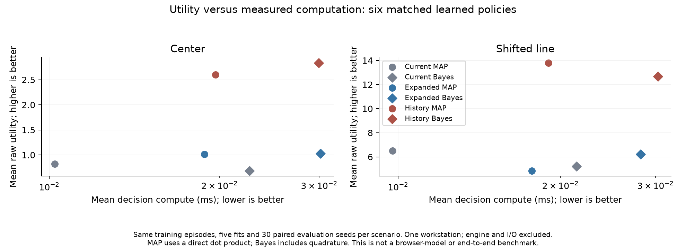

# Causal memory ablation

**History improved utility relative to the original model on both scenarios, but the full continuation gate failed.** The comparison against an equally sized current-only feature expansion remains inconclusive. Adaptive-compute experiments and second-environment efficacy validation were therefore not launched. The rule baseline remains stronger in mean utility.

## Frozen design

The protocol and execution code were committed at `04ce32d` before new evaluation. One run executed **1,980 real ViZDoom episodes**: 1,920 policy evaluations and 60 common-audit episodes. It reused the exact 80 training episodes from Bayesian v2, with the same per-replicate 565/609/631/628/522 commanded-fire labels. All five original seven-feature MAP weight vectors were reproduced exactly.

Three feature variants each use the same Gaussian-prior logistic model and fitting settings:

- **Current (7):** the original observation features.
- **Expanded current (17):** current features, squares and four interactions. This controls feature count, but not exact effective capacity or regularization geometry.
- **Causal history (17):** current features, the previous observation, previous issued-fire and observed-hit bits, time since the last issued fire command (capped at ten windows), and a has-previous flag. No weapon readiness, future observation or current-window outcome enters the pre-action features. History resets every episode.

All evaluated policies share rule steering, seven-tic action windows, the 0.25 firing-window cost, and the same untouched evaluation seeds 50000-50029. The five fitted replicates see identical training data across variants. There is no evaluation-time fitting. A separate common randomized audit uses seeds 60000-60029. The 180-decision episode cap is fixed; some line episodes reach it, so these are capped-horizon results.

Both MAP and posterior mean are evaluated for each feature variant. The two existing baselines run once per seed, not once per training replicate. Evaluation job order is randomized. No paid API is used.

## Predeclared continuation rule

Primary comparisons are history MAP minus each of current MAP and expanded MAP, separately in Center and Line. All four must have mean **net utility gain of at least 0.5** and a positive lower endpoint of a Bonferroni 98.75% crossed-bootstrap interval. We use 20,000 paired resamples over five training fits and 30 episode seeds, with a frozen RNG seed. These finite-sample bootstrap intervals are an exploratory continuation screen, not guaranteed coverage or external confirmation.

Net utility subtracts one utility unit per cumulative second of decision computation. Timing includes feature construction, rule steering, prediction, decision construction and history updates. It excludes engine observation/advance, trace I/O and rendering. History must also remain below 3x the current model's aggregate compute per decision and below 1 ms for every evaluation episode's p95 decision time. Both timing gates passed. Concurrent lightweight document editing occurred on the workstation; browser model loading began only after the run completed. Timing is local, not a controlled cross-machine or end-to-end benchmark.

The utility gains fail the capacity-control comparisons below. The frozen failure action prohibits tuning another run to get a pass and stops the conditional downstream efficacy experiments.

## Outcomes

| Controller | Center utility | Line utility | Center compute, ms/decision | Line compute, ms/decision |
|---|---:|---:|---:|---:|
| Current MAP (7 features) | 0.823 | 6.493 | 0.0102 | 0.0098 |
| Current-only expansion (17) | 1.012 | 4.845 | 0.0188 | 0.0177 |
| Causal history MAP (17) | 2.603 | 13.795 | 0.0197 | 0.0190 |
| Current Bayesian mean | 0.683 | 5.213 | 0.0226 | 0.0214 |
| Expanded Bayesian mean | 1.027 | 6.205 | 0.0301 | 0.0281 |
| History Bayesian mean | 2.837 | 12.680 | 0.0300 | 0.0303 |
| Rule baseline | 2.875 | 15.233 | 0.0054 | 0.0048 |
| Tiny imitation | 2.917 | 14.817 | 0.0278 | 0.0245 |

Raw utility is successful fire-command windows minus 0.25 per fire-command window. Each learned policy has 150 evaluation episodes per scenario; each existing baseline has 30. The seven-tic firing study is separate from the original two-tic gameplay benchmark.

| Primary comparison | Mean net utility gain | Adjusted interval | Pass |
|---|---:|---|---|
| Center: history minus current | +1.779 | [+0.277, +3.564] | Yes |
| Center: history minus expanded | +1.591 | [-0.349, +3.571] | No |
| Line: history minus current | +7.301 | [+0.351, +14.180] | Yes |
| Line: history minus expanded | +8.950 | [-0.972, +16.998] | No |




The shared-audit mean MAP Brier score decreased descriptively from 0.131446 to 0.119535 in Center and 0.243435 to 0.228333 in Line with history. Brier score measures overall probability accuracy, not calibration alone; no independent-event interpretation or calibration guarantee follows. These secondary results cannot override the primary continuation gate.

History uses handcrafted temporal features, not a learned recurrent world model. The result suggests that the original memoryless specification was weak, but does not isolate a memory-specific advantage over a richer current-only representation. It does not demonstrate a new Bayesian RL algorithm, an ICLR contribution, or superiority over rules. More Bayesian compute did not consistently improve mean utility across feature sets and scenarios.

## Artifacts and reproduction

- [Frozen protocol](../research/protocols/memory-doom-v1.json)
- [Run manifest, source hashes and artifact hashes](../evidence/memory-doom-v1/run-001/manifest.json)
- [Analysis and exact continuation decision](../evidence/memory-doom-v1/analysis-001.json)
- [All episode summaries](../evidence/memory-doom-v1/run-001/episodes.jsonl)
- [Compressed decision trace](../evidence/memory-doom-v1/run-001/trace.jsonl.gz)

The original run remains immutable. From the repo root, a separately labeled reproduction can use:

```sh
uv sync --frozen --extra dev
uv run python research/memory_doom.py --output runs/memory-reproduction
uv run python research/analyze_memory_doom.py runs/memory-reproduction --output runs/memory-reproduction-analysis.json
uv run --no-sync --with matplotlib==3.11.2 python research/plot_memory_doom.py
```

The final command plots the preserved run, not the new reproduction. Output run directories and analysis files must not already exist. The one-run development decision is closed; reproduction is not authorization to tune or replace its result. No adaptive-compute or second-environment result is claimed.
