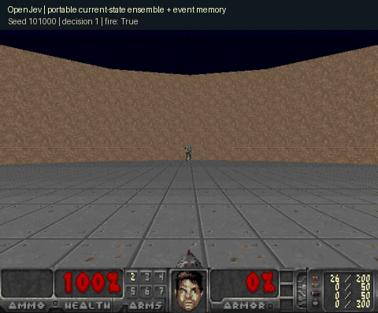

# Portable features and matched ensembles

This prospective study was frozen at `6402a29` before any of its new simulation runs. It follows the preserved failures and partial gains in the [ammo-only](cadence-study.md) and [combined-event](event-cadence-study.md) studies.

The five historical history-MAP models were trained on disjoint Center data. Their Line outcomes vary substantially, and their learned ammo coefficients differ. This suggests testing a smaller targeting representation without absolute ammo, health or distance levels. It is a hypothesis about this dataset, not proof that these variables are universally irrelevant.

## Matched training and controls

Every ensemble uses the same total 80 historical training episodes, divided into the same five fitting replicates with identical issued-fire labels. Original-history ensembles reuse the preserved 17-feature MAP fits. The new current head has four inputs: bias, target visibility, capped aim error divided by a target-width tolerance, and target width. Its history version adds previous fire, previous hit, time since last issued fire, and a history-present indicator, for eight inputs. The Gaussian prior and optimizer are unchanged.

Each ensemble averages five probabilities, not five sets of generated text. This is ordinary model averaging, not a new Bayesian procedure. Both feature removal and representation geometry change, so the comparison cannot isolate one input as the cause of any gain.

The eight development arms are rules, rules with event memory, original-history ensembles with and without event memory, and both new heads with and without event memory. All ensemble arms require a visible target; the untouched single-fit historical references retain their original behavior. All share the same rule steering, seven-tic windows, horizon and command cost. Event memory is the fixed one-window rest after an ammo decrease or preceding hit.

Development uses 24 new seeds in each scenario, 384 episodes. Eligible candidates must gain at least 0.5 mean net utility while losing no more than 0.5 mean kills against rules in each scenario. Select the candidate with the largest minimum gain across scenarios, once. No fallback is allowed after confirmation.

One confirmation, if authorized by development, uses 96 fresh seeds per scenario and ten arms counting the five historical fits separately: selected candidate, rules, original ensemble, event-memory rule, selected head with its event gate disabled, and five original history-MAP policies. It uses the same primary utility and kill criteria as the earlier cadence protocols, including adjusted bootstrap intervals and the latency screen.

The original ensemble is an essential control: gains against individual models alone could come from averaging and access to all five training replicates. Secondary comparisons against the original ensemble and against the same head without the event gate determine what the component comparisons support. These secondary results cannot rescue a failed primary gate.

Both scenarios appear in development. Confirmation measures new-seed performance, not unseen-task generalization. Intervals are adjusted within each study, not across the entire sequence of adaptive research studies. All attempts are retained, and no ICLR novelty or second-environment claim follows from these comparisons.

## Reproduce

```sh
uv run python research/portable_head_doom.py --stage development --output evidence/portable-head-doom-v1/development-new
uv run python research/portable_head_doom.py --stage confirmation --development evidence/portable-head-doom-v1/development-new --output evidence/portable-head-doom-v1/confirmation-new
uv run python research/analyze_portable_head_doom.py evidence/portable-head-doom-v1/confirmation-new --output evidence/portable-head-doom-v1/analysis-new.json
```

Use new output paths. Source, protocol, fitted models and run outputs are hashed. No paid API is used.

## Development result

The frozen selection rule chose `portable_current_event`: five four-feature logistic heads averaged into one score, followed by the fixed event-memory gate. Its minimum scenario gain was +3.520 net utility. Against rules, development differences were +3.520 utility and +2.708 kills in Center, and +7.352 utility and +1.167 kills in Line. Six candidates qualified; the original ensemble without event memory missed the Center utility threshold. Learned-history variants were not selected.

[All candidate development results](../evidence/portable-head-doom-v1/development-001/selection.json). These development results selected the candidate evaluated below.


## Fresh confirmation: useful gains, failed full gate

The fixed candidate completed 1,920 episodes on seeds 101000-101095 in both scenarios. No selection fallback was used. The full continuation gate **failed**.

| Comparison | Center net utility difference [99.375% interval] | Line net utility difference [99.375% interval] |
|---|---:|---:|
| Selected minus rules | +2.322 [1.549, 3.129] | +5.663 [3.590, 7.858] |
| Selected minus historical history-MAP bank | +2.602 [1.402, 3.667] | +6.220 [-3.298, 18.705] |

The candidate passed the Center rules comparison. Its Center kill difference against the historical bank was +0.083 with interval [-1.440, 1.734], failing the -1 noninferiority boundary. On Line, the kill difference against rules was -0.635 [-2.146, 0.875]; noninferiority was not established. Both latency screens passed. Wide between-fit uncertainty remains material for the historical bank.

Secondary component comparisons explain the narrower gain. Event memory added +0.760 net utility in Center [0.575, 0.961] and +4.846 in Line [4.236, 5.466] over exactly the same selected head without the event gate. Kills were identical in every one of these 192 paired episodes. Raw utilities increased by +0.760 and +4.846, respectively, through fewer issued-fire windows with unchanged successful windows. This is reduced command cost, not demonstrated ammunition savings or better combat performance. Secondary intervals are exploratory and are outside the primary eight-comparison correction family.

Against the matched original ensemble, the selected candidate gained +3.271 net utility in Center [2.386, 4.134], but averaged -2.228 in Line [-4.437, 0.015]. A portable representation did not dominate the original ensemble across scenarios. The Line advantage over the simpler event-memory rule was also inconclusive.


[Preserved analysis](../evidence/portable-head-doom-v1/analysis-001.json) · [Confirmation receipt](../evidence/portable-head-doom-v1/confirmation-001/manifest.json) · [All improvement studies](improvement-studies.md)

## Recorded local model



Seed 101000, chosen as the first confirmation seed rather than the best episode: 6 kills, 9.20 game seconds, utility 3.50, then death. This is the fitted numerical ensemble, separate from the Qwen browser model. The recording reproduces the preserved episode's gameplay fields exactly. Playback advances at seven tics per 200 ms; frame capture is not a timing benchmark. [Recording receipt](assets/portable-current-event-101000.json).
