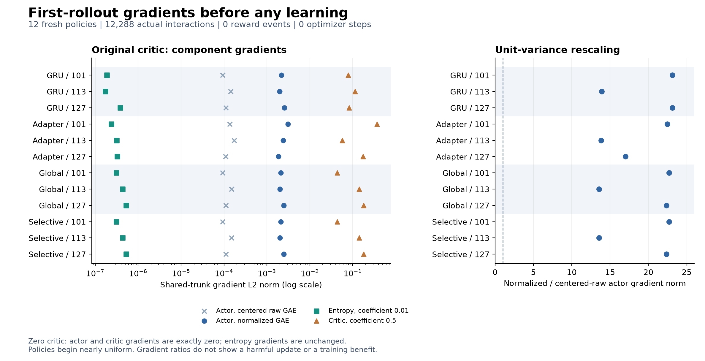

# What happens before PPO observes a reward?

**Completed initialization audit, not a training result.** The random value head produces nonzero policy and critic gradients during the first unrewarded rollout. Zeroing only that head removes both gradients on the same data. This establishes an initialization effect; it does not establish that the effect causes later exploration collapse or that zero initialization improves learning.



## What was measured

The protocol and sources were frozen in `f2cfd5b`. Four fresh architectures (GRU, feedforward adapter, global associative writes, selective writes) each used seeds 101, 113 and 127. Each model collected the first 16-environment, 64-step rollout of the [associative PPO recipe](associative-ppo-study.md): cue-visible MiniGrid Memory, size 11, native seven actions and sparse rewards, 128-step episode cap.

There were **12,288 actual interactions, zero reward events, zero completed episodes and zero optimizer steps**. The panel took 4.47 seconds. Three seeds are shared across architectures; these are not twelve independent seed replications. Global and selective stores have identical initial policies. Their gradient norms differ slightly because the selective gate has additional trainable weights.

For each rollout, a copied model differed only in its zeroed value-head weight and bias. Policy logits, recurrent states and sampled actions matched exactly. The original environment rewards were retained. A separately labeled synthetic all-zero-reward condition produced identical measurements here because the actual rollouts already contained no rewards. No trained checkpoint was loaded, and all parameter hashes remained unchanged.

Gradient components were measured on the same full rollout at the initial policy, before gradient clipping. The training recipe instead uses shuffled minibatches, repeated PPO epochs, clipping and Adam updates. The measurements below are not actual parameter updates.

## Every model and seed

Entropy is the mean action-distribution entropy over the initial rollout, in nats. A uniform seven-action policy has entropy `ln(7) = 1.94591015`. The normalization multiplier is `1 / (population_std(GAE) + 1e-8)`.

| Architecture | Seed | Initial entropy | Raw GAE std | Multiplier |
| --- | ---: | ---: | ---: | ---: |
| gru | 101 | 1.94590950 | 0.04323 | 23.13 |
| gru | 113 | 1.94590950 | 0.07184 | 13.92 |
| gru | 127 | 1.94590890 | 0.04327 | 23.11 |
| feedforward | 101 | 1.94590950 | 0.04454 | 22.45 |
| feedforward | 113 | 1.94590926 | 0.07232 | 13.83 |
| feedforward | 127 | 1.94590914 | 0.05877 | 17.02 |
| fast_global | 101 | 1.94590926 | 0.04404 | 22.71 |
| fast_global | 113 | 1.94590855 | 0.07373 | 13.56 |
| fast_global | 127 | 1.94590724 | 0.04478 | 22.33 |
| fast_selective | 101 | 1.94590926 | 0.04404 | 22.71 |
| fast_selective | 113 | 1.94590855 | 0.07373 | 13.56 |
| fast_selective | 127 | 1.94590724 | 0.04478 | 22.33 |

The next table uses the **shared trunk**, meaning all trainable parameters except the actor and value heads. `A` is the normalized-GAE actor-surrogate gradient norm, `E` the entropy-loss gradient norm including coefficient 0.01, and `C` the critic-MSE gradient norm including coefficient 0.5. Cosine compares actor and critic gradient directions in that trunk.

| Architecture / seed | A | E | C | A / E | C / A | Cosine(A,C) |
| --- | ---: | ---: | ---: | ---: | ---: | ---: |
| gru / 101 | 2.165e-03 | 1.873e-07 | 7.823e-02 | 11,556 | 36.14 | -0.410 |
| gru / 113 | 1.981e-03 | 1.710e-07 | 1.128e-01 | 11,583 | 56.94 | +0.091 |
| gru / 127 | 2.540e-03 | 3.842e-07 | 8.240e-02 | 6,612 | 32.43 | +0.202 |
| feedforward / 101 | 3.063e-03 | 2.375e-07 | 3.662e-01 | 12,897 | 119.53 | -0.357 |
| feedforward / 113 | 2.381e-03 | 3.162e-07 | 5.652e-02 | 7,529 | 23.74 | +0.093 |
| feedforward / 127 | 1.866e-03 | 3.246e-07 | 1.735e-01 | 5,747 | 93.00 | -0.016 |
| fast_global / 101 | 2.107e-03 | 3.085e-07 | 4.347e-02 | 6,830 | 20.63 | +0.297 |
| fast_global / 113 | 2.023e-03 | 4.322e-07 | 1.407e-01 | 4,681 | 69.54 | +0.102 |
| fast_global / 127 | 2.465e-03 | 5.259e-07 | 1.798e-01 | 4,687 | 72.94 | +0.251 |
| fast_selective / 101 | 2.107e-03 | 3.085e-07 | 4.347e-02 | 6,830 | 20.63 | +0.297 |
| fast_selective / 113 | 2.023e-03 | 4.322e-07 | 1.407e-01 | 4,681 | 69.54 | +0.102 |
| fast_selective / 127 | 2.465e-03 | 5.259e-07 | 1.798e-01 | 4,687 | 72.94 | +0.251 |

The [CSV](../evidence/ppo-initialization-probe-v1/gradients.csv) contains every seed, value-head condition and reward condition for the full parameter set, shared trunk, actor head and value head. It includes uncentered raw-GAE gradients, centered raw-GAE gradients, normalized gradients and all component cosines. The [full summary](../evidence/ppo-initialization-probe-v1/summary.json) preserves exact values; the [compact audit](../evidence/ppo-initialization-probe-v1/audit.json) contains the figure inputs.

## What the comparison supports

Unit-variance normalization multiplies the centered actor gradient by **13.56-23.13**, without changing its direction. Comparing with centered raw GAE isolates this rescaling from the separate effect of mean subtraction. The near-zero centered actor loss value does not imply a zero actor gradient.

With the zero value head, values, GAE, targets, actor gradients and critic gradients are exactly zero for these unrewarded rollouts. The policy entropy and entropy gradients remain exactly the same. Undefined gradient cosines are recorded as null, not zero.

The large actor-to-entropy ratios need context: the policies already begin almost uniform, where the entropy gradient approaches zero. This is not evidence that entropy regularization is inherently too weak. The critic also contributes a larger trunk gradient than the actor, with mixed alignment. Gradient magnitudes and cosine signs alone do not establish a harmful parameter update, loss of memory, poor exploration or downstream reward performance.

Zero initialization changes two pathways at once: bootstrap-derived actor advantages and critic updates to shared features. A future training benefit would therefore support the initialization intervention, not identify advantage normalization as its sole cause. This is an implementation diagnostic of standard initialization and normalization choices. No mathematical or architectural novelty, or effectiveness claim, follows from this audit.

## Proposed follow-up, not frozen or run

After the autonomous PPO results are complete, test **zero value-head initialization across the same four architectures**, keeping every other setting fixed. Reuse the completed original-head fits as the paired development controls; do not rerun them selectively or treat the reused panel as independent confirmation.

- Use the same seeds 101, 113 and 127 for GRU, feedforward adapter, global writes and selective writes. Preserve native seven actions, the cue-visible environment, optimizer and entropy coefficient. No pretrained weights, reward shaping, action restriction or curriculum.
- Give all twelve new zero-head fits exactly 1,048,576 interactions, for 12,582,912 additional interactions. Match actor/state initialization and reset the policy-sampling RNG after initialization. Freeze and verify the unchanged reference implementation and dependencies, randomize the new fit order before running, and use final checkpoints only. The old and new conditions are not contemporaneously interleaved; report runtime separately.
- Reuse the unchanged trainer and its existing learning logs. Report entropy, cumulative completed episodes and rolling success, with the discovery audit's window-coverage and censoring limits. These logs do not contain raw GAE, exact cumulative reward events or gradient-component histories; do not infer those quantities from them.
- Evaluate final policies on the same 128 previously scored paired development seeds per size 11, 17 and 23. Preserve every original evaluation mode, including state resets, cue swaps, native-start transfer and store-only resets for store architectures. Publish all seeds, failures, success, wrong-goal rates, timeouts and runtime.

The proposed optimization continuation gate requires at least a 10-percentage-point mean same-size improvement over the corresponding original-head control for at least three of four architectures, with no architecture degrading by more than five percentage points. Publish every paired seed and architecture, and report the original selective-writing gate separately. Better reward discovery alone does not establish use of memory; the intact-versus-reset evaluations retain that distinction. These proposed thresholds are development decisions, not statistical confirmation, and must be frozen before the follow-up runs.

If zero initialization preserves high entropy but does not improve reward discovery or scored utility, report that failure and investigate navigation/reward coverage. If it improves discovery but remains a fixed-branch policy, report an exploration effect and keep the memory gate failed. A later factorial control would be needed to separate advantage scaling from critic-to-trunk updates; it is not part of this recommendation.

## Evidence and reproduction

[Frozen plan](../evidence/ppo-initialization-probe-v1/plan.json) · [Completion receipt](../evidence/ppo-initialization-probe-v1/completed.json) · [Publication manifest](../evidence/ppo-initialization-probe-v1/publication.json) · [SVG figure](../evidence/ppo-initialization-probe-v1/initialization-gradients.svg)

```sh
.venv/bin/python scripts/ppo_initialization_probe.py run \
  --plan evidence/ppo-initialization-probe-v1/plan.json \
  --out runs/ppo-initialization-probe-v1/reproduction
.venv/bin/python scripts/publish_ppo_initialization_probe.py \
  --run runs/ppo-initialization-probe-v1/reproduction \
  --plan evidence/ppo-initialization-probe-v1/plan.json \
  --out runs/ppo-initialization-probe-v1/reproduction-figures
```

The publisher verifies source, receipt and raw-array hashes plus gradient identities without executing a model. Raw rollout arrays remain local; their hashes are published. Nineteen focused tests cover the collector and gradient accounting. Source or dependency drift causes the frozen probe to stop, and existing evidence is never overwritten.
