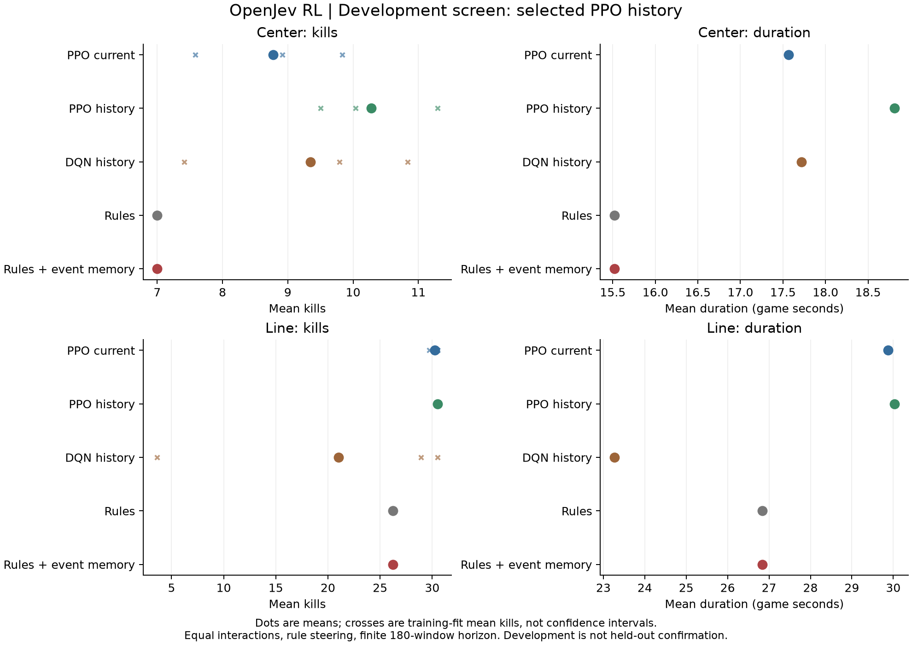

# PPO and DQN firing control

This is a new bounded experiment following the completed command-efficiency studies. It tests actual reinforcement learning: agents collect game transitions and optimize future reward. This is separate from the earlier supervised logistic outcome heads and does not implement proprietary RLCD.

Three families are compared: PPO with current observations, PPO with causal history, and DQN with the same causal history. Every family trains three independent seeds, each for exactly 32,768 interactions in Defend the Center. All policies choose fire/wait with unchanged rule steering. The two PPO variants have identical input and network dimensions; the current-only variant's history positions contain zeros. History contains previous observations, issued fire, observed hit and age since firing. It is handcrafted input, not a learned recurrent network.

The training reward is kills minus death minus 0.01 per issued-fire window. The previous command-efficiency utility remains secondary. The primary continuation rule requires at least one additional mean kill in Center with a positive interval lower endpoint, kill noninferiority on Line, duration noninferiority in both, and a latency screen. The episode horizon is explicitly observed and finite, so reaching the cap terminates value bootstrap. This avoids treating a hidden time limit as an ordinary terminal state.

Development evaluates all three final fits per family on 24 new paired seeds in each scenario. Selection is by family, never by lucky training seed or intermediate checkpoint. At most one family proceeds to 96 new confirmation seeds per scenario; if none qualifies, confirmation is not run. Confirmation includes PPO-current as a reference and both plain rules and the stronger event-memory rule. All prior failed gates remain unchanged.

These are established [PPO](https://stable-baselines3.readthedocs.io/en/master/modules/ppo.html) and [vanilla DQN](https://stable-baselines3.readthedocs.io/en/master/modules/dqn.html) implementations from pinned Stable Baselines3 2.9.0. See [Gymnasium's time-limit guidance](https://gymnasium.farama.org/tutorials/gymnasium_basics/handling_time_limits/). Matching interactions does not match optimization compute or on-policy data. The new RL experience also differs from the older supervised datasets, so comparisons do not isolate an algorithm effect at matched training data. No new algorithm, Bayesian advantage, or ICLR novelty is claimed.

[Full prospective protocol](../research/protocols/rl-doom-v1.json).

```sh
uv sync --frozen --extra rl --extra dev
uv run --extra rl python research/rl_doom.py --stage development --output evidence/rl-doom-v1/development-new
uv run --extra rl python research/analyze_rl_doom.py evidence/rl-doom-v1/development-new --output evidence/rl-doom-v1/development-analysis-new.json
# Only when the frozen development selection qualifies a family:
uv run --extra rl python research/rl_doom.py --stage confirmation --development evidence/rl-doom-v1/development-new --output evidence/rl-doom-v1/confirmation-new
uv run --extra rl python research/analyze_rl_doom.py evidence/rl-doom-v1/confirmation-new --output evidence/rl-doom-v1/confirmation-analysis-new.json
```

Use new output paths. No paid API calls. A hard 30-minute wall limit bounds each stage; partial or failed stages cannot establish efficacy. The development budget is 294,912 interactions plus 528 evaluation episodes. Confirmation is at most 1,536 episodes. Protocol, code, runtime versions, final checkpoints, logs and compressed traces are preserved with hashes.


## Simple-control addendum

While training was running, before any development evaluations, we separately froze [three diagnostic policies](../research/protocols/rl-doom-v1-simple-controls.json): always fire, alternating fire/wait, and fire whenever an enemy is visible. They use the same rule steering and hard constraints. They test whether any learned advantage has a trivial firing-pattern explanation. They do not modify the main protocol, family selection, or primary confirmation gate. Each completed stage can run these controls on its same game seeds, with separate traces and receipts. A positive primary gate alone would not establish a nontrivial learned mechanism if these controls explain the result.


## Completed development results

Completed 294,912 training interactions and 528 development evaluation episodes. **PPO history** qualified for one fresh confirmation.

| Controller | Center kills | Center game seconds | Line kills | Line game seconds |
|---|---:|---:|---:|---:|
| PPO current | 8.778 | 17.564 | 30.236 | 29.877 |
| PPO history | 10.278 | 18.812 | 30.500 | 30.031 |
| DQN history | 9.347 | 17.716 | 21.014 | 23.263 |
| Rules | 7.000 | 15.518 | 26.208 | 26.836 |
| Rules + event memory | 7.000 | 15.518 | 26.208 | 26.836 |

Learned rows average all three training fits and matched game seeds. Fixed rules are run once per seed, not repeated as independent data. These finite-horizon durations can include capped episodes.

| Family | Center kills by fit | Line kills by fit |
|---|---|---|
| PPO current | 8.92, 7.58, 9.83 | 30.50, 29.71, 30.50 |
| PPO history | 11.29, 10.04, 9.50 | 30.50, 30.50, 30.50 |
| DQN history | 7.42, 10.83, 9.79 | 30.50, 3.62, 28.92 |

PPO scores are action-selection probabilities. DQN scores are discounted action-value estimates, not probabilities of success. Neither is a calibrated success probability.

Development uses the disclosed selection thresholds, not a statistical superiority claim. The analysis includes descriptive crossed-bootstrap intervals; development selection and small training-seed counts limit their interpretation.





Learning curves show trailing means over 20 completed training episodes. They include exploration and are not substitutes for deterministic evaluation. Training froze at `d14a0b4`; the simple-control addendum was finalized at `6a48cf8`; development checkpoints and selection were preserved at `278d529` before confirmation.

## What the simple controls reveal in development

| Simple policy | Center kills | Line kills |
|---|---:|---:|
| Always fire | 8.000 | 30.500 |
| Alternate fire/wait | 8.000 | 30.500 |
| Fire when a target is visible | 7.542 | 29.875 |
| PPO history, three-fit mean | 10.278 | 30.500 |

All 10,728 compared Line decisions from history-PPO matched always-fire. That transfer result therefore needs no learned memory mechanism to explain it. Center's descriptive improvement over the simple policies still requires fresh confirmation and remains separate from the primary comparison against event-memory rules.

The controls also demonstrate a limitation of the old utility. Always-fire and alternating-fire produced identical kills, duration, engine reward and ammo use in all 48 paired development episodes. Yet all 1,319 hit windows under alternating-fire occurred while the command was wait, so the old issued-fire-window metric credited none. This is a timing-sensitive command-window estimand, not a reliable measure of combat performance across different firing schedules. Earlier results remain preserved under their stated metric; they should not be reinterpreted as improved accuracy or combat. The new RL study chose kills as primary before these diagnostics.

[Control summaries](../evidence/rl-doom-v1/development-controls-means.json) · [Action matching and delayed-hit diagnostic](../evidence/rl-doom-v1/development-credit-diagnostic.json) · [Training and evaluation receipt](../evidence/rl-doom-v1/development-001/manifest.json).
