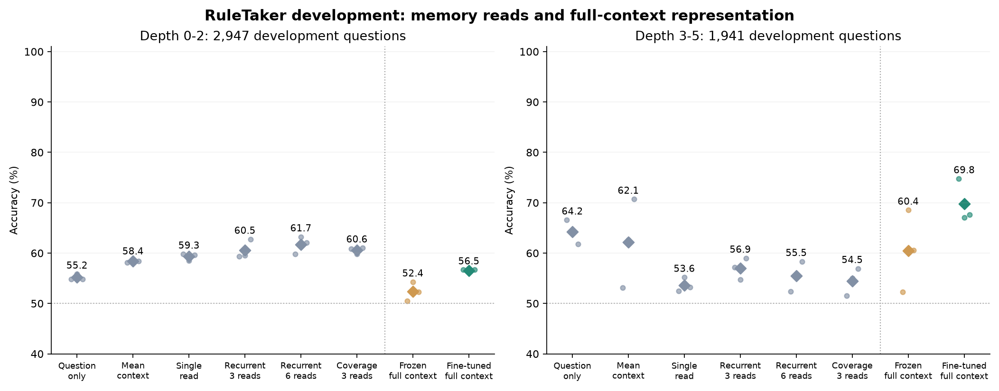

# Full-context text representation diagnostic

**Result: full-context fine-tuning raised raw shift accuracy, but did not establish reasoning.** All three frozen-head fits and all three fine-tuning fits completed. This follow-up was planned after weak early results in the [sentence-memory screen](rule-memory-study.md). It reuses development worlds, so it is adaptive research rather than independent confirmation.



| Condition | Depth 0-2 accuracy | Depth 3-5 accuracy | Shift four-group accuracy | Shift NLL |
| --- | ---: | ---: | ---: | ---: |
| Frozen full-context encoder | 52.37% | 60.45% | 49.04% | 0.6762 |
| Fine-tuned full-context encoder | 56.52% | 69.81% | 49.36% | 0.6118 |
| Word `not` control, post-hoc | 53.68% | 87.89% | 50.00% | 0.6542 |

Model rows average all three seeds. The word control has one deterministic fit using training labels only. Fine-tuning improved raw shift accuracy by 9.36 percentage points over frozen joint features, but that result is misleading as a reasoning claim. Its balanced diagnostic remains near 50%, and every learned variant lies between 47.81% and 50.07% on that breakdown. There is no convincing depth-transfer result to advance to confirmation.


The three additional fine-tuning fits took 818.78 summed training seconds on MPS, with 5,580 updates. Their shared frozen-feature preparation took 23.91 seconds, and the three CPU head warmups took 1.83 seconds with 7,020 updates. These exclude model loading, final evaluation and checkpoint serialization. The earlier memory screen had 28,080 updates. Across both screens, 24 fitted conditions completed; none is Astra-supervised.

[All fits and metrics](../evidence/rule-crossencoder-v1/summary.json) · [Timing and environment receipt](../evidence/rule-crossencoder-v1/receipt.json) · [Shortcut counts and group scores](../evidence/rule-crossencoder-v1/shortcut-audit.json) · [Parameter audit](../evidence/rule-crossencoder-v1/parameter-audit.json)

These selected development subsets and this small MiniLM training recipe do not reproduce the published RuleTaker protocol. Failure here does not establish that recurrent reasoning or transformers cannot solve the task.

Instead of separately embedding each sentence, MiniLM sees the full English context and assertion as a tokenizer pair. This preserves token interactions across rules, facts and the question. Every audited example fits without truncation: maximum 252 tokens in training, 240 in same-depth development and 268 in shifted development.

Two conditions share the pretrained encoder and initial classifier:

1. **Frozen joint encoder.** Mean-pool the complete context/assertion representation and train a binary linear head for 30 epochs, batch 256, AdamW learning rate 0.001 and weight decay 0.01.
2. **Fine-tuned joint encoder.** Start from that fitted head and pretrained encoder, then update all weights for three additional epochs, batch 32, AdamW learning rate 0.00002 and weight decay 0.01. Gradient norm is capped at one. This uses more parameters and compute; it is not a cost-matched architecture win.

Both use the same 19,809 audited training questions, three seeds (17, 29, 43), final-epoch outputs and the unchanged two development parts. Source IDs, labels, proof annotations and annotated depth are kept outside text inputs. We report every seed, accuracy, NLL, Brier and accuracy by depth and label. No development-based checkpoint selection is allowed. Only the supervised training loss reads gold labels while fitting.

This tests whether stronger context representations improve a weak local baseline. It does not establish a novel architecture, teacher distillation, calibration or transfer to arbitrary candidate sets. Astra API access is still unavailable, and no teacher requests are made. Official RuleTaker test members have not been opened; CLINC confirmation/calibration sets remain unscored.

## Shortcut diagnostic

After the memory results, an audit found that the shift subset is strongly associated with the word `not`. Among positive-form questions, 855 are true and 116 false; among negated questions, 119 are true and 851 false. Training-majority predictions in these two bins reach 87.89% shift accuracy without reading any context. This control was discovered after development evaluation, not preregistered.

The diagnostic therefore also reports **four-group macro accuracy**: average accuracy across the four combinations of gold label and question negation. It retains every question, giving the small groups equal weight to the large groups. The word-based control scores 50% under this metric. This diagnoses one shortcut; it does not prove that remaining gains reflect valid reasoning or establish independent generalization. Neither the frozen memory selector nor the current training recipe is changed after discovering the shortcut.

## Next decision

Do not optimize the raw shift score. A useful next model must improve the balanced breakdown, respond correctly when a relevant English fact changes, and preserve predictions when irrelevant facts are added. Those tests need a new frozen comparison and untouched worlds. Explicit entity/relation representations are a reasonable hypothesis, but [Neural Logic Machines](https://arxiv.org/abs/1904.11694) and [verifier-guided proof search](https://arxiv.org/abs/2205.12443) already cover important parts of this space. Implementing familiar components does not by itself supply an ICLR contribution.

```sh
.venv/bin/python scripts/rule_crossencoder_study.py freeze \
  --packet runs/ruletaker-depth-v1/packet --out runs/rule-crossencoder-v1/plan.json
.venv/bin/python scripts/rule_crossencoder_study.py run --device mps \
  --packet runs/ruletaker-depth-v1/packet --plan runs/rule-crossencoder-v1/plan.json \
  --out runs/rule-crossencoder-v1/fits
.venv/bin/python scripts/rule_crossencoder_study.py report \
  --packet runs/ruletaker-depth-v1/packet --plan runs/rule-crossencoder-v1/plan.json \
  --runs runs/rule-crossencoder-v1/fits --out runs/rule-crossencoder-v1/summary.json
```

Hash-checked local evidence includes initial plans, feature arrays, checkpoints, all logits and final metrics. Only aggregate evidence is published.

Parameter accounting: the fine-tuning model registers 22,713,986 parameters, including its 770-parameter classifier. Only 22,566,146 connect to the supervised loss because masked-mean pooling does not use BERT's 147,840-parameter pooler. The original fit metadata's `active_parameters` field counts registered weights; the separate gradient audit makes the distinction explicit without changing frozen training.
