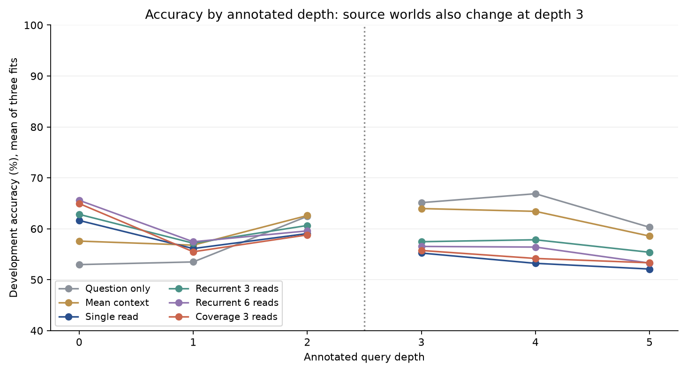

# English rule memory: frozen development experiment

**Result: recurrence failed the continuation rule.** All 18 fits completed. This tests whether repeated reads help on [RuleTaker](https://github.com/allenai/ruletaker), following the unsuccessful routing continuation tests. The [data audit](ruletaker-development.md) describes the exact English-only inputs and disjoint worlds.


| Head | Depth 0-2 accuracy | Depth 3-5 accuracy | Depth 3-5 NLL |
| --- | ---: | ---: | ---: |
| Question only | 55.16% | **64.21%** | **0.6747** |
| Mean context | 58.40% | 62.13% | 0.6759 |
| Single read | 59.30% | 53.61% | 0.7366 |
| Recurrent 3 | 60.54% | 56.95% | 0.7338 |
| Recurrent 6 | **61.68%** | 55.49% | 0.7881 |
| Coverage 3 | 60.58% | 54.49% | 0.7798 |

Values average all three fits; plotted diamonds are means and small dots are individual fits. Three reads beat the matched single-read head by 3.33 percentage points on the shift, but lost to the predeclared strongest control, question-only, by **7.26 points**. The descriptive paired world-bootstrap interval for that difference is **[-9.84, -4.75] points**. It lost all three paired seeds, worsened NLL and cost 26.63 times the question-only head's estimated matrix MACs. Comparing only to the weak single-read baseline would overstate the result.

Question-only performance shows exploitable associations in the question distribution, despite nearly balanced shift labels. It does not show that the question alone logically determines the answer. These shallow sentence-memory heads did not learn a useful rule reasoner under this training recipe. The result does not rule out recurrent reasoning with stronger representations or different training.

A subsequent surface-form audit found a stronger shortcut: predicting false for questions containing the word `not`, and true otherwise, gets **87.89%** on this shift subset. Those two predictions are also the majority labels learned separately in the corresponding training bins. Only 235 of 1,941 shift questions contradict the shortcut. This post-hoc finding was not part of the frozen selector and does not change its failure. Future reasoning comparisons must include this control and give label/negation groups equal weight.



The 28,080 optimizer updates took 205.00 seconds of summed fit time on CPU. The shared, deduplicated sentence encoding took 2.40 seconds on MPS, excluding model loading and serialization. These timing scopes are different from interactive end-to-end inference. All attention variants have 214,658 active parameters; question-only has 99,074 and mean context 165,122. Extra reads reuse weights, but add computation.

[All fits and frozen decisions](../evidence/rule-memory-v1/summary.json) · [Execution receipt](../evidence/rule-memory-v1/receipt.json) · [Full-context representation follow-up](rule-crossencoder-study.md)

## Comparison

| Head | Context access | Reads | Role |
| --- | --- | ---: | --- |
| Question only | None | 0 | Shortcut control |
| Mean context | Average sentence values | 1 | Non-attention control |
| Single read | Question-conditioned attention | 1 | Matched attention control |
| Recurrent 3 | Tied attention/update | 3 | Multi-step candidate |
| Recurrent 6 | Tied attention/update | 6 | Additional-compute candidate |
| Coverage 3 | Tied attention, accumulated-attention penalty | 3 | Corrective candidate |

Every English sentence and assertion receives a frozen, normalized MiniLM embedding. No sentence is truncated or retrieved away. Facts and rules remain separate memory slots, including duplicate sentences. Gold answers, source IDs, proof annotations and depth never enter the head. Outputs are uncalibrated probabilities over fixed `false` and `true` IDs. This experiment does not establish arbitrary-candidate transfer.

The query, key and value projections map 384 to 128 dimensions. Each attention step reads all unmasked sentences and applies a shared residual update and layer normalization. A shared classifier sees the original query, final state and their elementwise product. Coverage subtracts cumulative previous attention weights from the next attention logits, with coefficient one. It adds no parameters. Single-read and recurrent heads have identical initial tensors and parameter counts. The question-only and mean controls use fewer active parameters; the report counts that explicitly.

These are established building blocks: [end-to-end memory networks](https://arxiv.org/abs/1503.08895) already use repeated memory reads, and [coverage attention](https://arxiv.org/abs/1704.04368) already discourages repetition. This combination is a diagnostic candidate, not a claimed new architecture. The sentence encoder is a pretrained transformer.

## Frozen procedure

- Train on 19,809 questions in 2,000 worlds, annotated depth 0-2.
- Evaluate on 2,947 development questions at depth 0-2 and 1,941 at depth 3-5. The latter changes both depth and context distribution.
- Six heads, three seeds (17, 29, 43), 20 epochs each, batch size 256. AdamW learning rate 0.001, weight decay 0.0001, gradient norm cap 1. Same shuffled question order within each seed. Final epoch only; no best-seed or epoch selection.
- Train and time heads on CPU with four threads. Report accuracy, NLL, multiclass Brier, per-depth and per-label accuracy. Head latency excludes the encoder and is not end-to-end serving latency. Publish the shared feature-encoding cost separately.
- Select the strongest recurrent candidate and strongest control by mean shift accuracy. Continue only if the candidate gains at least 2 percentage points, loses at most 1 point on same-depth questions, has no worse shift NLL, wins at least two seeds, has a positive lower bound in a paired world bootstrap, and stays within three times the control's head MAC estimate.
- Bootstrap entire worlds after averaging paired training seeds, with 2,000 draws. Intervals are descriptive: they exclude seed uncertainty and selection effects. Independent confirmation is required even if the rule passes.

Official RuleTaker test members and the CLINC confirmation/calibration splits are not opened. Astra teaching has not run; these fits use the benchmark's audited gold labels.

## Reproduce

```sh
.venv/bin/python scripts/rule_memory_study.py freeze \
  --packet runs/ruletaker-depth-v1/packet --out runs/rule-memory-v1/plan.json
.venv/bin/python scripts/rule_memory_study.py prepare --device mps \
  --packet runs/ruletaker-depth-v1/packet --plan runs/rule-memory-v1/plan.json \
  --out runs/rule-memory-v1/features
.venv/bin/python scripts/rule_memory_study.py train \
  --packet runs/ruletaker-depth-v1/packet --plan runs/rule-memory-v1/plan.json \
  --features runs/rule-memory-v1/features --out runs/rule-memory-v1/fits
.venv/bin/python scripts/report_rule_memory.py \
  --packet runs/ruletaker-depth-v1/packet --plan runs/rule-memory-v1/plan.json \
  --features runs/rule-memory-v1/features --runs runs/rule-memory-v1/fits \
  --out runs/rule-memory-v1/summary-002.json
```

The runner checks source, plan, packet, feature and checkpoint hashes. Existing outputs cannot be overwritten. Raw text, local checkpoints and per-question predictions stay under ignored `runs/`; public evidence contains aggregates and hashes.

The original reporter replayed all metrics successfully but could not serialize a NumPy seed-win counter. Its partial output is retained locally. The small reporting adapter converts NumPy scalar types to JSON primitives while calling the unchanged frozen reporter. No fit, score, continuation criterion or frozen training source was changed.
