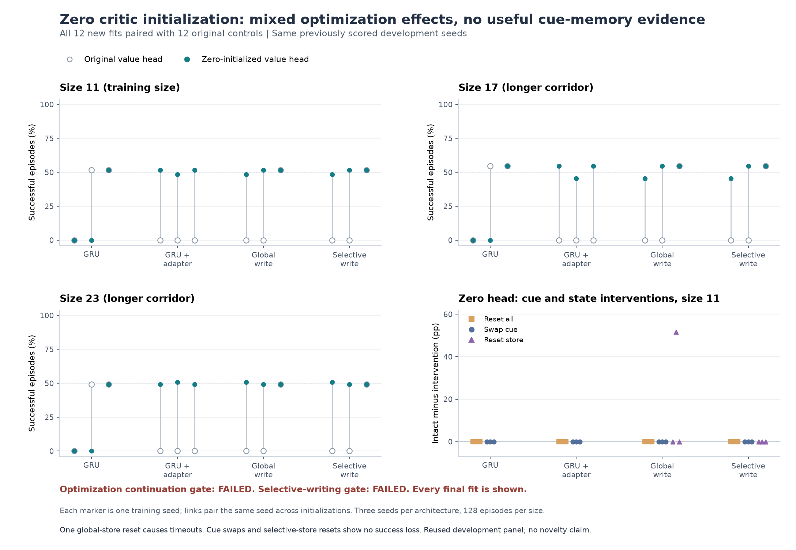

# Does zero critic initialization improve PPO learning?

**Completed. Both continuation gates failed.** Zeroing the initial value head improved three architectures but reduced GRU success. The improved policies reached a branch on every assigned episode and succeeded about half the time. The interventions do not establish useful cue memory or a selective-writing advantage.

Protocol and sources were frozen in `5a3a08d` before the full run. All twelve additional fits and all 55 evaluation records are retained. This is an optimization comparison of existing architectures on reused development seeds, not a new RL algorithm or independent confirmation.



## Results

Mean success on size 11, over three training seeds and the same 128 evaluation seeds per fit:

| Architecture | Original head | Zero head | Change |
| --- | ---: | ---: | ---: |
| GRU | 34.38% | 17.19% | -17.19 pp |
| GRU + feedforward adapter | 0.00% | 50.52% | +50.52 pp |
| Global-write memory | 17.19% | 50.52% | +33.33 pp |
| Selective-write memory | 17.19% | 50.52% | +33.33 pp |

The three improving arms each had **zero timeouts** after zero initialization. Their remaining failures were wrong-branch choices. GRU seeds 101 and 113 timed out on every evaluation episode; seed 127 reached a branch on every episode. The GRU mean therefore combines two failed fits with one approximately 50% fit.

| Zero-head architecture | Size 11 | Size 17 | Size 23 |
| --- | ---: | ---: | ---: |
| GRU | 17.19% | 18.23% | 16.41% |
| GRU + feedforward adapter | 50.52% | 51.56% | 49.74% |
| Global-write memory | 50.52% | 51.56% | 49.74% |
| Selective-write memory | 50.52% | 51.56% | 49.74% |

These are paired development results on a small structured task. The 384 assigned episodes per architecture and size are not 384 independent training runs. The uniform-random reference achieved 0.78%, 0% and 0% across the three sizes; it often failed to navigate to either branch. Beating that reference does not by itself demonstrate memory.

The **optimization gate failed**: three arms exceeded the required ten-point improvement, but GRU's 17.19-point decline violated the maximum five-point degradation. The **selective-writing gate also failed**, with nine of twelve checks failing. Selective writes matched global writes and the feedforward adapter, stayed below the 80% target and showed no store-reset success loss.

## What the interventions show

- Swapping the initial cue while leaving reward goals fixed left all **4,608 saved paired episode records unchanged** across the twelve zero-head fits and three sizes.
- Resetting all recurrent state at each observation also left all **4,608 saved paired episode records unchanged**.
- Resetting only the selective store left all **1,152 saved paired episode records unchanged**.
- Global-write seed 113 fell from 51.56% success to 0% on size 11 after a store-only reset, with every episode timing out. The other two global-write seeds retained their outcomes. Because cue swaps and full-state resets did not change the saved records, this isolated disruption is not evidence of useful stored cue information.

Episode identity here means the recorded seed, outcome, return, length and action counts match. The files do not contain complete per-step action sequences. No fresh policy replay was performed for publication.

The additional training consumed **12,582,912 interactions**, **49,152 optimizer steps** and **1,772.40 recorded training seconds**. The original controls consumed the same interaction budget and 1,731.49 seconds. Their runs were not interleaved, so the timing difference is not an initialization-speed result. Fit timers include environment setup, collection, optimization, logging and checkpoint saves; they exclude model/optimizer initialization and evaluation.

## Evidence

- [Compact audited summary](../evidence/zero-critic-ppo-v1/results/summary.json), [all aggregate conditions](../evidence/zero-critic-ppo-v1/results/aggregate-results.csv), and [all 162 paired fit/condition/size comparisons](../evidence/zero-critic-ppo-v1/results/paired-fit-results.csv).
- [Original comparison report](../evidence/zero-critic-ppo-v1/results/comparison.json), [saved-episode identity audit](../evidence/zero-critic-ppo-v1/results/episode-identity-audit.csv), [publication receipt](../evidence/zero-critic-ppo-v1/results/publication.json), and [visual/integrity QA](../evidence/zero-critic-ppo-v1/results/quality-assurance.json). Six in-memory corruption checks were rejected, including changed budgets, outcomes and gate results.
- [Lossless raw-evidence archive](../evidence/zero-critic-ppo-v1/results/raw-evidence.tar.gz), 10.8 MB, contains all new run/report artifacts, the twelve new and twelve reused control checkpoints and logs, every evaluation record, the prerequisite probe evidence, and the frozen study sources. All 251 archived files were checked byte-for-byte against their [SHA256 manifest](../evidence/zero-critic-ppo-v1/results/raw-evidence-manifest.json).
- [Frozen plan](../evidence/zero-critic-ppo-v1/plan.json) and [separate publisher/auditor](../scripts/publish_zero_critic_ppo.py). Publication did not change the frozen study or execute new training/inference.

The completed [original PPO study](associative-ppo-study.md) and [initialization probe](ppo-initialization-probe.md) motivated this follow-up. The probe found nonzero actor and critic gradients on unrewarded first rollouts; zeroing the value head removed both. The completed comparison shows that initialization affected learning outcomes, but it did not consistently improve every architecture or establish useful memory.

## One training change

The same four architectures and seeds were trained with fresh value-head weight and bias set to zero immediately after normal initialization. The head remained trainable. The wrapper imported the original trainer unchanged and checked that all other parameters, policy logits, recurrent states and random-number state remained identical before optimization. No pretrained checkpoint was used.

| Setting | Frozen value |
| --- | --- |
| Architectures | GRU, feedforward adapter, global writes, selective writes |
| Seeds | 101, 113, 127 for every architecture |
| Environment | Cue-visible MiniGrid Memory, native seven actions and sparse rewards |
| Train / evaluation sizes | 11 / 11, 17, 23 |
| Episode cap / partial view | 128 steps / 7 by 7 |
| Environments / rollout / updates | 16 / 64 / 1,024 |
| Interactions per fit / additional total | 1,048,576 / **12,582,912** |
| PPO epochs / environment minibatch | 2 / 8 |
| Optimizer steps per fit | 4,096 |
| Adam learning rate / epsilon | 0.0003 / 0.00001 |
| Discount / GAE lambda | 0.99 / 0.95 |
| PPO clip / value coefficient / entropy coefficient | 0.2 / 0.5 / 0.01 |
| Gradient norm cap | 0.5 |
| Model selection | Final checkpoint only; every declared fit |

Training data generation, action-sampling RNG reset, optimizer, entropy term, normalization and model code remain unchanged. No shortened panel fits, selective resumes, extra architecture or additional algorithm is part of this comparison.

## Controls and evaluation

Reuse all twelve completed original-head fits. Preparation requires the original execution and report to be complete, and hashes their checkpoints, logs, evaluations and receipts together with the completed initialization probe. Changed inputs or sources invalidate the prepared plan. The controls ran earlier, so the conditions are not contemporaneously interleaved; report runtime separately rather than interpreting timing differences as an initialization benefit.

Evaluate on the **same 128 previously scored paired development seeds per size**. Preserve intact, all-state-reset, cue-swapped and native-start evaluations, plus store-only resets for store architectures. Pair architecture, training seed, condition, size and episode seed. Keep timeouts in the denominator. Native-start transfer remains descriptive because changing the starting pose also changes navigation distance.

The uniform-random reference repeats the same seeded policy and episodes. Its episode contents must match the original reference exactly; timing fields may differ. It is not independent new evidence. Each panel has 55 evaluation records covering 21,120 assigned episodes across all conditions, including that repeated reference.

Reuse existing learning logs for entropy, cumulative completed episodes and rolling success. Discovery summaries must retain rolling-window coverage and censoring limits. These logs do not provide raw advantages, gradient-component histories or exact cumulative reward-event counts.

## Keep the two gates separate

The frozen **optimization continuation gate** requires at least a ten-percentage-point mean same-size success improvement over the corresponding original-head control for at least three of four architectures, with no architecture degrading by more than five percentage points. Publish all paired seeds and shifts, including failures.

Report the **existing selective-writing gate** separately for both initialization conditions, unchanged: selective writes must reach at least 80% mean same-size success and 70% in every fit, exceed each of GRU, adapter and global writes by five percentage points at every size, and lose at least twenty percentage points after same-size store-only resets. An optimization gain does not establish selective-writing superiority or use of memory.

This reused development panel cannot provide independent confirmation. Zeroing the head changes both bootstrap-derived actor advantages and critic gradients into shared features; any training benefit cannot be attributed solely to advantage normalization. A broader architectural claim would also require stronger controls, including the cached-initial-state model that solved the earlier forced-route diagnostic. That control is outside this single-factor experiment.

## Preparation and reproduction

The commands below document the completed procedure. Preparation bound the completed original controls and probe before zero-head training started. For an independent reproduction, use fresh output paths; existing artifacts are never overwritten.

```sh
.venv/bin/python scripts/zero_critic_ppo_study.py prepare \
  --control-plan evidence/associative-ppo-v1/plan.json \
  --control-run runs/associative-ppo-v1/execution \
  --control-report runs/associative-ppo-v1/report \
  --probe-plan evidence/ppo-initialization-probe-v1/plan.json \
  --probe-run runs/ppo-initialization-probe-v1/execution \
  --out evidence/zero-critic-ppo-v1/plan.json
.venv/bin/python scripts/zero_critic_ppo_study.py run \
  --plan evidence/zero-critic-ppo-v1/plan.json \
  --out runs/zero-critic-ppo-v1/execution
.venv/bin/python scripts/zero_critic_ppo_study.py report \
  --plan evidence/zero-critic-ppo-v1/plan.json \
  --run runs/zero-critic-ppo-v1/execution \
  --out runs/zero-critic-ppo-v1/report
```

The report preserves the inherited per-fit and intervention results under `core/`, and writes paired initialization comparisons and separate gate outcomes to `comparison.json`. Its completion receipt confirms repeated random-episode identity. The wrapper's 25 focused tests cover initialization parity, exception cleanup, preparation requirements, pairing and gate failures. The archive preserves the bound control artifacts required for verification.

To audit completed records and reproduce the compact publication without model inference:

```sh
.venv/bin/python scripts/publish_zero_critic_ppo.py \
  --plan evidence/zero-critic-ppo-v1/plan.json \
  --execution runs/zero-critic-ppo-v1/execution \
  --report runs/zero-critic-ppo-v1/report \
  --out evidence/zero-critic-ppo-v1/results
```

The publisher requires a fresh destination. It rechecks the frozen signatures, both twelve-fit budgets, all 55 records and 21,120 episodes in each panel, native rewards, checkpoint hashes, initialization invariants, paired comparisons and both continuation gates before writing.
