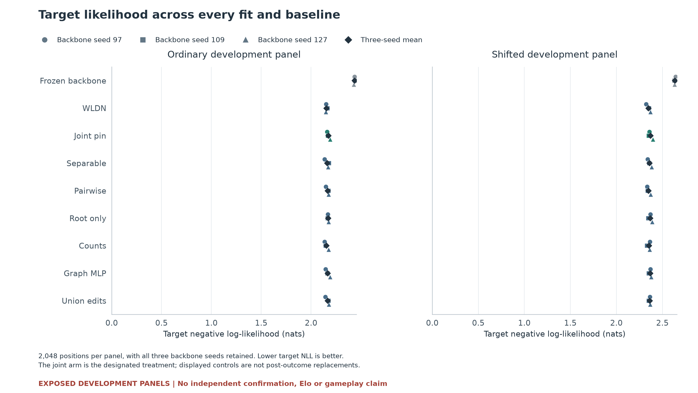
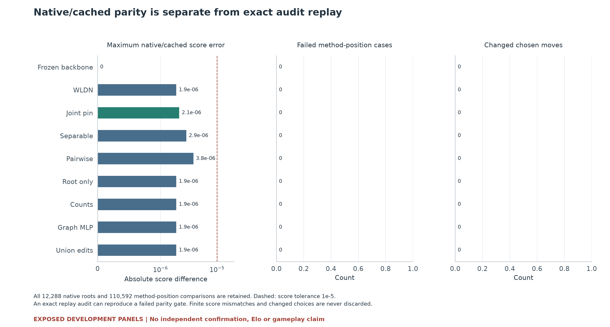
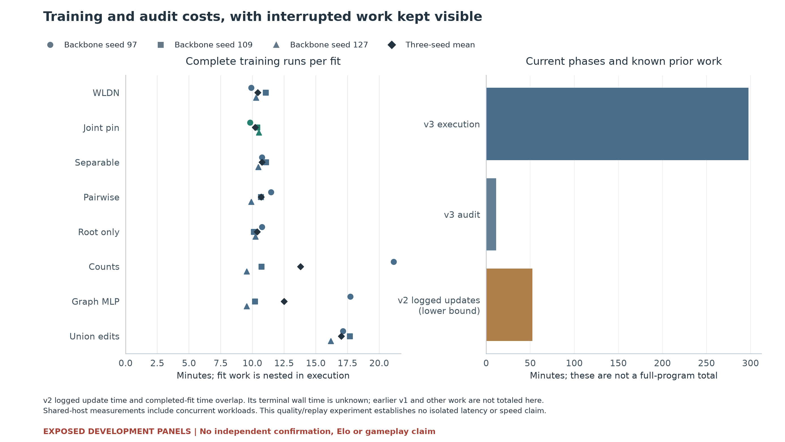

# Chess pin-quality v3

**Previously exposed development panels, not independent confirmation.**

All 24 trained fits and three frozen-backbone baselines are retained. No Elo or gameplay claim follows from these metrics.

| Method | Ordinary agreement | Shift agreement | Ordinary target NLL | Shift target NLL |
|---|---:|---:|---:|---:|
| Frozen backbone | 31.755% | 26.807% | 2.434607 | 2.634750 |
| WLDN | 37.158% | 31.917% | 2.153503 | 2.348466 |
| Joint pin | 36.426% | 31.396% | 2.172513 | 2.368147 |
| Separable | 37.012% | 31.510% | 2.161526 | 2.358588 |
| Pairwise | 36.572% | 31.445% | 2.165616 | 2.348599 |
| Root only | 36.751% | 31.462% | 2.169414 | 2.366796 |
| Counts | 36.637% | 31.608% | 2.152418 | 2.352115 |
| Graph MLP | 36.572% | 31.657% | 2.166158 | 2.366070 |
| Union edits | 36.686% | 31.657% | 2.165127 | 2.360217 |

Three-seed means are descriptive. Every individual seed remains in the figures and figure-data.json.

Quality gate: **FAIL** (2/16 checks). Native/cached numerical gate: **PASS**. Continuation: **FAIL**.

| Panel | Joint minus comparator | Mean gain (pp) | Minimum paired seed (pp) | Required mean (pp) | Check |
|---|---|---:|---:|---:|---|
| dev | Frozen backbone | +4.671 | +4.102 | 0.0 | PASS |
| dev | WLDN | -0.732 | -1.562 | 1.0 | FAIL |
| dev | Separable | -0.586 | -1.123 | 1.0 | FAIL |
| dev | Pairwise | -0.146 | -0.391 | 1.0 | FAIL |
| dev | Root only | -0.326 | -0.537 | 1.0 | FAIL |
| dev | Counts | -0.212 | -0.879 | 1.0 | FAIL |
| dev | Graph MLP | -0.146 | -0.586 | 1.0 | FAIL |
| dev | Union edits | -0.260 | -0.635 | 1.0 | FAIL |
| shift | Frozen backbone | +4.590 | +3.662 | 0.0 | PASS |
| shift | WLDN | -0.521 | -2.100 | 1.0 | FAIL |
| shift | Separable | -0.114 | -0.391 | 1.0 | FAIL |
| shift | Pairwise | -0.049 | -0.928 | 1.0 | FAIL |
| shift | Root only | -0.065 | -0.439 | 1.0 | FAIL |
| shift | Counts | -0.212 | -0.732 | 1.0 | FAIL |
| shift | Graph MLP | -0.260 | -0.928 | 1.0 | FAIL |
| shift | Union edits | -0.260 | -1.270 | 1.0 | FAIL |

Every comparison also requires a paired-seed floor of -0.5 percentage points. The designated joint arm is unchanged.

| Method | Maximum native/cached score error | Failed method-position cases | Changed chosen moves |
|---|---:|---:|---:|
| Frozen backbone | 0 | 0 | 0 |
| WLDN | 1.9073486e-06 | 0 | 0 |
| Joint pin | 2.1457672e-06 | 0 | 0 |
| Separable | 2.8610229e-06 | 0 | 0 |
| Pairwise | 3.8146973e-06 | 0 | 0 |
| Root only | 1.9073486e-06 | 0 | 0 |
| Counts | 1.9073486e-06 | 0 | 0 |
| Graph MLP | 1.9073486e-06 | 0 | 0 |
| Union edits | 1.9073486e-06 | 0 | 0 |

Cost ledger (seconds):

- execution wall seconds: 17849.138287750073
- audit wall seconds: 674.4591824999079
- fit wall seconds nested: 17232.347960625775
- v2 logged update seconds lower bound: 3147.9806702234782
- v2 completed fit seconds overlapping: 3016.4137634991203
- v2 termination cause known: False
- v1 and other historical costs: Not quantified by these inputs; do not present v3 as total project cost.

Interpretation limits:

- Previously exposed development panels, not independent confirmation. No Elo or gameplay conclusion.
- The designated joint arm must beat every prespecified comparator. A stronger control cannot replace it after outcomes.
- Native/cached failures are retained even when audit replay exactly reproduces all saved results.
- Intervals are the authenticated, conditional source-game bootstrap results. No new bootstrap or seed-population inference is performed.
- The chess audit reran existing neural kernels on saved inputs; this renderer performs zero model or engine calls.
- Per-fit work is nested in execution wall time. Prior logged updates and completed-fit times overlap and must not be added.
- Shared-host wall measurements are not isolated latency or throughput estimates; this quality study establishes no speed claim.

Existing conditional set-encoder and graph-difference ingredients; no architecture novelty follows from a named motif. Pairwise restriction applies only inside the anchored factor MLP, not to all policy interactions. Stored parameter counts do not equalize active capacity, FLOPs or optimization. No gameplay, new engine/model calls, independent confirmation or speed claim.

Prior knowledge: All previous development results, including the failed union quality criterion and its full audit, are known. No joint pin quality fit or outcome has been inspected. Adaptive development, not independent confirmation. The v1 attempt was stopped after 770 logged WLDN-97 updates because its string-only game-ID validator rejects integer corpus IDs. No fit completed or quality prediction was produced. No partial weights are reused; all24 fits restart fresh. The discarded attempt cost remains retained separately. V2 disappeared after 8239 logged updates and 5 completed fits, before evaluation. All partial artifacts and costs are retained. V3 repeats the complete fixed study from fresh initializations with the same recipes, order, data and criteria; no prior checkpoint is reused or selected. The detached launcher records terminal process status in regular files.

Audit scope: Authenticate full source/input and execution manifests; check every initial/final checkpoint, all training-index receipts and phase ordering. Recompute every cached score/NLL exactly and every native vector/comparison exactly with the same production kernels. Recompute metrics, all gates and all intervals. Existing independent input/packing audits are authenticated; this audit is not independent neural code or full retraining.

[All plotted values, fit records, gates and audited intervals](figure-data.json).

Audit receipt SHA-256: `c86562f02e450ad67ed6af6225cf3ba0b13a958c2ae63a8746441dcbf9e9c52e`.
