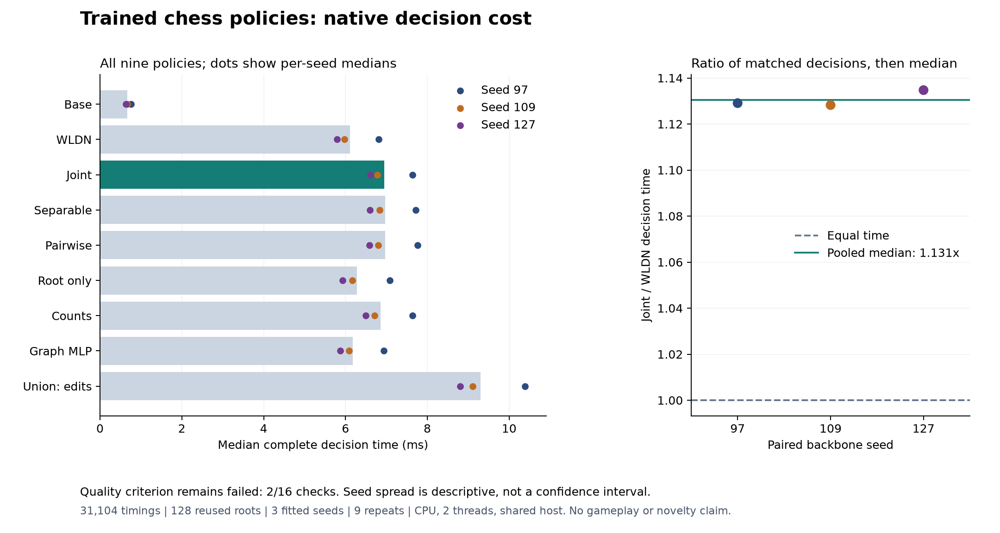

# Trained pin-policy decision cost

Descriptive timing on the reused ordinary panel.

The quality criterion remains failed (2/16 checks). Timing does not repair this criterion.

| Method | Median ms | Seed 97 | Seed 109 | Seed 127 | Paired ratio to WLDN |
|---|---:|---:|---:|---:|---:|
| Base | 0.6729 | 0.7530 | 0.6644 | 0.6293 | 0.1149 |
| WLDN | 6.1051 | 6.8073 | 5.9707 | 5.7984 | 1.0000 |
| Joint | 6.9481 | 7.6424 | 6.7740 | 6.6074 | 1.1305 |
| Separable | 6.9673 | 7.7202 | 6.8335 | 6.6018 | 1.1354 |
| Pairwise | 6.9680 | 7.7647 | 6.7979 | 6.5895 | 1.1337 |
| Root only | 6.2817 | 7.0849 | 6.1638 | 5.9286 | 1.0331 |
| Counts | 6.8535 | 7.6332 | 6.7129 | 6.4991 | 1.1229 |
| Graph MLP | 6.1775 | 6.9417 | 6.0838 | 5.8678 | 1.0157 |
| Union: edits | 9.2982 | 10.3853 | 9.1131 | 8.8023 | 1.5160 |

Ratios are medians of matched seed/root/repeat timing ratios, not ratios of aggregate medians.
Per-seed spread is descriptive and is not a confidence interval.

Complete FEN parse, legal candidates and board encoding, single-position backbone, required action features, native root/child graphs, required pin inputs, head, argmax and score-list serialization. Model loading, comparison and file I/O excluded. No persistent input cache between decisions.

Coverage: all 9 methods, 3 seeds, 128 roots, 9 repeats; 31,104 timings, 54 warmups and 3,456 audited native decisions.

Cost-path numerical criterion: passed. Quality numerical criterion: passed. Quality continuation: failed.

No Elo, gameplay strength or architecture novelty is established. These are scalar shared-host timings, not throughput or a hardware-general speed result.

Saved-byte authentication and arithmetic, not fresh inference or independent neural replay.

