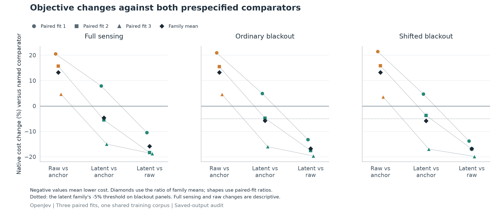
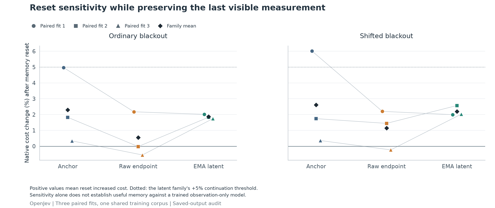
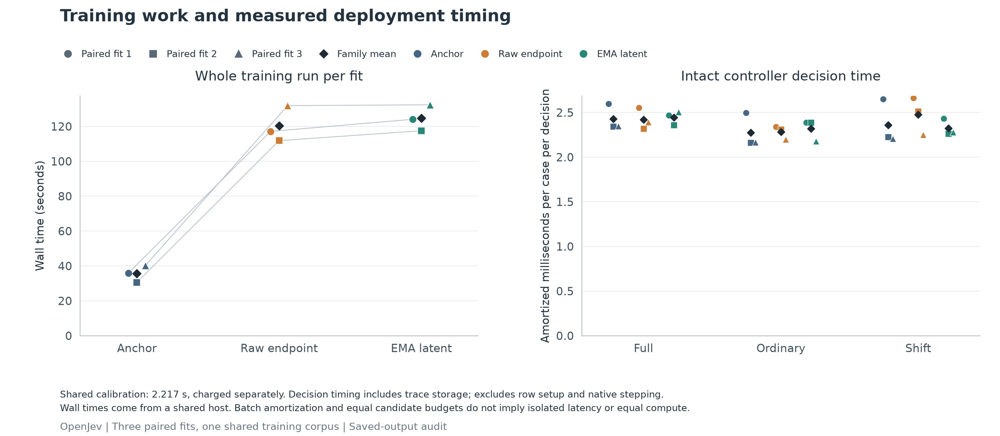

# Reacher objective ablation

Results below come from the authenticated completed saved-output audit.

All nine fits are retained. Every learned controller uses the same CEM256 configuration.

| Panel | Anchor | Raw endpoint | EMA latent | Physics reference | Zero action | Particle | Uniform |
|---|---:|---:|---:|---:|---:|---:|---:|
| Full sensing | 8.275979 | 9.372051 | 7.889425 | 7.311570 | 11.732924 | 7.393139 | 42.873641 |
| Ordinary blackout | 8.312297 | 9.414364 | 7.833946 | 7.311570 | 11.732924 | 7.433135 | 42.873641 |
| Shifted blackout | 8.374402 | 9.480126 | 7.885876 | 7.311570 | 11.732924 | 7.558764 | 42.873641 |

Native cost is negative total native reward across 50 steps; lower is better.

| Panel and contrast | Family mean change | Paired fit 1 | Paired fit 2 | Paired fit 3 |
|---|---:|---:|---:|---:|
| Full sensing: Raw vs anchor | +13.244% | +20.496% | +15.719% | +4.643% |
| Full sensing: Latent vs anchor | -4.671% | +7.885% | -5.514% | -15.008% |
| Full sensing: Latent vs raw | -15.820% | -10.466% | -18.349% | -18.780% |
| Ordinary blackout: Raw vs anchor | +13.258% | +20.950% | +15.463% | +4.538% |
| Ordinary blackout: Latent vs anchor | -5.755% | +4.920% | -4.786% | -16.017% |
| Ordinary blackout: Latent vs raw | -16.787% | -13.253% | -17.537% | -19.663% |
| Shifted blackout: Raw vs anchor | +13.204% | +21.472% | +15.844% | +3.612% |
| Shifted blackout: Latent vs anchor | -5.834% | +4.694% | -3.716% | -16.971% |
| Shifted blackout: Latent vs raw | -16.817% | -13.812% | -16.885% | -19.865% |

Negative changes favor the first objective. The latent continuation rule requires improvement against both anchor and raw on ordinary and shifted blackouts; raw gains alone do not establish a latent-objective gain.

Recorded continuation checks: 27/31. Frozen gate: FAIL.

| Audited paired difference | Mean native cost change | Conditional 95% interval |
|---|---:|---|
| ordinary: latent minus anchor | -0.478350 | [-0.726064, -0.230703] |
| ordinary: latent minus raw | -1.580417 | [-1.941450, -1.207022] |
| ordinary: latent reset minus intact | 0.146136 | [0.070090, 0.224782] |
| shift: latent minus anchor | -0.488526 | [-0.762886, -0.208648] |
| shift: latent minus raw | -1.594249 | [-1.973844, -1.207090] |
| shift: latent reset minus intact | 0.172547 | [0.094437, 0.249899] |

Intervals condition on these three paired fits and the shared corpus; they do not estimate uncertainty over retraining.

All plotted values, episode costs, costs and provenance are in [figure-data.json](figure-data.json).

- Shapes identify paired initializations, not independent environment replications.
- Black diamonds are ratios of family means for percentage plots; no error bars are fabricated.
- Audited confidence intervals are conditional on the three saved fits and shared training corpus.
- Reset differences measure intervention sensitivity, not useful memory versus a trained observation-only model.
- Deployment timing is amortized across the recorded batch and includes stored-input loading, assimilation, CEM, selected advance and trace saving. It excludes row setup and native stepping.
- Wall times were measured on a shared host and can include concurrent workloads; they are not isolated latency measurements.
- Whole-fit wall includes setup, learning and serialization. Shared calibration is shown separately and is not allocated to individual arms.
- Equal CEM candidate budget does not establish equal FLOPs, training work or latency.

Audit limitations:

- Saved gradient vectors establish norm and multiplier arithmetic, not their neural forward/backward origin.
- First/last EMA witnesses are checked numerically. Every other optimizer/EMA transition is source-bound logged evidence, not independently rerun training.
- Checkpoint tensor/counter restoration is authenticated by receipts and synthetic roundtrip tests; the saved-output audit does not instantiate the learned model.
- All nine fits are retained. Bootstrap intervals condition on three paired initializations and one shared corpus.
- Reset penalties establish intervention sensitivity; they do not alone prove useful memory versus a trained current-observation comparator.
- Auxiliary capacity/update matching is not FLOP, gradient-path or wall-time matching. Teacher, decoder and collapse diagnostics are paid training work.
- Native replay validates stored actions/outcomes; CEM proposals reconstruct from recorded scores without independently rerunning neural scoring.
- This is one development environment. Neither lower auxiliary loss nor this gate establishes JEPA reproduction, biological superiority or architecture novelty.

Audit receipt SHA-256: `ee5f68ba9c194d39695c16d257bb05e3f294488a14c025e50a9e881ce4280dc8`.
