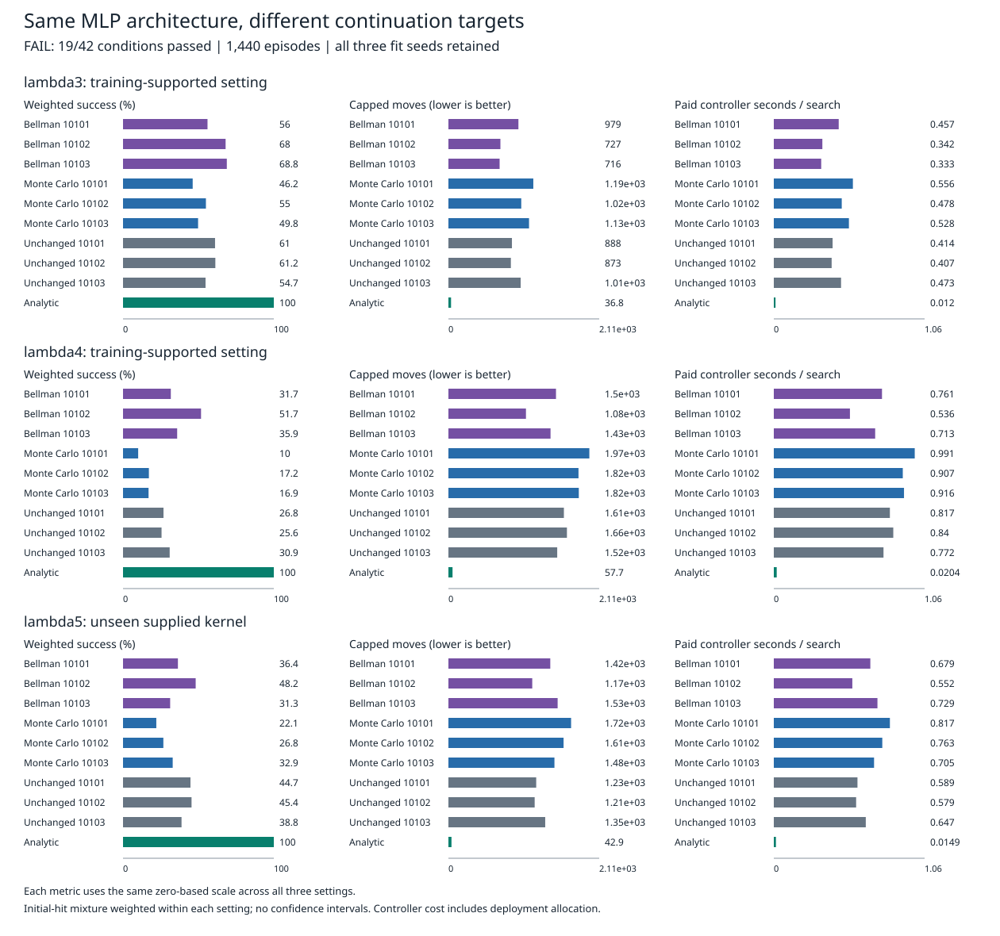

# Bellman versus Monte Carlo continuation

**FAIL: 19/42 frozen conditions passed.** Competence: 0/18; paired improvement: 19/24.

This compares training targets in the same MLP architecture. It does not establish an architecture, connectome or recurrent-model advantage. The original scalar study remains a 0/54 failure.

Six continuations restore three fixed MLP checkpoints: Monte Carlo returns versus delayed Bellman backups. Three unchanged checkpoints and an analytic controller complete the ten arms. All use the public full posterior. Each arm has 48 paired searches per setting, capped at 2,188 moves. Lambda 3 and 4 are training-supported; lambda 5 supplies an unseen kernel. These are fresh local evaluation cases.

Each table uses the setting-specific initial-hit mixture, not pooled episode means. A failed search contributes 2,188 moves. Controller seconds include feature/branch construction, readout, selection, public updates, initialization and allocated deployment setup; recorded artifact I/O is excluded. All fit seeds are shown.

## lambda3

| Arm | Success | Moves | Controller s | H=1 s | H=100 s | H=10,000 s |
|---|---:|---:|---:|---:|---:|---:|
| backup@10101 | 56.03% | 978.972 | 0.456603 | 24.012644 | 0.692151 | 0.458946 |
| backup@10102 | 68.03% | 727.063 | 0.341530 | 24.215245 | 0.580255 | 0.343905 |
| backup@10103 | 68.84% | 715.956 | 0.333442 | 24.494031 | 0.575036 | 0.335846 |
| mc@10101 | 46.20% | 1187.152 | 0.556330 | 4.314263 | 0.593895 | 0.556691 |
| mc@10102 | 54.98% | 1018.625 | 0.477904 | 4.318345 | 0.516297 | 0.478277 |
| mc@10103 | 49.78% | 1127.260 | 0.528363 | 4.422517 | 0.567293 | 0.528741 |
| reference@10101 | 61.03% | 888.254 | 0.413652 | 0.415542 | 0.413658 | 0.413639 |
| reference@10102 | 61.23% | 873.214 | 0.406841 | 0.408730 | 0.406847 | 0.406828 |
| reference@10103 | 54.73% | 1010.332 | 0.473041 | 0.474868 | 0.473047 | 0.473029 |
| analytic_inbounds | 100.00% | 36.755 | 0.011971 | 0.011971 | 0.011971 | 0.011971 |

Equal-seed family means (success / moves / controller s): Bellman 64.30% / 807.330 / 0.377192; Monte Carlo 50.32% / 1111.012 / 0.520866; Unchanged 58.99% / 923.933 / 0.431178.

## lambda4

| Arm | Success | Moves | Controller s | H=1 s | H=100 s | H=10,000 s |
|---|---:|---:|---:|---:|---:|---:|
| backup@10101 | 31.70% | 1504.305 | 0.761081 | 24.317122 | 0.996629 | 0.763424 |
| backup@10102 | 51.74% | 1084.420 | 0.535562 | 24.409277 | 0.774287 | 0.537937 |
| backup@10103 | 35.91% | 1428.016 | 0.713097 | 24.873686 | 0.954691 | 0.715501 |
| mc@10101 | 10.05% | 1970.707 | 0.991454 | 4.749387 | 1.029019 | 0.991815 |
| mc@10102 | 17.16% | 1818.984 | 0.907402 | 4.747843 | 0.945795 | 0.907775 |
| mc@10103 | 16.94% | 1823.246 | 0.915934 | 4.810088 | 0.954864 | 0.916311 |
| reference@10101 | 26.85% | 1614.853 | 0.816556 | 0.818446 | 0.816562 | 0.816543 |
| reference@10102 | 25.55% | 1657.290 | 0.840476 | 0.842365 | 0.840482 | 0.840463 |
| reference@10103 | 30.94% | 1521.408 | 0.771695 | 0.773521 | 0.771700 | 0.771682 |
| analytic_inbounds | 100.00% | 57.666 | 0.020428 | 0.020428 | 0.020428 | 0.020428 |

Equal-seed family means (success / moves / controller s): Bellman 39.78% / 1338.913 / 0.669913; Monte Carlo 14.72% / 1870.979 / 0.938264; Unchanged 27.78% / 1597.850 / 0.809576.

## lambda5

| Arm | Success | Moves | Controller s | H=1 s | H=100 s | H=10,000 s |
|---|---:|---:|---:|---:|---:|---:|
| backup@10101 | 36.40% | 1424.449 | 0.679026 | 24.235067 | 0.914574 | 0.681369 |
| backup@10102 | 48.18% | 1172.284 | 0.552401 | 24.426116 | 0.791127 | 0.554777 |
| backup@10103 | 31.26% | 1527.315 | 0.729125 | 24.889714 | 0.970719 | 0.731529 |
| mc@10101 | 22.08% | 1715.438 | 0.816660 | 4.574593 | 0.854225 | 0.817021 |
| mc@10102 | 26.75% | 1610.417 | 0.763170 | 4.603611 | 0.801563 | 0.763542 |
| mc@10103 | 32.94% | 1482.616 | 0.705227 | 4.599381 | 0.744156 | 0.705604 |
| reference@10101 | 44.72% | 1227.590 | 0.588549 | 0.590439 | 0.588555 | 0.588536 |
| reference@10102 | 45.44% | 1206.120 | 0.579118 | 0.581007 | 0.579124 | 0.579105 |
| reference@10103 | 38.80% | 1353.574 | 0.647053 | 0.648879 | 0.647059 | 0.647040 |
| analytic_inbounds | 100.00% | 42.871 | 0.014931 | 0.014931 | 0.014931 | 0.014931 |

Equal-seed family means (success / moves / controller s): Bellman 38.62% / 1374.683 / 0.653518; Monte Carlo 27.26% / 1602.824 / 0.761686; Unchanged 42.99% / 1262.428 / 0.604907.

## Cost and interpretation

Preparation: 0.713 s. Full worker duration: 3331.920 s.

| Continuation | Paid fit seconds |
|---|---:|
| backup@10101 | 23.435 |
| backup@10102 | 23.753 |
| backup@10103 | 24.040 |
| mc@10101 | 3.637 |
| mc@10102 | 3.720 |
| mc@10103 | 3.774 |

The two arms receive equal optimizer updates, not equal total compute. Backup target construction is paid in fit time. Separate parity, scalar diagnostics and independent target auditing are excluded from fit time. H columns are accounting scenarios U + (L + P/6 + D)/H, not additional searches: U excludes deployment setup, L is continuation time, P is preparation, and D is head loading plus shared module setup. Unchanged references have L=P=0; original training is a common prior investment. Analytic initialization is paid anew per search. These single-run timings are hardware-specific.

Monte Carlo returns estimate the analytic teacher policy, not optimal costs. Bellman targets are generated by each arm's own delayed checkpoint on the same teacher-visited TRAIN states, with no exploratory collection. The comparison therefore retains target noise, coverage limits and undiscounted bootstrapping risk. A gate pass would remain a pilot result, not a novelty claim.

Independent audit: 64,603,745 comparisons. Saved targets, choices and aggregates were checked; optimizer trajectories, actual Torch execution, RNG and timing truth remain source-bound evidence.

[Protocol](otto-bellman-control-protocol.md) | [Worker summary](../output/otto-bellman-control-v1/run-01/summary.json) | [Independent audit](../output/otto-bellman-control-v1/audit-01/summary.json) | [Worker receipt](../output/otto-bellman-control-v1/run-01/receipt.json) | [Audit receipt](../output/otto-bellman-control-v1/audit-01/receipt.json)
