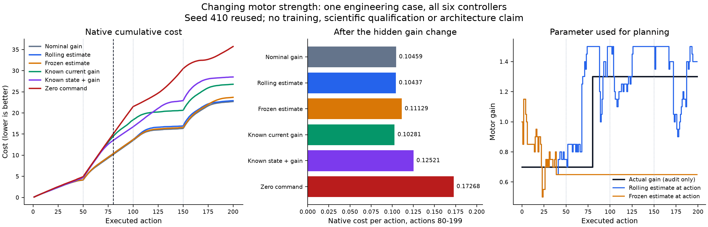

# Tracking changing dynamics: engineering preview

**Update:** the [six-controller engineering run](../../research/reacher-tracking-engineering.md)
is complete with full replay. Post-change adaptation improved cost by only 0.21%
versus nominal physics on the single reused case. The fresh-case screen remains
unlaunched pending planner and observer diagnosis. The earlier pulse diagnostic
and prospective design below retain their original scope.

The [stronger trained-history comparison](../../research/reacher-two-observation-control.md)
is complete and failed its continuation rule (24/25). The separate
[normalized-error gate pilot](../../research/reacher-innovation-pilot.md)
also failed (21/29). These results remain closed.

This preview supports a new question: **does a persistent change in motor
strength create a useful adaptation problem?** The earlier
[clean Pendulum qualification](../../research/robotics-pendulum-qualification.md)
showed why both parts matter: gain was identifiable, but knowing it added little
control value. No neural comparison is justified by identification alone.

## Implemented

- [Tracking wrapper](../../src/openjev/research/reacher_tracking_dynamics.py):
  explicit horizon, public target events, hidden shared motor-gear changes,
  sensing and actuator-noise schedules. Rewards use the target already visible
  before the action; the next target arrives with the next packet. Audit records
  separate these states and retain partial failures. This is a custom task,
  not an unchanged Reacher-v5 benchmark.
- [Classical estimator](../../src/openjev/research/reacher_tracking_identification.py):
  public angles give a three-point endpoint-velocity approximation; supplied
  nominal physics evaluates a declared grid of gains against recent observed
  transitions. An exactly flat bank retains the prior estimate. Neither the
  actual gain, simulator velocity nor future goals enter the estimator.

- [Controller and planner bank](../../src/openjev/research/reacher_tracking_policy.py):
  six explicit information roles, current-gain privileges and isolated planning models.
- [Rollout](../../src/openjev/research/reacher_tracking_rollout.py) and
  [independent audit](../../src/openjev/research/reacher_tracking_audit.py):
  compact complete traces, native/CEM replay, paid-work counters and partial failures.

Independent reviews passed the 37 wrapper and 27 estimator engineering tests.
[Wrapper review](wrapper-review.md) · [Estimator review](identifier-review.md).
These tests cover interfaces, timing, native arithmetic and failure behavior;
they do not establish benchmark performance.

## One bounded pulse diagnostic

The [original engineering run](identification-engineering-01/completed.json)
completed six 80-step cases from the **same seed410 initial condition**, using
fixed commands, full observations and no actuator noise. Four pulse cases use
gain 0.7, gain 1.3, and both switch directions. In each, mean absolute gain error
over the final ten transitions was **0.05**, within the predeclared 0.1
engineering tolerance. Final estimates were 0.75 and 1.35, one grid step above
the actual gains; this retained bias needs to be measured under the intended
control conditions.

Both zero-command cases produced identical arm trajectories, kept the prior
gain 1.0 and reported flat candidate errors throughout. This is the expected
absence of gain information, not accurate identification. All six checks and
the zero-trajectory identity check passed.

The run took 0.353 seconds, with 480 task transitions and 10,080 additional
nominal transitions for identification. It made no model calls, optimizer
updates or planner decisions. The original
[driver](probe_identification.py), [declared conditions](identification-engineering-01/started.json)
and all six array files are retained. [Independent saved-output check](probe-review.json).
There is no scientific seed allocation, closed-loop qualification or learned
adaptation result yet. The later closed-loop engineering result is linked above.

## Next decision

The [prospective design](design-review.md) calls for repeated target movements
and hidden gain changes at different times. Compare nominal physics, rolling
identification, a frozen estimate, a same-public-observer true-gain reference,
and a separate true-state reference. Current-gain oracles receive only the
current parameter, not the future schedule or live plant model.

Before training, require identification under the actual public observer and
a useful post-change reduction in native control cost. Charge estimator and
planner work together. If nominal or short-history control already suffices,
stop that architecture expansion. The pulse diagnostic does not satisfy this
control requirement.

[Classical comparator rationale](classical-comparator-review.md) ·
[Six primary papers and conditional fast-weight implementation](../../research/reacher-fast-adaptation-source-review.md).
The proposed experiment, seeds, thresholds and total budget still need a
separate frozen protocol after capacity and complete replay checks. None of
these components establishes a biological or architectural contribution.
