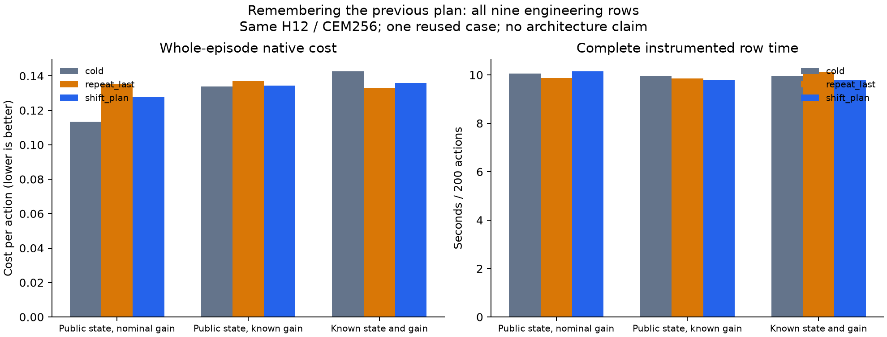

# Proposal-memory engineering comparison

**One reused seed410 case, all nine rows. No scientific qualification or architectural novelty is established.**

Native cost per action, lower is better. The full episode is the prospectively specified comparison; other windows cannot rescue it.

| State/dynamics role | Proposal mode | Full | PRE | POST | MOVE | Whole row seconds |
|---|---|---:|---:|---:|---:|---:|
| nominal | cold | 0.11349797 | 0.12685897 | 0.10459064 | 0.05677829 | 10.052 |
| nominal | repeat_last | 0.13537533 | 0.12393802 | 0.14300020 | 0.17230865 | 9.865 |
| nominal | shift_plan | 0.12755328 | 0.12323546 | 0.13043182 | 0.14882919 | 10.140 |
| public_gain | cold | 0.13394715 | 0.18065342 | 0.10280964 | 0.04530133 | 9.954 |
| public_gain | repeat_last | 0.13700914 | 0.15919771 | 0.12221677 | 0.11069363 | 9.848 |
| public_gain | shift_plan | 0.13435511 | 0.14734161 | 0.12569745 | 0.12533576 | 9.795 |
| true_state | cold | 0.14254395 | 0.16854546 | 0.12520961 | 0.12392000 | 9.964 |
| true_state | repeat_last | 0.13282033 | 0.14158475 | 0.12697739 | 0.14087845 | 10.104 |
| true_state | shift_plan | 0.13582295 | 0.15241640 | 0.12476065 | 0.12492437 | 9.794 |

Descriptive engineering support check: **FAIL**, 2/6 comparisons meet the fixed 3% margin.
This is a practical engineering check on an exposed case, not statistical confirmation or permission to start neural training.

| Role | Shifted plan versus | Full-cost improvement | Meets 3% |
|---|---|---:|---|
| nominal | cold | -12.384% | False |
| nominal | repeat_last | 5.778% | True |
| public_gain | cold | -0.305% | False |
| public_gain | repeat_last | 1.937% | False |
| true_state | cold | 4.715% | True |
| true_state | repeat_last | -2.261% | False |

All three cold-mode native episodes and saved candidate arrays exactly reproduce their corresponding earlier rows.
Execution 89.627s; independent replay 84.819s. Shared-host timing includes setup and evidence recording.
Work: 1,800 real transitions, 5,377,536 candidate transitions and 1,800 selected advances. No identification updates or training.

All methods use the same physics, score, horizon, candidate budget and original innovations. They follow different closed-loop trajectories. The inherited zero-command row is not a new measurement.
The prospective fresh-case six-controller qualification remains unlaunched; no failed criterion was relaxed.
