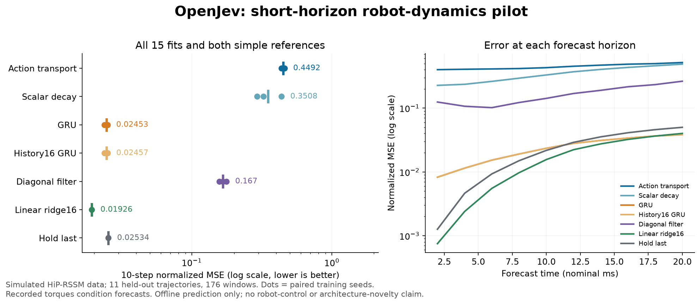

# Short-horizon robot dynamics: simple controls win

September 19, 2026. **The proposed action-transported memory did not improve
prediction.** A linear predictor beat all five neural families, and a GRU
using 32 observations was only 0.15% better than a separately trained GRU
using the last 16. This pilot provides no reason to scale the proposed recipe.
The fixed continuation rule **failed all 25 checks**. An independent audit of
the saved outputs reproduced the result without new model calls.

## Results

Each neural family has three paired fits. Lower error is better.

| Model | Mean normalized MSE | Parameters | State floats | Median window prediction, ms |
| --- | ---: | ---: | ---: | ---: |
| Proposed action transport | 0.449162 | 1,583 | 64 | 3.509 |
| Scalar-decay ablation | 0.350848 | 1,056 | 64 | 2.754 |
| GRU, 32 observations | 0.024531 | 28,425 | 64 | 2.153 |
| GRU, last 16 observations | 0.024567 | 28,425 | 64 + input buffer | 1.215 |
| Learned diagonal filter | 0.166954 | 2,825 | 128 | 3.124 |
| Direct ridge, last 16 observations | **0.019255** | Separate linear outputs per horizon | Input buffer | Not measured separately |
| Hold last observation | 0.025337 | 0 | 9 | Not measured |

The ridge reference lowers error **21.51% versus GRU**. The transport candidate
has about **18.3 times GRU's error** and costs about **1.63 times its predictor
latency**, despite its smaller parameter count. Equal state size did not mean
equal parameter count, computation or accuracy. These results concern this
small fixed training recipe; they do not establish that all associative-memory
or probabilistic-filter architectures fail.

Timing includes a fresh state, context assimilation and ten forecast steps for
one window on an Apple M5 Max CPU, one thread, float32. Family medians pool
100 measured samples per fit after three warmups. This is not streaming
per-action latency and excludes data loading, normalization and service work.
All 15 fits and evaluations completed in **40.98 seconds**. Each fit received
300 optimizer updates, for 4,500 total. No simulator or policy rollouts were run.

## What was tested

The official HiP-RSSM archive contains **simulated PyBullet mobile-robot data**.
We retained its test trajectory IDs and used 30 training, 9 development and
11 test trajectories. Each contributes 16 disjoint windows, producing
480/144/176 windows. Test windows within a trajectory are related; they are
not 176 independent simulation runs. Normalization uses training data only.
All neural fits finished before test scoring. No checkpoint was selected on
development or test results.

Inputs are position and sine/cosine of Euler angles. Forecasts condition on
recorded applied torques, following the source loader's alignment. Those
torques are not authenticated issued commands, so this is conditional offline
prediction rather than a demonstrated deployable world model. Terrain and
run independence are not established. The nominal 500 Hz source configuration
makes the prediction horizon just **20 ms**. That is a local forecasting test,
not a test of long-term planning or long-memory adaptation.

The candidate advances a 16 by 4 matrix using action-conditioned row mixing,
then corrects it with a delta write when an observation arrives. Forecasts
advance private state without receiving future observations. The scalar-decay
ablation shares the initial common weights, targets and batches. GRU and
diagonal-filter controls have their own learned transitions. These are new
implementations of familiar mechanisms, not reproductions of published RKN
or HiP-RSSM scores, and not evidence of biological learning.

## Evidence and reproduction

- [Prospective protocol](action-filter-protocol.md) and
  [frozen source/data bindings](../output/action-filter-v1/experiment-01/protocol.json).
- [Producer completion](../output/action-filter-v1/experiment-01/run-01/completed.json),
  [all training losses](../output/action-filter-v1/experiment-01/training.log), and
  [initial/final weights and fit receipts](../output/action-filter-v1/experiment-01/run-01).
- [Independent saved-output audit](../output/action-filter-v1/report-01/summary.json).
  It recomputes errors from saved predictions and checks the frozen bindings;
  it does not make fresh model calls.
- [Data provenance](../output/action-filter-v1/data-01/manifest.json),
  [safe data adapter](../scripts/prepare_action_filter_data.py),
  [training runner](../scripts/train_action_filter.py), and
  [models](../src/openjev/research/action_filter_models.py).

The upstream archive and normalized inputs stay local because an explicit
dataset license was not supplied. Reproduction requires downloading the exact
publisher archive named in the preparation script and verifying its pinned
SHA-256. Published results do not include source observations or raw target
arrays. The model and data-boundary tests passed **61 checks** before training;
these software checks are separate from empirical effectiveness.

## Connection to the shared-prefix diagram

The supplied Qwen RLCD diagram concerns inference serving: reuse context and
batch bounded decisions. Our [source review](qwen-parallel-source-review.md)
found useful cache reuse but no new RL-trained checkpoint, no demonstrated
calibration, and incomplete multi-token scoring. The upstream revision remains
unchanged. Its speed claim is not a speed measurement for OpenJev.

That serving optimization and this learned state-transition experiment address
different costs. Neither supplies an ICLR contribution without stronger evidence.
