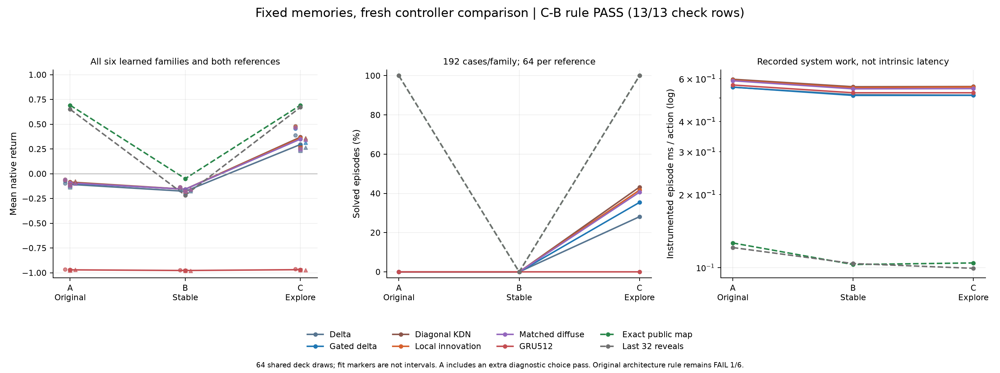
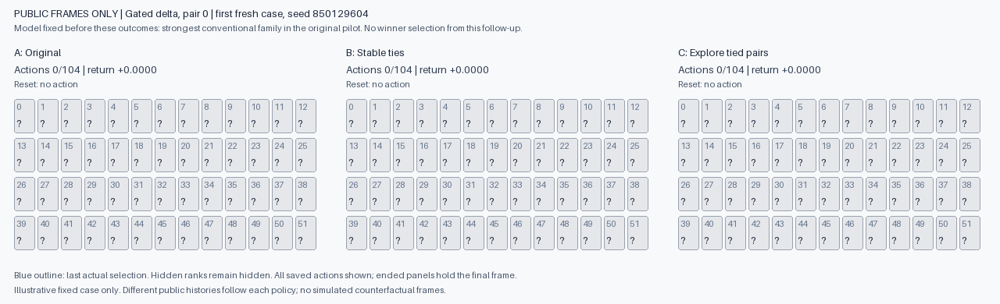

# Stable scoring and exploration with frozen memories

**Completed: 3,840 games, controller continuation PASS.** Preferring an unseen card when expected-match scores tie raises the best learned family's completion from **0/192 to 83/192 (43.2%)**, without changing any weights. All 18 learned fits improve over the stable-score control. Both simple public-memory references still finish **64/64**, so this is a controller result, not an architectural breakthrough.

The GIF shows the first scheduled fresh deck and gated-delta pair 0, chosen before this run because gated delta was the strongest conventional family in the original pilot. All three policies exhaust 104 actions in this particular game. C improves return from -0.25 to +0.1538 but does not finish. Frames contain only actual public observations.

[All fits and criteria](../output/card-controllers-v1/report-01/report.md) · [Results JSON](../output/card-controllers-v1/report-01/summary.json) · [Independent audit](../output/card-controllers-v1/independent-review.md) · [Full evidence](https://github.com/kw2828/OpenJev/releases/tag/research-card-controllers-v1)

This follows the [learned card-memory pilot](card-memory-pilot.md), whose proposed update failed its continuation rule. Saved-state analysis showed that tiny probability row-sum differences changed many first-card choices. This comparison tests the controller while keeping every trained weight fixed.

## What changed in gameplay

| Memory | A return | B return | C return | C games finished |
| --- | ---: | ---: | ---: | ---: |
| Delta | -0.1070 | -0.1767 | 0.2959 | 54/192 |
| Gated delta | -0.0956 | -0.1550 | 0.3514 | 68/192 |
| Diagonal Kalman | -0.0835 | -0.1556 | 0.3701 | 83/192 |
| Local innovation | -0.0889 | -0.1566 | 0.3606 | 80/192 |
| Gain-matched diffuse | -0.0925 | -0.1559 | 0.3511 | 78/192 |
| GRU512 | -0.9700 | -0.9766 | -0.9681 | 0/192 |
| Exact public table | 0.6923 | -0.0490 | 0.6923 | 64/64 |
| Last 32 reveals | 0.6511 | -0.2166 | 0.6716 | 64/64 |

Every learned family finishes zero games under A and B. Across the six learned families, C finishes 363/1,152 games (31.5%). These are repeated evaluations of **64 paired deck draws**, not thousands of independent layouts.

Stable scoring alone is worse: B lowers mean return in every learned fit, and both symbolic references fall from 64/64 completions under A to 0/64 under B. An accurate memory does not by itself resolve equal immediate-match scores. C adds an explicit exploration preference within the same tie set and restores both reference completion rates to 64/64. This supports the importance of the selection rule on this task; it does not make the heuristic a new learning algorithm.

The mean C-minus-B gain across learned fits is **+0.422877**. All six family means and all 18 fit differences are positive. The three jointly required continuation conditions pass, represented by 13 detailed check rows. These are practical continuation checks, not independent significance tests. The GRU's small +0.008413 mean gain still leaves it at zero completions.

The proposed local memory remains below ordinary diagonal Kalman under C: **0.3606 versus 0.3701** return. It is also far below the last-32 reference's **0.6716**. The original architecture result stays **FAIL, 1/6**. No connectome advantage, calibrated uncertainty, world-model transfer or ICLR readiness follows from this result.

## Three policies, the same models and fresh decks

- **A, original:** reproduce the previous picker exactly.
- **B, stable:** normalize probability rows in float64 and treat scores within `1e-12` of the maximum as tied. Select the first eligible index.
- **C, explore:** use B's scores and tie set, but prefer an unseen first card among tied pair endpoints. The second-card rule stays identical to B.

A versus B measures normalization and numerical tie handling together. C versus B isolates the added exploration preference. C may select the higher-index unseen endpoint of a tied pair first; it cannot select an endpoint outside that score tie set.

All 18 final checkpoints and both symbolic references play all three policies on the same 64 fresh reset seeds: 3,840 games, with no retraining or checkpoint selection. Every seed is disjoint from the previous train, development, evaluation and engineering sets. Episode order is fixed before execution.

The prospective exploration criterion requires C-minus-B mean return of at least 0.03 across all learned fits, nonnegative mean differences in every family, and positive differences in at least two of each family's three paired fits. The original architecture result remains failed regardless of this outcome.

The actor receives only public observations and the same seen/matched/phase bookkeeping. A separate evaluator hashes the hidden layout immediately after reset to verify paired deck identity; only the digest is retained, and the actor never receives the hidden ranks. Public reveals are used to independently reconstruct and check complete layouts afterward.

Timing includes the complete instrumented controller. A deliberately calls the frozen original chooser after computing diagnostic scores, so it has an extra scoring pass. These timings do not establish an intrinsic speedup from B or C. A pure saved-output test reproduced all 130,730 original decisions before any fresh games.

[Protocol](../evidence/card-controllers-v1/protocol.json) · [Fresh seeds and order](../evidence/card-controllers-v1/inputs.json) · [Prior diagnostic](../output/card-memory-pilot-v1/picker-diagnostic-01.json)

The prospective code, seeds, source snapshots and criteria were published in commit [`eef9ab6`](https://github.com/kw2828/OpenJev/commit/eef9ab6) before execution. The run completed in **204.96 seconds**, using 392,810 native actions and 357,582 learned prediction/write pairs, with no retraining or retry. The saved-output report reproduced all choices; a separate audit independently reconstructed the public transitions, rewards and all 64 deck identities. Neither audit reran learned checkpoint forwards.

The run retained 1.33 GB of compressed trajectory and receipt files. The evidence release includes every new trajectory, report, figure and source snapshot. Its inherited checkpoints and training data remain in the [original pilot release](https://github.com/kw2828/OpenJev/releases/tag/research-card-memory-pilot-v1); both releases are needed for the complete training-to-evaluation chain.

The result establishes a better controller baseline for future work. Before another architecture claim, a separate experiment must show that learned recurrent memory improves useful retained-history performance beyond the cheap last-32 reference, with fresh training data and a scenario shift. This run does not establish that advantage.
