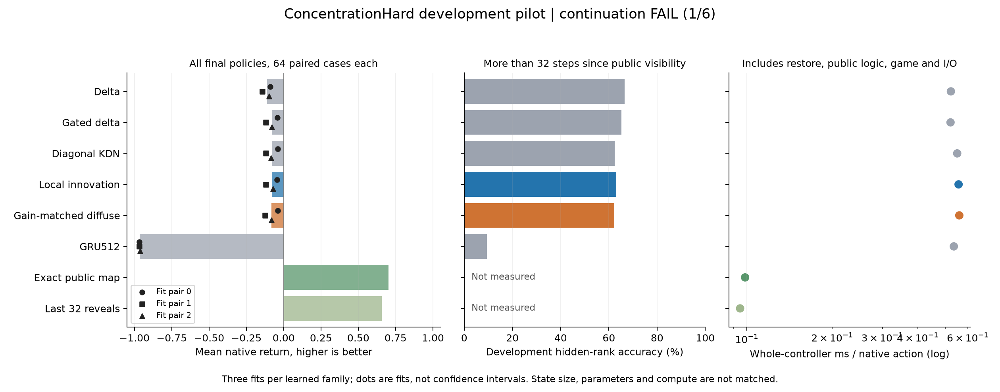
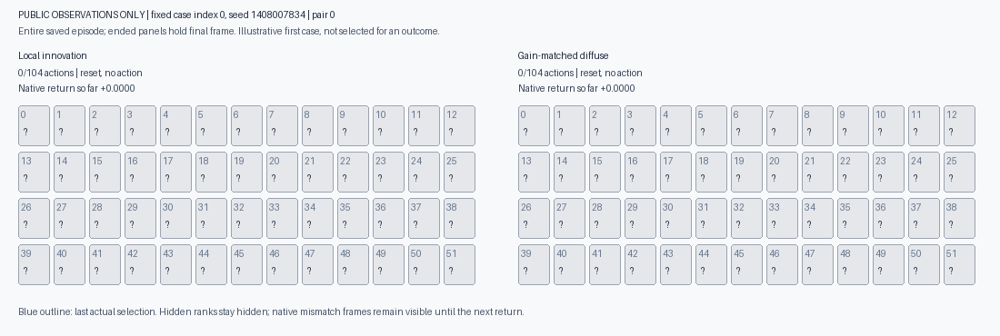

# Learned decision memory: a controlled card-matching pilot

**Completed: 18 fits, 1,280 held-out games, continuation FAIL (1/6 checks).** The proposed local update averaged -0.0781 native return versus -0.0802 for the strongest conventional model. The +0.0021 difference missed the fixed +0.03 requirement. All learned controllers finished 0/192 games per family; both symbolic memory references finished 64/64.

The GIF replays the first scheduled seed and paired initialization, with public observations only. Both policies use all 104 actions without finishing. It was not selected for a favorable result.

The local model scored **92.57%** on development hidden-card queries, falling to **63.05%** for cards last visible more than 32 actions ago. Its gain over the matched control was only **0.0036 native return** and **0.75 percentage points** of old-card recall. These results do not support the proposed mechanism.

[Full table and fixed criteria](../output/card-memory-pilot-v1/report-01/report.md) · [Machine-readable results](../output/card-memory-pilot-v1/report-01/summary.json) · [Full evidence and all weights](https://github.com/kw2828/OpenJev/releases/tag/research-card-memory-pilot-v1)

This experiment trains small recurrent memories on the public observations of [POPGym ConcentrationHard](https://github.com/proroklab/popgym/blob/410d5aa626dae8024f498354d8781a0d1870c399/popgym/envs/concentration.py). It asks whether an error-sensitive memory update improves actual decisions, beyond conventional recurrent updates and a matched correction control. It is a single-task pilot, not a claim of biological learning or a new state of the art.

## What the saved games show

An exploratory audit found that the local model predicted the selected, previously seen hidden card correctly on **99.62%** of those actions, yet visited only **38.69 of 52 positions** per game on average. This is a selected-action statistic, not accuracy across all hidden cards or the same population as development recall. It does not prove that memory errors are irrelevant. It makes the probability-based picker and exploration behavior concrete targets for a separate experiment.

The local policy repeated 236 previously failed pairs across 192 games. The GRU repeated 8,499 and visited only 6.74 positions per game. The symbolic references visited all 52. [Independent artifact review and exploratory diagnostics](../output/card-memory-pilot-v1/independent-results-review.json).

The saved-score check also found substantial numerical sensitivity: normalizing the same probability rows changes **4,026 of 9,984 first-card choices (40.33%)** for the local model. All changes occur within score gaps no larger than `1e-7`; the median original gap is `5.79e-9`. The second-card choices do not change. On those same saved prefixes, choosing an unseen first card rises from 798 to 2,016. **No alternate trajectories were executed**, so this establishes sensitivity, not improved returns or a causal explanation of the failed games. It limits architectural interpretation of this picker-based comparison. [Saved-score diagnostic](../output/card-memory-pilot-v1/picker-diagnostic-01.json).

The [completed controller follow-up](card-controller-comparison.md) separates stable scoring from an information-seeking tie preference, using these same weights and 64 fresh decks. The exploration preference improves gameplay, while stable scoring alone makes it worse. The original six criteria and failed outcome remain unchanged.

## Experiment fixed before training

Six update rules share learned position keys, rank values and a readout: delta, gated delta, diagonal Kalman, local innovation, gain-matched diffuse innovation and GRU. The proposed local rule increases a diagonal covariance scale in the coordinates of a key whose prediction has an error. The diffuse control increases it everywhere while matching the immediate correction along the current key from the same input state. The control does not match total trace or future memory histories.

Existing work already covers the main building blocks: [DeltaNet](https://arxiv.org/abs/2406.06484), [Kalman Delta Networks](https://arxiv.org/abs/2609.07816), and [HOLA](https://arxiv.org/abs/2607.02303). Innovation-adaptive filtering has further prior art. This pilot tests a specific interference hypothesis; it does not establish novelty by combining names or equations.

- 128 native training episodes; 32 separate development episodes.
- Six modes and three paired initializations, with the same 16 episode-order permutations per pair. Batch 16, 128 Adam updates per fit, final checkpoints only.
- All 18 fits finish before development evaluation. Final controllers then play the same 64 fresh seeds each, plus an exact public-memory table and a last-32-event reference: 1,280 native games total.
- Training labels come only from previously exposed card ranks that are currently hidden. Predictions precede the next reveal; each actual selected reveal causes one write. No hidden deck inspection.
- Every controller receives the same public seen/matched/phase bookkeeping and fixed probability-based action picker. This is supervised memory learning plus a supplied planner, not end-to-end RL.

The GRU matches the associative matrix's 512 mean-state floats but has many more parameters. Kalman variants add 32 covariance floats. Reported full-controller timing includes game logic, bookkeeping and saved episode evidence. Neither parameter count nor compute is matched across all families.

## Continuation rule

Continue the proposed local rule only if it clears every prespecified criterion: mean native return at least 0.03 above the strongest conventional learned arm; a positive difference in every paired fit; at least 0.02 above the gain-matched control, also positive in all three fits; and at least two percentage points better recall of hidden cards last visible more than 32 actions ago, with adequate development coverage. Missing, incomplete or nonfinite results fail the rule. No alternative seeds, checkpoint selection or automatic retries.

A pass would justify fresh-seed and scenario-shift validation. It would not establish ICLR readiness, calibrated uncertainty, robotics transfer, connectome efficacy or a leaderboard result.

[Exact protocol](../evidence/card-memory-pilot-v1/protocol.json) · [Fixed seeds and episode orders](../evidence/card-memory-pilot-v1/inputs.json) · [Prior-work review](../output/decision-memory-direction-v1/related-work.md) · [CPU sizing](../output/decision-memory-direction-v1/sizing.json)

The recipe is closed without continuation of the proposed local update. The large gap between off-policy recall and native game completion motivates a separate diagnosis of decision-time errors and repeated choices. Any follow-up needs fresh seeds and a newly specified protocol.

Execution used 2,304 optimizer updates and 130,730 native evaluation actions. Training plus final development evaluation took 176.99 seconds; native evaluation took 66.92 seconds on this CPU runtime. All 78 execution-source bindings remained unchanged. There were 223 focused correctness tests, plus saved-data and saved-game audits.

The prospective execution commit was [`3b9c5e6`](https://github.com/kw2828/OpenJev/commit/3b9c5e6), followed by saved-output analysis commit [`a25981e`](https://github.com/kw2828/OpenJev/commit/a25981e). Full raw trajectories, checkpoints, optimizer state, seeds, training logs and source snapshots are included in the evidence release.
