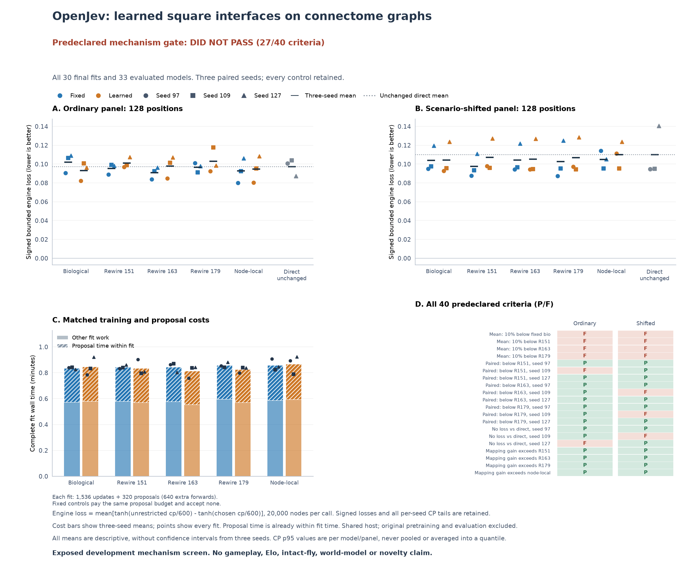

# Does learning a spatial interface help biological wiring more than its controls?

Status: completed once on 2026-09-18. All 30 fits and the saved-output audit
completed; **27 of 40 predefined checks passed, so the continuation rule failed**.
Learning the biological spatial mapping improved ordinary-panel mean loss by
8.61%, but did not improve the shifted panel. This result does not justify the
planned game-strength follow-up.

[Frozen plan](../evidence/chess-connectome-mapping-v1/protocol/plan.json) SHA-256:
`bef6862e84733c6436b09dc3d693037247895bc017132b388f692fabf74aac04`.

The original [connectome comparison](../docs/chess-connectome.md) is negative.
The [outcome-supervision comparison](../docs/chess-continuation.md) also failed
its performance criteria. This study therefore retains the original frozen
backbones and changes only how each graph receives and returns board features.
It cannot change either previous result.

## Completed result

[PDF figure](../evidence/chess-connectome-mapping-v1/figures/figure.pdf) ·
[Complete audit summary](../evidence/chess-connectome-mapping-v1/audit/summary.json) ·
[Per-model centipawn tails](../evidence/chess-connectome-mapping-v1/figures/engine_cp_tails.csv)

These are means over all three paired seeds on the fixed 128-position engine
subset of each exposed development panel. Lower signed bounded loss is better.

| Topology | Ordinary, fixed | Ordinary, learned | Shifted, fixed | Shifted, learned |
|---|---:|---:|---:|---:|
| Biological | .101983 | .093204 | .103960 | .104099 |
| Rewire 151 | .095392 | .101010 | .097407 | .107061 |
| Rewire 163 | .090986 | .097719 | .104259 | .105320 |
| Rewire 179 | .096636 | .102945 | .102657 | .106654 |
| Node-local | .092884 | .094729 | .104899 | .110014 |
| Unchanged direct reference | .097387 | .097387 | .110094 | .110094 |

The direct columns repeat the same unchanged reference, not separate fits.
The biological fixed-to-learned change is an 8.61% reduction on the ordinary
panel and a 0.134% increase under shift. All three biological seeds improve
on their fixed counterpart on the ordinary panel; under shift, two improve
and one worsens. Biological learned mappings have lower means than learned
rewires on both panels, but fail the required magnitude and seed consistency.
Some fixed controls also outperform biological learned mappings.

All eight requirements for a 10% mean reduction failed. Three strict paired
rewire comparisons and two direct-model no-degradation comparisons also failed.
All eight topology-by-mapping difference-in-differences checks passed: mapping
helped biology more, or hurt it less, than each control. In the shifted panel,
that interaction reflects controls becoming worse, not a biological improvement.
The forty checks are a predeclared continuation rule, not independent statistical
tests or a measure of statistical significance.

All 30 final fits were retained: 46,080 optimizer updates and 9,600 proposal
pairs. Learned mappings accepted 2,110 of their 4,800 proposals; fixed controls
accepted none while paying for both forwards. The biological learned fits
accepted 136, 146 and 151 of 320 proposals for seeds 97, 109 and 127.

Primary execution took 2,395.74 seconds and saved-output auditing 833.92 seconds,
within the respective 7,200/1,800-second limits. Summed complete fit time was
1,518.43 seconds, including 477.49 seconds of proposal work. Proposal time is a
subset, not an additional cost. Stronger grading used 748 deduplicated calls,
14,960,000 requested nodes and 14,885,370 reported nodes. Biological learned
mean full-decision latency was 1.752 ms versus 0.656 ms for the unchanged direct
reference on this shared host; this is not an isolated speed comparison.

The fair conclusion is an ordinary-panel mapping effect and a descriptive
interaction with topology, without reliable improvement under scenario shift.
It does not establish biological superiority, a recurrent world model, novelty,
chess playing strength or Elo. The previous negative connectome and continuation
studies remain unchanged.

## Intervention and controls

The [hard-square interface](chess-connectome-interface.md) uses one permutation
of the 64 board squares, shared across all channels and tied between input
gathering and output pooling. Original channels, node identities, signed graph
support and occupancy normalization are preserved. There is no dense interface,
soft mixture, new sensory input or cross-move memory. The existing input/output
projections, graph edge magnitudes and node biases still train.

Compare five graphs: the biological descending subgraph, the original three
signed-degree-preserving rewires, and node-local recurrence. Each receives
fixed and learned mappings under seeds 97, 109 and 127: **30 fresh fits**.
The three original direct backbones are evaluated again as unchanged references.
Biological and rewired models match parameter counts and graph operations;
node-local recurrence has fewer parameters and is an explicit mechanism control.

Every arm starts from the original seed-paired artificial assignment and adapter
initialization. The original width32, depth4 candidate-policy backbones and all
readouts remain frozen. The biological graph has 1,409 descending neurons and
44,090 edges; this is an induced subgraph with artificial board inputs, not the
intact fly sensory circuit.

## Learning the mapping

Use the original 32,768 training positions, labels and seed-paired minibatch
orders for six epochs, batch128 and 1,536 ordinary updates per fit. The objective
remains legal-move cross entropy plus 0.5 times root-value MSE. Adam, initialization,
gradient clipping and neural precision stay matched to the original study.

The first 256 updates have no mapping proposals. Before updates 257, 261 and
every fourth update through 1,533, evaluate one predetermined pair of board
squares for swapping. This gives exactly **320 proposals per fit** and 9,600
proposals in total. A private seed determines the same proposal sequence for
all five graphs and both policies within each training seed.

Each proposal evaluates the current and proposed mapping on the same training
minibatch with fixed parameters and no gradients. The learned arm accepts only
a strict finite objective decrease. The fixed arm performs both evaluations
and restores its original mapping. Both then receive their scheduled ordinary
optimizer update. An accepted map is hard immediately; evaluation does not
replace a soft training map with a different discrete map.

No evaluation labels, engine scores or game outcomes select swaps. Every proposal
records both losses, acceptance, its complete permutation chain and timing.
There are 46,080 ordinary updates and 19,200 extra proposal forward passes.
Equal forward/update counts do not imply identical wall time. All bookkeeping,
copies, graph work and device synchronization count toward recorded time;
forward MAC estimates are not complete training FLOP measurements.

## Evaluation and continuation rule

All 30 final fits finished before evaluating the benchmark panels. There is no best-seed,
best-epoch or best-map selection. Reuse the exact old connectome development
panels and their fixed 128-position engine subsets. Every one of the 33 models
receives ordinary and shifted evaluation with complete legal-move score vectors
saved. Stronger grading uses 20,000-node Stockfish searches and retains signed
bounded losses and raw centipawn tails.

For both panels, every following requirement must hold:

1. Biological learned-map mean bounded loss is at least 10% below its fixed-map
   counterpart and each of the three learned-map rewires. Comparator means
   must be positive.
2. Biological learned-map loss is strictly below each learned-map rewire in
   every paired seed and no worse than the same seed's unchanged direct model.
3. Biological fixed-to-learned improvement exceeds the corresponding improvement
   for every rewire and for node-local recurrence. This is the interaction
   between topology and mapping, not merely a within-model gain.

Nonfinite, incomplete or failed evidence cannot pass. The arithmetic tolerance
is 1e-12; it does not turn these development thresholds into statistical
significance. Three selected fitted seeds do not establish a population-level
architecture effect. Improvement shared by controls supports a generic interface
effect, not biological superiority.

The maximum engine workload is 8,704 calls and 174,080,000 requested nodes.
Shared selected moves are graded once; actual calls, reported nodes and costs
are retained. Full CPU decision timings include preparation, interface checks
and synchronization. Another frozen CPU study may run concurrently, so these
shared-desktop measurements cannot establish isolated latency superiority.

Only a passed mechanism screen can motivate a separately frozen game-strength
comparison. There is no arena or Elo claim in this stage. A broader claim still
requires actual games, stronger opponents and disjoint confirmation data.

## Execution and evidence limits

The prospective primary limit is two hours, followed by at most thirty minutes
of saved-output audit. A detached supervisor enforces both limits. There are
no retries, replacement fits, checkpoint resumes or budget extensions within
this study. Failed attempts retain their records.

The audit authenticates sources, original inputs, graphs, backbones, every
training update and proposal, final mappings and checkpoints, complete saved
prediction-vector arithmetic, engine coverage and timing records. It does not
rerun neural inference or Stockfish and does not independently establish exact
gradient execution. Graph arrays and derivative weights remain local under
`runs/` with the original third-party terms.

The completed [synthetic engineering profile](../evidence/chess-connectome-mapping-preflight-v1/profile.json)
uses an artificial 1,409-node/44,090-edge graph, random initial weights and
invented targets on repeated starting boards. Its 1,223.30-second linear
update-loop projection excludes data preparation, journals, checkpointing and
evaluation. It supports workload planning only; it is not measured study
runtime, a topology comparison or evidence of policy quality.

The [test receipt](../evidence/chess-connectome-mapping-v1/tests.json) binds all
six new source and test files. Checks include synthetic MPS training, accepted
swaps, checkpoint reload, evaluation identity, malformed evidence rejection
and phase deadlines. Passing these checks establishes engineering readiness,
not the effectiveness of biological wiring.

The [full input check](../evidence/chess-connectome-mapping-v1/input-check.json)
authenticated the original inputs and reproduced the exact deterministic
training/dev/shift caches for 32,768/2,048/2,048 positions. It made no neural,
training or engine calls and took 1,562.58 seconds, including the original
exclusion and game-history validation. This is preparation cost, not model
training speed or policy quality.

Constrained learned interfaces already have substantial [prior work](chess-connectome-interface.md#closest-checked-prior-work).
This study tests a specific mapping interaction. It does not claim novelty
from merely connecting a chess encoder to a connectome.

## Public evidence and local artifacts

The public evidence package contains the frozen protocol, engineering/input
receipts, completed audit summary and receipt, and authenticated PNG/PDF figure.
The companion CSV preserves all 66 per-model/panel centipawn means, p95 values
and maxima, including the direct references. Its p95 values are not pooled
across fits. The [figure provenance](../evidence/chess-connectome-mapping-v1/figures/provenance.json)
binds the plan, audit receipt, sources and derived outputs. Rendering used
saved outputs only and made zero model or engine calls.

Biological graph arrays, rewires, derivative checkpoints, original training
data, full raw execution records and launch logs remain local under
`runs/chess-connectome-mapping-v1/` and their original source directories. They
are not included in the public evidence package, which is therefore not a
self-contained execution archive. The saved-output audit verifies the local
records; the public figure can be reproduced from the public plan and audit
without loading weights or graph assets.
