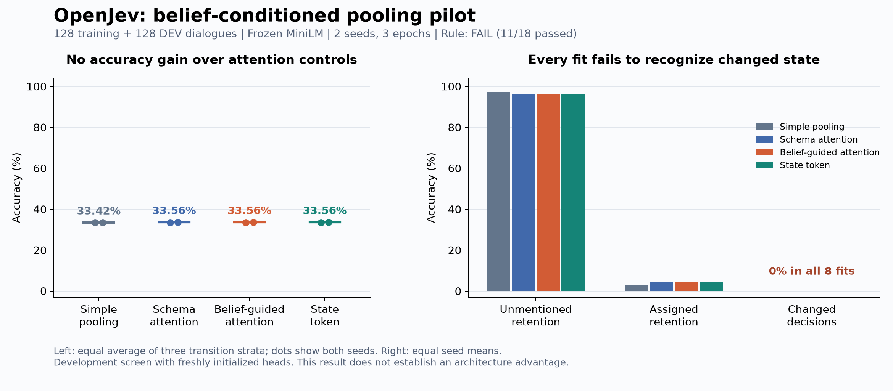

# Belief-guided pooling needs a competent starting model

21 September 2026. **The new attention mechanism showed no useful advantage in
this small development pilot.** All eight fits completed, but only **11 of 18**
continuation conditions passed. Every fit scored **0% on changed decisions**.
That common failure makes this a weak test of the architecture's potential.

## What was trained

Four methods received the same frozen pretrained MiniLM features and fresh
scalar-memory initialization: simple pooling, schema-guided attention,
belief-guided attention, and an appended state token. The belief-guided method
uses its own previous candidate probabilities to choose which token features
to read. The state-token control receives the same belief-derived summary as
an extra attention item. Both preserve gradients through autonomous predictions;
neither receives gold previous state. All three attention arms have the same
parameter shapes and forward geometry.

The fixed pilot selected 128 TRAIN and 128 DEV dialogues by public-ID hashes.
Each of two seeds trained for three epochs, with 48 optimizer updates per fit.
All 3,251 selected DEV endpoints were scored after training. The official TEST
split remains unopened. These are exposed development data, not confirmation.

## Complete result

Values are equal means over both seeds. Macro accuracy equally averages the
three transition strata; proper scores average endpoints. Lower NLL and Brier
are better. No temperature scaling or probability repair was applied.

| Method | Macro accuracy | NLL | Brier |
| --- | ---: | ---: | ---: |
| Simple pooling | 33.4173% | 1.0942987 | 0.5667961 |
| Schema attention | 33.5613% | 1.0933762 | 0.5658216 |
| Belief-guided attention | 33.5613% | 1.0933708 | 0.5658182 |
| State token | 33.5613% | 1.0933716 | 0.5658178 |

Belief guidance adds only **0.144 percentage points** over simple pooling and
has exactly the same accuracy as the attention controls in each seed. It misses
the required one-point gain against all three comparators. It also worsens
unmentioned-retention error relative to pooling and slightly worsens Brier
relative to the state token. Tiny favorable proper-score differences are not
evidence of an effective new model.

Unmentioned-retention accuracy is about 96-97%, while assigned-retention accuracy
is only 3-4.5% and changed accuracy is zero in every fit. The near-33% macro
therefore reflects the uneven transition performance; it is not a random-guess
baseline. This cold-start, short-training recipe did not learn useful state
updates. The experiment does not identify why, or establish that belief-guided
pooling could never help a competent model.

These scores are **not a regression measurement against the earlier 79.34%
unseen-service result**. That study used trained encoders, more training data,
longer fitting, three seeds and a different evaluation population. This pilot
used fresh heads and a fixed pretrained encoder. Comparisons are within the
matched four-arm pilot only.

## What follows

This recipe is closed with its failed rule unchanged. A better next experiment
would add the same zero-initialized observation residual to an already competent
trained encoder and scalar memory, with an equally trained pooled control.
It should first verify that initial predictions and changed-state competence
are preserved, then compare the same state-feedback placements. Any adaptation
budget and continuation criteria need a separate prospective protocol.

That follow-up has not run. It would test an integration hypothesis; ordinary
state conditioning has substantial prior art. This result supports no recurrent
world-model, biological-learning, RL or ICLR novelty claim. The public Qwen RLCD
diagram concerns a separate [inference optimization](qwen-parallel-source-review.md).

## Execution and verification

The complete supervised run took **31.659 seconds**, including shared encoder
caching, 3,072 training forwards, 1,024 evaluation forwards and process cleanup.
It completed within the fixed 1,800-second budget. Shared caching is a pilot
convenience, not an end-to-end serving benchmark or a comparison with the older
trainable-encoder route.

There were 47 model/runner synthetic checks and 43 reporting checks. A separate
numerical reader verified **96 metric cells and all 18 conditions**, agreeing
on 1,092 scalar checks with maximum score difference below 1.2e-16. Its input
authentication reuses the qualified reader; its metric arithmetic is separate.
Changed-subtype and recovery tables are authenticated, but not independently
recomputed. All earlier frozen sources and failed results remain unchanged.

The first launch command was rejected by the supervisor's argument parser
before any worker or run directory existed. Its receipt is preserved; correcting
the invocation did not replace a fit or change a seed, source or budget. Two
reporter lint findings were corrected before analysis was frozen, with all 43
synthetic checks rerun. No outcome-based source changes were made.

- [Prospective protocol](dialogue-belief-pooling-pilot-protocol.md) and [source/data plan](../output/dialogue-belief-pooling-pilot-v1/freeze-01/plan.json).
- [Actual complete execution](../output/dialogue-belief-pooling-pilot-v1/run-evidence-01/actual-exit.json).
- [All eight fits and eighteen conditions](../output/dialogue-belief-pooling-pilot-v1/report-01/report.md).
- [Independent numerical audit](../output/dialogue-belief-pooling-pilot-v1/audit-01/result-01/summary.json).
- [Figure source and exact plotted values](../output/dialogue-belief-pooling-pilot-v1/figure-01/render-01/receipt.json).

Checkpoints and raw arrays are retained locally under
`runs/dialogue-belief-pooling-pilot-v1/run-01`; public artifacts contain their
hashes, counts and complete scored summaries.
