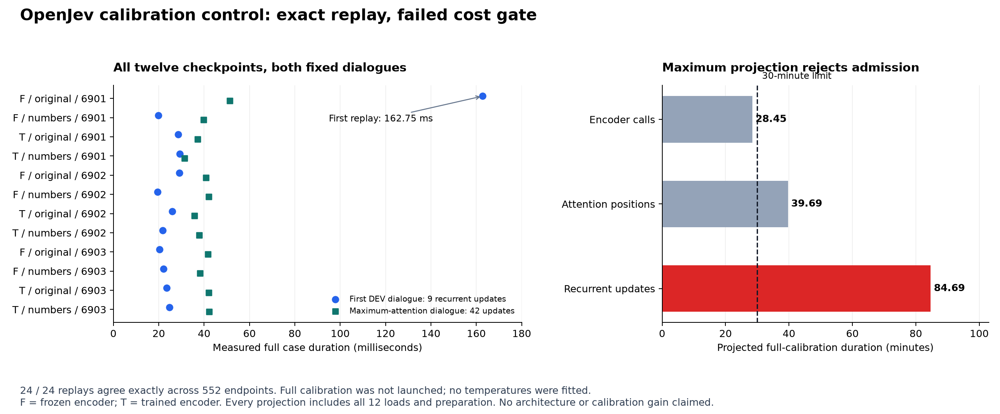

# Calibration control: exact replay, failed cost admission

21 September 2026. **The calibration experiment stopped before full inference.**
All 24 checkpoint replays reproduced the original saved probabilities exactly,
but the frozen cost estimate was **5,081.54 seconds (84.69 minutes)**, above the
**1,800-second admission limit**. No calibration temperatures were fitted and
no new calibration-quality or architecture result is claimed. The earlier
observation-learning comparison remains a **6/7 failure**.

## What completed

| Stage | Outcome | Measured duration |
|---|---|---:|
| Cohort preparation | 512 dialogues, 13,333 labeled endpoints, 5,228 public USER turns | 8.377 s |
| Independent preparation audit | Selection, exclusions, actor/target mappings and geometry agree | 4.391 s |
| Checkpoint replay | 12 checkpoints, 24 complete dialogues, 552 saved endpoints; exact agreement | 10.422 s |
| Independent replay review | All saved arrays, counts and the failed cost decision agree | 1.284 s |
| Full calibration inference | Not launched | No run |
| Temperature fitting and DEV scoring | Not run | No result |

The protocol and its thirteen new source/test files were committed and pushed
as [`163e774`](https://github.com/kw2828/OpenJev/commit/163e774) before selecting
the cohort. The original 64 scientific sources remain unchanged. Preparation
and replay each exited successfully under their separate native-clock parent
deadlines. Successful replay does not imply cost admission.

The cohort is the fixed salted sample from 13,956 eligible remaining TRAIN
dialogue groups. It excludes all 2,017 actually fitted dialogues and any whole
normalized-text group shared with fitted or evaluated DEV dialogues. Its 24
services have no overlap with the six services marked unseen in the original
DEV panel. These exclusions do not establish paraphrase independence or absence
from pretrained models' training data.

Every restored checkpoint replayed the same two complete DEV dialogues,
`10_00000` and `1_00096`, selected by original order and maximum attention
geometry. Maximum supported log-probability and probability differences were
both **zero**. The run recorded 36 encoder dispatches and 612 monitored
question-state updates. It verifies saved endpoints and new update invariants;
V2 did not save all internal state trajectories for comparison.

## Why admission failed

The predeclared rule takes the largest measured seconds-per-work-unit across
all 24 cases, multiplies by the complete workload of **12 x 512** dialogues,
then adds all twelve checkpoint loads and preparation. All cases remain in the
calculation.

| Work measure | Full-workload variable estimate | With 12 loads and preparation |
|---|---:|---:|
| Encoder calls | 1,693.240 s | 1,707.215 s |
| Padded attention positions | 2,367.187 s | 2,381.161 s |
| Recurrent question updates | 5,067.569 s | **5,081.543 s** |

The maximum for all three measures comes from the first replay,
`frozen_original-6901` on `10_00000`: **162.749 ms**, one encoder dispatch and
nine recurrent updates. Subsequent replays of that same dialogue took
**19.524-29.334 ms**. The other fixed dialogue took **31.431-51.293 ms** across
all twelve checkpoints. The complete replay phase took 10.422 seconds,
including authentication, loading, outputs and process cleanup; the 24 paid
dialogue intervals sum to 0.908 seconds.

This identifies which observation drives the estimate. It does not establish
whether startup, shape-specific execution or timing noise caused the outlier,
and it does not measure full calibration runtime. The 84.69-minute figure is
an estimate, not an observed 6,144-dialogue run. The separate 3,600-second
inference allocation was never started.

The next engineering question is whether a prospective timing study that
separately measures initialization and repeated work can predict complete
runtime more faithfully. It should validate that prediction on a bounded
workload and retain the same numerical-replay requirements. This needs a new
protocol; the present failed admission remains recorded.

## Evidence and limits

- [Frozen protocol](dialogue-calibration-control-protocol.md) and [plan](../output/dialogue-calibration-control-v1/plan.json).
- [251-test source qualification](../output/dialogue-calibration-control-v1/synthetic-qualification-01/receipt.json).
- [Preparation metadata](../output/dialogue-calibration-control-v1/preparation-evidence-01/manifest.json) and [independent cohort audit](../output/dialogue-calibration-control-v1/preparation-audit-01/receipt.json).
- [Replay completion and timing evidence](../output/dialogue-calibration-control-v1/qualification-evidence-01/manifest.json) and [independent replay review](../output/dialogue-calibration-control-v1/qualification-review-01/receipt.json).
- [All plotted values](../output/dialogue-calibration-control-v1/figure-01/source-values.json) and [figure provenance](../output/dialogue-calibration-control-v1/figure-01/receipt.json).

The cohort audit reuses the frozen authentication code. It independently
reconstructs selection, public maps, original lexical features and workload
arithmetic, but does not retokenize text or independently reimplement the
normalized-number matching flags. The replay audit independently compares
saved arrays and recomputes projection arithmetic; it does not rerun models.
Neither audit measures calibration efficacy.

The results reader and its synthetic tests are prepared for a future admitted,
complete inference run. They have not processed actual calibration predictions.
They cannot substitute for the missing experiment, reverse the original raw
failure, or establish a new recurrent or biological architecture.
