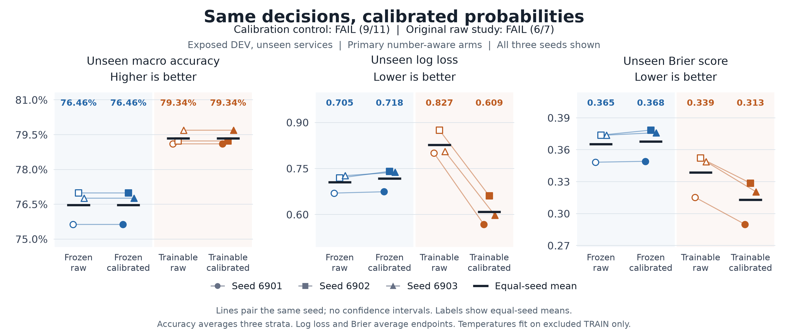

# Calibration helps the trained encoder but fails the full control

21 September 2026. All twelve checkpoints completed the fixed calibration
experiment. The trained, number-aware model's unseen-service log loss fell
**26.4%, from 0.82721 to 0.60893**, with the same selected answers. Its Brier score
fell **7.6%, from 0.33875 to 0.31302**. Both improvements held in all three seeds.

The complete continuation rule still **fails, with 9 of 11 conditions passed**. Applying the same scalar
fitting procedure to the frozen number-aware reference worsened both unseen
proper scores in every seed. Those two safeguards remain failures. The
original uncalibrated study remains **FAIL, 6/7**; it has not been relabeled.

## What changed and what stayed fixed

One output temperature was fitted per checkpoint using 13,333 categorical
endpoints from the same 512 source TRAIN dialogues. These dialogues and their
normalized-text groups were excluded from the original weight fits; evaluated
DEV text groups were also excluded. The calibration sample covers 24 training
services and has no service or query overlap with the six unseen DEV services.
This excludes direct normalized-text duplication, not paraphrases or unknown
pretraining exposure. DEV had already informed this research direction, so this
is development evidence rather than untouched confirmation.

All four original arms and three seeds are retained. The same final encoder and
autonomous memory weights, candidates, full public streams, lexical variants
and numerical execution route produced the new calibration predictions. There
were no weight updates. Temperatures were fitted on calibration endpoints only,
using the previously fixed bounded scalar optimizer. They act only on final
output distributions and never feed the recurrent state.

Every selected answer and complete top-tie set is unchanged on evaluation.
Normalization at beta one is reported separately; its largest absolute change
to an individual fit's unseen log loss is below 4.8e-9. It cannot explain the
observed reduction from temperature scaling.

## Complete comparison

Values below are equal means over all three optimization seeds. Accuracy is the
mean of the three transition-stratum accuracies. Log loss and Brier average
endpoints; Brier sums over candidates. These are different denominators. No
confidence intervals or independent-evaluation-sample interpretation is added.

| Encoder / lexical input | Output | Unseen macro accuracy | Unseen log loss | Unseen Brier |
|---|---|---:|---:|---:|
| Frozen / original | Raw | 72.77% | 0.73185 | 0.35678 |
| Frozen / original | Calibrated | 72.77% | 0.74781 | 0.35960 |
| Frozen / number-aware | Raw | 76.46% | 0.70526 | 0.36525 |
| Frozen / number-aware | Calibrated | 76.46% | 0.71760 | 0.36786 |
| Trained / original | Raw | 78.96% | 0.89294 | 0.36710 |
| Trained / original | Calibrated | 78.96% | 0.65158 | 0.33590 |
| Trained / number-aware | Raw | 79.34% | 0.82721 | 0.33875 |
| Trained / number-aware | Calibrated | 79.34% | 0.60893 | 0.31302 |

For the primary comparison, calibrated trained versus calibrated frozen, all
seven original relative conditions pass. The trained model also improves both
unseen proper scores against its own raw output. The remaining two conditions
require that the frozen reference not worsen against its own raw output; both
fail. We do not exempt it, leave it uncalibrated after seeing DEV, change the
thresholds, or redefine the comparison to obtain a passing result.

The primary trained model's fitted temperatures are **1.59-1.75**, which soften
its distributions. The frozen reference's temperatures are **0.935-0.987**,
which sharpen them slightly. All twelve fits have interior optima. The opposite
outcomes show that this calibration procedure does not transfer uniformly to
unseen services. They do not establish a causal explanation for that difference.

The primary trained model also improves seen-service log loss
**0.40780 to 0.31881** and Brier **0.15305 to 0.14656**. The frozen reference
slightly worsens seen log loss **0.39628 to 0.39752** and Brier
**0.20166264 to 0.20166733**. The
[complete report](../output/dialogue-calibration-runtime-v2/report-01/report.md)
and [indexed results](../output/dialogue-calibration-runtime-v2/report-01/summary.json)
retain all twelve temperatures, raw/normalized/calibrated panels, paired seed
changes and the service, transition-bin and candidate-type breakdowns.

## Runtime evidence

The [earlier V1 resource failure](dialogue-calibration-control-results.md) remains
unchanged: its two-case maximum-rate method projected 5,081.54 seconds against
an 1,800-second limit. Its inference directory remains unused. This study
[froze a separate runtime protocol](dialogue-calibration-runtime-v2-protocol.md)
before selecting or running its additional timing cases.

The new pilot used the same 128 hash-selected DEV dialogues for every checkpoint:
64 estimator cases and 64 verification cases, after two paid legacy warmups.
Each forecast was saved before its verification block. All **1,560** complete
replays and **40,680** saved endpoints matched the original output exactly.
All twelve verification forecasts passed. The fixed twofold-margin estimate
was **341.03 seconds**, below the unchanged 1,800-second admission threshold.
The 512-dialogue inference then completed **6,144** full forwards and saved
**159,996** endpoints across all twelve fits.

| Separate phase | Measured seconds |
|---|---:|
| Existing calibration preparation | 8.377 |
| Existing V1 replay, failed cost admission | 10.422 |
| New runtime pilot | 49.405 |
| Full calibration inference | 148.979 |
| Scalar fitting and reporting | 23.270 |
| Sum of these measured phases | 240.453 |

Neural phases use actual native-clock parent intervals through process exit and
cleanup. The reporting interval ends at its final pre-publication check, with
publication checked before successful exit. The table excludes original weight
training, synthetic qualification, independent audits, figure production and
human development time. It does not claim a serving speedup from comparing an
old projection with a new observed duration.

The timing sample does not cover every calibration shape: 53 of 512 dialogues
fall outside at least one measured marginal range, mostly below its minimum.
Joint batch-shape coverage is unknown. Geometry was disclosed as a diagnostic,
not used for sample replacement or admission. The fixed resource deadline,
complete observed inference and paid pilot cost remain the relevant evidence.

## Interpretation and evidence

This is a useful improvement to a baseline, using ordinary output temperature
scaling. It removes the trained encoder's observed log-loss regression while
preserving its accuracy gains. The full two-arm procedure did not satisfy its
continuation rule because it hurt the reference under service shift. There is
no new recurrent, connectome or world-model advantage established here, and no
ICLR novelty claim follows from this result alone.

The next research question is whether a method can retain this confidence gain
without the reference regression under a separately fixed shift test. That is a
new experiment; this study's failure and all eleven conditions stay fixed.

- [Prospective runtime plan and eleven source pins](../output/dialogue-calibration-runtime-v2/plan.json)
- [612 synthetic qualification checks](../output/dialogue-calibration-runtime-v2/synthetic-qualification-01/receipt.json)
- [Independent pilot audit: 32,340 checks](../output/dialogue-calibration-runtime-v2/pilot-review-01/result-01/summary.json)
- [Actual complete inference](../output/dialogue-calibration-runtime-v2/inference-evidence-01/actual-exit.json)
- [Separately frozen analysis plan](../output/dialogue-calibration-runtime-v2/report-plan-01.json)
- [Independent numerical audit: 9,205 scalar checks across 432 metric cells](../output/dialogue-calibration-runtime-v2/report-review-01/result-01/summary.json)
- [Complete analysis receipt](../output/dialogue-calibration-runtime-v2/report-01/receipt.json)
- [Figure source](../output/dialogue-calibration-runtime-v2/figure-01/plot.py) and [exact plotted values](../output/dialogue-calibration-runtime-v2/figure-01/render-01/plotted-values.json)

Raw arrays remain in the local ignored run directories. Public evidence includes
hash-bound metadata, all fit diagnostics, source, protocols and observed exits.
