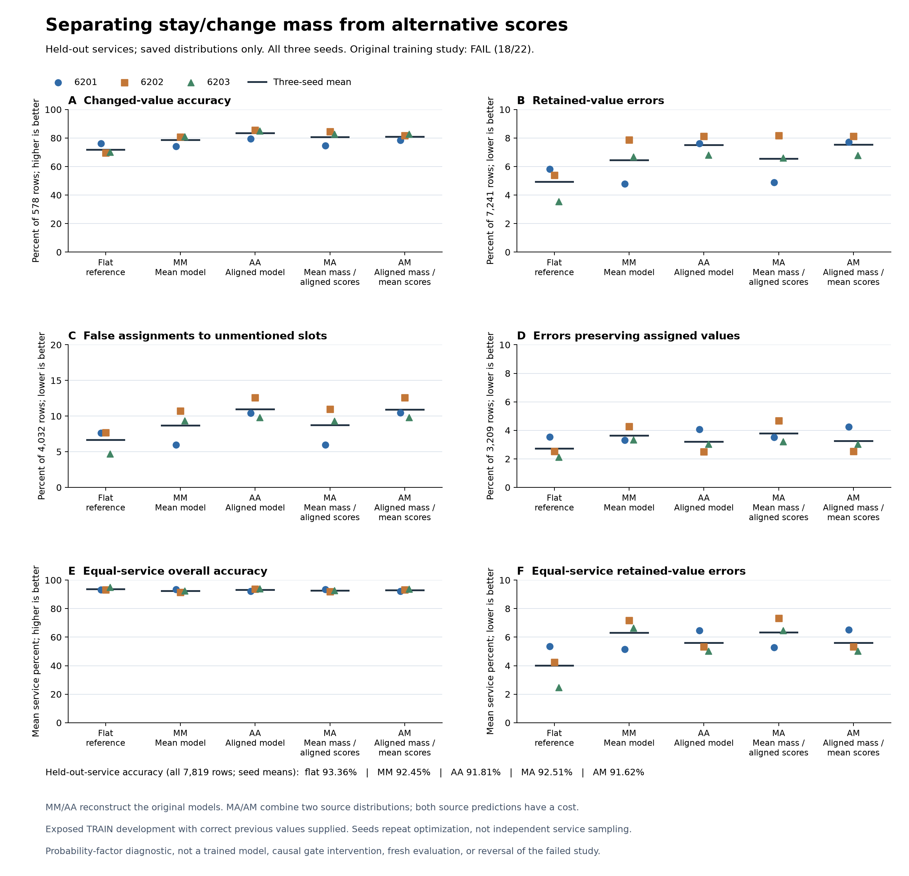

# Separating keep probability from alternative scores gives a mixed tradeoff

The saved-output diagnostic completed and its independent primary audit agrees.
Combining token-mean's keep probability with aligned alternative scores (MA)
raises changed-value accuracy from **78.60% to 80.68%** over token mean. It also
raises retained-value errors from **6.44% to 6.55%**. Overall accuracy improves
only **0.0554 percentage points**, to **92.5054%**, below the flat baseline's
**93.3623%**. This does not establish a better model.

Compared with alignment alone, MA recovers many pooled retention errors while
losing changed-value accuracy. **The retention benefit reverses when services
receive equal weight.** No diagnostic continuation gate was declared, and the
original training campaign remains **FAIL, 18/22**.

## What was computed

The [specification](dialogue-alignment-commitment-diagnostic.md), implementation,
tests and [source freeze](../output/dialogue-commitment-v1/protocol-02/freeze.json)
were published in commit `08dfc8d` before execution. All nine saved distributions
and all 13,599 existing evaluation rows were used. There was no fitting,
threshold search, model call, encoder call, checkpoint loading or new data.

For each seed, the previous candidate's probability comes from one model and
the conditional distribution over all other candidates comes from another:

| Construction | Previous-candidate mass | Conditional alternative scores |
|---|---|---|
| Flat | Original flat baseline | Original flat baseline |
| MM | Token mean | Token mean |
| AA | Token aligned | Token aligned |
| MA | Token mean | Token aligned |
| AM | Token aligned | Token mean |

MM and AA reproduce their source decisions exactly. MA and AM are algebraic
combinations, not newly trained architectures. The alternative distribution's
concentration matters as well as its ordering: donating keep probability does
not donate the donor's hard keep/change decision. These are factors of final
probabilities, not interventions on an internal gate. Both source predictions
would have to be paid for in an implementation.

The primary panel contains 7,819 held-out-service rows: 578 changes and 7,241
retentions, including 4,032 unmentioned and 3,209 assigned retentions. These
are historically exposed official TRAIN development examples. The evaluator
supplies the correct previous value. This is not autonomous recurrent memory,
fresh confirmation, calibration or a new architecture result.

## Primary results

Percentages below are equal means over the three paired training seeds. Row
metrics weight every row equally; service metrics give each supported service
equal weight. The three seeds repeat optimization on the same data.

| Construction | Changed accuracy | Retained error | All-row accuracy | Equal-service retained error | Equal-service overall accuracy |
|---|---:|---:|---:|---:|---:|
| Flat | 71.9146% | 4.9257% | 93.3623% | 4.0225% | 93.7408% |
| MM | 78.6044% | 6.4448% | 92.4500% | 6.3177% | 92.4522% |
| AA | 83.4487% | 7.5174% | 91.8148% | 5.6048% | 93.3187% |
| MA | 80.6805% | 6.5507% | 92.5054% | 6.3486% | 92.7079% |
| AM | 81.0842% | 7.5404% | 91.6187% | 5.6168% | 92.9990% |

MA's pooled retained error falls 0.9667 points relative to AA, but its
equal-service retained error rises 0.7438 points. Equal-service overall
accuracy also falls 0.6108 points. The aggregation choice materially changes
the conclusion; pooled retention improvement cannot be described as broad
service improvement.

| Construction | Unmentioned-retention error | Assigned-retention error | Changed equal-service NLL | Changed equal-service Brier |
|---|---:|---:|---:|---:|
| Flat | 6.6716% | 2.7319% | 1.630243 | 0.671468 |
| MM | 8.6806% | 3.6356% | 1.682973 | 0.565071 |
| AA | 10.9540% | 3.1993% | 1.306143 | 0.501669 |
| MA | 8.7384% | 3.8018% | 1.520756 | 0.528496 |
| AM | 10.9458% | 3.2617% | 1.468361 | 0.540078 |

Retained-row NLL for MA equals MM by construction: the target is the previous
candidate, whose probability is copied exactly. Likewise, AM's retained NLL
equals AA. Those identities are not additional evidence of improvement.
Reported NLL uses explicitly normalized float64 distributions. Maximum
absolute source log-normalizer is `2.0836202789398651e-7`; the original raw-log
metrics and exact normalization drift remain separately recorded.

## All seeds and the uneven tradeoff

These are correct changed decisions out of 578 and retained errors out of
7,241. No seed is selected or omitted.

| Construction | Seed | Changed correct | Retained errors | All-row accuracy |
|---|---:|---:|---:|---:|
| Flat | 6201 | 440 | 422 | 92.8380% |
| Flat | 6202 | 402 | 391 | 92.7484% |
| Flat | 6203 | 405 | 257 | 94.5006% |
| MM | 6201 | 429 | 346 | 93.6693% |
| MM | 6202 | 466 | 570 | 91.2777% |
| MM | 6203 | 468 | 484 | 92.4031% |
| AA | 6201 | 460 | 552 | 91.4311% |
| AA | 6202 | 495 | 588 | 91.4183% |
| AA | 6203 | 492 | 493 | 92.5950% |
| MA | 6201 | 432 | 353 | 93.6181% |
| MA | 6202 | 488 | 592 | 91.2777% |
| MA | 6203 | 479 | 478 | 92.6205% |
| AM | 6201 | 454 | 558 | 91.2777% |
| AM | 6202 | 473 | 588 | 91.1370% |
| AM | 6203 | 479 | 492 | 92.4415% |

| MA paired comparison | Seed 6201 | Seed 6202 | Seed 6203 |
|---|---:|---:|---:|
| Changed correct gained versus MM | +3 | +22 | +11 |
| Retained errors added versus MM | +7 | +22 | -6 |
| All-row correct gained versus MM | -4 | 0 | +17 |
| Retained errors recovered versus AA | +199 | -4 | +15 |
| Changed correct lost versus AA | 28 | 7 | 13 |

MA retains 36 of the aligned model's 84 net additional changed-correct events
over MM, or 42.9%. It recovers 210 of 233 additional pooled retention errors,
but 199 of that net recovery comes from seed 6201. These totals repeat the same
rows across three fits; they are not counts of independent new examples.
The net overall improvement over MM is just 13 repeated prediction events.

The reverse combination AM loses 6/22/13 changed-correct decisions relative
to AA. Its retained-correct differences are -6/0/+1. Overall accuracy falls
in all three seeds; the reverse swap offers no aggregate improvement over AA.

## Rare outcomes and remaining limits

All five constructions still miss every one of the five DONTCARE changes.
On the 29 TRUE changes, MA gets **3/9/7** correct across seeds, versus MM's
**3/10/7** and AA's **11/11/9**. Thus MA does not preserve alignment's TRUE
change improvement. The primary panel contains no FALSE changes or clears.
TRUE false-positive rates on the inherited 2,039 supported non-TRUE rows are
1.9127% for MM, 3.1878% for AA and 2.0108% for MA. Undefined zero-support
rates remain null in the full results.

All/seen/held-out panels, every service, row/service/dialogue weighting and
paired repair/harm tables are in the full summary. The independent checker
reproduces the primary panels and paired comparisons only. It does not
independently reproduce every service table or re-audit model training.

The [next specified control](dialogue-weight-prior-diagnostic.md) checks the
known training-objective weights before adding memory.
The original recipe deliberately gives changed, unmentioned-retention and
assigned-retention strata equal loss mass. A separately specified comparison
can test ordinary row-uniform cross-entropy alongside a commitment/value
parameterization. Categorical cross-entropy already decomposes into a binary
keep/change term and conditional alternative loss; simply renaming those
terms is not a new method. This diagnostic neither admits that training run
nor supports deploying a two-model combination.

## Execution and reproducibility

The diagnostic ran once in **1.67 seconds**, with 216.1 MiB process-lifetime
peak RSS. The separate audit ran once in **3.83 seconds**, checking **10,110
scalar comparisons across 75 primary cells and 225 paired cells**. Both were
within their fixed 60-second, 1 GiB RSS and 64 MiB output limits. These are
saved-output arithmetic costs, not model-inference timings.

The producer's initial 23 synthetic tests passed; its two revised label and
padding tests also passed. All 16 independent-auditor tests passed, including
an artificial all-nine producer/auditor integration. Lint passed. A metadata
collector failure before freezing is preserved in `protocol-01`; the corrected
freeze is `protocol-02`. No prediction arrays were read by the failed collector.
Figure 01 had overlapping labels; figure 02 fixed them without changing plotted
values. Figure 03 adds the audited equal-service panels. Both earlier figures
remain preserved. The final chart was visually inspected.

| Artifact | SHA256 |
|---|---|
| [Freeze](../output/dialogue-commitment-v1/protocol-02/freeze.json) | `44ba7347f00555520442a57363e490f4b61fd29a09e3ff167decf6c0d3115763` |
| [Diagnostic receipt](../output/dialogue-commitment-v1/diagnostic-01/receipt.json) | `cb69e0f5e2c579bbe4ac5b283f6651b0ead8eb04c6ba24677f4e1cfb16191af8` |
| [Full summary](../output/dialogue-commitment-v1/diagnostic-01/summary.json) | `97c3e4920ef4c6759f1ea65aad793acd906ed278aba6c878663725fc3994940e` |
| [Independent audit](../output/dialogue-commitment-v1/audit-01/receipt.json) | `d58afdabfc3434c2550fafadcae8f28d91ba21ca3689566a1d5086d099d7a547` |

Run instructions are in the saved `request` fields. Implementations:
[producer](../scripts/diagnose_dialogue_commitment.py),
[independent primary checker](../scripts/audit_dialogue_commitment.py),
[figure](../scripts/plot_dialogue_commitment.py).
