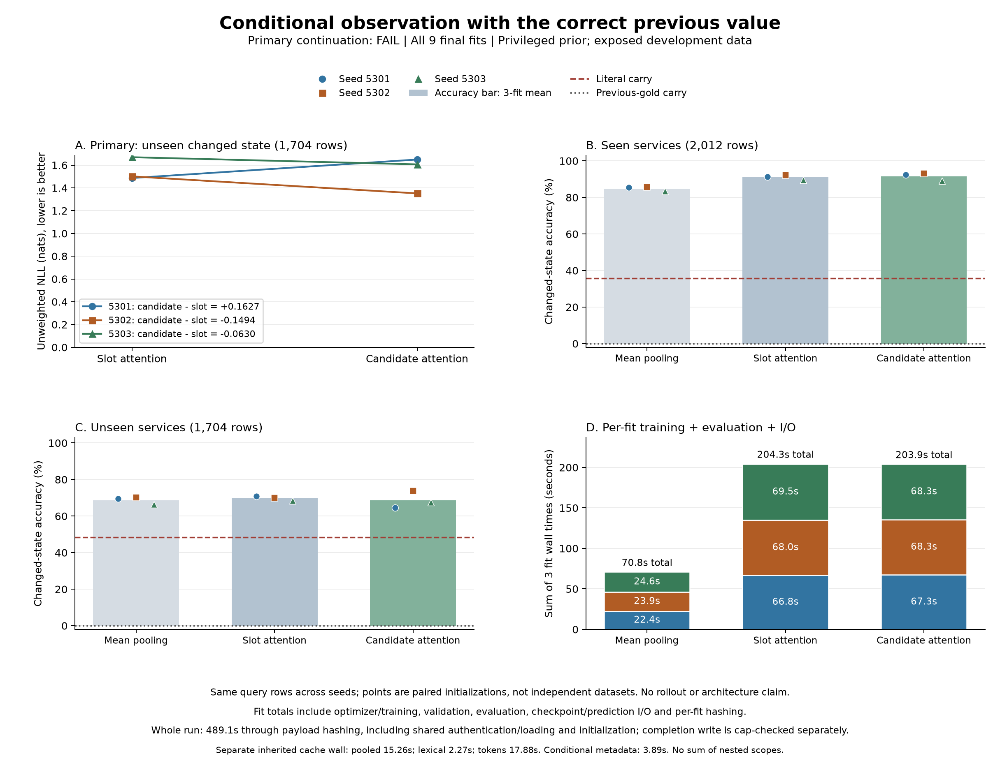

# Conditional observation: completed, continuation failed

All **nine fits completed**, and the independent saved-output audit found no discrepancies. Candidate-conditioned attention did **not** pass the frozen continuation rule: its unseen changed-state NLL was worse than slot-conditioned attention at one of three paired seeds. The small favorable average does not rescue the failure. This probe is closed; no retry, replacement seed, partial-fit selection or additional memory experiment is authorized by this result.

The diagnostic supplies the **correct previous categorical value** to every model. It measures conditional interpretation of the current observation, not autonomous memory, recurrent rollout, calibration or a novel architecture. Development data were already exposed; official test remains untouched.

The subsequent [saved-output error diagnosis](dialogue-conditional-error-results.md)
finds that every model chooses the previous NOT_MENTIONED value on all 31 unseen
TRUE updates. It separates that error pattern from ordinary-value regressions;
the original failed result is unchanged.

## Primary result

The sole primary is unweighted row-mean NLL on **1,704 unseen changed-state rows**, covering **1,125 dialogues**, **15 schema queries** and **1,588 dialogue-query streams**. Lower NLL is better. Rows within a dialogue are correlated; the seeds repeat the same data, not independent datasets.

| Seed | Slot NLL | Candidate NLL | Candidate minus slot | Relative change |
|---|---:|---:|---:|---:|
| 5301 | 1.486648 | 1.649352 | +0.162704 | +10.94% |
| 5302 | 1.501222 | 1.351799 | -0.149423 | -9.95% |
| 5303 | 1.669645 | 1.606642 | -0.063003 | -3.77% |

Mean paired change: **-0.016574 nats (-1.07%)**. The rule required a strictly negative difference at **all three seeds**. Seed 5301 instead worsened by **0.162704 nats (+10.94%)**. The continuation result is **FAIL**, despite all execution, coverage, numerical and cost checks passing.

Mean pooling, the smaller fixed secondary control, had unseen changed-state NLL **1.418295**, versus **1.552505** for slot attention and **1.535931** for candidate attention. Its result is not a replacement primary or a rescue of the failed rule.

## Fixed secondary results

Each entry below is the unweighted mean of three final-fit metrics on the same rows. NLL uses the saved log-softmax directly; Brier is the multiclass sum of squared probability errors. Probabilities are neither floored nor repaired.

| Development group | Model | Accuracy | NLL | Brier | Rows |
|---|---|---:|---:|---:|---:|
| seen/changed | Mean pooling | 84.82% | 0.599377 | 0.243972 | 2,012 |
| seen/changed | Slot attention | 91.09% | 0.393564 | 0.146478 | 2,012 |
| seen/changed | Candidate attention | 91.50% | 0.321311 | 0.132878 | 2,012 |
| unseen/changed | Mean pooling | 68.60% | 1.418295 | 0.514577 | 1,704 |
| unseen/changed | Slot attention | 69.74% | 1.552505 | 0.497348 | 1,704 |
| unseen/changed | Candidate attention | 68.64% | 1.535931 | 0.512150 | 1,704 |
| seen/retained | Mean pooling | 97.76% | 0.069709 | 0.033484 | 21,829 |
| seen/retained | Slot attention | 98.55% | 0.049914 | 0.022482 | 21,829 |
| seen/retained | Candidate attention | 98.47% | 0.051717 | 0.023722 | 21,829 |
| unseen/retained | Mean pooling | 96.72% | 0.124808 | 0.053293 | 25,525 |
| unseen/retained | Slot attention | 97.33% | 0.118324 | 0.044471 | 25,525 |
| unseen/retained | Candidate attention | 97.14% | 0.125446 | 0.046234 | 25,525 |
| seen/all | Mean pooling | 96.67% | 0.114409 | 0.051247 | 23,841 |
| seen/all | Slot attention | 97.92% | 0.078916 | 0.032946 | 23,841 |
| seen/all | Candidate attention | 97.89% | 0.074468 | 0.032934 | 23,841 |
| unseen/all | Mean pooling | 94.96% | 0.205755 | 0.082160 | 27,229 |
| unseen/all | Slot attention | 95.61% | 0.208076 | 0.072812 | 27,229 |
| unseen/all | Candidate attention | 95.36% | 0.213715 | 0.075391 | 27,229 |

Candidate attention improved the seen changed-state averages, but unseen changed-state accuracy fell **1.10 percentage points** from slot attention (69.74% to 68.64%), and Brier worsened (0.497348 to 0.512150). Candidate attention also regressed against slot attention on the seen-retained and unseen-retained averages for all three row-weighted metrics, and on all unseen rows for accuracy, NLL and Brier. Seen all-row accuracy decreased slightly even though its NLL and Brier improved.

The fixed revision subgroup remains difficult: unseen revision accuracy was **52.05% / 66.01% / 65.68%** for mean/slot/candidate, compared with **79.80%** for literal carry (203 rows). This subgroup cannot replace the failed primary. All nine fits score **0/31 on unseen changed TRUE rows**. Candidate attention also scores **0/23 on unseen changed DONTCARE rows at every seed**, compared with 2/23 for slot attention. Its 93.45% accuracy over all unseen TRUE rows comes from retaining the 442 already-correct TRUE values, not recognizing the 31 changes.

All **414 fit-group cells** and **92 reference-group cells**, including five transition groups, current-value groups, changed/retained breakdowns, row/equal-dialogue means and empty groups, are in the [audited analysis](../output/dialogue-conditional-v1/analysis-01/summary.json). The [secondary-means CSV](../output/dialogue-conditional-v1/tables-01/secondary-means.csv) and [all defined paired differences](../output/dialogue-conditional-v1/tables-01/secondary-differences.json) expose every secondary regression. Blank CSV cells and JSON nulls mean undefined, never zero. Those presentation tables average each saved per-fit metric; they add no outcome panels.

Deterministic references use the identical admitted rows and receive accuracy only. Previous-gold carry is 0% on changed rows and 100% on retained rows by definition. Literal carry is **35.74%** on seen changed rows and **48.36%** on unseen changed rows. The neural models' advantage over that reference in this privileged diagnostic is not a deployable dialogue-tracking gain.

## Cohort and execution

[Audited metadata preparation](dialogue-conditional-preparation-results.md) admitted **42,810 training rows** and **51,070 development rows**. Eligibility requires the same service/slot to be scored at adjacent public USER steps, with exact previous-ID remapping into the current schema. First turns and gaps are excluded. Admission never uses predictions.

There are **no FALSE targets or clear transitions among admitted development rows**. Unseen development has 473 TRUE and 162 DONTCARE rows. Neither the aggregate nor subgroup results support a general negation, polarity or clearing claim. Lexical inputs retain their disclosed causal literal-register history; this is not a pure current-utterance experiment.

The [frozen protocol](dialogue-conditional-training-protocol.md) used seeds 5301/5302/5303, twenty epochs, batches of 256, AdamW at 0.001, and three admitted-training strata with inverse-frequency weights. Every fit has **3,360 optimizer updates**, for **30,240 total**. All arms share the same seed's saved row orders and common initial scorer tensors; slot/candidate also share initial attention tensors. The scorer receives previous gold but never current gold or evaluator category flags. There is no carry mixture, departure head, recurrent state or BPTT.

Registered parameters are **99,393** for mean pooling and **173,121** for each attention model. Slot attention uses duplicated query inputs; equal registered counts do not imply equal effective functional dimensions. The 64 zero-entropy input weights and common softmax-shift bias are disclosed separately. These are small trainable decoders over frozen MiniLM features, not newly pretrained language models.

## Cost

The single run used float32 on Apple M5 Max CPU, four intra-op threads, one inter-op thread, Python 3.12.13 / NumPy 2.5.3 / Torch 2.14.0. A coordinated quiet window excluded another known heavy experiment at launch and during training.

- Whole recorded run: **489.08 seconds**, including authentication, cache loading, all fitting/evaluation, bookkeeping, payload I/O and hashing. Completion write/hash and return remained cap-checked beyond the recorded timestamp.
- Process-lifetime peak RSS: **3.005 GiB**, not a per-arm allocation measurement.
- Complete run artifacts: **124,246,259 bytes (118.49 MiB)**.
- All were below the fixed **3,600-second / 6-GiB / 512-MiB** ceilings.

| Model | Sum of three fit wall times |
|---|---:|
| Mean pooling | 70.80 s |
| Slot attention | 204.27 s |
| Candidate attention | 203.87 s |

Fit time includes optimizer setup, batches, validation, evaluation, checkpoint/prediction I/O and per-fit payload hashing. It excludes shared authentication/loading, model initialization, final receipt writing and whole-run hashing. These are measured training/evaluation scopes, not an inference-latency speedup benchmark.

Shared caches were not free. Their inherited recorded preparation walls were **15.26 s pooled**, **2.27 s lexical** and **17.88 s tokens**, with manifest payloads of **95,219,635 / 81,109,526 / 2,011,987,502 bytes** respectively. These are separate inherited producer scopes; do not sum nested timings. The new conditional metadata extraction recorded another **3.89 s** through its payload manifest, with **100,963,373 bytes** in the complete preparation directory. Synthetic tests, source reviews, plan freeze, saved-output reporting, audit and figure rendering are separately recorded and are not benchmark fit time.

## Evidence and terminal decision

The complete plan, all 18 source files and row orders were published in commit `55526c5ace9470b50ed1693c989359a84f5989a3` before training. Its remote plan bytes were verified against SHA-256 `0bc43fadc5cd4bdb1055810c0a415dae9bc6930ae45129b2bee6774b82400835`. [Launch and release receipts](../output/dialogue-conditional-v1/launch-01/) retain the CPU-window context.

The [complete 43-file execution copy](../output/dialogue-conditional-v1/training-01/) preserves final weights, predictions, orders, every update and completion receipts byte-for-byte. Root completion SHA-256: `df3c172bae7163292b54cdd9a3b1d6e3bb5a07acb49b62be4f0c0dfc68efbe75`. Its [publication receipt](../output/dialogue-conditional-v1/publication-01/receipt.json) distinguishes this exact execution copy from the aggregate-only metadata export.

The independently implemented [saved-output audit](../output/dialogue-conditional-v1/training-audit-01/summary.json) checked all fixed metrics, references, row/work counts, costs and source identities without importing the model or reporter or executing training/inference. Its [receipt](../output/dialogue-conditional-v1/training-audit-01/receipt.json) retains the original temporary execution path. The [published auditor](../scripts/audit_dialogue_conditional_training_saved.py) is byte-identical, SHA-256 `f743845f04fddb04589d7c32ce8d6ed2a8335d18944048a015e1a1532f5b2550`. Historical initializer digests, runtime counters and inherited cache validity remain authenticated execution witnesses, not a new tensor replay.

The [preflight receipts](../output/dialogue-conditional-v1/training-preflight-01/) preserve the initial reporter failure on a different Python runtime and its correction before freeze. The final model/preparation/runner/reporter suites passed 63/41/30/56 synthetic checks respectively. No scientific execution was retried.

**Decision:** close this conditional-attention probe. The observed seen-service improvements and two favorable seeds do not meet the continuation rule. The result supports neither an architecture advantage nor an ICLR novelty claim. Any subsequent work needs a separately justified question and protocol; these outputs must not be retimed, retuned or relabeled as a successful memory experiment.
