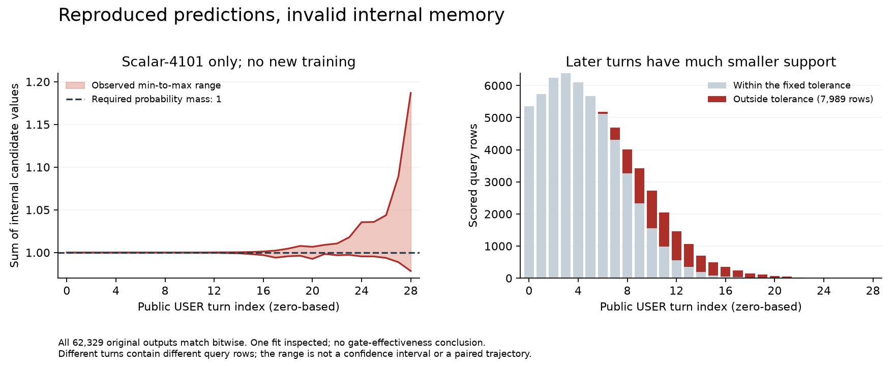

# Memory qualification stopped on an internal normalization defect

**The first replay reproduced every saved prediction but failed its internal probability checks.** Do not use this attempt to choose a new memory gate or claim an improved architecture. The failure exposes a numerical defect in the original scalar-memory implementation.



## What completed

The [prospective protocol](dialogue-evidence-qualification-protocol.md) and source were published in commit `5640906` before replay. The plan digest is `11d444b137951c0435c5bb1c4c5a97734229b4d2fe9bab24fa3d33f52002d24b`. The run restored the existing `scalar-4101` checkpoint and matched all 62,329 scored development rows. It then stopped at the factor-validity check, before producing a successful per-fit diagnostic. The other five scheduled fits were not replayed.

The failed attempt took 2.36 seconds, including 74 returned model forwards and 1,084 recurrent batch updates. No new weights, encoder calls, official test access or retries were used. The source, original checkpoints, saved predictions, failed receipt and partial outputs are retained.

The raw prior belief sums ranged from **0.978359 to 1.186877**. **7,989 of 62,329 rows** exceeded the frozen `2e-6` normalization tolerance. The largest departure mass was **1.029081**, with two rows above the permitted upper bound. These deviations are materially larger than the allowed roundoff. The tolerance was not relaxed, and the factors were not clipped or silently renormalized to produce counterfactual results.

An [independent saved-output audit](../output/dialogue-evidence-qualification-v1/failure-audit/summary.json) verified bitwise equality of all eight original arrays and confirmed the factor violations. Of 51,070 adjacent scored same-query transitions, the source-derived mass formula below matches to a maximum absolute residual of `3.48e-7`. The first violations appear at turn index 5. The final index, 28, contains only four scored rows, so the figure's late extremes should not be read as typical dialogue behavior. [Audit receipt](../output/dialogue-evidence-qualification-v1/failure-audit/receipt.json).

## Why the original update can drift

Let `S=sum(b)` and `m=sum(b*r)`. The original scalar implementation computes retained mass per candidate as `b_i * sum_j(b_j*(1-r_j))`. With a normalized writer, its next total mass is therefore:

```text
S_next = S*(S-m) + m
S_next - 1 = (S-1)*(S+1-m)
```

At exactly `S=1` this matches the intended scalar equation. In float32, small mass errors can recur. Near `S=1`, the error is multiplied approximately by `2-m`, which approaches two when departure is small. Learned gates also depend on state, so this is an operator-level explanation, not a fitted-model stability proof.

The model's final softmax normalizes the reported outputs. That explains why prediction replay and the earlier output-only audit passed: those checks did not establish normalization of the recurrent states used as features.

Final normalization does not undo the internal effect. Write `b=S*q` for a normalized `q` and `rho=sum(q*r)`. The effective scalar write fraction after output normalization is `rho / (S*(1-rho)+rho)`. A larger `S` can make memory harder to replace. The belief and entropy features also change with `S`. The selective equation lacks this particular quadratic mass term, so the defect introduces an unintended difference between the compared mechanisms.

## Effect on the earlier report

The [15-fit report](dialogue-copy-results.md) still describes the actual saved outputs of its frozen implementation, and its 7/13 continuation failure remains unchanged. However, comparisons involving scalar memory cannot be interpreted as a clean test of the intended normalized-belief mechanism. Re-normalizing old checkpoints at inference would change their behavior and would not repair the training history.

Only the first scalar fit's internal factors were captured. Do not extend its measured violation counts to other seeds or methods. A corrected implementation needs explicit float32 long-sequence checks and a new, separately specified training comparison before making an efficacy claim.

## Corrected version

The separate [V2 implementation](dialogue-memory-normalization-fix.md) normalizes memory before using it as a feature and after each real update. It preserves the original source and adds no learned parameters. Forty-five focused tests include 512-turn float32 sequences; the combined V2 and qualification suite passes **78 tests**, with Ruff clean and an independent source review. These are implementation checks only. No V2 training or evaluation on the corpus has run, and the failed six-fit qualification was not retried.

[Failed execution receipt](../output/dialogue-evidence-qualification-v1/replay-01/failed.json) · [Published and retained file manifest](../output/dialogue-evidence-qualification-v1/replay-01/publication-manifest.json) · [Frozen protocol](dialogue-evidence-qualification-protocol.md) · [Reproduction contract](dialogue-evidence-reproduction.md) · [Saved-output error analysis](../output/dialogue-copy-error-diagnostic-v1/README.md)
