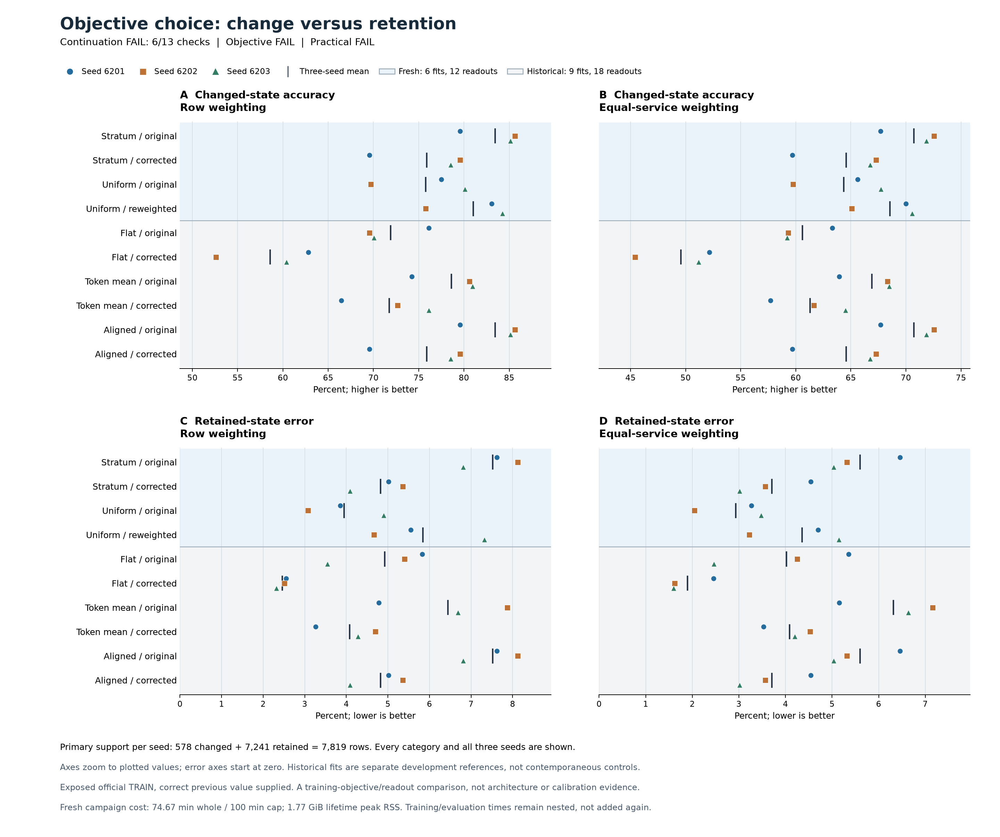
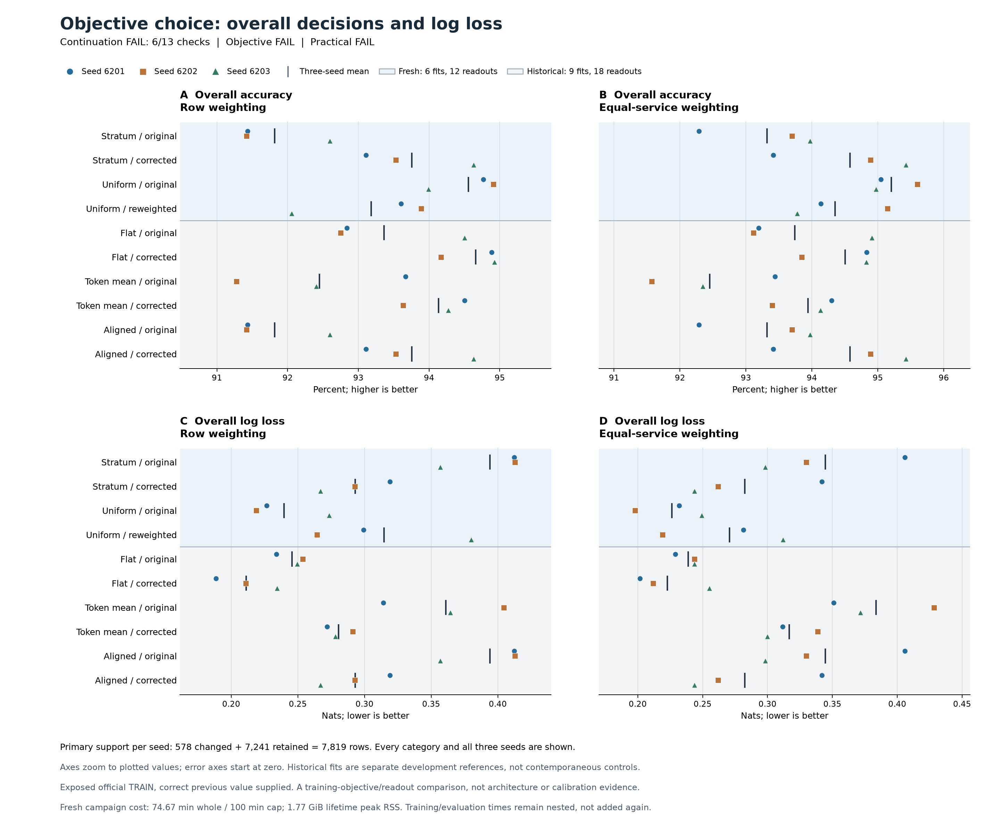

# Row-uniform training improves retention but fails the required comparison

All six fresh fits completed once. The reporter and independent primary audit
agree: **continuation failed, with 6 of 13 checks passed**. Compared with fresh
stratum training plus fixed inverse-weight correction, row-uniform training
reduces mean retained error from **4.82% to 3.95%** and overall row log loss
from **0.2930 to 0.2397**. Changed accuracy is **75.78% versus 75.89%**, missing
the required two-percentage-point improvement. The objective and practical
requirements both fail.

This is evidence about a training objective on an exposed development task.
It establishes neither a new architecture nor calibration or autonomous
memory efficacy. All earlier failures remain unchanged.

## What was compared

The [frozen protocol](dialogue-objective-protocol.md) used the same token-aligned
model, complete paired initial tensors and saved row orders for seeds
6201-6203. Each objective received 20 epochs and 2,300 optimizer updates per
fit, with effective batch 256 and microbatch 32. Stratum training gives equal
loss mass to unmentioned retention, assigned retention and changes; uniform
training gives every fitting row weight one.

All 29,211 fitting rows and 13,599 evaluation rows come from historically
exposed official TRAIN. The primary held-out-service panel contains 7,819 rows:
578 changes and 7,241 retentions. Every prediction receives the **correct
previous value from the evaluator**. There was no official DEV inference or
TEST access. Three seeds repeat optimization on the same examples; they are
not three independent evaluation populations.

Four fixed readouts distinguish training from score adjustment. Original
readouts normalize saved log probabilities in float64. Corrected stratum
divides probabilities by the fixed analytic FIT weights, then normalizes;
reweighted uniform multiplies by those weights. Neither transformation uses
the current target or fits a threshold. All six fits were saved before quality
scoring, with no checkpoint or seed selection.

## Means and stronger references

Entries are equal means over three seeds. Rates below weight rows equally;
NLL is in nats. Historical references are pinned earlier results, not new
equal-capacity fits in this campaign.

| Readout | Changed accuracy | Retained error | Overall accuracy | Overall NLL |
|---|---:|---:|---:|---:|
| Fresh stratum, original | 83.45% | 7.52% | 91.81% | 0.3940 |
| Fresh stratum, corrected | 75.89% | 4.82% | 93.75% | 0.2930 |
| Fresh uniform, original | 75.78% | 3.95% | 94.56% | 0.2397 |
| Fresh uniform, reweighted | 81.03% | 5.85% | 93.18% | 0.3146 |
| Historical corrected flat | 58.59% | 2.46% | **94.66%** | **0.2113** |
| Historical corrected token mean | 71.74% | 4.08% | 94.13% | 0.2804 |
| Historical corrected aligned | 75.89% | 4.82% | 93.75% | 0.2930 |

Uniform training improves average retention and overall loss beyond fixed
score correction, but does not supply the required changed-state gain.
Reweighting its output increases changed accuracy while increasing retention
errors. That secondary readout cannot replace the frozen primary comparison.
Its changed accuracy also remains below original stratum training.

The weighting of services matters. Uniform's overall equal-service accuracy
is **95.21%**, versus **94.50%** for historical corrected flat, a gain of
0.7040 points. Its pooled accuracy is lower by 0.1023 points. Overall NLL is
worse than corrected flat under both weightings: **0.2397 versus 0.2113** by
row and **0.2264 versus 0.2229** by service. A favorable accuracy aggregate
does not establish dominance or calibration.

## All thirteen requirements

Differences are uniform-original minus the named control, averaged over seeds.
Rate differences use percentage points (pp); NLL differences use nats. Joint
conditions require the same seeds to satisfy both row and service comparisons.

| Requirement | Observed difference or count | Frozen requirement | Result |
|---|---:|---:|---|
| Changed accuracy vs fresh corrected stratum, row | -0.1153 pp | At least +2 pp | FAIL |
| Changed accuracy, equal service | -0.2228 pp | At least +2 pp | FAIL |
| Retained error, row | -0.8746 pp | At most 0 | PASS |
| Retained error, equal service | -0.7775 pp | At most 0 | PASS |
| Overall NLL, row | -0.053325 | At most 0 | PASS |
| Overall NLL, equal service | -0.056095 | At most 0 | PASS |
| Joint objective seeds: changed accuracy up, retained error no worse | 1/3 | At least 2/3 | FAIL |
| Overall accuracy vs historical corrected flat, row | -0.1023 pp | At least +0.25 pp | FAIL |
| Overall accuracy, equal service | +0.7040 pp | At least +0.25 pp | PASS |
| Overall NLL, row | +0.028387 | At most 0 | FAIL |
| Overall NLL, equal service | +0.003429 | At most 0 | FAIL |
| TRUE false-positive rate, row | -0.6212 pp | At most +0.5 pp | PASS |
| Joint practical seeds: overall accuracy up, NLL no worse | 0/3 | At least 2/3 | FAIL |

The objective passes 4/7 checks and the practical comparison 2/6. All thirteen
were required; neither a favorable mean nor a secondary readout rescues failure.

## Seed variation and rare outcomes

This table shows the primary paired comparison. Changed counts share the
578-row denominator; retained errors share 7,241. NLL differences are for all
7,819 primary rows.

| Seed | Changed correct: corrected stratum → uniform | Retained errors: corrected stratum → uniform | Overall row NLL difference |
|---|---:|---:|---:|
| 6201 | 402 → 448 | 363 → 279 | -0.092479 |
| 6202 | 460 → 403 | 388 → 223 | -0.073945 |
| 6203 | 454 → 463 | 296 → 355 | +0.006450 |

Seed 6201 alone meets the joint objective condition. Seed 6202 loses changed
decisions despite better retention; seed 6203 gains changed decisions but
worsens retention and both row/equal-service NLL. Against historical corrected
flat, uniform has worse row NLL at every seed, so no seed meets the joint
practical condition. There is no significance or seed-stability claim.

Uniform gets **8/2/9 of 29 TRUE changes** correct, compared with **5/10/7** for
corrected stratum. All twelve fresh readouts miss **all five DONTCARE changes**.
The primary panel has no FALSE changes or clears. TRUE false-positive rates
use 2,039 eligible non-TRUE rows, not the 29 TRUE changes. Small or absent
supports cannot establish general polarity or preference interpretation.

## Cost, verification and terminal scope

The single run took **4,480.1063 seconds (74.67 minutes)**, within the frozen
6,000-second, 6 GiB RSS and 512 MiB output limits. It completed **13,800 optimizer
updates**, 109,560 training microbatches and 2,550 evaluation microbatches.
Peak process-lifetime RSS was **1,901,625,344 bytes**; the 32 execution files
total **73,697,480 bytes**. Whole time includes authentication, initialization,
training, evaluation and serialization. Nested fit timings must not be added
again. Historical encoder/cache preparation remains a separate cost; this is
not an inference-latency measurement.

The saved-only reporter took 5.00 seconds and the independent audit 1.69 seconds.
They agree on **3,566 scalar comparisons across 60 primary cells, 30 paired
cells and all 13 decisions**. The audit independently reconstructs primary
metrics and rules using pinned arithmetic. It inherits technical training
validation from the authenticated report; it does not replay neural inference,
gradients or optimizer updates. Secondary panels, full service tables,
descriptive means and cost accounting are not separately reproduced by that
audit, except service counts needed for the rules. Both readers made zero
model/encoder calls or checkpoint deserializations. All 56 frozen scientific
sources remained unchanged; the [59 preflight cases](dialogue-objective-status.md)
and earlier failed attempts remain documented.

This closes the six-fit campaign without meeting its continuation rule. It
does not reverse the [earlier 18/22 alignment failure](dialogue-token-alignment-scientific-results.md)
or convert [weight correction](dialogue-weight-prior-results.md) into an
architecture result. The [source-specific memory idea](dialogue-source-memory-decision.md)
remains conditional and unproven. Failure here does not establish source
confusion or automatically admit a new memory experiment.

| Evidence | SHA256 |
|---|---|
| [Training completion](../output/dialogue-objective-v1/training-01/completed.json) | `535dbded805d3a14dc61668195b909164b3802924e91a520d267ddf950718e02` |
| [Full report summary](../output/dialogue-objective-v1/report-01/summary.json) | `d744753d9edb545b9060867500e3c390d03da69937ffd6d8b3fd1e0c12c4cf6b` |
| [Report receipt](../output/dialogue-objective-v1/report-01/receipt.json) | `93e7ae0656faf56b5b7687951bbd7265ec936688e3ef6c89c12925931bca1af9` |
| [Independent audit receipt](../output/dialogue-objective-v1/audit-01/receipt.json) | `4c88a0ea790dd788d64d887afb764d75a7e9f24d5b6ea7f0ad1bd08b0205e541` |

The summary retains all fresh and historical readouts, each seed, other panels,
service effects and paired repair/harm counts. See the [execution history](dialogue-objective-status.md)
for the frozen plan, completed implementation checks and original launch command.
