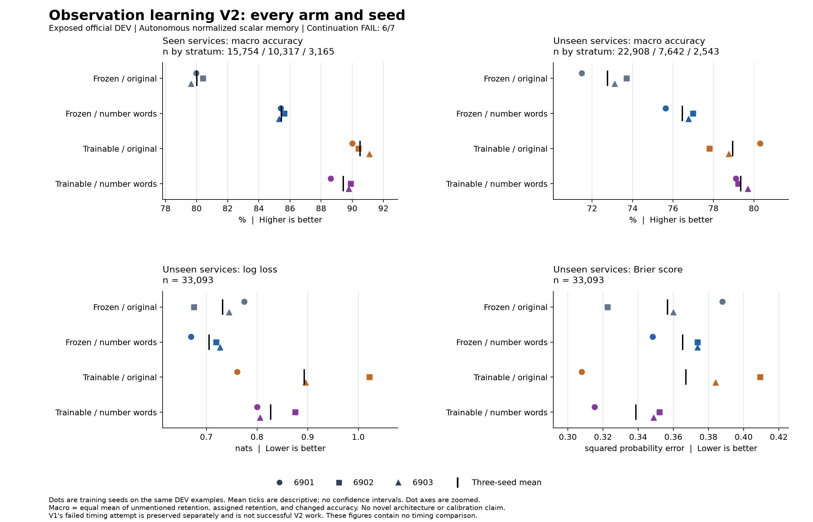
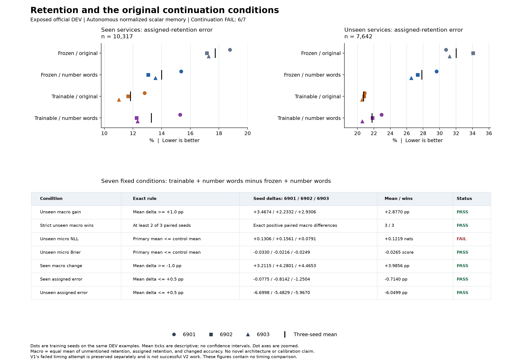

# Text fine-tuning improves decisions but worsens unseen log loss

All **twelve fresh fits completed**. The producer report and independent audit
agree: **scientific continuation failed, with 6 of 7 conditions passed**.
Training the text encoder improves unseen-service macro accuracy by **2.8770
percentage points**, but worsens log loss in every paired seed. This is useful
evidence about observation learning, not a successful overall comparison or a
connectome, recurrent-architecture, world-model or calibration advantage.

## Matched comparison

The [frozen protocol](dialogue-observation-learning-protocol-v2.md) crossed
frozen/trainable MiniLM encoders with original/number-normalized lexical
features, using seeds **6901, 6902 and 6903**. Every arm retained the same
normalized scalar memory, public streams, training labels, paired head
initialization, dialogue orders and loss. Each fresh fit ran twenty epochs and
1,280 optimizer updates, followed by final-only evaluation. Predicted state
remained autonomous; previous gold values did not enter the actor.

Each fit scored **62,329 official DEV endpoints**, including 33,093 from unseen
services. DEV is exposed development data; official TEST remains untouched.
The three seeds repeat optimization on the same evaluation examples.

## Primary result

The primary comparison is trainable_numbers versus frozen_numbers. Entries are
equal means over all three seeds, rounded for display; the linked summary
retains full precision. Macro accuracy equally weights unmentioned retention,
assigned retention and changed states. NLL and Brier use endpoint-micro means.

| Metric | Frozen encoder + numbers | Trainable encoder + numbers |
| --- | ---: | ---: |
| Unseen macro accuracy | 76.4632% | 79.3402% |
| Unseen NLL, lower is better | 0.705265 | 0.827207 |
| Unseen Brier, lower is better | 0.365248 | 0.338746 |
| Seen macro accuracy | 85.4432% | 89.4288% |
| Seen assigned-retention error | 13.9963% | 13.2823% |
| Unseen assigned-retention error | 27.8374% | 21.7875% |

Macro accuracy improves in all three paired seeds. Unseen NLL increases by
**0.130619 / 0.156069 / 0.079138** for seeds 6901/6902/6903. The NLL safeguard
fails; all six other [predeclared conditions](dialogue-observation-learning-scoring.md)
pass. No secondary arm, selected seed or score adjustment replaces that result.

The unseen gain comes from retention. Assigned-retention accuracy improves
**6.0499 points**, and unmentioned retention improves **2.6992 points**.
Changed-state accuracy is **80.3120% versus 80.1940%**, slightly worse after
fine-tuning. The producer's descriptive revision breakdown also declines
**2.1346 points**, on 203 endpoints per fit. These observations do not identify
a missing recurrent mechanism.

## Next question

The subsequently specified [saved-probability diagnostic](dialogue-probability-diagnostic-results.md)
now locates the NLL regression in the common subset where either model assigns
the correct answer below 1% probability. Its complement improves in every
paired seed. The full fixed temperature grid shows output sensitivity without
fitting or selecting a temperature. This justifies a separate calibration
control, not a causal attribution or a reversal of this study's failure.
Calibration fitting should use dialogues excluded from weight fitting, treat
frozen and trainable models equally, preserve all seeds and leave recurrent
state unchanged.

[Earlier belief-conditioned encoding](dialogue-observation-followup-candidates.md)
remains conditional on demonstrating a reproducible state-dependent residual.
This result alone does not admit that architectural experiment.

## Evidence and execution

The [producer report](../output/dialogue-observation-learning-v2/report-01/report.md),
[full summary](../output/dialogue-observation-learning-v2/report-01/summary.json)
and [receipt](../output/dialogue-observation-learning-v2/report-01/receipt.json)
retain all arms, seeds, contrasts and costs. Scientific execution took
**17,062.620 seconds** under the eight-hour suspend-inclusive cap. The
[terminal review](../output/dialogue-observation-learning-v2/scientific-terminal-review-01.json)
verified actual exit 0, process cleanup and all 64 frozen source hashes.

The [independent audit](../output/dialogue-observation-learning-v2/result-audit-01/result-02/receipt.json)
agrees on **144 fit cells, 24 literal-reference cells, 1,608 scalar checks**,
equal-seed means and all seven conditions. Detailed transition-bin, service/type
tables and descriptive contrasts inherit the authenticated producer; they were
not independently recomputed. Neither reader replayed training, and both made
**zero model calls**.

An [initial audit launch failed](../output/dialogue-observation-learning-v2/result-audit-01/result-01/failed.json)
before the auditor body because its launcher bypassed the virtual environment.
The [prospective launcher correction](../output/dialogue-observation-learning-v2/result-audit-01/launcher-correction-01.json)
preserved that failure and reran the unchanged auditor against unchanged inputs.
Training was not restarted. The separate
[failed V1 timing attempt](dialogue-observation-learning-timing-failure.md)
also remains preserved and unscored.
