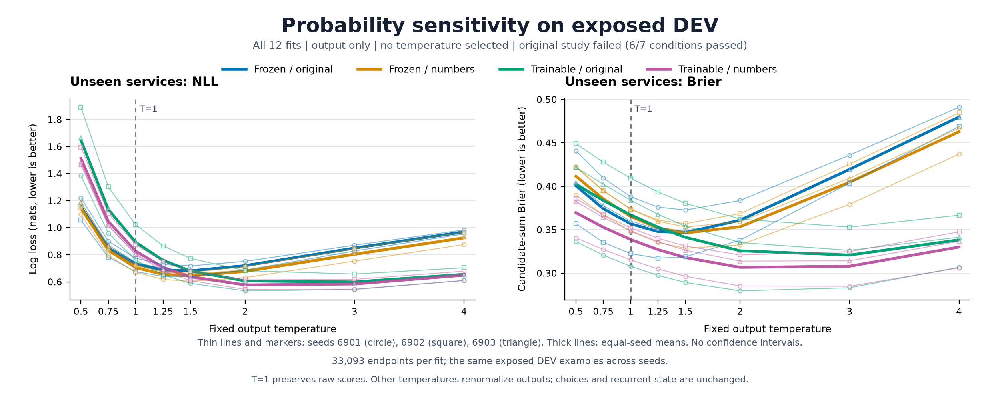

# The log-loss regression is concentrated in low-probability correct answers

The saved-output diagnostic completed for **all twelve fits**. In each primary
paired seed, the subset where either model assigns the correct answer less than
1% probability contributes more than the entire unseen log-loss regression.
The complementary subset improves. This is a matched numerical decomposition,
not evidence that training caused overconfidence or that a new architecture is
needed. **The original study still fails: six of seven conditions passed.**

This analysis was specified after seeing the completed V2 aggregate results.
Its [protocol](dialogue-probability-diagnostic-protocol.md), qualified code and
[input-pinned plan](../output/dialogue-probability-diagnostic-v1/plan.json) were
published before execution. It uses the same 62,329 exposed DEV endpoints per
fit, including 33,093 unseen-service endpoints. No model was called, temperature
fitted or selected, prediction regenerated, actor state changed, or official
TEST data accessed.

## Where the primary loss difference comes from

The comparison is trainable_numbers minus frozen_numbers; positive differences
are worse. Contributions below divide by all 33,093 unseen endpoints in each
seed, so the two subset contributions sum to that seed's original NLL gap.
Membership is shared by both models, using the union of their strict-below
true-label probability events. These thresholds were fixed before diagnosis.

| Threshold | Seed | Shared tail endpoints | Tail contribution | Complement contribution | Total gap |
| --- | ---: | ---: | ---: | ---: | ---: |
| 0.01 | 6901 | 2,416 | +0.259042 | -0.128423 | +0.130619 |
| 0.01 | 6902 | 2,577 | +0.290446 | -0.134377 | +0.156069 |
| 0.01 | 6903 | 2,506 | +0.191006 | -0.111869 | +0.079138 |
| 0.0001 | 6901 | 354 | +0.089208 | +0.041410 | +0.130619 |
| 0.0001 | 6902 | 408 | +0.121274 | +0.034795 | +0.156069 |
| 0.0001 | 6903 | 204 | +0.047600 | +0.031538 | +0.079138 |
| 0.000001 | 6901 | 85 | +0.035089 | +0.095529 | +0.130619 |
| 0.000001 | 6902 | 108 | +0.041853 | +0.114216 | +0.156069 |
| 0.000001 | 6903 | 34 | +0.013011 | +0.066127 | +0.079138 |

The 1% subsets contain **7.30-7.79%** of unseen endpoints. The much smaller
1e-6 subsets do not explain the full regression: their complements still
worsen. Thresholds are nested; contributions across thresholds must not be
added. Display rounding can slightly alter sums.

The four correctness transitions provide a second exhaustive decomposition:

| Frozen to trainable decision | Prediction events across three seeds | Mean NLL-gap contribution |
| --- | ---: | ---: |
| Wrong to wrong | 10,583 | +0.124050 |
| Wrong to correct | 13,166 | -0.270913 |
| Correct to wrong | 9,933 | +0.314479 |
| Correct to correct | 65,597 | -0.045675 |
| All | 99,279 | +0.121942 |

More mistakes are fixed than introduced, but the new mistakes carry a larger
loss penalty than the loss reduction from fixed mistakes. Still-wrong decisions
also contribute positively. These are repeated predictions on the same 33,093
endpoints, not 99,279 independent examples.

## Confidence and output-only temperature sensitivity

Among decisions with at least 99% top-choice confidence, the frozen model's
mean confidence is **99.62%** and accuracy **95.39%**; the trainable model's
are **99.84%** and **91.93%**. These are equal means of three seed-specific bin
statistics, on different selected subsets. The average bin sizes are 5,977.3
and 18,478 endpoints respectively. This describes top-choice reliability,
not full multiclass calibration. Neither primary model has confidence above
one on the unseen panel.

The entire fixed grid is shown below. Entries are equal-seed means on unseen
endpoints. Every fit preserves its original selected IDs at every temperature;
T=1 preserves the raw saved distribution exactly. Other temperatures transform
only the final output, without changing the recurrent trajectory.

| Temperature | Frozen NLL | Trainable NLL | Frozen Brier | Trainable Brier |
| ---: | ---: | ---: | ---: | ---: |
| 0.50 | 1.144214 | 1.512723 | 0.411590 | 0.369595 |
| 0.75 | 0.832185 | 1.046659 | 0.385587 | 0.352845 |
| 1.00 | 0.705265 | 0.827207 | 0.365248 | 0.338746 |
| 1.25 | 0.655272 | 0.707469 | 0.352040 | 0.327134 |
| 1.50 | 0.644247 | 0.638315 | 0.346302 | 0.317968 |
| 2.00 | 0.676883 | 0.577173 | 0.353454 | 0.306729 |
| 3.00 | 0.803664 | 0.583965 | 0.404749 | 0.308012 |
| 4.00 | 0.925058 | 0.648893 | 0.462849 | 0.330102 |

These exposed-DEV curves motivate a calibration control. They do not select a
temperature, establish generalization, reverse the original failure, or show
that temperature scaling is novel.

## Next experiment

Freeze a separate calibration subset from source TRAIN dialogues excluded from
all twelve fits. Fit the same output-only temperature procedure for every arm
and seed, leaving actor state unchanged. Compare raw and calibrated proper
scores on the already declared DEV panels, keeping the original result separate.
This requires a new protocol and bounded inference run; it has not happened.

Existing preparation metadata indicates that additional nonfitted TRAIN
dialogues are materialized locally. Exclude normalized-text duplicate groups
containing any fitted dialogue, not only fitted IDs. Exact eligible membership
has not been measured. The current evaluator hardcodes DEV and the worker has
no inference-only final-checkpoint loader, so a separately qualified replay
wrapper is needed; calibration TRAIN must not be relabeled as DEV. Training
distribution calibration alone would not guarantee unseen-service calibration.
The current result supplies no evidence for biological wiring, a recurrent
world model or an expressive limitation of scalar memory.

The implementation can reuse the existing
[actor/label builders](../src/openjev/research/dialogue_finetune_dataset.py),
[normalized-text identity](../src/openjev/research/dialogue_state_data.py),
[lexical pair builder](../scripts/prepare_dialogue_observation_learning.py) and
[V2 forward path and checkpoint schema](../scripts/study_dialogue_observation_v2.py).
Actual fitted membership must come from authenticated preparation orders,
not from recomputing the original hash shortlist. New calibration actors need
their own packet indices; checkpoint loading must be strict and inference-only.

## Evidence

The [complete diagnostic](../output/dialogue-probability-diagnostic-v1/run-01/summary.json)
contains all four arms, three seeds, all/seen/unseen panels, their three strata,
all confidence bins, tails, transitions and temperatures. The
[execution receipt](../output/dialogue-probability-diagnostic-v1/run-01/receipt.json)
records **6.465 seconds**, **372,015,104 bytes peak RSS**, all twelve fits and
zero model calls. All **1,188 baseline scalar comparisons** agree with the
published V2 report, and all 64 scientific source hashes remain unchanged.
The [qualification receipt](../output/dialogue-probability-diagnostic-v1/qualification-01/receipt.json)
preserves the pre-freeze fixes and **47 passing synthetic tests**. Those tests
establish implementation checks, not task efficacy.

The [independent arithmetic audit](../output/dialogue-probability-diagnostic-v1/independent-audit-01/result-01/receipt.json)
agrees on **27,320 scalar checks**, covering all 144 fit groups, 1,152
temperature/group cells and 36 paired groups. It independently reconstructs
the diagnostic arithmetic from saved logs, including Brier via an alternative
identity and temperature normalization via log-add-exp. Authentication and
canonical layout are inherited from the qualified readers; training and actor
execution are not replayed. Seven closed-form fixtures passed before decoding
predictions. Its [actual exit record](../output/dialogue-probability-diagnostic-v1/independent-audit-01/actual-exit.json)
records success on the sole invocation, with zero model calls.

The [plotted values](../output/dialogue-probability-diagnostic-v1/figure-01/plotted-values.json)
and [plot source](../output/dialogue-probability-diagnostic-v1/figure-01/plot.py)
retain all twelve curves in both panels. The figure adds equal-seed means,
without treating the seeds as independent evaluation data or adding confidence
intervals. The linked [actual exit record](../output/dialogue-probability-diagnostic-v1/actual-exit-01.json)
binds the completed diagnostic to the observed successful process exit.
