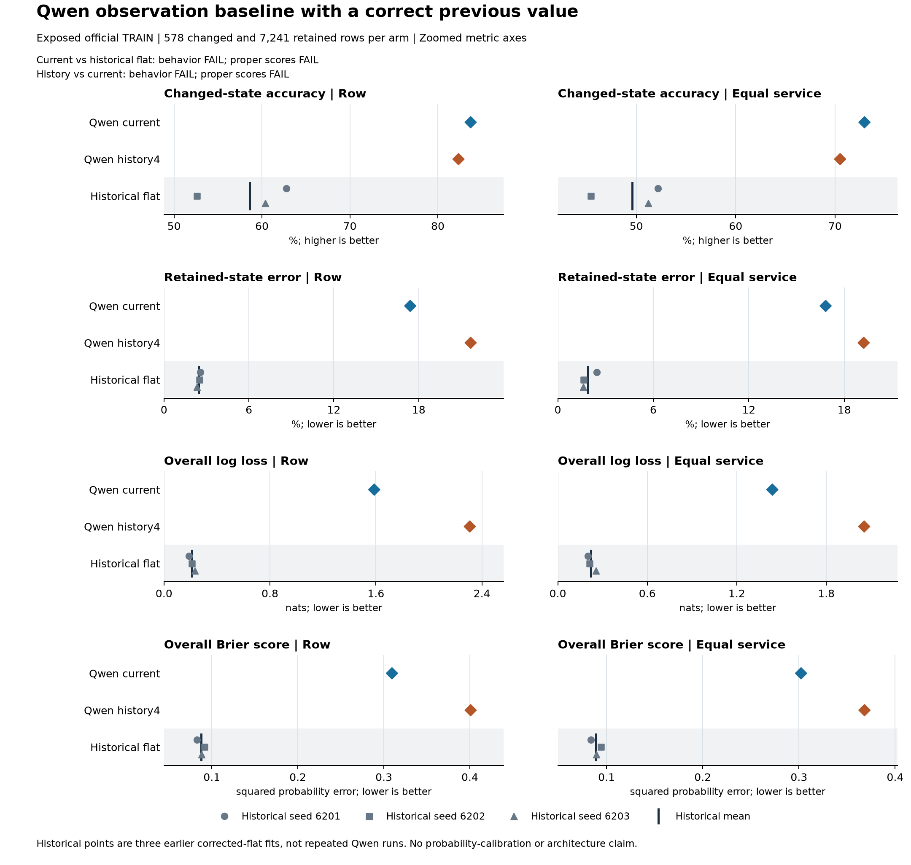

# Qwen finds more updates but loses too many retained values

Both frozen Qwen arms completed all **7,819 decisions**. The current-turn arm
gets **484 of 578 changes correct (83.74%)**, versus **58.59%** for the fixed
three-seed historical corrected-flat mean. That gain comes with **1,260 errors
on 7,241 retained values (17.40%)**, versus **2.46%** historically. Adding three
earlier public exchanges reduces changed accuracy and increases retained error.

**Both behavioral comparisons fail. Both separate proper-score nonregression
checks also fail.** These are four distinct conclusions, each with four
prespecified components, not a combined architecture gate.

## Scope and fixed comparison

The [prospective protocol](dialogue-qwen-observation-protocol.md) uses the
existing local `mlx-community/Qwen3-4B-Instruct-2507-4bit`, revision
`50d427756c6b1b2fe0c0a10f67fbda1fc8e82c1b`. There is no training, generated
answer, fitted calibration, threshold search or model selection. Each question
receives the **correct previous value**, supplied schema and candidates, and
the same ten public lexical flags. These flags include a literal register over
the full public prefix, so the current arm is not history-free.

`current` sees the preceding SYSTEM/current USER pair. `history4` adds up to
three earlier public USER exchanges, including unscored turns. Candidate
descriptions map to unique single-token answer labels; probabilities are the
temperature-one softmax over those labels. Full prompts are batched in groups
of at most four questions at the same dialogue/time. This is not a shared-prefix
speed experiment, RL training or autonomous recurrent memory.

All rows come from repeatedly exposed **official TRAIN**, with six services
held out from the earlier local fitting split: Events_1, Homes_1, Hotels_1,
Music_2, Services_1 and Services_3. There are **578 changes**, **4,032 unmentioned
retentions** and **3,209 assigned retentions**. No official DEV inference or
TEST access occurred. Unknown Qwen pretraining overlap prevents calling these
schemas unseen to Qwen. The historical control is not matched for parameters,
compute, pretraining or optimization. Its seeds are three earlier fitted models
evaluated on the same rows, not three independent Qwen runs or evaluation populations.

## All primary metrics and historical seeds

Each entry is **row weighting / equal-service weighting**. Accuracy and error
are percentages; NLL is in nats; Brier is summed squared categorical error.
Historical means weight all three seeds equally, without selecting the best.

| Arm or historical fit | Changed accuracy | Retained error | Overall NLL | Overall Brier |
|---|---:|---:|---:|---:|
| Qwen current | 83.7370 / 72.9665 | 17.4009 / 16.8298 | 1.5871 / 1.4383 | 0.3095 / 0.3022 |
| Qwen history4 | 82.3529 / 70.5144 | 21.6683 / 19.2217 | 2.3085 / 2.0541 | 0.4010 / 0.3681 |
| Corrected flat, seed 6201 | 62.8028 / 52.1599 | 2.5549 / 2.4591 | 0.1885 / 0.2016 | 0.0826 / 0.0835 |
| Corrected flat, seed 6202 | 52.5952 / 45.4053 | 2.5135 / 1.6228 | 0.2109 / 0.2120 | 0.0917 / 0.0942 |
| Corrected flat, seed 6203 | 60.3806 / 51.1924 | 2.3201 / 1.6021 | 0.2344 / 0.2553 | 0.0883 / 0.0893 |
| **Corrected-flat mean** | **58.5928 / 49.5859** | **2.4628 / 1.8947** | **0.2113 / 0.2229** | **0.0875 / 0.0890** |

Overall row accuracy is **82.68% current**, **78.63% history4** and **94.66%** for
the historical mean. Always carrying the supplied previous gold achieves
**92.61% overall**, while necessarily missing every change. The unchanged
literal register achieves **65.88% overall** and **49.13% on changes**. These
deterministic references have accuracy only, not invented probability scores.

The score tradeoff is not uniform. On changed rows, current Qwen improves Brier
from **0.6765 to 0.3016**, but worsens NLL from **1.7924 to 1.8914** relative to
the historical mean. On retained rows, NLL rises from **0.0851 to 1.5628** and
Brier from **0.0405 to 0.3101**. History4 worsens both scores within both strata
under row and equal-service weighting. All subgroup scores, the other fixed
MiniLM readouts and equal-dialogue metrics remain in the
[full summary](../output/dialogue-qwen-observation-v1/report-01/summary.json).

## Four separate four-component conclusions

Differences are candidate minus control. Rate differences use percentage points
(pp); NLL and Brier use their original units. Decisions use unrounded values.

**Current versus historical corrected-flat mean: behavioral FAIL, 2/4.**

| Component | Difference | Requirement | Result |
|---|---:|---:|---|
| Changed accuracy, row | +25.1442 pp | At least +2 pp | PASS |
| Changed accuracy, equal service | +23.3807 pp | At least +2 pp | PASS |
| Retained error, row | +14.9381 pp | At most 0 | FAIL |
| Retained error, equal service | +14.9351 pp | At most 0 | FAIL |

**Current versus historical corrected-flat mean: proper-score nonregression FAIL, 0/4.**

| Component | Difference | Requirement | Result |
|---|---:|---:|---|
| Overall NLL, row | +1.375781 | At most 0 | FAIL |
| Overall NLL, equal service | +1.215332 | At most 0 | FAIL |
| Overall Brier, row | +0.221964 | At most 0 | FAIL |
| Overall Brier, equal service | +0.213208 | At most 0 | FAIL |

**History4 versus current: behavioral FAIL, 0/4.**

| Component | Difference | Requirement | Result |
|---|---:|---:|---|
| Changed accuracy, row | -1.3841 pp | At least +2 pp | FAIL |
| Changed accuracy, equal service | -2.4521 pp | At least +2 pp | FAIL |
| Retained error, row | +4.2674 pp | At most 0 | FAIL |
| Retained error, equal service | +2.3919 pp | At most 0 | FAIL |

**History4 versus current: proper-score nonregression FAIL, 0/4.**

| Component | Difference | Requirement | Result |
|---|---:|---:|---|
| Overall NLL, row | +0.721405 | At most 0 | FAIL |
| Overall NLL, equal service | +0.615838 | At most 0 | FAIL |
| Overall Brier, row | +0.091471 | At most 0 | FAIL |
| Overall Brier, equal service | +0.065921 | At most 0 | FAIL |

## Where history helps and harms

On exactly paired rows, history4 repairs **351** current-arm errors but breaks
**668** correct decisions, a net loss of **317**. Changes account for **19
repairs and 27 harms**; retention accounts for **332 repairs and 641 harms**.
This is paired descriptive evidence, not independent-trial significance.

Unmentioned-retention errors increase from **461/4,032 (11.43%)** to
**780/4,032 (19.35%)**. Assigned-retention errors decrease slightly from
**799/3,209 (24.90%)** to **789/3,209 (24.59%)**. That ten-decision improvement
does not offset the other losses; assigned-retention NLL and Brier still worsen
under both primary weightings.

Sparse categories remain a limitation rather than a success criterion. Current
and history4 correctly update **2/29 and 3/29 TRUE changes**, versus
**2/29, 4/29 and 0/29** for the three historical corrected-flat seeds. Both Qwen arms and all three
historical fits miss **all five DONTCARE changes**. There are no FALSE targets
in this panel, so FALSE recall is undefined, not zero or perfect. Across all
580 TRUE targets, Qwen gets only **32 and 23** correct, versus **553/555/551**
historically. This makes the retention problem substantive even with a correct
previous value supplied.

All-row TRUE false positives are **15/2,039 current** and **92/2,039 history4**;
DONTCARE false positives are **482/7,804** and **421/7,804**. These denominators
include only non-target rows that actually offer the respective candidate.
They must not be replaced by the 29 TRUE or five DONTCARE changed-row counts.

## Cost and verification

The full run completed once in **3,229.396 seconds (53.82 minutes)**, including
load, authentication, inference, validation, I/O and final hashes. Peak
process-lifetime RSS was **3,712,122,880 bytes (3.712 GB, about 3.46 GiB)**,
within the frozen **7,200-second, 12 GiB RSS and 512 MiB output** caps.
It made **7,444 forward calls** for **15,638 decisions**, charging
**13,771,479 padded input-token positions**. Per-request timers nest within
whole-run time and exclude file writes; they are not added again.

Successful preparation took **12.963 seconds** and the fixed **28-call** cost
pilot **17.564 seconds**. Their combined time with full inference is
**3,259.923 seconds (54.33 minutes)**. The pilot's **6,316-second** projection
was an admission heuristic, not measured full-run latency. Its decisions were
repeated in the full run and charged separately, not selected for quality.
An earlier model-free preparation attempt failed on local cache metadata
resolution; that failure remains preserved. The successful-phase total above
does not include that earlier failure, historical model training or pretraining.

The saved-only reporter completed in **2.893 seconds**, reconstructing float64
candidate log probabilities without floors, exact frozen prompt-order ties,
metrics and all sixteen decision components. It found **36 current** and
**38 history4** exact ties and no underflowed target probabilities. Candidate
normalization error was at most **2.22e-16**. These numerical checks establish
neither calibration nor semantic correctness. Unsaved full-vocabulary logits
cannot be independently reconstructed; their saved partition witnesses are
checked for consistency. Actual inference and public-input provenance remain
bound to the frozen execution and preparation evidence.

The [independent saved-result audit](../output/dialogue-qwen-observation-v1/result-audit-01/receipt.json)
agrees on **530 scalar checks across 42 cells and all sixteen decision
components**, taking **1.416 seconds** with zero model calls. It independently
reconstructs supported-label probabilities, prompt-order choices and
all/changed/retained accuracy, error, NLL and Brier under row/equal-service
weighting, including per-service results. Historical metrics are inherited
from the pinned earlier summary. Rare groups, retention subtypes, equal-dialogue
metrics, paired repairs/harms, cost, vocabulary mass and public actor provenance
are not independently re-audited there; they retain the main report and
preparation's stated verification scope. Figure-02 only corrects overlapping
header text in the preserved first render, using the same completed report.

## Interpretation and evidence

Qwen's higher changed-state accuracy is useful evidence that the compact
observation models left some decision quality available. It is not a practical
dominance result: retention, overall accuracy and proper scores regress sharply,
and TRUE/DONTCARE updates remain weak. More public history does not fix those
problems in this frozen prompt and readout. The experiment does not distinguish
prompt interpretation, value grounding, pretraining effects or score behavior
as the cause. It therefore does **not justify porting the result into a learned
recurrent memory** or claiming a new memory mechanism. All earlier failed
continuation rules remain unchanged.

The subsequent [saved-output retention diagnosis and blinded Astra6 review](dialogue-qwen-retention-results.md)
partitions these failures and identifies a preference-versus-action ambiguity
in two fixed sampled cases. It does not revise this experiment's labels,
predictions, metrics or failed continuation decisions.

The [question builder](../src/openjev/research/dialogue_qwen_observation.py),
[inference runner](../scripts/run_dialogue_qwen_observation.py) and
[reporter](../scripts/report_dialogue_qwen_observation.py) define the exact
implementation. Dataset provenance and SGD's **CC BY-SA 4.0** terms are recorded
in the [data reproduction guide](dialogue-memory-reproduction.md). Original
OpenJev code uses the [project MIT license](../LICENSE); upstream data and
model terms remain separate. The exact prompts are available through the
[lossless request packet and its dataset notice](../output/dialogue-qwen-observation-v1/publication-01/README.md).
Saved candidate predictions, timing records and aggregates accompany the run;
external model weights remain local. Publication does not relicense upstream
data or models.

| Evidence | SHA256 |
|---|---|
| [Preparation plan](../output/dialogue-qwen-observation-v1/preparation-02/plan.json) | `2d5f7e6b512ae7260cc01685ae03220891ad4ca5236092645197d4074be90111` |
| [Full-run completion](../output/dialogue-qwen-observation-v1/run-01/completed.json) | `872ee6819af4cbc4f7e0bd6397d6c90907dba9aaecc995abb6045fd20520f70c` |
| [Report summary](../output/dialogue-qwen-observation-v1/report-01/summary.json) | `931f60349dc7dace7508d0f3307a6c480c4e14022de7e2c047b6f024ec349c6c` |
| [Report receipt](../output/dialogue-qwen-observation-v1/report-01/receipt.json) | `3106ca10cfa939fb47af41560772ae66a9308911cbfb5aa290dbe213f93e4ce2` |
| [Independent result audit](../output/dialogue-qwen-observation-v1/result-audit-01/receipt.json) | `8dc7996b9d70a2c330c040a62537e8db8ff4a79d6125c311f28978fd9a8c5848` |
