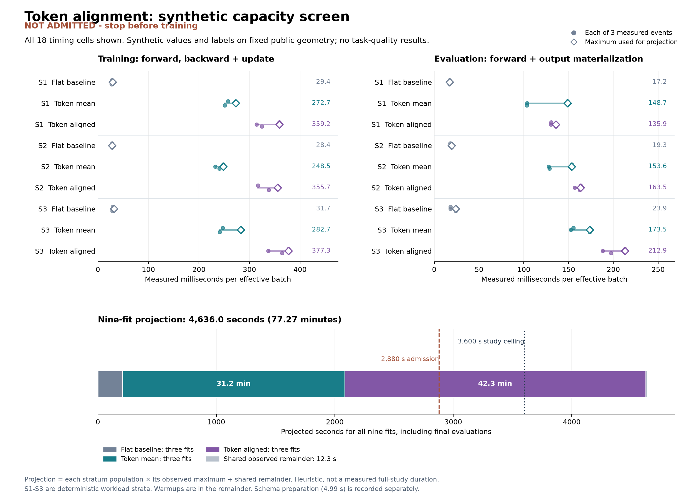

# Token alignment: valid implementation, cost screen not admitted

The complete synthetic cost probe projects **77.27 minutes** for the planned
nine-fit comparison, above the frozen **48-minute admission threshold** and
60-minute whole-study ceiling. **No scientific fits or accuracy evaluation
were run.** This is a cost result, not evidence for or against task quality.

## What was implemented

The [design](dialogue-token-alignment-design.md) compares the existing flat
candidate-attention scorer with two token comparison models. Both new models
share **124,482 registered parameters** and complete initial weights; one uses
the opposite sequence's mean, the other bidirectional soft token alignment.
Their common subset of **75,138 parameters** is copied from the fresh baseline,
which has **173,506 parameters** overall. This is an adaptation of established
align/compare/aggregate attention. No recurrent or biological architecture
advantage is claimed.

Each supplied candidate already contains its full service/slot question and
value text. The new cache preserves these exact strings for every candidate.
It contains **53 query schemas, 307 candidate strings and 360 unique strings**
including standalone questions. Frozen MiniLM encoding completed once in
**4.995 seconds**, using three encoder calls and retaining all **9,962 tokens**.
Total cache size, including its completion receipt, is **16,067,867 bytes**.

Every reconstructed pooled vector agrees with its original cached counterpart:
maximum absolute float32 error **7.45e-8**, below the fixed **2e-5** limit.
The [independent cache audit](../output/dialogue-token-alignment-v1/schema-audit-01/result-01/summary.json)
reconstructs exact strings, candidate coverage, token geometry, priors and
pooling without running an encoder. Its independent float64 reconstruction has
maximum error **3.64e-8**. The recorded encoder calls and timings remain
authenticated execution witnesses, not an independent rerun.

## Measured and projected cost

The [frozen protocol](dialogue-token-alignment-capacity-protocol.md) retains all
29,211 fitting and 13,599 evaluation rows, three paired seeds, 20 epochs,
effective batch 256 and row microbatch 32. The cache and workload are drawn
from original TRAIN; no official DEV inference or TEST access occurs.

The probe completed **72 synthetic events**, including **36 optimizer updates**,
**576 microbatch forwards** and **288 microbatch backwards**, in **20.841 seconds**.
Peak process RSS was **0.737 GiB**, below the 6-GiB limit. All numerical,
support, gradient and execution-coverage checks completed. The scalar losses
use synthetic targets and are not task-quality measurements.

Each of 18 arm/phase/workload cells contains one warm event and three measured
events. Timing includes the same actor assembly, model validation, forward,
backward where applicable, clipping, optimizer step, output materialization
and journal flush. The figure shows all three measurements and each maximum.

| Arm, three planned fits each | Projected fitting | Projected evaluation | Projected subtotal |
|---|---:|---:|---:|
| Existing flat-stratum scorer | 205.79 s | 3.26 s | 209.05 s |
| Token mean comparison | 1,848.90 s | 25.69 s | 1,874.59 s |
| Token alignment | 2,512.32 s | 27.67 s | 2,539.99 s |
| Observed shared remainder | | | 12.33 s |
| **Projected nine-fit total** | | | **4,635.96 s / 77.27 min** |

The estimate multiplies each cell's largest measured duration by the frozen
number of batches in its workload stratum: 6,900 fitting updates and 162
evaluation batches per arm across all three seeds. Shared remainder includes
authentication, geometry reconstruction, setup and warm events. The one-time
schema preparation cost is reported separately above, not hidden inside a
model's decision latency.

This is a heuristic. Synthetic values use small deterministic banks and
uniform valid priors; their access pattern differs from actual memory-mapped
feature gathering. The fixed composite geometry proxy does not identify the
slowest possible shape for every operation. Full-study checkpoint saving,
final prediction compression and end-of-study hashing were not performed or
separately measured. Background VM and browser activity is recorded in the
receipt. These limitations prevent a clean hardware-speed or end-to-end
runtime claim; the admission decision is still unambiguously negative under
the stated estimate.

The [independent capacity audit](../output/dialogue-token-alignment-v1/capacity-audit-01/result-01/summary.json)
agrees with all 72 event identities and operation counts, 18-cell timing
arithmetic, scalar stratum counts, source/manifests and the unchanged admission
decision. It performs no model calls. Full token geometry, model calculations
and the truth of clock/RSS observations remain source-bound execution
witnesses rather than independently reexecuted measurements. Its
[receipt](../output/dialogue-token-alignment-v1/capacity-audit-01/result-01/receipt.json)
has SHA256 `6b22c787a63c8028fc107a6df3a0d11ebbe7591d00f239a8ecdd3de69a6a7c4d`.

## Interpretation and terminal state

The larger cost is already present in the mean comparison arm. This suggests
that tokenwise comparison and repeated candidate work, rather than only the
pairwise alignment matrix, matter for this implementation's cost. It does not
establish the exact component bottleneck, nor predict either model's accuracy.
Fewer parameters did not make the token models cheaper in this local probe.

The [scientific protocol](dialogue-token-alignment-study-protocol.md) remains
conditional and unexecuted. Its nine fits were not admitted. No alternative
kernel, microbatch size, reduced support or replacement seed was measured to
rescue this result. No fitted checkpoint was selected or produced. The schema
cache and model implementation are reusable; any different experiment needs
its own explicit design and compute allocation. Prior failed studies retain
their original decisions.

## Provenance and correction

The first metadata freeze failed in **0.779 seconds**, before any model call,
because the shared adapter omitted an authentication bookkeeping counter.
Its [failure receipt](../output/dialogue-token-alignment-v1/capacity-protocol-01/failed.json)
is preserved. A narrowly scoped loader fix and regression test were published
in commit `448c8bc`; the corrected freeze was published in `2161f9b` before
the single empirical probe. No numerical recipe or cost limit changed.

- [Corrected workload freeze](../output/dialogue-token-alignment-v1/capacity-protocol-02/completed.json):
  `d037a378a62f4c81ae55cf28e1e4e7a1c901c5059c0326f05ae18207fd0f33c3`.
- [Execution receipt](../output/dialogue-token-alignment-v1/capacity-01/completed.json):
  `a3bf8c6728227f0f5dec17a8fa2bcc1371470ca6a9f2cb9fd7ae75b5792505b5`.
- [Projection](../output/dialogue-token-alignment-v1/capacity-01/projection.json):
  `dda2779a562298dae3d96cf919a643ed76999f656ebda126f6f79bbcfc7cf1ad`.
- [Schema-cache receipt](../output/dialogue-token-alignment-v1/schema-cache-01/completed.json):
  `630116d89e87ada14ad6dbe0028680acd6adaa5413f850364e3232aa6762168a`.

Synthetic verification covered 42 model tests, 20 schema-preparation tests,
four common-actor/loader tests and 23 probe tests; Ruff passed. These checks
validate implementation behavior and boundaries, not empirical efficacy.
