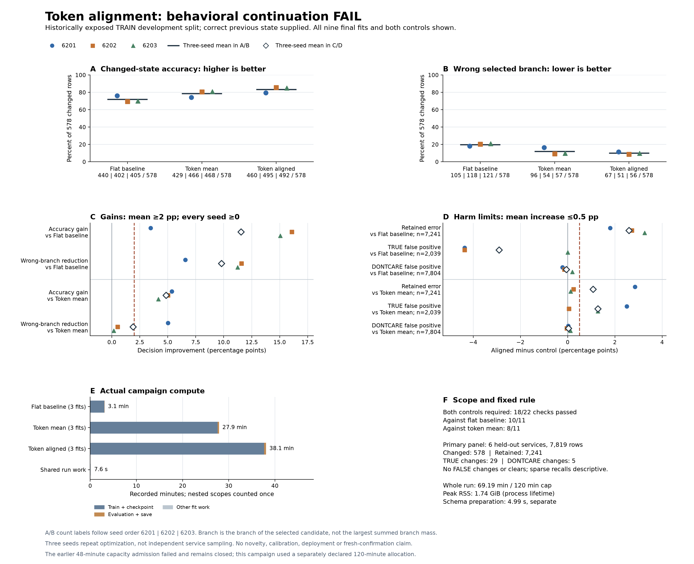

# Token alignment improves changed-state decisions but fails the retention safeguards

The nine-fit campaign completed once, and the independent saved-output audit
agrees with the reporter. **The frozen continuation rule failed: 18 of 22
checks passed.** Alignment improved accuracy on the 578 held-out-service
changed rows to **83.45%**, versus **78.60%** for the matched token-mean control
and **71.91%** for the flat baseline. However, it made more mistakes on the
7,241 retained rows. Across all 7,819 primary rows, accuracy was **91.81%**,
below both controls' **92.45%** and **93.36%**.

This is a development result for an adaptation of established token alignment.
It does not establish a novel architecture, calibration, autonomous state
tracking, or a broadly better model. The failed rule remains failed.

## What was compared

The [protocol](dialogue-token-alignment-scientific-protocol.md) fixed three
fresh seeds, 6201-6203, for each of three arms: the flat candidate-attention
baseline, token comparison using opposite-sequence means, and bidirectional
token alignment. Mean and aligned models have the same **124,482 parameters**,
complete initial weights, inputs and training orders; their intervention is
the token interaction. The **173,506-parameter** baseline shares the same
fresh **75,138-parameter** compatible scorer subset. It is a separate control,
not an equal-parameter comparison.

All arms used the same frozen MiniLM caches, public candidate types, lexical
features and **correct previous value supplied by the evaluator**. Candidate
strings preserve their original service/slot question and value. The split
contains 29,211 fitting rows and 13,599 evaluation rows from official TRAIN.
Whole dialogues containing held-out services were excluded from fitting.
These examples were historically exposed in earlier experiments; this is not
fresh confirmation. There was no official DEV inference or TEST access.

Every fit used 20 epochs, effective batch 256, row microbatch 32, the same
three-stratum weighting, and 2,300 AdamW updates. All nine final checkpoints
were evaluated and retained before quality scoring. No seed or checkpoint
was selected after observing results.

## Changed-state benefit and the four failed checks

The following are equal means over three seeds. Decision rates use all 578
changed rows. NLL and Brier give equal weight to each held-out service; the
full report also includes row and dialogue weighting.

| Arm | Changed accuracy | Wrong selected branch | Wrong value within correct branch | Equal-service NLL | Equal-service Brier |
|---|---:|---:|---:|---:|---:|
| Flat baseline | 71.91% | 19.84% | 8.25% | 1.6302 | 0.6715 |
| Token mean | 78.60% | 11.94% | 9.46% | 1.6830 | 0.5651 |
| Token aligned | **83.45%** | **10.03%** | **6.52%** | **1.3061** | **0.5017** |

Alignment improved changed accuracy by **11.5340 percentage points** over the
flat baseline and **4.8443 points** over token mean. Accuracy and wrong-branch
rate improved at every paired seed against both controls. Here, branch means
the branch of the selected candidate: NONE, DONTCARE or concrete. It is not
the branch with the largest summed probability.

Against token mean, the accuracy gain consists of a **1.9031-point reduction
in wrong-branch errors** and a **2.9412-point reduction in wrong-value errors**.
The former narrowly misses the required two-point mean reduction. The other
three failures concern retained states and TRUE false positives:

| Failed check | Aligned change versus control | Frozen limit |
|---|---:|---:|
| Retained error versus flat baseline | **+2.5917 pp** | At most +0.5 pp |
| Wrong-selected-branch rate versus token mean | **-1.9031 pp** | At most -2.0 pp |
| Retained error versus token mean | **+1.0726 pp** | At most +0.5 pp |
| TRUE false-positive rate versus token mean | **+1.2751 pp** | At most +0.5 pp |

The rule passed 10/11 checks against the flat baseline and 8/11 against token
mean. Both controls were required. Lower loss or better changed-state accuracy
does not replace the failed safeguards. Retained error increased at every
paired seed against both controls, and TRUE false positives increased at every
paired seed against token mean.

| Arm | Retained error, n=7,241 | TRUE false positives, n=2,039 | DONTCARE false positives, n=7,804 | All-primary accuracy, n=7,819 |
|---|---:|---:|---:|---:|
| Flat baseline | 4.9257% | 6.0978% | 0.1410% | **93.3623%** |
| Token mean | 6.4448% | **1.9127%** | **0.0513%** | 92.4500% |
| Token aligned | 7.5174% | 3.1878% | 0.0854% | 91.8148% |

False-positive denominators include primary rows offering that type whose
target is a different type. They are not just the changed rows. The larger
retained population reverses the changed-state accuracy advantage in the
all-row result. Even the supplied-previous-value reference reaches **92.6078%**
on all primary rows, with zero changed accuracy and perfect retained accuracy.
This reference is privileged and is not a deployable dialogue tracker.
The literal-register reference reaches **49.1349%** on changed rows and
**65.8780%** on all primary rows; these references are accuracy-only.

## Every seed

Counts below use the same denominator in each column. NLL is equal-service
changed-state NLL. The full machine-readable report retains all other panels,
transition/value groups and per-service results.

| Arm | Seed | Correct / 578 | Wrong branch / 578 | Retained errors / 7,241 | TRUE false positives / 2,039 | NLL |
|---|---:|---:|---:|---:|---:|---:|
| Flat baseline | 6201 | 440 | 105 | 422 | 176 | 1.2163 |
| Flat baseline | 6202 | 402 | 118 | 391 | 149 | 1.5257 |
| Flat baseline | 6203 | 405 | 121 | 257 | 48 | 2.1486 |
| Token mean | 6201 | 429 | 96 | 346 | 36 | 1.8556 |
| Token mean | 6202 | 466 | 54 | 570 | 59 | 1.1400 |
| Token mean | 6203 | 468 | 57 | 484 | 22 | 2.0534 |
| Token aligned | 6201 | 460 | 67 | 552 | 87 | 1.7364 |
| Token aligned | 6202 | 495 | 51 | 588 | 60 | 1.0269 |
| Token aligned | 6203 | 492 | 56 | 493 | 48 | 1.1551 |

Against token mean, alignment repairs 57/49/45 changed-row errors but breaks
26/20/21 previously correct decisions at the respective seeds. These are
paired prediction events on the same examples, not 1,734 independent samples.

The retained-error increase is concentrated in the 4,032 rows where the value
should remain unmentioned. Net additional errors versus token mean are
**181/75/19** across the three seeds, totaling 275 repeated prediction events.
On the 3,209 assigned-retention rows, net error differences are **+25/-57/-10**,
a net improvement of 42. Together these yield 233 additional retained errors.
This distinguishes false assignments to unmentioned slots from a general loss
of already assigned values; it does not establish why the model made them.

TRUE-change recall is descriptive: correct counts are **8/11/0** for flat,
**3/10/7** for mean, and **11/11/9** for aligned, each out of 29. Every fit gets
**0/5 DONTCARE changes** correct. There are no FALSE changes or clears in the
primary panel. These supports do not establish general polarity or preference
handling, and three optimizer seeds do not create new service samples.

## Recorded cost and terminal state

The complete campaign took **4,151.5024 seconds, or 69.19 minutes**, within its
separately frozen 7,200-second allocation. It completed 20,700 optimizer
updates, 164,340 training microbatches and 3,825 evaluation microbatches.
Peak process-lifetime RSS was **1,869,643,776 bytes (1.741 GiB)**. The execution
contains 44 files totaling **94,196,294 bytes**.

| Arm, three fits each | Training and checkpoint | Evaluation and prediction save | Whole-fit subtotal |
|---|---:|---:|---:|
| Flat baseline | 183.6463 s | 2.5954 s | 186.2572 s |
| Token mean | 1,654.7020 s | 18.6912 s | 1,673.4054 s |
| Token aligned | 2,260.8875 s | 23.3349 s | 2,284.2338 s |
| **All fits** | **4,099.2358 s** | **44.6215 s** | **4,143.8963 s** |

Training and evaluation are nested inside each fit subtotal. An additional
**7.6060 seconds** of shared campaign work brings the fit subtotals to whole-run
time; do not add the nested columns again. Whole-run accounting includes
authentication, gathering, padding, initialization, training, evaluation,
serialization and hashing. It is not inference latency or a controlled
hardware speed benchmark.

The inherited frozen feature preparation is outside this campaign's time;
its [provenance](dialogue-memory-preparation.md) remains separate. The new
schema cache cost **4.9948 seconds** before this campaign. Saved-only reporting
and independent auditing subsequently cost **7.5761** and **3.3385 seconds**.
No encoder or model call was made by either reader.

The [earlier synthetic cost screen](dialogue-token-alignment-capacity-results.md)
remains NOT ADMITTED under its original 48-minute admission and 60-minute
study limits. This campaign was authorized and frozen under a new allocation
before quality access; its completion does not change that historical result.
Its own scientific continuation remains **FAIL**, with no retry, omitted arm
or changed threshold.

## Evidence and limits

- [Frozen campaign plan](../output/dialogue-token-alignment-scientific-v1/protocol-01/plan.json):
  `e700080ee2dd28c83c0c13a0dad2640cdc83fb1992efb4bfd3777a90111877c1`.
- [Training completion](../output/dialogue-token-alignment-scientific-v1/training-01/completed.json):
  `e7222147935b1f1604d31da83c940ed428ae3745dfddec374cfa64f7ddd1ce7c`.
- [Full report summary](../output/dialogue-token-alignment-scientific-v1/report-01/summary.json):
  `b4b8c1d3f6e9d1e98096c2684a5bca84b011496f89044e3f3eb31260f2fbbdc3`.
- [Independent audit](../output/dialogue-token-alignment-scientific-v1/audit-01/result-01/summary.json)
  and [receipt](../output/dialogue-token-alignment-scientific-v1/audit-01/result-01/receipt.json):
  receipt `8773cf48d0b07b10f6bb920549d3628a4716beb814c98185df021081046b19bd`.
- [Figure receipt](../output/dialogue-token-alignment-scientific-v1/figure-01/receipt.json):
  `1561a816ee5d5be6b54b7a481bccf3a349aee25e4b3d7a698eaac94bcc5bf79d`.
- [Portable metric-only recheck](dialogue-token-alignment-portable-recheck.md)
  and [successful receipt](../output/dialogue-token-alignment-scientific-v1/portable-02/receipt.json):
  all nine primary metric sets and 22 checks agree. The incorrect-path first
  invocation is preserved; it failed before reading predictions. This narrower
  recheck does not repeat the full provenance or training audit.

The independent reader agrees with all nine fits' primary all/changed/retained
accuracy, NLL, Brier, selected-branch/value error rates, decision counts, paired
repair/harm tables and all 22 checks. It also verifies saved identities and
recorded normalization/work coverage. The other descriptive groups and loss
decomposition inherit the authenticated main reporter. Neither reader reruns
neural calculations; gradients, initializer tensors, clocks and RSS remain
source-bound execution witnesses. This comparison supports a changed-state
benefit within the fixed recipe, alongside a measured retention cost. It does
not establish a causal explanation for the additional errors or resolve the
broader architecture research goal.
